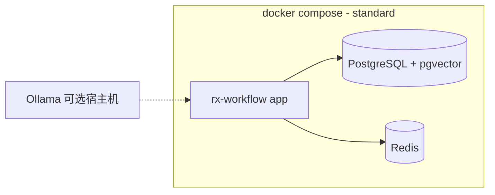

# ADR-002：多档位部署架构（Deployment Profiles）

| 字段 | 内容 |
|------|------|
| **状态** | 已采纳（Accepted） |
| **日期** | 2026-05-19 |
| **关联 PRD** | [spec.md](../.trae/specs/workflow-system/spec.md) FR-21、FR-19.4 |
| **决策者** | 架构 / 产品 |

---

## 1. 背景与问题

工作流 + AI 平台常见实现依赖 **MongoDB + PostgreSQL + Redis + BullMQ** 等多组件，对个人开发者和小团队运维成本高，与「本地 Ollama + 私有化」定位冲突。

需要同时满足：

1. **个人 / 小团队**：一条命令或单个容器即可运行，**无需**自管 Redis、独立数据库集群、消息队列。
2. **中小型企业**（本期规划重点）：适度扩展，仍尽量 **模块化单体**，可选引入 PostgreSQL / Redis。
3. **中大型企业**（预留）：水平扩展、HA、K8s —— **本期仅架构预留**，不承诺交付。

---

## 2. 决策摘要

采用 **Deployment Profile（部署档位）** + **可替换基础设施适配层**：

| Profile | 代号 | 目标用户 | v1.x 交付 |
|---------|------|----------|-----------|
| **极简** | `lite` | 个人、小团队 | **v1.0 默认推荐** |
| **标准** | `standard` | 中小型企业（需完整 RBAC、RAG、高并发等） | v1.0 文档 + v1.1 强化 |
| **分布式** | `distributed` | 大型企业 | **预留**，v2+ |
| **高可用** | `ha` | 大型企业生产 | **预留**，v2+ |

**核心原则**：

- 业务代码只依赖 **`StorageProvider` / `QueueProvider` / `VectorStoreProvider` / `CacheProvider`** 接口，禁止在节点执行器中直接写死 Mongo/PG/Redis。
- **Lite 与 Standard 共用同一套应用镜像**，通过环境变量 `RXWF_DEPLOY_PROFILE` 与连接串切换后端实现。
- 功能在 Lite 下可 **降级**（见 §4），但核心路径（编辑器、执行、Ollama、MCP、AI Chat 基础）必须可用。

---

## 3. 各档位基础设施对照

| 组件 | Lite（极简） | Standard（标准） | Distributed（预留） |
|------|----------------|------------------|---------------------|
| **应用进程** | 单进程（API + 执行 + Chat 同进程） | 模块化单体；可选独立 `worker` 进程 | API / Worker / AI Worker 拆分 |
| **主存储** | **SQLite** 单文件（`data/rxwf.db`） | **PostgreSQL** 单实例 | PG 集群 / 分库 |
| **工作流定义** | SQLite `workflows` 表 | PG 或 MongoDB（二选一，**推荐统一 PG**） | 同 Standard |
| **执行日志 / 审计** | SQLite | PostgreSQL | PG + 分区 / 冷归档 |
| **任务队列** | **内存队列** + SQLite `jobs` 表持久化（崩溃可恢复） | **BullMQ + Redis** | Redis Cluster / 云队列 |
| **缓存** | 进程内 LRU（可选关闭） | Redis | Redis Cluster |
| **向量 / RAG** | SQLite + **sqlite-vec** 或 Lite 下 RAG **延后 v1.1** | PostgreSQL **pgvector** | 独立 Qdrant/Milvus（可选） |
| **文件上传** | 本地目录 `data/uploads/` | 本地或 S3 兼容对象存储 | 对象存储 + CDN |
| **部署单元** | 单容器 / 单二进制 / `docker compose` 1 服务 | `compose`：app + pg [+ redis] | Helm / K8s |
| **最低资源** | 1 核 2GB | 2 核 4GB | 按规模规划 |

> **v1.0 实现优先级**：先交付 **Lite** 完整路径，再交付 **Standard** 的 PostgreSQL + Redis 组合；不在 v1.0 要求用户安装 MongoDB。

---

## 4. Lite 档位：能力与降级

### 4.1 必须可用（v1.0）

- Web 控制台、工作流 CRUD、DAG 执行（含 Items / 表达式 / 凭证）
- Webhook / 定时 / 手动触发
- Code 节点（沙箱）、HTTP、If/Switch/Merge 等 P0 节点
- Ollama、OpenAI 兼容 LLM
- MCP Client + 内置 MCP Server（stdio/HTTP）
- AI Chat 纯对话（会话存 SQLite）
- 单用户或简易多用户（SQLite 用户表）
- 导入导出 JSON、内置模板
- i18n、多主题（FR-20）

### 4.2 可降级或限制

| 能力 | Lite 行为 |
|------|-----------|
| 并发执行 | 默认 **≤5** 并行实例（可配置，上限 20） |
| 执行队列 | 内存 + SQLite 任务表；无 Redis |
| RAG / 知识库 | v1.0 可 **关闭**；v1.1 起 sqlite-vec 或提示「升级到 Standard」 |
| 插件热加载 | 支持；插件 Worker 与主进程同进程隔离 |
| RBAC | 简化：Owner / Member；完整矩阵 Standard 起 |
| 审计保留 | 默认 30 天（可配置），SQLite 体积告警 |
| 高可用 | 不支持多副本；备份 = 拷贝 `data/` 目录 |
| **远程 Runner（v1.1）** | 可选 `rxwf-runner` Agent；**API 必须单实例**（`replicas: 1`），因 `InMemoryRunnerGateway` 持 WS 连接与待派发 Job。见 [adr-node-runner.md](./adr-node-runner.md)、[changelog/runner-v1.1.md](./changelog/runner-v1.1.md) |

### 4.3 推荐安装方式（Lite）

```bash
# 方式 A：Docker 单容器（推荐）
docker run -d \
  --name rx-workflow \
  -p 8787:8787 \
  -v rxwf-data:/app/data \
  -e RXWF_DEPLOY_PROFILE=lite \
  ghcr.io/org/rx-workflow:latest

# 方式 B：docker compose（仅 1 个 service）
docker compose -f deploy/compose.lite.yaml up -d
```

`compose.lite.yaml` **仅包含 `app` 一个服务**，无 `postgres` / `redis` 依赖。

数据目录结构：

```
data/
├── rxwf.db              # SQLite（含工作流、执行、用户、Chat）
├── uploads/            # 知识库文件（若启用）
└── config.yaml         # 可选本地配置
```

---

## 5. Standard 档位（中小型企业）

### 5.1 适用场景

- 团队需完整 RBAC、审计 90 天、更高并发（~100 实例）、稳定 RAG 等 Lite 以上能力
- 需要稳定 **RAG（pgvector）**、BullMQ 可靠队列、Redis 缓存
- 仍接受 **单机或少量 VM**，不要求 K8s

### 5.2 推荐拓扑



```yaml
# deploy/compose.standard.yaml（示意）
services:
  app:
    image: ghcr.io/org/rx-workflow:latest
    environment:
      RXWF_DEPLOY_PROFILE: standard
      DATABASE_URL: postgres://...
      REDIS_URL: redis://redis:6379
    depends_on: [postgres, redis]
  postgres:
    image: pgvector/pgvector:pg16
  redis:
    image: redis:7-alpine
```

**v1.x 不再推荐 MongoDB** 作为默认依赖；工作流定义与执行数据 **统一进 PostgreSQL**，降低运维组件数。

### 5.3 Standard 相对 Lite 的增量

| 增量 | 说明 |
|------|------|
| 并发 | 默认上限 **100** 工作流实例 |
| 队列 | BullMQ 持久化、延迟任务、失败重试更可靠 |
| RAG | pgvector 全流程 |
| RBAC | 完整 FR-6 矩阵 |
| 审计 | ≥90 天（PG 存储） |
| Chat | 独立 chat-worker 进程（v1.1，同 compose 内第二容器可选） |

---

## 6. 预留档位（本期不实现）

### 6.1 Distributed

- API 与 Execution Worker、Chat Worker、Plugin Worker **分 Deployment**
- 对象存储、托管 Redis、外部向量库
- 水平扩展执行器

### 6.2 HA

- 多副本 API + 无状态会话（Redis）
- PostgreSQL 主从 / 托管 RDS
- Redis Sentinel / Cluster
- 多可用区、优雅迁移

仅在代码层保留 **Profile 检测与接口扩展点**；不在 v1.0～v1.1 编写 Helm Chart（v2 评估）。

---

## 7. 适配层接口（实现约束）

```typescript
// packages/platform — 所有档位共用

interface StorageProvider {
  workflows: WorkflowRepository;
  executions: ExecutionRepository;
  credentials: CredentialRepository;
  users: UserRepository;
  chat: ChatRepository;
}

interface QueueProvider {
  enqueue(job: JobPayload): Promise<string>;
  // lite: 同进程 Worker 轮询；standard: BullMQ Worker
}

interface VectorStoreProvider {
  upsert(docs: VectorDoc[]): Promise<void>;
  search(query: number[], k: number): Promise<ScoredChunk[]>;
  // lite: sqlite-vec | standard: pgvector
}

interface CacheProvider {
  get<T>(key: string): Promise<T | null>;
  set(key: string, value: unknown, ttlSec?: number): Promise<void>;
  // lite: memory | standard: redis
}
```

**环境变量（节选）**：

| 变量 | Lite | Standard |
|------|------|----------|
| `RXWF_HTTP_PORT` | `8787`（默认；勿用 5678） | 同左 |
| `RXWF_PUBLIC_URL` | `http://localhost:8787` | 部署实际对外 URL |
| `RXWF_DEPLOY_PROFILE` | `lite` | `standard` |
| `RXWF_DATA_DIR` | `./data` | — |
| `DATABASE_URL` | `sqlite:./data/rxwf.db` | `postgres://...` |
| `REDIS_URL` | 空（禁用） | `redis://...` |
| `RXWF_QUEUE_DRIVER` | `memory` | `bullmq` |

---

## 8. 迁移路径

| 路径 | 方式 |
|------|------|
| Lite → Standard | 提供 `awf migrate` CLI：读取 SQLite → 写入 PostgreSQL；停机窗口或只读模式 |
| 备份 Lite | 停止容器 → 打包 `data/` 目录 |
| 降级 | **不支持** Standard → Lite（日志量与类型可能不兼容） |

---

## 9. 与 PRD 其他章节的对应

| PRD | 本 ADR |
|-----|--------|
| FR-21 部署档位 | §3～§5 |
| FR-19.4 技术架构 | Standard 为 v1.x 全功能基线；Lite 为默认交付 |
| §13 技术约束 | 按 Profile 阅读，非全局强制 Mongo+Redis |
| NFR-1 并发 | Lite ≤20，Standard ≤100（可配置） |

---

## 10. 风险与缓解

| 风险 | 缓解 |
|------|------|
| Lite SQLite 写锁瓶颈 | 执行队列串行化写库；热路径读多写少；超限提示升级 Standard |
| 双实现维护成本 | 接口薄、集成测试矩阵仅覆盖 lite + standard 两条 |
| RAG 在 Lite 缺失 | v1.0 文档标明；v1.1 sqlite-vec 或强制 Standard |

---

## 11. 变更记录

| 日期 | 说明 |
|------|------|
| 2026-05-19 | 初稿：lite / standard / 预留 distributed & ha |
