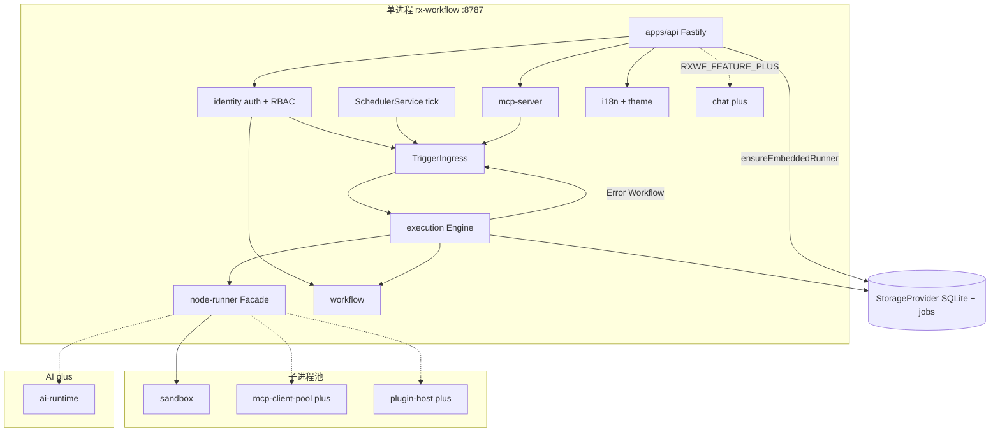

# ADR-003：模块与进程边界

| 字段 | 内容 |
|------|------|
| **状态** | 已采纳（Accepted） |
| **日期** | 2026-05-20 |
| **关联 PRD** | [spec.md](./spec.md) FR-3、FR-6、FR-13、FR-15、FR-17、FR-18、FR-21、FR-23 |
| **实现设计** | [superpowers/specs/2026-05-20-v1-implementation-design.md](./superpowers/specs/2026-05-20-v1-implementation-design.md) |
| **决策者** | 架构 |

---

## 1. 背景

Lite 档位为**单进程**部署，但同时承载 API、DAG 执行、MCP Server、AiRuntime、Chat、插件与 MCP Client 子进程。若无边界，易出现事件循环阻塞、子进程爆炸与故障域混杂。

---

## 2. 决策摘要

采用 **模块化单体 + 明确进程/池隔离**：

| 层级 | 包/模块 | 职责 | Lite | Standard |
|------|---------|------|------|----------|
| 接入 | `apps/api` | HTTP、SSE/WS、`TriggerIngress`、DI 装配、`ensureEmbeddedRunner` | 同进程 | 同进程 |
| 接入 | `packages/mcp-server` | 内置 MCP Tools（v1.0 基础 8 Tool） | 同进程 | 同进程 |
| 平台 | `packages/identity` | 用户、会话、API Key、RBAC | 同进程 | 同进程 |
| 领域 | `packages/workflow` | 定义 CRUD、版本、校验（含 runnerPolicy） | 同进程 | 同进程 |
| 领域 | `packages/execution` | DAG 调度、状态机、**Scheduler**、**Error Workflow**、Partial/Pin | 同进程 | 可拆 `worker`（v1.1） |
| 领域 | `packages/expression` | `{{ }}` 求值（ADR-004） | 同进程 | 同进程 |
| 领域 | `packages/credential` | 凭证加解密 | 同进程 | 同进程 |
| 执行 | `packages/node-runner` | `ExecutorRegistry` + `RunnerDispatcher` + 内置 executors（见 [adr-node-runner.md](./adr-node-runner.md)） | 同进程 Embedded | worker + 远程 Agent |
| 执行 | `packages/runner-agent` | CLI `rxwf-runner`（v1.1） | v1.0 占位包 | 多机注册 |
| 执行 | `packages/sandbox` | Code 节点子进程池 | **子进程池** | 子进程池 |
| 执行 | `packages/mcp-client-pool` | MCP Client 节点子进程池（v1.0-plus） | **子进程池** | 子进程池 |
| AI | `packages/ai-runtime` | LangGraph/LangChain；**core 用 `stub` 子路径** | stub / 同进程 | 可选 `chat-worker` |
| AI | `packages/chat` | AI Chat（v1.0-plus） | 特性开关关闭 | 可选独立容器 |
| 平台 | `packages/i18n-catalog` | 语言目录与 bundle | 同进程 | 同进程 |
| 平台 | `packages/theme-catalog` | 主题目录与 Token | 同进程 | 同进程 |
| 平台 | `packages/plugin-host` | 插件 Worker（v1.0-plus） | 子进程/隔离 | 子进程 |
| 基础设施 | `packages/providers/*` | Storage、Queue、Cache、Blob、**RunnerRepositoryPort** 等 | 适配实现 | 适配实现 |

**调用链（节点执行）**：`execution` → `NodeRunnerFacade`（`node-runner`）→ `ExecutorRegistry` → 具体 executor / `sandbox` / `ai-runtime` / `plugin-host`。

**禁止**：

- `execution` 直接 `import @langchain/*`
- `node-runner` / `runner-agent` 直接访问 DB 或 `providers` 实现层
- `execution` 内联实现节点类型逻辑（须经 `node-runner`）

**允许的数据访问**：

- `RunnerRegistry` 经注入的 **`RunnerRepositoryPort`**（实现在 `providers`，由 `apps/api` 装配）
- `execution` / `workflow` 经 **`StorageProvider`** 等契约访问持久化

---

## 3. 统一触发入口

所有生产触发经 **`TriggerIngress`**（同一中间件链）：

```
Webhook / API POST / MCP workflow_execute / Scheduler tick / Error Workflow
  → auth（session | apiKey）+ RBAC（identity）
  → HMAC（Webhook）
  → IdempotencyService（§11.6）
  → QueueProvider.enqueue(executionJob)
  → ExecutionEngine（读 definition_snapshot）
```

节点执行路径（与触发链分离）：`ExecutionEngine` → `node-runner.NodeRunnerFacade` → executors / 子进程池。

---

## 4. Lite 单实例约束

| 项 | 规则 |
|----|------|
| 部署 | Lite **禁止**多副本；`RXWF_SINGLE_INSTANCE=true` 默认 |
| 队列 | 内存调度器 + SQLite `jobs` 持久化（见 [adr-execution-data.md](./adr-execution-data.md)） |
| MCP/Code 池 | 全局 `maxConcurrentSandbox=5`、`maxMcpProcesses=3`（可配置） |

---

## 5. 架构图（Lite）

> 默认 HTTP **8787**（`RXWF_HTTP_PORT`）。与 [实现设计规格](./superpowers/specs/2026-05-20-v1-implementation-design.md) §1 一致。



**v1.0-core 说明**：`CHAT`、`MCPc`、`PH`、`AIR` 在 `RXWF_FEATURE_PLUS=false` 时不加载；`node-runner` 仅走 Embedded + P0 executors。

---

## 6. 变更记录

| 版本 | 日期 | 说明 |
|------|------|------|
| v1.0 | 2026-05-20 | 初稿 |
| v1.1 | 2026-05-20 | 对齐实现设计：identity、execution 子模块、node-runner 调用链、RunnerRepositoryPort、架构图修订、8787、Error/Scheduler 触发 |
