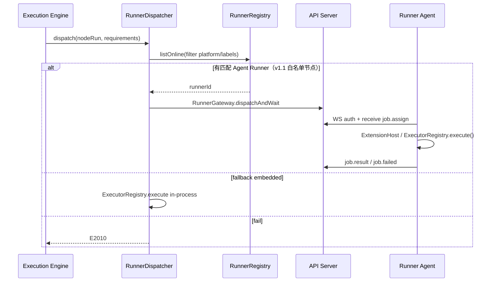

# ADR-006：Node Runner（跨平台执行 Runner）

| 字段 | 内容 |
|------|------|
| **状态** | 已采纳（Accepted） |
| **日期** | 2026-05-20 |
| **关联 PRD** | [spec.md](./spec.md) FR-23、FR-3、FR-2 |
| **关联 ADR** | [adr-module-boundaries.md](./adr-module-boundaries.md)、[adr-execution-data.md](./adr-execution-data.md) |
| **决策者** | 架构 |

---

## 1. 背景

研发向工作流包含 **本地命令、SSH、WMI、文件系统** 等节点，其行为与目标主机操作系统强相关（路径分隔符、Shell、权限模型、包管理器等）。控制面（API + 调度）通常部署在 **Linux** 服务器，但执行面需要落在 **Windows / Linux / macOS** 各环境的 Agent 上。

若所有节点均在控制面进程内执行，则无法安全、可靠地在 Windows 域控或开发者 macOS 笔记本上跑命令。需要引入 **可注册的跨平台 Runner Agent**，由调度器按工作流策略将节点任务派发到匹配平台的 Runner。

### 1.1 术语澄清（避免与现有包名混淆）

| 概念 | 包/模块 | 职责 |
|------|---------|------|
| **NodeExecutor 注册表** | `packages/node-runner` 内 `ExecutorRegistry` | 按 `node.type` 查找 **进程内** 的 `execute()` 实现（HTTP、If、Code 等） |
| **Runner Agent（执行 Runner）** | `packages/runner-agent` CLI + `packages/node-runner` 内 `RunnerRegistry` | 在 **远程或本机** 注册的平台进程，接收 `NodeRunJob` 并调用对应 Executor |
| **Embedded Runner** | 控制面内置 | Lite / 无外部 Runner 时，**同进程**执行；`platform` 由启动时探测 |

下文 **Runner** 若无特别说明，均指 **Runner Agent（执行 Runner）**，而非 NodeExecutor 类型注册。

---

## 2. 决策摘要

1. 引入 **Runner 注册与心跳** 模型；每条 Runner 记录必须携带 **`platform`（os + arch）** 及可选 `labels`、`capabilities`。
2. 工作流支持 **`settings.runnerPolicy`**（工作流级，可选）与 **节点级 `runner` 覆盖**；解析优先级 **节点 > 工作流 > 全局默认 Embedded**（`resolveEffectiveRunnerPolicy`）。策略模式：`embedded` | `auto` | `pinned` | `label`；节点另含 `inherit`。
3. **`auto` 模式**：调度器根据节点 `NodeDefinition.runnerRequirements`（插件 manifest）与工作流策略，选择 **在线且负载最低** 的兼容 Agent Runner；无可用 Runner 时按 `fallback` 处理（`fail` | `embedded`，Lite 默认 `embedded`）。
4. **远程执行协议（v1.1）**：Runner Agent 与 API 之间使用 **WebSocket**（`GET /api/runners/{id}/stream`）派发 `job.assign` / 接收 `job.result`；HTTP `POST /heartbeat` 为 **deprecated** 兼容桩。Lite v1.1 使用进程内 **`InMemoryRunnerGateway`**（**API 须单实例**，`replicas: 1`）。
5. **v1.1 远程白名单**：仅 `code`、`executeCommand` 可走 Agent 远程路径；其余节点在策略指向 Agent 时 **静默回退 Embedded**（`preferRemote=true` 时抛 `E2016`）。
6. `packages/node-runner` 扩展职责：`ExecutorRegistry` + `RunnerDispatcher` + `NodeRunnerFacade`；`RunnerRepositoryPort` / `RunnerGatewayPort` 经 `packages/providers/contracts` 注入，由 `apps/api` 装配。**禁止** `node-runner` / `runner-agent` / `runner-sdk` 直连 DB 或 import `providers` 实现层。

---

## 3. Runner 数据模型

### 3.1 平台枚举

```typescript
type RunnerOs = 'windows' | 'linux' | 'macos';
type RunnerArch = 'x64' | 'arm64' | 'arm';

interface RunnerPlatform {
  os: RunnerOs;
  arch: RunnerArch;
  /** 可选：如 "Windows Server 2022", "Ubuntu 22.04", "Darwin 23" */
  osVersion?: string;
}
```

**匹配规则**：

- `auto` 时节点声明 `platforms: ['windows']` → 仅匹配 `platform.os === 'windows'` 的 Runner。
- 节点声明 `platforms: ['any']` 或未声明 → 任意平台 Runner 均可；`embedded` 视为 `any`。
- `arch` 仅在节点 manifest 显式要求时参与过滤（如 ARM 构建机）。

### 3.2 Runner 实体（Server 侧）

| 字段 | 类型 | 说明 |
|------|------|------|
| `id` | UUID | runnerId |
| `name` | string | 展示名，如 `win-build-01` |
| `platform` | RunnerPlatform | **必填**，注册时由 Agent 上报 |
| `labels` | string[] | 亲和性标签，如 `["gpu","ci"]` |
| `capabilities` | string[] | 能力集，如 `shell`,`ssh`,`code`,`file` |
| `status` | enum | `online` \| `offline` \| `draining` |
| `kind` | enum | `embedded` \| `agent` |
| `maxConcurrent` | int | 默认 2 |
| `runningJobs` | int | 当前占用 |
| `agentVersion` | string | Agent semver |
| `lastHeartbeatAt` | datetime | 超过 90s 无心跳 → `offline` |
| `registeredAt` | datetime | |
| `registeredBy` | userId? | |

### 3.3 注册凭证

| 阶段 | 凭证 | 说明 |
|------|------|------|
| 预注册 | `registrationToken` | Admin 一次性 Token（`POST /runners/registration-tokens`） |
| 注册后 | `runnerCredential` | 长期 Secret，仅注册响应返回一次；后续心跳/拉任务使用 |

---

## 4. 工作流 Runner 策略

### 4.1 工作流级 `settings.runnerPolicy`

```json
{
  "runnerPolicy": {
    "mode": "auto",
    "platform": "linux",
    "labels": ["ci"],
    "runnerId": null,
    "fallback": "fail"
  }
}
```

| mode | 行为 |
|------|------|
| `embedded` | 显式使用控制面 Embedded Runner（与全局默认等价） |
| `auto` | 按节点需求 + 可选 `platform`/`labels` 过滤 Agent 池，选负载最低在线 Runner |
| `pinned` | 固定 `runnerId`（可为 embedded 或 agent）；Runner 离线则失败（或 `fallback`） |
| `label` | 必须匹配 `labels` 全集；再按负载均衡 |

| fallback | 行为 |
|----------|------|
| `fail` | 无匹配 Runner → 节点 `failed`，`E2010` |
| `embedded` | 回退控制面 Embedded Runner（**v1.1 Lite 默认**；仅当节点 `platforms` 含 `any` 或匹配 Embedded 平台） |

**默认**：工作流未配置 `runnerPolicy` 时继承 **全局 Embedded**；生产可在工作流显式设 `auto` + `fallback: fail`。

### 4.2 节点级覆盖 `node.runner`

```json
{
  "runner": {
    "mode": "inherit",
    "runnerId": null,
    "platform": "windows",
    "labels": ["domain-controller"]
  }
}
```

| mode | 行为 |
|------|------|
| `inherit` | 使用工作流 `runnerPolicy` |
| 其他 | 同工作流级，覆盖全局 |

### 4.3 节点 Manifest 要求（插件规范扩展）

在 [node-plugin-spec.md](./node-plugin-spec.md) 的 `NodeDefinition` 增加可选字段：

```typescript
runnerRequirements?: {
  /** 默认 ['any'] */
  platforms?: Array<RunnerOs | 'any'>;
  arch?: RunnerArch[];
  capabilities?: string[];  // 必须 ⊆ Runner.capabilities
  preferRemote?: boolean;   // true 时禁止 fallback embedded（如 WMI）
};
```

示例：

| 节点 | platforms | capabilities |
|------|-----------|----------------|
| HTTP / If / Set | `any` | — |
| Code（沙箱） | `any` | `code` |
| 本地命令 | `linux`,`windows`,`macos` | `shell` |
| SSH | `any` | `ssh` |
| WMI | `windows` | `wmi` |

---

## 5. 调度与执行流程



**选择算法（`auto`）**：

1. 解析有效策略（节点覆盖 > 工作流 settings）。
2. 过滤：`status=online`，`platform` 匹配，`labels` 超集匹配，`capabilities` 超集匹配。
3. 排序：`runningJobs/maxConcurrent` 升序，其次 `lastHeartbeatAt` 降序。
4. 取第一名；若并发已满则尝试下一台或排队（v1.1，`runnerQueueTimeoutMs` 默认 300s）。

**节点 `node_runs` 持久化**（见 [adr-execution-data.md](./adr-execution-data.md)）：增加 `runner_id`、`runner_platform`（快照）、`execution_host`（Agent 主机名，可选）。

---

## 6. Runner Agent（`rxwf-runner`）

生产实现：`packages/runner-agent`（CLI `rxwf-runner`）+ `packages/runner-sdk`（第三方扩展）+ `packages/runner-protocol`（WS 信封与远程 Job 类型）。

### 6.0 v1.1 远程节点范围

| 节点 | v1.1 远程 | capability |
|------|-----------|------------|
| `code` | ✓ | `code` |
| `executeCommand` | ✓ | `shell` |
| 其他（HTTP、文件、DB 等） | ✗（回退 Embedded） | — |

凭证 **不** 经远程 Job 下发（无 Credential Bridge，v1.1.1+）。

### 6.1 支持平台

| OS | 安装方式 | v1.1 |
|----|----------|------|
| Linux | 单二进制 / systemd unit | ✓ |
| macOS | 单二进制 / launchd | ✓ |
| Windows | 单二进制 / Windows Service | ✓ |

Agent 启动时上报：

```json
{
  "name": "dev-macbook",
  "platform": { "os": "macos", "arch": "arm64", "osVersion": "Darwin 24" },
  "labels": ["dev"],
  "capabilities": ["shell", "code", "file"],
  "maxConcurrent": 2,
  "agentVersion": "1.0.0"
}
```

### 6.2 安全

- 注册 Token 仅 Admin 可创建；Scope `runner:register`。
- Runner Credential 轮换：`POST /runners/{id}/rotate-credential`。
- Agent 出站仅 HTTPS；命令节点仍受 **白名单 + 超时**（FR-2）。
- Runner 只能执行 **已启用插件** 中其 `capabilities` 允许的节点类型。

---

## 7. 部署档位

| Profile | v1.0 | v1.1 |
|---------|------|------|
| **Lite** | 仅 **Embedded Runner**（探测本机 OS）；API 可列出 1 条 `kind=embedded` | 可选注册 Agent（`rxwf-runner`）；**启用远程 Runner 时 API `replicas: 1`** |
| **Standard** | Embedded + 多 Agent | 完整池化、draining；远程 Runner 同样要求 **单 API 实例**（v1.2 多副本 + Redis 路由） |

详见 [runner-agent-quickstart.md](./runner-agent-quickstart.md)、[superpowers/specs/2026-05-29-runner-v1.1-websocket-design.md](./superpowers/specs/2026-05-29-runner-v1.1-websocket-design.md) §1.0。

---

## 8. API 与 MCP（摘要）

REST 见 [openapi.yaml](./openapi.yaml) `Runners` 标签：

- `GET /runners` — 列表（含 platform、labels、agentVersion、lastHeartbeatAt、status）
- `POST /runners/registration-tokens` — Admin 创建注册 Token
- `POST /runners/register` — Agent 注册（Body 含 platform）
- `GET /runners/{id}/stream` — **WebSocket** 任务通道（v1.1）
- `POST /runners/{id}/heartbeat` — **Deprecated**；请用 WS `presence`
- `DELETE /runners/{id}` — 吊销（踢掉 WS）
- `POST /runners/{id}/drain` — 停止接新任务（`config.update`）
- `POST /runners/{id}/rotate-credential` — 轮换凭证（踢掉旧 WS）

MCP（v1.1）：`runner_list`、`runner_create_registration_token`。

---

## 9. 与现有模块边界

| 模块 | 变更 |
|------|------|
| `packages/node-runner` | `ExecutorRegistry` + `RunnerRegistry`（Port）+ `RunnerDispatcher` + `NodeRunnerFacade`；远程回调仍走 `ExecutorRegistry` |
| `packages/runner-agent` | CLI、`WsSession`、JobPool、ExtensionHost（v1.1 交付） |
| `packages/runner-sdk` | 第三方扩展 manifest 与 `RunnerExtension` API |
| `packages/runner-protocol` | WS 信封、`RemoteNodeRunJob`、错误码 E2010–E2016 |
| `packages/execution` | DAG 调度；节点前调用 `NodeRunnerFacade.resolveRunner` / `executeNodeRun`（**不**直连 sandbox） |
| `packages/workflow` | `workflow_validate` 校验 `runnerId`、`preferRemote` + `fallback` 等 |
| `packages/providers/contracts` | 新增 `RunnerRepositoryPort`；Lite/Standard 实现 |
| `apps/api` | `InMemoryRunnerGateway`、WS handler、sweeper；注入 Port 至 `node-runner` |

**禁止**：`node-runner` / Runner Agent import `providers` 实现层或直连 SQLite/PG。

**实现设计**：[superpowers/specs/2026-05-20-v1-implementation-design.md](./superpowers/specs/2026-05-20-v1-implementation-design.md) §3.5。

---

## 10. 版本分期

| 阶段 | 交付 |
|------|------|
| v1.0-core | Schema `runnerPolicy` / `node.runner`；Embedded Runner；`GET /runners` 只读 |
| v1.1 | `rxwf-runner` 三平台、WS 远程派发（**code + executeCommand**）、三层策略、MCP runner 工具 |
| v1.2 | Runner 组、API 多副本 + Redis 路由、更多节点类型远程化 |

---

## 11. 变更记录

| 版本 | 日期 | 说明 |
|------|------|------|
| v1.0 | 2026-05-20 | 初稿：跨平台 Runner 注册、工作流策略、调度算法 |
| v1.1 | 2026-05-20 | 对齐 ADR-003：RunnerRepositoryPort、NodeRunnerFacade、execution 调用链 |
