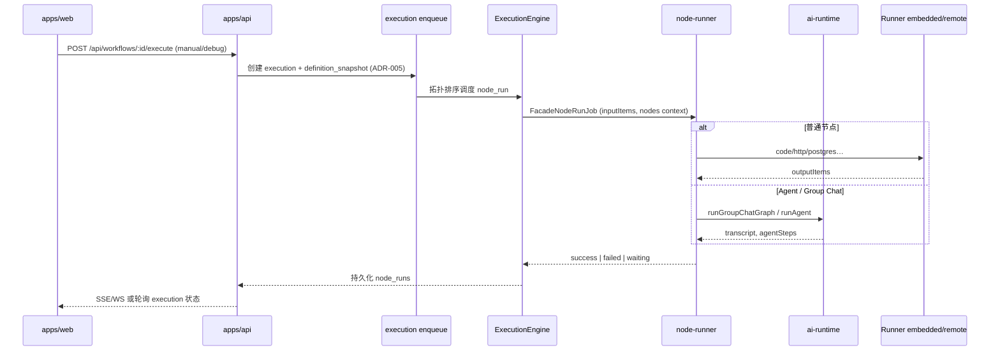
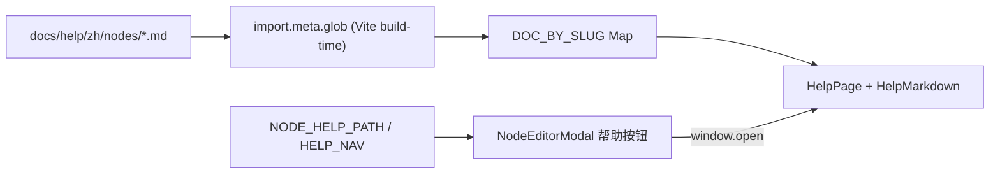
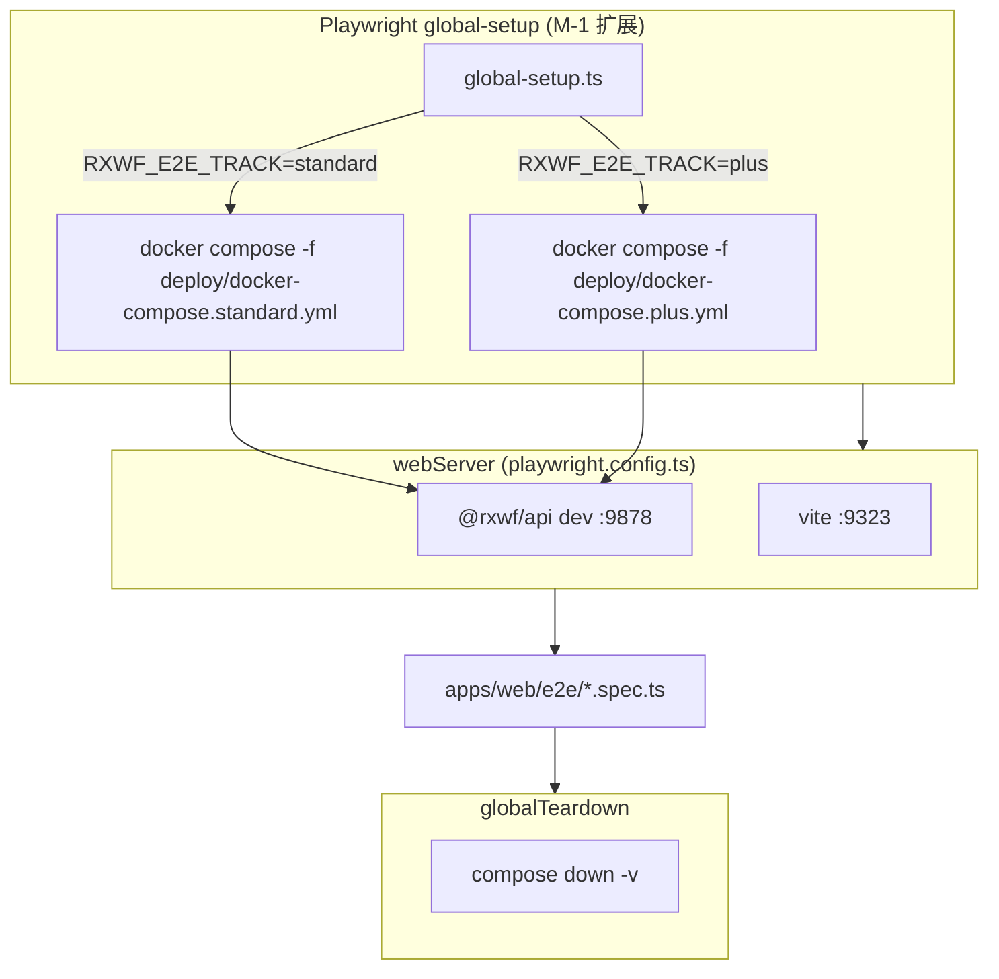

# RX-Workflow v2.0 补齐 — 系统架构

> **版本**：1.0  
> **日期**：2026-06-19  
> **状态**：待批准  
> **权威输入**：`docs/requirements/PRD.md`、`docs/workflow/plan.md`、`docs/spec.md` v2.0  
> **关联规格**：Group Chat、Binary、Help Center 等 `docs/superpowers/specs/*.md`

---

## 1. 系统上下文（C4 Level 1）

### 1.1 语境图（文字等价）

```
┌─────────────┐     HTTPS/WSS      ┌──────────────────────────────────────────┐
│  研发/运维   │◄──────────────────►│  RX-Workflow 平台（本仓库 monorepo）       │
│  用户        │   编辑器 / 帮助 /   │  apps/web + apps/api + packages/*         │
└─────────────┘   执行监控           └───────────┬──────────────────────────────┘
                                                 │
         ┌───────────────────────────────────────┼───────────────────────────────┐
         │                                       │                               │
         ▼                                       ▼                               ▼
┌─────────────────┐              ┌─────────────────────────┐        ┌──────────────────┐
│ Docker 依赖栈    │              │ 外部 LLM / 模型服务       │        │ Runner Agent      │
│ Postgres/Redis  │              │ Ollama / OpenAI 兼容 API  │        │ (embedded/remote) │
│ CrewAI Sidecar  │              └─────────────────────────┘        └──────────────────┘
│ (Plus 轨)       │
└─────────────────┘
         ▲
         │ compose up/down（CI、E2E global-setup、人工验收）
┌────────┴────────┐
│ CI / 开发者本地  │
└─────────────────┘
```

### 1.2 系统职责边界


| 边界内（In Scope）                        | 边界外（Out of Scope，本轮）        |
| ------------------------------------ | --------------------------- |
| v2.0 差距审计、半实现补齐、全节点审查                | 无 spec 依据的全新大功能             |
| Group Chat MVP、Binary 全链路            | 独立 VitePress/Docusaurus 帮助站 |
| 帮助 registry 全覆盖、`/help` 应用内路由        | 英文帮助全文、多区域 HA、企业 SSO        |
| E2E 100% 覆盖 v2.0（Standard + Plus 双轨） | 以 mock 替代 Docker 真实依赖验收     |


### 1.3 部署档位（与 spec FR-21 对齐）


| 档位           | 用途                                      | 本轮验收                                                         |
| ------------ | --------------------------------------- | ------------------------------------------------------------ |
| **Lite**     | 单进程 SQLite + 内嵌执行                       | 开发默认、`playwright` webServer 启 api+web                        |
| **Standard** | Postgres + Redis                        | `deploy/docker-compose.standard.yml` — DAG/数据节点 E2E          |
| **Plus**     | Standard + CrewAI Runner + FEATURE_PLUS | `deploy/docker-compose.plus.yml` — Agent/Crew/Group Chat E2E |


---

## 2. 模块 / 组件划分

### 2.1 Monorepo 总览

```
rx-workflow/
├── apps/
│   ├── web/          # React + Vite 编辑器、/help 帮助中心、Playwright E2E
│   └── api/          # Fastify HTTP/WebSocket、执行编排、集成测试
├── packages/
│   ├── workflow/     # 工作流定义、图校验、schemaVersion:1
│   ├── execution/    # 执行引擎、HITL、调度、快照（ADR-005）
│   ├── node-runner/  # 节点执行器注册表（含 groupChat、crew、http 等）
│   ├── ai-runtime/   # LangChain/LangGraph Agent 运行时（Group Chat graph）
│   ├── expression/   # {{ }} 表达式引擎、$binary globals
│   ├── shared/       # WorkflowItem、Binary 类型（M-5 扩展）
│   ├── sandbox/      # Code 节点子进程沙箱
│   ├── credential/   # 凭证类型与加解密
│   ├── providers-lite|standard/  # 部署档位 Provider 注入
│   ├── runner-agent|protocol|sdk/  # 远程 Runner 协议
│   └── …             # chat、knowledge、mcp、skill-runtime 等
├── docs/             # 规格、帮助源、索引、测试矩阵
├── deploy/           # docker-compose.standard.yml / plus.yml
└── scripts/          # lint、索引校验（M-1 新增）
```

### 2.2 应用层职责


| 组件          | 路径                              | 职责                                                   |
| ----------- | ------------------------------- | ---------------------------------------------------- |
| **Web 编辑器** | `apps/web/src/features/editor/` | DAG 画布、节点弹窗、INPUT 面板、调试 Pin、帮助按钮                     |
| **帮助中心**    | `apps/web/src/features/help/`   | `/help/*` 路由、`load-help-doc.ts` 加载 `docs/help/zh/`** |
| **API 网关**  | `apps/api/src/main.ts`          | 认证、工作流 CRUD、执行 enqueue、HITL resume、Webhook           |
| **执行编排**    | `apps/api/src/execution/`       | Job loop、Runner 网关、HITL sweeper、Crew 桥接              |
| **集成测试**    | `apps/api/src/integration/`     | Docker/真实依赖验收（Standard/Plus profile）                 |


### 2.3 领域包职责


| 包                   | 职责                               | 关键导出/入口                                  |
| ------------------- | -------------------------------- | ---------------------------------------- |
| `@rxwf/workflow`    | 定义模型、保存校验、`to-workflow-graph`    | 节点端口、Crew/Group Chat 编排边规则               |
| `@rxwf/execution`   | DAG 调度、`ExecutionEngine`、HITL、快照 | `FacadeNodeRunResult.status: waiting`    |
| `@rxwf/node-runner` | per-nodeType 执行器                 | `executors/group-chat.ts`、HTTP、Postgres… |
| `@rxwf/ai-runtime`  | LLM Agent 图                      | `runGroupChatGraph`                      |
| `@rxwf/expression`  | Items 上下文、$json/$binary          | globals spec 已实现                         |
| `@rxwf/shared`      | `WorkflowItem`                   | M-5 扩展 `BinaryMap`、`BinaryBlobService`   |


### 2.4 模块依赖规则

- **依赖方向**：`apps/`* → `packages/*`；`packages/execution` → `node-runner` → `ai-runtime` / `sandbox`；禁止 packages 反向依赖 apps。
- **档位注入**：`@rxwf/providers-lite` / `@rxwf/providers-standard` 通过 `apps/api` bootstrap 注入 DB、Redis、Blob（M-5）。
- **边界校验**：`.dependency-cruiser.cjs` + `pnpm lint:deps` 防止跨层耦合。

---

## 3. 关键数据流

### 3.1 编辑器 → API → 执行引擎 → Runner / AI




**契约要点**：

- **输入**：`WorkflowItem[]`（`json` + 可选 `binary`，M-5 全链路透传）。
- **快照**：execution 创建时固化 `definition_snapshot`，运行中不读草稿（FR-3 / ADR-005）。
- **waiting**：HITL（`humanApproval`、`groupChat` UserProxy）返回 `status: 'waiting'` + `metadata.hitl` + 可选 `metadata.groupChat.checkpoint`。
- **Resume**：`POST /api/executions/:id/hitl/resume`；Group Chat 走 `orchestrationResume.kind === 'groupChat'` 重入同一节点（非全图重跑）。

### 3.2 帮助文档加载




| 环节   | 实现                                            | 约束                                       |
| ---- | --------------------------------------------- | ---------------------------------------- |
| 内容源  | `docs/help/zh/**`                             | 权威 Markdown；开发者 spec 在 `docs/` 其余目录      |
| 构建加载 | `apps/web/src/features/help/load-help-doc.ts` | Vite `?raw` eager glob                   |
| 路由   | `/help/nodes/:slug`                           | P0 无 locale 前缀；预留 `zh`/`en`              |
| 映射   | `help-registry.ts` + `help-nav.ts`            | M-6：与 45 nodeType **一一映射**               |
| 跳转   | `buildHelpUrl({ nodeType })`                  | 新 Tab；未映射 fallback `/help?from=nodeType` |


### 3.3 E2E 双轨 Docker 测试栈




| 轨                   | Compose 文件                           | 典型用例                                   |
| ------------------- | ------------------------------------ | -------------------------------------- |
| **Standard (A)**    | `deploy/docker-compose.standard.yml` | Postgres、Redis、postgres 节点、核心 DAG      |
| **Plus (B)**        | `deploy/docker-compose.plus.yml`     | crewai-runner、Crew、Group Chat、MCP Plus |
| **Lite（无 compose）** | 仅 `RXWF_DATA_DIR` 临时目录               | 编辑器冒烟、帮助路由、无外部依赖节点                     |


**环境变量约定**（tasking 阶段细化）：

- `RXWF_E2E_TRACK`：`standard` | `plus` | `lite`
- `RXWF_E2E_API_PORT` / `RXWF_E2E_WEB_PORT`：与 `playwright.config.ts` 一致
- `RXWF_DATABASE_URL` / `CREWAI_RUNNER_URL`：compose 注入后传给 api dev

**现状与目标**：当前 `global-setup.ts` 仅清理 auth 目录；M-1 须扩展 compose 生命周期 + healthcheck 等待 + teardown 无容器泄漏（AC-073）。

---

## 4. FR/NFR → 设计决策追溯表


| PRD ID    | 设计决策                                                  | 主要落点                                                     |
| --------- | ----------------------------------------------------- | -------------------------------------------------------- |
| FR-01     | `docs/INDEX.md` YAML frontmatter + 人类目录；子目录 README 链回 | `scripts/lint-docs-index.mjs`（M-1 新增）                    |
| FR-02     | `spec-gap-audit.md` 为 v2.0 单一差距真相源                    | M-1 产出；驱动 M-2～M-6                                        |
| FR-03     | `e2e-coverage-matrix.md` 全功能行，逐 Milestone 更新          | `docs/test/`；CI 不强制 100% 直至 M-6                          |
| FR-04     | 未登记 INDEX 的 `.md` 变更 → CI fail                        | root `package.json` script + GitHub Actions              |
| FR-05     | 半实现项 TDD 补齐，不允许 exclude                               | M-2：`skill-runtime`、`identity` ACL、`credential`、`switch` |
| FR-06～08  | 45 独立 help 文 + registry + 弹窗跳转                        | `help-registry.ts`、`load-help-doc.ts`、E2E help spec      |
| FR-09     | 节点矩阵双源：`NODE_TYPE_META` + executor registry           | M-3 审查表 + Docker 真实验收                                    |
| FR-10     | Group Chat MVP：native loop + 可选 `ai-runtime` graph    | §8；Plus 轨                                                |
| FR-11     | Binary 先审查门禁再实现                                       | §9；M-5 独立 Milestone                                      |
| FR-12～13  | 每 M 人工验收 + 累积 E2E 全绿                                  | `docs/test/milestones/M-x-`*                             |
| FR-14     | Standard/Plus compose 双轨                              | `deploy/docker-compose.*.yml`                            |
| FR-15     | 功能变更同 PR 更文档/INDEX/help                               | PR checklist                                             |
| FR-16     | 大变动人工门禁                                               | §12.3                                                    |
| FR-17     | `schemaVersion: 1` 不变                                 | `@rxwf/workflow` 校验层                                     |
| FR-18～19  | M-3 每 nodeType ≥1 E2E；M-6 matrix 100%                 | Playwright + matrix                                      |
| FR-20     | 每 Milestone 独立分支 → 验收后合 main                          | §11                                                      |
| NFR-01    | Red→Green→Refactor；单元/集成先于 E2E                        | Vitest 各 package                                         |
| NFR-02～03 | E2E 不 mock 外部服务；global-setup 自动启停                     | §3.3、§6                                                  |
| NFR-04    | matrix/acceptance 标注 Standard/Plus                    | 列 `track`                                                |
| NFR-05    | 索引校验脚本 P95 < 30s                                      | 纯 Node 脚本，无重型构建                                          |
| NFR-06    | help registry 完整性单元测试                                 | `help-registry.test.ts`（M-6）                             |
| NFR-07～10 | 阻塞暂停；M-x 双门禁                                          | `state.json` history                                     |


---

## 5. Milestone 架构交付物映射


| Milestone              | 架构交付物                    | 文档/代码索引                                                                                                                  | E2E / 测试                                                  |
| ---------------------- | ------------------------ | ------------------------------------------------------------------------------------------------------------------------ | --------------------------------------------------------- |
| **M-1** 文档索引与差距审计      | 文档治理基础设施                 | `docs/INDEX.md`、`docs/README.md`、`docs/workflow/spec-gap-audit.md`                                                       | 建立 `docs/test/e2e-coverage-matrix.md`；索引 CI；help 路由基线 E2E |
| **M-2** 半实现项补齐         | 领域模块补全                   | `packages/skill-runtime`、`packages/identity`、`packages/credential`、`apps/web` switch 面板、`packages/node-runner` executors | M-2 功能行 matrix 100% 覆盖；Standard/Plus 集成测                  |
| **M-3** 全节点审查          | 节点健康矩阵 + 执行器一致性          | `node-type-meta.ts` ↔ `node-runner` registry；`docs/error-codes.md`                                                       | 每 nodeType ≥1 E2E；Docker Standard+Plus                    |
| **M-4** Group Chat MVP | Group Chat 运行时 + HITL 扩展 | §8；`packages/node-runner/src/executors/group-chat.ts`、`packages/ai-runtime`、`resume-hitl`                                | Plus 轨全场景 E2E                                             |
| **M-5** Binary 全链路     | Binary 内核（方案确认后）         | §9 审查流程；`packages/shared`、`packages/execution` blob；ADR-005 §2.5                                                         | Binary 上传/下载/表达式 E2E                                      |
| **M-6** 帮助全覆盖          | Help registry 闭环         | 45× `docs/help/zh/nodes/<type>.md`；`NODE_HELP_PATH`/`HELP_NAV`                                                           | 45 帮助跳转 E2E；matrix 100%；registry 单测                       |


### 5.1 跨 Milestone 累积约束

- E2E **只增不减**；每 Milestone 跑**当前全量**套件。
- `spec-gap-audit.md` 与 matrix 同行 ID 互链。
- 合入主分支前：`验收 M-x` + E2E green + 人工用例全通过（AC-070～074）。

---

## 6. 可测试性设计

### 6.1 TDD 分层


| 层级         | 范围                                               | 工具         | 依赖策略                                               |
| ---------- | ------------------------------------------------ | ---------- | -------------------------------------------------- |
| **单元**     | 纯函数、校验、registry                                  | Vitest     | 无 IO；mock 仅用于隔离**非外部服务**的端口                        |
| **包集成**    | execution、node-runner、ai-runtime                 | Vitest     | `@rxwf/ai-runtime-stub` 替代真实 LLM                   |
| **API 集成** | `apps/api/src/integration/*.integration.test.ts` | Vitest     | Lite 内存库 或 Testcontainers/compose                  |
| **E2E**    | 用户路径                                             | Playwright | **真实** api+web+compose；不 mock Postgres/Ollama/Crew |


### 6.2 依赖注入与 Test Double


| 边界           | 生产实现                                           | 测试替身                                            |
| ------------ | ---------------------------------------------- | ----------------------------------------------- |
| LLM 调用       | `@rxwf/ai-runtime`                             | `ai-runtime-stub`、集成测用 Ollama（compose）          |
| DB           | Lite SQLite / Postgres provider                | 临时 `RXWF_DATA_DIR`；Standard 测用 compose Postgres |
| Blob（M-5）    | `BinaryBlobService` + SQLite `execution_blobs` | 内存/临时目录实现同一接口                                   |
| 时间           | `hitl-sweeper` 注入 `now()`                      | 单测控制超时                                          |
| Crew Sidecar | HTTP `CREWAI_RUNNER_URL`                       | Plus compose 真实 sidecar                         |


### 6.3 Docker Compose Test Harness

```
scripts/e2e-compose.mjs          # up/down/wait-health（M-1）
deploy/docker-compose.standard.yml
deploy/docker-compose.plus.yml
deploy/docker-compose.e2e-ollama.yml  # 可选扩展（M-3 LLM 节点）
```

**流程**：

1. `global-setup`：读 `RXWF_E2E_TRACK` → `compose up -d` → 轮询 healthcheck → 写入 `.e2e-env` 供 api 读取。
2. `playwright` `webServer` 启动 api/web（已有）。
3. `globalTeardown`：`compose down -v`；验证无残留容器（AC-073）。

### 6.4 Playwright global-setup 目标形态


| 阶段     | 文件                             | M-1 交付                              |
| ------ | ------------------------------ | ----------------------------------- |
| setup  | `apps/web/e2e/global-setup.ts` | compose 生命周期 + auth 清理              |
| auth   | `apps/web/e2e/auth.setup.ts`   | 登录 storageState                     |
| config | `playwright.config.ts`         | 按 project 或 env 区分 Standard/Plus 套件 |
| specs  | `apps/web/e2e/**/*.spec.ts`    | 按 matrix 行增量添加                      |


### 6.5 测试目录结构

```
apps/web/e2e/                    # Playwright E2E
apps/web/src/**/*.test.ts        # Web 单元（Vitest + jsdom）
apps/api/src/**/*.test.ts        # API 单元
apps/api/src/integration/        # API 集成（真实依赖）
packages/*/src/**/*.test.ts      # 领域单元/集成
docs/test/e2e-coverage-matrix.md
docs/test/milestones/M-x-*.md
```

---

## 7. 测试框架与命令

### 7.1 框架选型


| 类型    | 框架                   | 配置文件                               |
| ----- | -------------------- | ---------------------------------- |
| 单元/集成 | **Vitest** 3.x       | 各包 `vitest` 内联或 `vitest.config.ts` |
| E2E   | **Playwright** 1.60+ | `apps/web/playwright.config.ts`    |
| 依赖边界  | dependency-cruiser   | `.dependency-cruiser.cjs`          |
| 文档索引  | Node 脚本（M-1）         | `scripts/lint-docs-index.mjs`      |


### 7.2 常用命令

```bash
# 全仓单元/集成（turbo 编排，先 build）
pnpm test

# 单包
pnpm --filter @rxwf/execution test
pnpm --filter @rxwf/api test
pnpm --filter @rxwf/web test

# E2E（Lite：当前默认，api+web 由 playwright webServer 拉起）
pnpm --filter @rxwf/web test:e2e

# E2E UI 模式
pnpm --filter @rxwf/web test:e2e:ui

# 依赖与 AC 映射 lint
pnpm lint:deps
pnpm lint:ac-mapping

# 本地开发
pnpm dev                    # api :8787 + web :5173
pnpm reset:data             # 清数据重启

# Docker Standard / Plus（人工或 E2E setup）
docker compose -f deploy/docker-compose.standard.yml up -d
docker compose -f deploy/docker-compose.plus.yml up -d
```

### 7.3 命名约定

- 单元/集成：`<module>.test.ts` 与源文件同目录或 `__tests__`。
- API 集成：`<feature>.integration.test.ts`；Plus 场景可后缀 `.plus.integration.test.ts`。
- E2E：`<area>-<scenario>.spec.ts`；matrix 列必须引用 spec 路径。
- 测试描述：`describe('模块')` / `it('应…')`；Red 阶段测试名含 `should fail until` 可选。

---

## 8. Group Chat 架构

> 依据：`2026-05-30-group-chat-design.md`、PRD FR-10、OQ-010。

### 8.1 组件关系

```
groupChat (根节点)
  ├── group_member × N → aiAgent 参与者
  ├── group_orchestrator (可选) → aiAgent + aiChatModel
  └── 执行器：node-runner/group-chat.ts
        ├── native loop（MVP 默认，与 crew-native 一致）
        └── 可选 ai-runtime/runGroupChatGraph（P4-E.2）
```

### 8.2 发言策略


| 模式             | 算法                                     | 依赖                                    |
| -------------- | -------------------------------------- | ------------------------------------- |
| `roundRobin`   | `members[round % N]`                   | 无 LLM                                 |
| `orchestrator` | LLM JSON `{ action, member | finish }` | inline 模型或 `group_orchestrator` Agent |


### 8.3 UserProxy 与超时（OQ-010 架构决选）


| 参数                       | 类型      | 默认值               | 行为                             |
| ------------------------ | ------- | ----------------- | ------------------------------ |
| `userProxyEnabled`       | boolean | `false`           | 启用人工插话                         |
| `userProxyTimeoutMs`     | number  | `**-1**`          | **-1 = 不超时**（调试/长等待）           |
| `userProxyTimeoutAction` | enum    | `**fail`**（超时触发时） | 仅当 `userProxyTimeoutMs > 0` 生效 |


**超时触发路径**（`userProxyTimeoutMs > 0` 且到期）：

1. HITL sweeper 或 Group Chat 专用 timer 检测 waiting 节点 `nodeType === 'groupChat'`。
2. 写入 **审计事件**（execution 日志 / `agentSteps` type `groupChatUserProxyTimeout`）。
3. 将 execution 置 **failed**（错误码建议 **E1048**：UserProxy 超时终止）；**不**静默跳过、**不**默认空回复继续。
4. 若产品后续需要「超时自动继续」，须新增**显式**参数（如 `userProxyTimeoutAction: 'continueWithEmpty'`），且**非默认**。

**Resume 正常路径**：

- `POST .../hitl/resume` + `supplement` → `orchestrationResume.kind = 'groupChat'` → 同一节点重入 → append user 消息 → 继续循环。

### 8.4 与 Crew / Agent 共存

- 编排边：`isGroupChatOrchestrationConnection` 与 Crew 边并列，不参与 main DAG。
- 冲突检测：M-4 启动前对比 `spec-gap-audit` 与现有 Crew 执行路径；若需改 `ExecutionEngine` 调度语义 → **暂停 FR-16 门禁**。
- 验收：**Plus 轨** only（`crewai-runner` + FEATURE_PLUS）。

### 8.5 可观测性

- `metadata.agentSteps`：`groupChatTurn` | `groupChatUserProxy` | `groupChatFinish` | `groupChatUserProxyTimeout`。
- 输出 Items：`transcript`、`answer`；`returnTranscript` 控制是否全量输出。

---

## 9. Binary 独立 Milestone — 审查与决策流程

> **本阶段不写最终技术方案**；M-5 实施前须完成下列门禁。参考草案：`2026-06-03-workflow-binary-support-design.md`、`docs/binary-type-support-analysis.md`、n8n Items/binary 行为。

### 9.1 审查触发条件

- M-5 分支创建前，`spec-gap-audit.md` 中 Binary 行状态为 `ready-for-review`。
- M-4 已验收合 main，避免与 Group Chat 并行改 execution 核心。

### 9.2 n8n / 业界对标审查流程


| 步骤             | 产出                                                              | 负责人                   | 门禁                                                        |
| -------------- | --------------------------------------------------------------- | --------------------- | --------------------------------------------------------- |
| **B-1 现状快照**   | 代码库 binary 能力矩阵（类型/HTTP body/节点透传/DB）                           | developer + architect | 无                                                         |
| **B-2 n8n 对标** | 对照表：Item binary 键、HTTP download/upload、Webhook multipart、表达式、存储 | architect             | 文档 `docs/architecture/binary-n8n-review.md`（M-5 创建）       |
| **B-3 业界采样**   | 另选 1～2 家（如 Node-RED buffer、Temporal payload）记录取舍                | architect             | 同上                                                        |
| **B-4 差距与风险**  | ADR-005 影响、Lite blob 路径、32MiB 上限、Merge 策略                       | architect             | 列出「须人工确认」项                                                |
| **B-5 方案选项**   | ≥2 方案：如「按 draft spec P1～P4」vs「缩小 v1 切片」                         | architect             | **不含最终决选**                                                |
| **B-6 人工方案确认** | 用户书面确认选项 + 范围                                                   | 用户                    | `**gates.m5-binary-plan`**（见 state.json 或 M-5 acceptance） |
| **B-7 实施**     | TDD 按确认方案                                                       | developer             | B-6 通过后                                                   |


### 9.3 人工方案确认门禁

- **禁止**：B-6 未通过即修改 `WorkflowItem` 持久化格式、新增 blob 表字段、改 HTTP 默认行为。
- **必须确认项（示例）**：inline 阈值 256KiB、单 Item 32MiB 上限、Merge combine binary 策略、Webhook multipart 边界。
- **大变动**：若决选偏离 ADR-005 → 先修订 ADR 并 FR-16 人工批准。
- **验收**：AC-045～056；matrix Binary 行 100%；Standard 轨为主（Blob 本地 SQLite）。

---

## 10. 文档索引机制

### 10.1 结构

```
docs/
├── INDEX.md              # YAML frontmatter + 全量索引（FR/nodeType 交叉引用）
├── README.md             # 分类目录 + 维护规则
├── architecture/
│   └── architecture.md   # 本文档
├── requirements/PRD.md
├── workflow/plan.md
├── test/e2e-coverage-matrix.md
└── help/zh/nodes/*.md
```

### 10.2 INDEX.md 规范

**Frontmatter 示例**：

```yaml
---
version: 1
updated: 2026-06-19
categories:
  - id: spec
    label: 产品规格
  - id: help-node
    label: 节点帮助
entries:
  - path: docs/requirements/PRD.md
    title: PRD v2.0 补齐
    category: spec
    fr: [FR-01, FR-02]
    milestone: [M-1]
---
```

### 10.3 CI 校验规则（FR-04）


| 规则                   | 行为                                 |
| -------------------- | ---------------------------------- |
| 新增/移动 `docs/**/*.md` | 必须在 `INDEX.md` `entries` 登记        |
| 删除文档                 | 同步删 INDEX 条目                       |
| help 新增 nodeType     | 同时登记 `nodeType` 字段                 |
| PR 检查                | `pnpm lint:docs-index` fail → 阻塞合并 |


### 10.4 维护流程

1. 功能 PR 同提交 INDEX + 相关 help/spec。
2. M-6 最终扫描：INDEX 条目数 = 仓库 `.md` 文档集合（排除模板与自动生成 dist）。

---

## 11. Git 分支策略

### 11.1 Milestone 分支命名


| Milestone | 建议分支名                      | 合入时机                    |
| --------- | -------------------------- | ----------------------- |
| M-1       | `milestone/m-1-docs-index` | `验收 M-1` + E2E green    |
| M-2       | `milestone/m-2-gap-fill`   | `验收 M-2`                |
| M-3       | `milestone/m-3-node-audit` | `验收 M-3`                |
| M-4       | `milestone/m-4-group-chat` | `验收 M-4`                |
| M-5       | `milestone/m-5-binary`     | `验收 M-5` + Binary 方案已确认 |
| M-6       | `milestone/m-6-help-e2e`   | `验收 M-6` + 最终验收         |


### 11.2 工作流

1. 从 **最新 `main`** 切 Milestone 分支。
2. 阶段内：小 PR 可叠在 Milestone 分支；每 PR 跑 Vitest + 当前全量 E2E。
3. 放行：用户 `验收 M-x` → Milestone PR 合 **main**（squash 或 merge 按仓库惯例）。
4. 下一 Milestone 从合入后的 main 再切。
5. **禁止**：未验收合 main；跨 Milestone 混合无关改动。

### 11.3 热修

- 已合 main 的阻塞缺陷：`hotfix/<issue>` 从 main 切，修复后直合 main，再 **cherry-pick 或 rebase 到活跃 Milestone 分支**。

---

## 12. 安全、部署、可观测性

### 12.1 安全要点


| 域       | 措施                                           | 追溯               |
| ------- | -------------------------------------------- | ---------------- |
| 认证      | Session/JWT；`/help` 与 API 同守卫                | spec §11.1       |
| 凭证      | `@rxwf/credential` 加密存储；M-2 credential-types | FR-10 spec       |
| Code 沙箱 | `@rxwf/sandbox` 子进程隔离                        | ADR-004          |
| 帮助 XSS  | `rehype-sanitize`                            | help-center spec |
| Webhook | HMAC、幂等                                      | spec §11.6       |
| Binary  | blob 访问绑 executionId；禁止路径遍历                  | M-5 方案确认项        |
| AI/MCP  | 工具白名单、超时                                     | spec §11.4       |


### 12.2 部署要点


| 档位       | 进程                     | 数据                     |
| -------- | ---------------------- | ---------------------- |
| Lite     | 单 api 进程内嵌执行           | `RXWF_DATA_DIR` SQLite |
| Standard | api + Postgres + Redis | compose env            |
| Plus     | + crewai-runner 容器     | `FEATURE_PLUS=true`    |


- 生产镜像：`deploy/docker/Dockerfile`（注释态，CI 发布）。
- 迁移：`pnpm rxwf:migrate`（Standard profile）。

### 12.3 框架 / 流程 / UX / UI 大变动门禁（FR-16）

**须暂停并人工确认后再实施**：

- 更改 `ExecutionEngine` 调度语义、HITL 全局协议。
- 更改编辑器画布交互范式（非 bugfix 级）。
- Group Chat 与 Crew 资源模型冲突的结构性合并。
- Binary 变更 ADR-005 表结构或 `schemaVersion`。
- 替换 E2E 策略（如改回 mock 外部依赖）。

**确认记录**：写入 `docs/workflow/state.json` `history` + 对应 Milestone acceptance 备注。

### 12.4 可观测性


| 信号        | 实现                                                     |
| --------- | ------------------------------------------------------ |
| 执行 trace  | `executions.trace_id`                                  |
| 节点日志      | `node_runs` + sandbox logs                             |
| Agent 步骤  | `metadata.agentSteps`（含 Group Chat）                    |
| HITL 审计   | resume / timeout 事件写 execution 日志                      |
| LangSmith | 可选，`langsmith-tracing` spec（非 M-1～6 阻断）                |
| CI        | Playwright trace on-first-retry；Vitest github reporter |


---

## 13. 本阶段不实现（占位）


| 项                                      | 说明                          | 目标版本     |
| -------------------------------------- | --------------------------- | -------- |
| LangGraph 完整 Group Chat 图迁移            | MVP 用 native loop；P4-E.2 可选 | post-M-4 |
| Binary 最终方案与 P1～P4 代码                  | 待 M-5 B-6 人工确认              | M-5      |
| `lint-docs-index.mjs` / compose e2e 脚本 | 架构已定义，M-1 实现                | M-1      |
| 英文帮助 `docs/help/en/`**                 | 路由预留                        | 后续       |
| Runner WebSocket 全量                    | runner v1.1 spec            | v2.1+    |
| 独立帮助站、全文搜索                             | help-center spec 非目标        | 后续       |
| SSO / 多区域 HA                           | PRD Out of Scope            | 远期       |


---

## 14. 需求-架构冲突

当前 **无未决冲突**。若 M-4/M-5 实施中发现与 `docs/spec.md` 或已 Approved spec 不可兼容：

1. 在本节追加条目（spec 引用、冲突描述、建议回退方案）。
2. 暂停开发，等待人工确认（NFR-07、NFR-09）。
3. **不**在架构阶段修改 PRD 范围。

---

## 15. 追溯与批准


| 文档                                 | 关系                |
| ---------------------------------- | ----------------- |
| `docs/requirements/PRD.md`         | FR/NFR/AC 来源      |
| `docs/workflow/plan.md`            | Milestone 与 OQ 决选 |
| `docs/spec.md` v2.0                | 产品能力权威            |
| `docs/test/e2e-coverage-matrix.md` | E2E 覆盖（M-1 建立）    |


**下一步**：用户 `批准架构` → dev-leader 产出 `docs/workflow/tasks.md` → M-1 分支开发。

---

**状态**：`artifacts.architecture.status = done`；`gates.architecture.status = pending`（等待人工批准）。