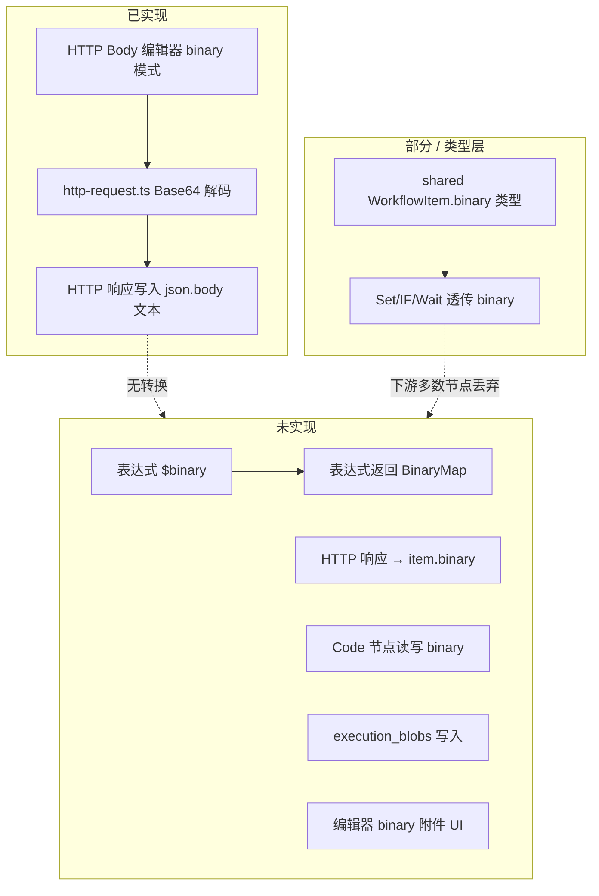

# Binary 类型支持情况分析

> 分析日期：2026-06-03（**复核：2026-06-03 晚**）  
> 范围：代码库（`packages/`、`apps/`）与相关设计文档（`docs/`）

---

## 1. 结论摘要

本仓库中 **「binary」有两层不同含义**，支持程度差异很大：

| 含义 | 说明 | 实现状态 |
|------|------|----------|
| **A. `WorkflowItem.binary`** | Item 上的命名二进制附件（文件、图片等），结构为 `{ [key]: { data, mimeType } }` | **仅类型与文档层面**；运行时几乎无完整链路 |
| **B. HTTP 请求体 `bodyContentType: 'binary'`** | HTTP Request 节点以 Base64 解码后发送原始字节流 | **已实现**（编辑器 + 执行器 + 测试） |

**总体判断**：平台在 PRD/ADR 中已定义 Item 级 binary 数据模型，但 **端到端能力尚未落地**。当前唯一可稳定使用的 binary 相关能力是 **HTTP 请求体以 binary 模式发送**。

---

## 2. 数据模型定义

### 2.1 共享类型（权威定义）

```ts
// packages/shared/src/item.ts
export interface WorkflowItem {
  json: Record<string, unknown>;
  binary?: Record<string, { data: string; mimeType: string }>;
}
```

要点：

- `data` 为 **Base64 字符串**（非 `Buffer`；插件规范 ADR 中 executor 侧可写 `Buffer`，序列化后仍为字符串）。
- 可选 `fileName` 在 [2026-06-03 JS 表达式全局设计](./superpowers/specs/2026-06-03-js-expression-globals-design.md) 中列为扩展字段，**共享类型尚未包含**。

### 2.2 文档中的期望形态

| 文档 | 对 binary 的表述 |
|------|------------------|
| [spec.md](./spec.md) FR-9 | Item 可选 `binary` 命名附件；FR-8 要求「二进制元数据索引」与大 payload 外置 |
| [adr-expression-sandbox.md](./adr-expression-sandbox.md) | 表达式可引用 `$binary` |
| [adr-execution-data.md](./adr-execution-data.md) | `execution_blobs` 表用于大 Item；策略含「含大二进制时写入 blob」 |
| [node-plugin-spec.md](./node-plugin-spec.md) | 插件 `WorkflowItem.binary` 使用 `Buffer` |
| [adr-langchain.md](./adr-langchain.md) | AI 运行时 `WorkflowItem` 对齐，含 binary |
| [2026-06-03-js-expression-globals-design.md](./superpowers/specs/2026-06-03-js-expression-globals-design.md) | 规划 `$binary` 全局、表达式返回 BinaryMap、Set 节点 binary 模式 |

---

## 3. 分层实现对照

### 3.1 表达式引擎 — ✅ 已完整落地（含隐式 return）

**模块与测试**（`packages/expression`，**75 tests PASS**）：

| 能力 | 状态 | 位置 |
|------|------|------|
| `isolated-vm` JS 沙箱 | ✅ | `js-sandbox/evaluate-js.ts` |
| `$binary` / `$input` / `$nodes` 等全局 | ✅ | `js-sandbox/build-globals.ts` |
| 单行隐式 return（`{{ $json.x }}`） | ✅ | `js-sandbox/classify-expression-source.ts` |
| 多语句须含 `return`（保存校验） | ✅ | `validate-expression-source.ts` |
| acorn 禁止项扫描（非正则） | ✅ | `validate-expression-source.ts` |
| `[binary:key]` 嵌入占位 | ✅ | `to-display-string.ts` |
| 工作流保存扫描 | ✅ | `scan-expression-sources.ts` → `workflow/validate.ts` |
| 执行期 `binary` 注入 | ✅ | `node-runner/expression/item-context.ts` |
| Set 写入表达式 BinaryMap | ❌ | 仍仅透传 input binary |

**相关 spec / plan（均为 Implemented / Completed）：**

- [js-expression-globals-design.md](./superpowers/specs/2026-06-03-js-expression-globals-design.md)
- [expression-static-validation-design.md](./superpowers/specs/2026-06-03-expression-static-validation-design.md)
- [expression-implicit-return-design.md](./superpowers/specs/2026-06-03-expression-implicit-return-design.md)
- [js-expression-engine.md](./superpowers/plans/2026-06-03-js-expression-engine.md)
- [expression-implicit-return.md](./superpowers/plans/2026-06-03-expression-implicit-return.md)

**仍建议补测（非阻塞）：** `evaluate-js.test.ts` 增加 `$binary.data` 读测。

### 3.2 HTTP Request 节点 — ✅ 请求体 binary 已实现

| 层级 | 文件 | 行为 |
|------|------|------|
| 类型 | `packages/node-runner/src/http-body.ts` | `'binary'` 为合法 `HttpBodyContentType` |
| 执行 | `packages/node-runner/src/http-request.ts` | `bodyContentType === 'binary'` 时 `Buffer.from(resolved, 'base64')` 发送；默认 `Content-Type: application/octet-stream` |
| 执行器 | `packages/node-runner/src/executors/http.ts` | 识别 binary 为「字符串 body」类型之一 |
| 编辑器 | `apps/web/src/features/editor/HttpBodyEditor.tsx` | binary 模式展示 Base64 文本框 |
| i18n | `packages/i18n-catalog/src/catalog-ui-ext.ts` | `editor.http.bodyType.binary` / `bodyBinaryPlaceholder` |
| 测试 | `packages/node-runner/src/executors/http.test.ts` | `'sends binary body decoded from base64'` |

**限制**：

- 这是 **出站 HTTP 请求体编码方式**，不是向后续节点输出 `WorkflowItem.binary`。
- HTTP **响应** 无 binary 模式：`HttpResponseBodyContentType` 仅 `plaintext | json | html | xml | text`；`parseHttpResponseBody` 始终 `response.text()`，**不会**把响应体写入 item 的 `binary` 字段。
- HTTP 节点输出仅 `{ json: buildHttpNodeOutputJson(...) }`，**丢弃** 输入 item 的 `binary`（未透传）。

### 3.3 节点执行器 — ⚠️ 部分透传，无生产者

对 `WorkflowItem.binary` 的处理（检索 `packages/node-runner`）：

| 节点 | binary 行为 |
|------|-------------|
| **Set** | ✅ 透传：`...(item.binary ? { binary: item.binary } : {})` |
| **IF / Wait / Webhook（有输入时）** | ✅ 透传整个 `item` 对象 |
| **Merge `append`** | ✅ `flat()` 保留各 branch item（含 binary） |
| **Merge `combineByKey` / `combineAll`** | ❌ 仅合并/包装 `json`，**丢失 binary** |
| **JSON / Code / HTTP / ReadWriteFile 等** | ❌ 输出仅 `{ json }`，**丢弃 binary** |
| **任意节点** | ❌ **无**将 HTTP 响应、文件、表达式结果写入 `binary` 的实现 |

Set 节点参数（`node-param-schemas.ts`）仅有 `manual | expression` 模式，用于 **json 字段**；设计文档中的「Set manual/binary 模式」**未实现**。

### 3.4 Code 沙箱 — ❌ 未支持 binary

| 项 | 说明 |
|----|------|
| Worker 载荷类型 | `sandbox-worker.ts` 中 `$input` / `nodes.items` 类型仅为 `{ json }`，不含 `binary` |
| 返回值 | 只提取 `first.json`，**无法**从 Code 节点输出 binary |
| 文档 | [code-node-guide.md](./code-node-guide.md) 仅描述 `{ json: ... }` 结构，未提及 binary |

### 3.5 前端编辑器 — ⚠️ 类型与 UI 缺口

| 项 | 状态 |
|----|------|
| HTTP Body binary 编辑器 | ✅ 已实现 |
| `WorkflowItem` 类型 | ❌ `apps/web/src/features/editor/editor-debug-types.ts` 仅 `{ json }`，**无 binary 字段** |
| 调试面板展示 | `itemsForDebugDisplay` 只处理 json 包装，**无 binary 预览/元数据** |
| Pin Data / Partial Run | 类型同上，未建模 binary |
| Set / 其他节点 UI | 无 binary 附件编辑能力 |

### 3.6 执行持久化 — ⚠️ 表结构存在，逻辑未接通

| 项 | 状态 |
|----|------|
| `execution_blobs` 表 | ✅ SQLite schema（`packages/providers/lite/src/drizzle/schema.ts`） |
| 写入 blob 的业务逻辑 | ❌ 全库 grep **无**对 `executionBlobs` 的读写（除 schema/migration） |
| `node_runs.outputData` | JSON 序列化存储；理论上可存含 base64 的 binary，但 **无专门策略、无元数据索引、无大小阈值分流** |

spec FR-8 要求的「二进制元数据索引」与「大二进制外置 blob」**尚未实现**。

### 3.7 AI / LangChain 层 — 📋 类型预留

[adr-langchain.md](./adr-langchain.md) 定义 `WorkflowItem.binary`，但 Agent/RAG 执行路径 **未发现** 读取或产出 binary 的实现；Vision 多模态（图片 binary）在 spec 中标记为 **v2.0 / P2**。

---

## 4. 两种 binary 语义关系图



---

## 5. 文档 vs 代码差异清单

| 能力 | 文档/ADR | 代码现状 |
|------|----------|----------|
| Item 可选 `binary` 字段 | spec FR-9 ✅ | 类型 ✅；端到端 ❌ |
| 表达式 `$binary` | ADR-004、表达式 globals spec | ❌ 未实现 |
| `$nodes["X"].binary` | 表达式 globals spec §4.3 | ❌ 无快捷字段；items 内 binary 无法通过表达式路径访问 |
| 表达式返回 binary 写入 output | 表达式 globals spec §5.2 | ❌ 未实现 |
| Set binary 模式 | 表达式 globals spec §5.2 | ❌ 仅 json manual/expression |
| HTTP 请求 binary body | — | ✅ 已实现 |
| HTTP 响应 binary / 文件下载 | n8n 对标常见能力 | ❌ 仅文本/json 解析 |
| 执行日志 binary 元数据 | spec FR-8 | ❌ |
| 大 binary → execution_blobs | adr-execution-data | 表 ✅；逻辑 ❌ |
| Code 节点 Items API binary | spec FR-9、code-node-guide | ❌ |
| Vision 图片 binary | spec P2 v2.0 | ❌（预期未做） |
| Web 调试面板展示 binary | spec FR-8 隐含 | ❌ |

---

## 6. 测试覆盖

| 测试 | 覆盖内容 |
|------|----------|
| `http.test.ts` → `sends binary body decoded from base64` | HTTP **请求体** binary ✅ |
| 其他 | **无**针对 `WorkflowItem.binary` 透传、表达式 `$binary`、响应转 binary 的测试 |

---

## 7. 后续工作（已 spec 化）

详见 [2026-06-03-workflow-binary-support-design.md](./superpowers/specs/2026-06-03-workflow-binary-support-design.md) 与 [实施计划](./superpowers/plans/2026-06-03-workflow-binary-support.md)。

建议实现顺序（P1 优先）：

1. **平台内核**：`BinaryAttachment` 扩展、`BinaryBlobService`、透传 helper
2. **HTTP 响应** → `item.binary` + 默认透传
3. **持久化**：256 KiB 阈值 → `execution_blobs`
4. **前端**：调试面板 binary 元数据摘要
5. **P2–P4**：Webhook、HTTP 上传、Set/Code、Merge

---

## 8. 关键代码索引

| 主题 | 路径 |
|------|------|
| Item 类型定义 | `packages/shared/src/item.ts` |
| 表达式求值（无 $binary） | `packages/expression/src/parse-eval.ts` |
| HTTP binary 请求体 | `packages/node-runner/src/http-request.ts` |
| HTTP 响应（仅文本） | `packages/node-runner/src/http-response.ts` |
| Set binary 透传 | `packages/node-runner/src/executors/transform/set.ts` |
| Merge 丢 binary | `packages/node-runner/src/executors/control-flow/merge.ts` |
| Code 仅 json 输出 | `packages/node-runner/src/executors/code.ts`、`packages/sandbox/src/sandbox-worker.ts` |
| 编辑器 HTTP binary UI | `apps/web/src/features/editor/HttpBodyEditor.tsx` |
| 前端 Item 类型（无 binary） | `apps/web/src/features/editor/editor-debug-types.ts` |
| execution_blobs schema | `packages/providers/lite/src/drizzle/schema.ts` |
| 表达式 globals 设计（**Implemented**） | `docs/superpowers/specs/2026-06-03-js-expression-globals-design.md` |
| Item binary 设计（**Accepted**） | `docs/superpowers/specs/2026-06-03-workflow-binary-support-design.md` |
| Item binary 实施计划 | `docs/superpowers/plans/2026-06-03-workflow-binary-support.md` |

---

## 9. 版本说明

- 本分析基于仓库 **2026-06-03** 工作区快照；未跟踪文件（如编辑器 Switch 分支相关改动）不影响 binary 结论。
- 表达式 AST 中的 `{ type: 'binary', op: '||' }` 等为 **逻辑运算符节点**，与 Item binary **无关**。
