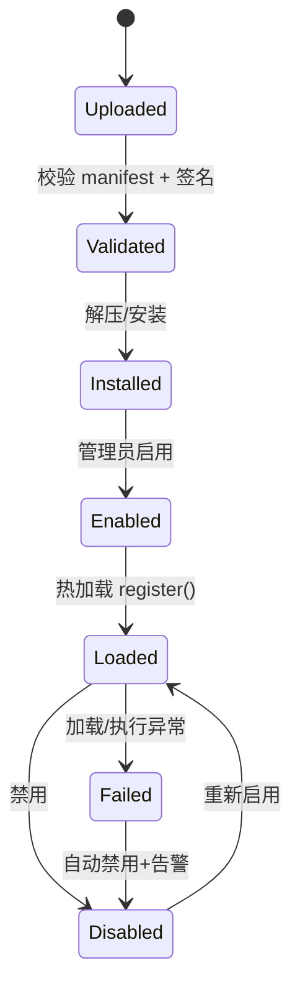

# 节点插件扩展规范（Node Plugin Specification）

| 字段 | 内容 |
|------|------|
| **版本** | 1.0.0 |
| **状态** | 草案（Draft） |
| **日期** | 2026-05-19 |
| **关联 PRD** | [spec.md](../.trae/specs/workflow-system/spec.md) FR-18 |
| **实现包** | `@rxwf/node-sdk`（规划） |

---

## 1. 概述

### 1.1 目标

定义 **统一的节点插件扩展规范**，使团队或第三方开发者能够：

1. 按规范 **自研节点插件**（无需修改平台核心代码）
2. 将插件打包为可分发单元，支持 **安装、启用、热加载、回滚**
3. 在 Web 编辑器节点面板中自动出现新节点类型，含配置 UI 与执行逻辑

### 1.2 适用范围

| 包含 | 不包含 |
|------|--------|
| 工作流 **执行节点**（1 入 → 1+ 出 Items） | 触发器节点（v1.0 仅内置；v1.2 开放） |
| 节点属性面板 UI Schema | 前端画布框架本身 |
| 凭证声明与解析 | MCP Server 实现（见 FR-13A） |
| 沙箱与权限声明 | Agent Tool 专用插件（见 FR-18.1 工具插件） |

### 1.3 术语

| 术语 | 定义 |
|------|------|
| **Plugin** | 一个 npm 包或 `.tgz` 包，含 manifest + 一个或多个 Node |
| **Node Type** | 插件注册的唯一类型 ID，如 `acme.gitlab.createMr` |
| **Node Definition** | 静态元数据（显示名、图标、属性 Schema） |
| **Node Executor** | 运行时 `execute()` 实现 |
| **Engine API** | 平台提供给插件的受控能力（凭证、日志、HTTP 代理等） |

---

## 2. 插件包结构

### 2.1 目录布局

```
my-workflow-nodes/
├── package.json                 # npm 包元数据
├── plugin.manifest.json         # 插件清单（必需）
├── dist/
│   └── index.js                 # 入口：export register(registry)
├── src/
│   ├── index.ts
│   └── nodes/
│       └── GitlabCreateMrNode.ts
├── icons/
│   └── gitlab.svg
└── README.md
```

### 2.2 `package.json` 要求

```json
{
  "name": "@acme/rx-workflow-nodes-gitlab",
  "version": "1.2.0",
  "main": "dist/index.js",
  "type": "module",
  "engines": { "node": ">=20" },
  "peerDependencies": {
    "@rxwf/node-sdk": "^1.0.0"
  }
}
```

### 2.3 `plugin.manifest.json`（必需）

```json
{
  "manifestVersion": "1",
  "id": "acme.gitlab",
  "name": "Acme GitLab Nodes",
  "version": "1.2.0",
  "description": "GitLab MR and Issue nodes for rx-workflow",
  "author": "Acme DevOps",
  "license": "MIT",
  "engine": {
    "anyWorkflow": ">=1.0.0",
    "nodeSdk": "^1.0.0"
  },
  "entry": "./dist/index.js",
  "permissions": [
    "network:outbound",
    "credentials:read"
  ],
  "credentials": [
    {
      "name": "gitlabApi",
      "type": "headerAuth",
      "displayName": "GitLab API Token",
      "required": true
    }
  ],
  "nodes": [
    {
      "type": "acme.gitlab.createMr",
      "displayName": "GitLab Create MR",
      "description": "Create a merge request",
      "category": "integration",
      "icon": "icons/gitlab.svg",
      "version": 1
    }
  ]
}
```

| 字段 | 必需 | 说明 |
|------|------|------|
| `manifestVersion` | ✓ | 清单格式版本，当前 `"1"` |
| `id` | ✓ | 插件全局唯一 ID，反斜杠形式 `vendor.name` |
| `engine.anyWorkflow` | ✓ | 兼容的平台 semver 范围 |
| `engine.nodeSdk` | ✓ | 兼容的 `@rxwf/node-sdk` 范围 |
| `entry` | ✓ | 相对路径，默认导出 `register` 函数 |
| `permissions` | ✓ | 见 §7 |
| `credentials` | | 插件级凭证类型声明 |
| `nodes` | ✓ | 预声明节点列表（可与代码注册合并校验） |

---

## 3. 插件入口与注册

### 3.1 入口签名

```typescript
import type { NodePluginRegistry } from '@rxwf/node-sdk';

export default function register(registry: NodePluginRegistry): void {
  registry.registerNode(GitlabCreateMrDefinition, GitlabCreateMrExecutor);
}
```

### 3.2 `NodePluginRegistry` API

```typescript
interface NodePluginRegistry {
  registerNode(definition: NodeDefinition, executor: NodeExecutor): void;
  registerCredentialType?(schema: CredentialTypeSchema): void;
}
```

- 同一插件内 `type` 不可重复
- 全局 `type` 冲突时后加载者失败并记录错误

---

## 4. 节点定义（NodeDefinition）

### 4.1 完整 TypeScript 接口

```typescript
interface NodeDefinition {
  /** 全局唯一，建议 {vendor}.{domain}.{action} */
  type: string;
  displayName: string;
  description: string;
  /** 节点面板分类 */
  category: NodeCategory;
  version: number;
  /** 相对插件根目录或 URL */
  icon?: string;
  /** 输入连接点 */
  inputs: PortDefinition[];
  /** 输出连接点 */
  outputs: PortDefinition[];
  /** 右侧配置面板 Schema */
  properties: PropertySchema[];
  /** 引用的凭证类型名（对应 manifest 或内置） */
  credentials?: string[];
  /** 节点级默认：超时、重试 */
  defaults?: {
    timeoutMs?: number;
    retry?: { maxAttempts: number; delayMs: number };
    continueOnFail?: boolean;
  };
  /** 是否支持在开发态 Pin 输出 */
  pinnable?: boolean;
  /**
   * 可选：i18n 键，优先于 displayName（FR-20.1）
   * 例： "nodes.gitlab.createMr.displayName"
   */
  displayNameKey?: string;
  descriptionKey?: string;
  /**
   * 执行 Runner 需求（跨平台调度），见 adr-node-runner.md
   * 未声明时视为 platforms: ['any']
   */
  runnerRequirements?: {
    platforms?: Array<'windows' | 'linux' | 'macos' | 'any'>;
    arch?: Array<'x64' | 'arm64' | 'arm'>;
    capabilities?: string[];
    /** true 时禁止回退 Embedded Runner（如 WMI） */
    preferRemote?: boolean;
  };
}

type NodeCategory =
  | 'trigger'      // v1.2+ 开放
  | 'transform'
  | 'integration'
  | 'ai'
  | 'logic'
  | 'data'
  | 'custom';

interface PortDefinition {
  name: string;
  displayName?: string;
  type: 'main';
  /** 最大入度；触发器为 0 */
  maxConnections?: number;
}

interface PropertySchema {
  name: string;
  displayName: string;
  type: PropertyType;
  default?: unknown;
  required?: boolean;
  /** 支持 {{ }} 表达式 */
  expressionable?: boolean;
  description?: string;
  placeholder?: string;
  /** type=options */
  options?: Array<{ name: string; value: string | number | boolean }>;
  /** type=json 时 JSON Schema */
  schema?: Record<string, unknown>;
  /** 条件显示 */
  displayOptions?: {
    show?: Record<string, unknown[]>;
    hide?: Record<string, unknown[]>;
  };
}

type PropertyType =
  | 'string'
  | 'number'
  | 'boolean'
  | 'options'
  | 'multiOptions'
  | 'json'
  | 'code'
  | 'credential'
  | 'notice';
```

### 4.2 配置面板渲染约定

- 平台根据 `properties` 自动生成表单（与内置节点一致）
- `expressionable: true` 的字段显示 `ƒx` 切换按钮
- `type: 'credential'` 绑定 `credentials` 中声明的类型
- `type: 'code'` 使用 Monaco 编辑器，语言默认 `javascript`

### 4.2.1 插件文案国际化（FR-20.1）

| 方式 | 说明 |
|------|------|
| **displayNameKey** | 节点/属性键指向平台或插件自带的 locale JSON |
| **displayName 回退** | 未配置 Key 时使用 `displayName` 字符串（通常为英文） |
| **插件语言包** | 插件包内 `locales/{locale}.json`，安装时注册到 i18next namespace `plugin-{pluginId}` |

`PropertySchema` 同样支持 `displayNameKey` / `descriptionKey`（可选扩展字段）。

### 4.3 示例：属性定义

```typescript
export const GitlabCreateMrDefinition: NodeDefinition = {
  type: 'acme.gitlab.createMr',
  displayName: 'GitLab Create MR',
  description: 'Creates a merge request in GitLab',
  category: 'integration',
  version: 1,
  icon: 'icons/gitlab.svg',
  inputs: [{ name: 'main', type: 'main' }],
  outputs: [{ name: 'main', type: 'main' }],
  credentials: ['gitlabApi'],
  properties: [
    {
      name: 'projectId',
      displayName: 'Project ID',
      type: 'string',
      required: true,
      expressionable: true,
    },
    {
      name: 'sourceBranch',
      displayName: 'Source Branch',
      type: 'string',
      required: true,
      expressionable: true,
    },
    {
      name: 'targetBranch',
      displayName: 'Target Branch',
      type: 'string',
      default: 'main',
      expressionable: true,
    },
  ],
  defaults: { timeoutMs: 30_000 },
  pinnable: true,
};
```

---

## 5. 节点执行器（NodeExecutor）

### 5.1 接口

```typescript
interface NodeExecutor {
  execute(context: NodeExecutionContext): Promise<NodeExecutionResult>;
}

interface NodeExecutionContext {
  /** 节点配置（已解析表达式） */
  config: Record<string, unknown>;
  /** 上游传入的 Items */
  inputItems: WorkflowItem[];
  /** 执行上下文 */
  execution: {
    id: string;
    workflowId: string;
    mode: 'manual' | 'production' | 'partial';
    environment: 'dev' | 'staging' | 'prod';
  };
  node: { id: string; name: string; type: string };
  /** 受控 API */
  helpers: NodeHelpers;
  signal: AbortSignal;
}

interface NodeExecutionResult {
  outputItems: WorkflowItem[][];
  /** 与 outputs 端口顺序对应，通常 [main] */
}

interface WorkflowItem {
  json: Record<string, unknown>;
  binary?: Record<string, { data: Buffer; mimeType?: string }>;
}
```

### 5.2 `NodeHelpers`（Engine API）

插件 **仅允许** 通过 `helpers` 访问平台能力：

```typescript
interface NodeHelpers {
  /** 解析凭证（脱敏日志） */
  getCredential(name: string): Promise<Record<string, string>>;
  /** 受控 HTTP；遵守插件 network 权限 */
  httpRequest(options: HttpRequestOptions): Promise<unknown>;
  /** 结构化日志，写入执行时间线 */
  log: {
    info(message: string, meta?: Record<string, unknown>): void;
    warn(message: string, meta?: Record<string, unknown>): void;
    error(message: string, meta?: Record<string, unknown>): void;
  };
  /** 读取环境变量（遵守作用域） */
  getEnv(key: string): string | undefined;
  /** 表达式求值（可选，用于复杂场景） */
  evaluateExpression?(template: string, itemIndex?: number): unknown;
}
```

**禁止**：插件直接 `require('fs')` / `child_process` / 任意网络库（除非声明权限且经沙箱放行）。

### 5.3 执行示例

```typescript
export const GitlabCreateMrExecutor: NodeExecutor = {
  async execute(ctx) {
    const cred = await ctx.helpers.getCredential('gitlabApi');
    const out: WorkflowItem[] = [];

    for (const item of ctx.inputItems) {
      const projectId = ctx.config.projectId ?? item.json.projectId;
      const body = await ctx.helpers.httpRequest({
        method: 'POST',
        url: `https://gitlab.example.com/api/v4/projects/${projectId}/merge_requests`,
        headers: { 'PRIVATE-TOKEN': cred.token },
        body: {
          source_branch: ctx.config.sourceBranch ?? item.json.sourceBranch,
          target_branch: ctx.config.targetBranch ?? 'main',
          title: item.json.title ?? 'Automated MR',
        },
      });
      out.push({ json: { mr: body } });
    }

    return { outputItems: [out] };
  },
};
```

### 5.4 错误处理

```typescript
import { NodeError } from '@rxwf/node-sdk';

throw new NodeError('Failed to create MR', {
  code: 'GITLAB_API_ERROR',
  httpStatus: 403,
  retryable: false,
  details: { projectId },
});
```

| `code` 前缀 | 含义 |
|-------------|------|
| `PLUGIN_*` | 插件逻辑错误 |
| `VALIDATION_*` | 配置校验失败 |
| `TIMEOUT` | 执行超时 |
| `ABORTED` | 用户停止 |

---

## 6. 数据与表达式

### 6.1 Items 契约

- 插件必须遵守平台 **Items 模型**（见 PRD FR-9）
- 输入 0 个 Item 时，执行一次 `execute` 且 `inputItems = [{}]`（可选约定，由平台配置）
- 输出每个端口对应 `outputItems` 数组中的一项

### 6.2 表达式

- 标记 `expressionable: true` 的字段，平台在执行前求值
- 插件收到的 `config` 为**已求值**结果
- 若需按 Item 索引求值，使用 `helpers.evaluateExpression`

---

## 7. 权限与安全

### 7.1 权限声明（`permissions`）

| 权限 | 说明 |
|------|------|
| `network:outbound` | 允许 `helpers.httpRequest` 访问外网 |
| `network:internal` | 仅内网 CIDR（部署配置） |
| `credentials:read` | 允许 `getCredential` |
| `env:read` | 允许 `getEnv` |
| `filesystem:read` | 只读指定前缀（P2） |
| `subprocess` | 禁止默认；特殊审批后开放 |

未声明权限的 API 调用将 **拒绝并记录安全事件**。

### 7.2 沙箱

| 版本 | 策略 |
|------|------|
| v1.0 | 插件在 **独立 Worker 进程** 加载；禁止动态 `require` 非白名单模块 |
| v1.1 | 可选 **VM 隔离** + 内存/CPU 限制 |
| 签名 | 生产环境推荐校验插件包签名 |

### 7.3 凭证

- 插件在 manifest 声明 `credentials` 类型
- 工作流节点配置面板选择凭证实例 ID
- 执行时 `getCredential` 返回解密字段，**不得写入日志**

---

## 8. 生命周期



| 阶段 | 平台行为 |
|------|----------|
| **上传** | Admin 上传 `.tgz` 或指定目录 |
| **校验** | JSON Schema 校验 manifest；检查 `engine` 兼容性 |
| **安装** | 写入插件目录，记录版本 |
| **启用** | 调用 `register()`，节点出现在面板 |
| **热加载** | v1.1：替换版本无需重启 API |
| **禁用** | 从注册表移除；已有工作流节点显示「插件已禁用」 |
| **回滚** | 保留上一版本，一键切换 |

---

## 9. 版本与兼容

### 9.1 语义化版本

- 插件 `version` 遵循 SemVer
- **Breaking**（主版本）：节点 `type` 删除、`properties` 不兼容变更
- **Minor**：新增节点、新增可选属性
- **Patch**：Executor 内部修复

### 9.2 节点 `version` 字段

- 工作流 JSON 存 `typeVersion`，默认绑定安装时最新版
- 平台升级插件后，旧工作流可继续用旧 `typeVersion`（若插件保留实现）

### 9.3 Engine API 版本

- `@rxwf/node-sdk` 独立发版
- **主版本变更** 仅当 `NodeHelpers` / `NodeDefinition` 破坏性变更

---

## 10. 工作流中的存储格式

```json
{
  "id": "node-uuid",
  "type": "acme.gitlab.createMr",
  "typeVersion": 1,
  "name": "Create MR",
  "position": [320, 240],
  "parameters": {
    "projectId": "={{ $json.projectId }}",
    "sourceBranch": "feature/foo",
    "targetBranch": "main"
  },
  "credentials": {
    "gitlabApi": { "id": "cred-uuid", "name": "GitLab Prod" }
  }
}
```

---

## 11. 开发工具链

| 工具 | 说明 | 版本 |
|------|------|------|
| `@rxwf/node-sdk` | 类型定义 + `NodeError` + 测试工具 | v1.0 |
| `awf-node create` | CLI 脚手架生成插件模板 | v1.0 |
| `awf-node dev` | 本地链接 + 热重载调试 | v1.1 |
| `awf-node validate` | 校验 manifest 与 Definition | v1.0 |
| `awf-node pack` | 打包 `.tgz` | v1.0 |

### 11.1 本地调试

1. `awf-node dev --link` 将插件链接到本地 rx-workflow 实例
2. 编辑器节点面板出现「开发中」标记
3. 使用 Partial 执行 + Pin 调试（与内置节点相同）

---

## 12. 测试要求

| 类型 | 要求 |
|------|------|
| **单元** | 每个 Executor 至少 1 个成功 + 1 个失败用例；mock `NodeHelpers` |
| **契约** | Definition 通过 JSON Schema 校验 |
| **集成** | 在 CI 中加载插件并执行最小工作流 |

---

## 13. 平台 REST API（管理面）

| 方法 | 路径 | 说明 |
|------|------|------|
| GET | `/api/plugins` | 列表 |
| POST | `/api/plugins/upload` | 上传包 |
| POST | `/api/plugins/:id/enable` | 启用 |
| POST | `/api/plugins/:id/disable` | 禁用 |
| POST | `/api/plugins/:id/rollback` | 回滚 |
| GET | `/api/plugins/:id/nodes` | 该插件注册的节点类型 |

---

## 14. 校验清单（发布前）

- [ ] `plugin.manifest.json` 通过 Schema 校验
- [ ] `engine.anyWorkflow` 与目标平台版本匹配
- [ ] 每个 `nodes[].type` 与代码 `register` 一致
- [ ] 所有 `permissions` 已声明且最小化
- [ ] 凭证不落日志、不硬编码密钥
- [ ] README 含配置说明与示例工作流 JSON
- [ ] SemVer 与 CHANGELOG 已更新

---

## 15. 变更记录

| 版本 | 日期 | 说明 |
|------|------|------|
| 1.0.0 | 2026-05-19 | 初稿：manifest、Definition、Executor、权限、生命周期 |
