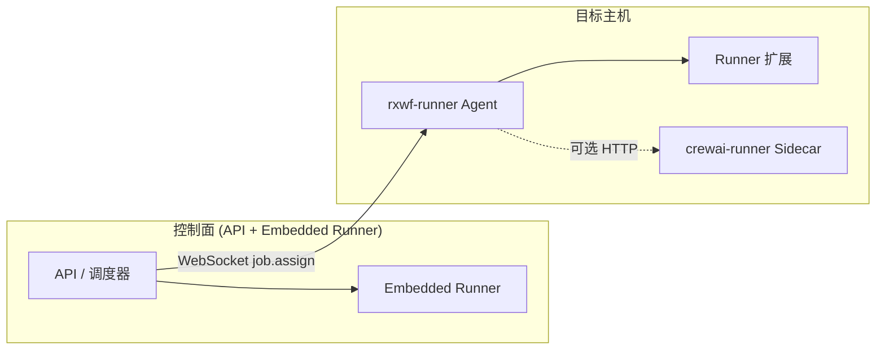

# Runner 扩展、打包与部署指南

> 本文档面向需要在 **Runner Agent** 上开发自定义 Executor、打包分发并在生产环境部署的开发者。  
> 快速上手见 [runner-agent-quickstart.md](./runner-agent-quickstart.md)；SDK API 摘要见 [runner-sdk.md](./runner-sdk.md)。

---

## 目录

1. [架构概览](#1-架构概览)
2. [前置条件](#2-前置条件)
3. [扩展开发完整流程](#3-扩展开发完整流程)
4. [与控制面节点插件配合](#4-与控制面节点插件配合)
5. [本地开发与调试](#5-本地开发与调试)
6. [打包与发布](#6-打包与发布)
7. [Agent 部署](#7-agent-部署)
8. [CrewAI Sidecar 部署（可选）](#8-crewai-sidecar-部署可选)
9. [运维与生命周期](#9-运维与生命周期)
10. [CI/CD 示例](#10-cicd-示例)
11. [故障排查](#11-故障排查)
12. [相关文档](#12-相关文档)

---

## 1. 架构概览

RX-Workflow 的执行面分为 **控制面（Embedded Runner）** 与 **远程 Runner Agent** 两层：



| 概念 | 包 / 模块 | 运行位置 | 职责 |
|------|-----------|----------|------|
| **Embedded Runner** | 控制面内置 | API 进程 | 无外部 Agent 时的默认执行面 |
| **Runner Agent** | `@rxwf/runner-agent`（CLI：`rxwf-runner`） | Linux / Windows / macOS | 注册、心跳、接收并执行远程任务 |
| **Runner 扩展** | `@rxwf/runner-sdk` 契约 | **仅 Agent 进程** | 注册额外 `NodeExecutor`、能力标签 |
| **节点插件** | `@rxwf/node-sdk` | 控制面 + 编辑器 | 节点定义、UI、`runnerRequirements` |
| **Runner SDK** | `@rxwf/runner-sdk` | 扩展作者依赖 | manifest 校验、`RunnerExtension` 类型 |
| **Runner Protocol** | `@rxwf/runner-protocol` | Agent ↔ API | WebSocket 信封、`RemoteNodeRunJob` |

**内置能力（无需扩展）**：Agent 启动时自动注册 `code`（Code 节点）与 `shell`（`executeCommand` 节点）。

**v1.1 远程白名单（MVP）**：控制面调度层默认仅将 `code`、`executeCommand` 派发到 Agent；其余节点类型在策略指向 Agent 时会 **静默回退 Embedded**。扩展注册的自定义节点类型需在控制面插件中声明 `preferRemote: true` 并在调度层放开（见 §4）。

---

## 2. 前置条件

| 项 | 要求 |
|----|------|
| 控制面 | API 已启动（`pnpm dev` 或 `deploy/compose.lite.yaml`） |
| Node.js | ≥ 20（源码运行 Agent / 构建扩展） |
| 权限 | **Admin** 可创建 Runner 预注册 Token |
| 网络 | Agent 仅需 **HTTPS/WSS 出站** 访问控制面 `serverUrl` |
| API 副本 | 启用远程 Runner 时 **API 须单实例**（`replicas: 1`），见 [deploy/README.md](../deploy/README.md) |

核心 CLI 与包：

```bash
# monorepo 内构建 Agent
pnpm --filter @rxwf/runner-agent build

# 使用 CLI（bin 名 rxwf-runner）
pnpm exec rxwf-runner --help
```

---

## 3. 扩展开发完整流程

### 3.1 创建扩展项目

推荐独立 npm 包，默认导出 `RunnerExtension`：

```
my-rxwf-runner-extension/
├── package.json
├── tsconfig.json
├── src/
│   └── index.ts          # export default RunnerExtension
└── dist/
    └── index.js          # 构建产物
```

**`package.json` 示例**：

```json
{
  "name": "@acme/rxwf-wmi-executor",
  "version": "1.0.0",
  "type": "module",
  "main": "dist/index.js",
  "types": "dist/index.d.ts",
  "scripts": {
    "build": "tsc -p tsconfig.json",
    "prepublishOnly": "pnpm build"
  },
  "peerDependencies": {
    "@rxwf/runner-sdk": "^1.0.0",
    "@rxwf/node-runner": "^1.0.0"
  },
  "devDependencies": {
    "@rxwf/runner-sdk": "^1.0.0",
    "@rxwf/node-runner": "^1.0.0",
    "typescript": "^5.8.0"
  }
}
```

**`tsconfig.json` 示例**：

```json
{
  "compilerOptions": {
    "target": "ES2022",
    "module": "NodeNext",
    "moduleResolution": "NodeNext",
    "declaration": true,
    "outDir": "dist",
    "rootDir": "src",
    "strict": true,
    "skipLibCheck": true
  },
  "include": ["src"]
}
```

### 3.2 编写 manifest

`RunnerExtensionManifest` 在 Agent 启动时校验，并合并进注册时的 `capabilities`：

```typescript
import type { RunnerExtensionManifest } from '@rxwf/runner-sdk';

export const manifest: RunnerExtensionManifest = {
  /** 全局唯一 ID，建议 scoped 包名 */
  id: '@acme/rxwf-wmi-executor',
  version: '1.0.0',
  /** 合并进 Agent 注册时的 capabilities，供调度过滤 */
  capabilities: ['wmi'],
  /** 须与 registerExecutor 的 type 一致 */
  nodeTypes: ['wmi.query'],
  /** 与 @rxwf/runner-sdk 主版本对齐 */
  runnerSdk: '^1.0.0',
  /** 可选：兼容的控制面版本 */
  awfServer: '^1.1.0',
  description: 'Windows WMI query executor',
};
```

| 字段 | 必填 | 说明 |
|------|:----:|------|
| `id` | ✓ | 如 `@acme/rxwf-wmi-executor` |
| `version` | ✓ | Semver |
| `runnerSdk` | ✓ | 主版本须与 Agent 内置 SDK 一致（当前 `1.0.0`） |
| `capabilities` | — | 注册时上报给控制面 |
| `nodeTypes` | — | 文档/校验用；须与 Executor `type` 一致 |
| `awfServer` | — | 可选控制面版本约束 |
| `description` | — | 人类可读说明 |

### 3.3 实现 NodeExecutor

扩展通过 `register()` 向 Agent 注册与 `@rxwf/node-runner` 相同契约的 Executor：

```typescript
import type { NodeExecutor, NodeRunResult } from '@rxwf/node-runner';
import type { RunnerExtension } from '@rxwf/runner-sdk';
import { manifest } from './manifest.js';

const wmiExecutor: NodeExecutor = {
  type: 'wmi.query',
  async execute(ctx): Promise<NodeRunResult> {
    const query = String(ctx.config.query ?? '');
    if (!query) {
      return {
        status: 'failed',
        errorCode: 'E2002',
        errorMessage: 'query is required',
        outputItems: [[]],
      };
    }

    // 调用本地 WMI / 平台 API（示例占位）
    const rows: unknown[] = [];
    // ... 实际 WMI 调用 ...

    return {
      status: 'success',
      outputItems: [[{ json: { rows } }]],
    };
  },
};

const extension: RunnerExtension = {
  manifest,
  async register(ctx) {
    ctx.registerExecutor(wmiExecutor);
    ctx.logger.info('WMI executor registered');
  },
};

export default extension;
```

**`NodeExecutionContext` 常用字段**：

| 字段 | 说明 |
|------|------|
| `config` | 节点 `parameters`（已解析表达式） |
| `inputItems` | 上游输出项 |
| `env` / `vars` | 工作流 / 用户 / 全局环境变量 |
| `executionId` / `nodeId` | 执行与节点标识 |

**`NodeRunResult` 约定**：

- `status`: `success` | `failed` | `skipped`（远程 Runner **不支持** `waiting`）
- 失败时提供 `errorCode` / `errorMessage`（参考 [error-codes.md](./error-codes.md)）
- 成功时 `outputItems` 为 `WorkflowItem[][]`（多输出分支）

### 3.4 RunnerExtensionContext

| 成员 | 说明 |
|------|------|
| `registerExecutor(executor)` | 注册 `NodeExecutor` |
| `registerCapability(name, probe?)` | 动态能力；`probe()` 返回 false 时可从能力集排除 |
| `config` | 只读 Agent 配置（`serverUrl`、`runnerId`、`labels` 等） |
| `logger` | 结构化日志（`debug` / `info` / `warn` / `error`） |

### 3.5 可选：lifecycle 与 middleware（SDK 契约）

`@rxwf/runner-sdk` 定义了生命周期钩子与中间件类型，供扩展作者预留审计、限流等逻辑：

```typescript
const extension: RunnerExtension = {
  manifest,
  async register(ctx) {
    ctx.registerExecutor(wmiExecutor);
  },
  lifecycle: {
    onAgentStart(ctx) {
      ctx.logger.info('WMI extension started');
    },
    onJobEnd(job, result, ctx) {
      ctx.logger.debug('job finished', { jobId: job.jobId, status: result.status });
    },
  },
  middleware: [
    {
      id: 'audit',
      async execute(ctx, next, meta) {
        const result = await next();
        // 记录 meta.jobId / meta.nodeType
        return result;
      },
    },
  ],
};
```

> **注意**：v1.1 Agent 的 `ExtensionHost` 当前在启动时加载 `manifest` 并调用 `register()`；`lifecycle` / `middleware` 为 SDK 预留接口，后续 Agent 版本将接入。扩展作者可先按契约编写，便于向前兼容。

### 3.6 manifest 校验

Agent 与 CLI 共用 `validateExtensionManifest`：

```typescript
import { validateExtensionManifest } from '@rxwf/runner-sdk';

const RUNNER_SDK_VERSION = '1.0.0'; // Agent 内置版本

const result = validateExtensionManifest(manifest, RUNNER_SDK_VERSION);
if (!result.ok) {
  throw new Error(result.reason);
}
```

常见失败原因：

| reason | 含义 |
|--------|------|
| `manifest.runnerSdk is required` | 未填写 `runnerSdk` |
| `runnerSdk … is incompatible with sdk …` | manifest 与 Agent SDK **主版本**不一致 |

---

## 4. 与控制面节点插件配合

Runner 扩展 **不能单独构成工作流节点**；须在控制面注册对应 **节点插件**，两层声明须一致：

| 层 | 包 | 运行位置 |
|----|-----|----------|
| 工作流节点定义 + 编辑器 UI | `@rxwf/node-sdk` | 控制面 + Embedded Runner |
| **Runner 扩展** | `@rxwf/runner-sdk` | **仅 Runner Agent 进程** |

节点插件 manifest 中通过 `runnerRequirements` 声明远程执行需求（见 [node-plugin-spec.md](./node-plugin-spec.md)）：

```typescript
// 控制面节点插件（节选）
const wmiNodeDefinition = {
  type: 'wmi.query',
  displayName: 'WMI Query',
  category: 'integration',
  runnerRequirements: {
    platforms: ['windows'],
    capabilities: ['wmi'],
    /** true 时禁止回退 Embedded；WMI 等必须远程 */
    preferRemote: true,
  },
  // ... properties、inputs/outputs ...
};
```

**对齐检查清单**：

| 检查项 | 扩展 manifest | 节点插件 |
|--------|---------------|----------|
| 节点 type | `nodeTypes: ['wmi.query']` | `type: 'wmi.query'` |
| 能力标签 | `capabilities: ['wmi']` | `runnerRequirements.capabilities: ['wmi']` |
| 平台 | Agent 运行在 Windows | `platforms: ['windows']` |
| 禁止回退 | — | `preferRemote: true` |

若调度成功但 Agent 未注册对应 Executor，Agent 返回 **E2016**（节点类型不受支持）。

---

## 5. 本地开发与调试

### 5.1 配置 Agent

```bash
mkdir -p ./runner-config
cp packages/runner-agent/rxwf-runner.json.example ./runner-config/rxwf-runner.json
```

编辑 `rxwf-runner.json`，加入扩展引用（npm 包名或相对路径）：

```json
{
  "serverUrl": "http://localhost:8787",
  "credentialFile": "./runner-config/credential.json",
  "name": "dev-win-01",
  "maxConcurrent": 4,
  "extensions": [
    "./extensions/wmi-executor/dist/index.js"
  ],
  "labels": ["dev"],
  "logLevel": "debug"
}
```

扩展引用方式：

| 方式 | `extensions` 条目 | 适用场景 |
|------|-------------------|----------|
| 相对路径 | `"./plugins/custom.js"` | 本地开发、CI 挂载 |
| npm 包名 | `"@acme/rxwf-wmi-executor"` | 已发布到 registry |
| monorepo workspace | `"@acme/rxwf-wmi-executor"` | `pnpm install` 后 node 可解析 |

### 5.2 校验扩展

```bash
pnpm --filter @rxwf/runner-agent build

pnpm exec rxwf-runner validate-extensions \
  --config ./runner-config/rxwf-runner.json
```

期望输出：

```
OK ./extensions/wmi-executor/dist/index.js (@acme/rxwf-wmi-executor@1.0.0)
```

### 5.3 查看合并后的能力集

```bash
pnpm exec rxwf-runner info --config ./runner-config/rxwf-runner.json
```

示例输出：

```json
{
  "runnerId": "550e8400-e29b-41d4-a716-446655440000",
  "serverUrl": "http://localhost:8787",
  "capabilities": ["code", "shell", "wmi"]
}
```

### 5.4 注册与启动

**创建预注册 Token（Admin）**：

```bash
export SERVER_URL=http://localhost:8787
export RXWF_API_KEY=<your-admin-api-key>

curl -sf -X POST "$SERVER_URL/api/runners/registration-tokens" \
  -H "Content-Type: application/json" \
  -H "x-api-key: $RXWF_API_KEY" \
  -d '{"labels":["dev"],"expiresInHours":24}'
```

**注册**（扩展能力会合并进 `POST /api/runners/register` 的 `capabilities`）：

```bash
pnpm exec rxwf-runner register \
  --config ./runner-config/rxwf-runner.json \
  --token "<registrationToken>"
```

成功后写入 `credential.json` 并回写 `runnerId`。

**启动 Agent**：

```bash
pnpm exec rxwf-runner start --config ./runner-config/rxwf-runner.json
```

### 5.5 单元测试扩展

在扩展包内 mock `NodeExecutionContext` 测试 Executor：

```typescript
import { describe, expect, it } from 'vitest';
import extension from './index.js';

describe('wmi.query executor', () => {
  it('requires query parameter', async () => {
    const executors: Array<{ type: string; execute: Function }> = [];
    await extension.register!({
      registerExecutor: (e) => executors.push(e),
      registerCapability: () => {},
      config: {} as any,
      logger: { debug() {}, info() {}, warn() {}, error() {} },
    });

    const executor = executors.find((e) => e.type === 'wmi.query')!;
    const result = await executor.execute({ config: {}, inputItems: [] });
    expect(result.status).toBe('failed');
    expect(result.errorMessage).toContain('query');
  });
});
```

manifest 校验测试可参考 `packages/runner-sdk/src/validate-manifest.test.ts`。

---

## 6. 打包与发布

### 6.1 构建扩展 npm 包

```bash
cd my-rxwf-runner-extension
pnpm install
pnpm build
npm pack   # 或 pnpm publish --access restricted
```

发布前确认：

- `main` 指向 ESM 构建产物（`"type": "module"`）
- `peerDependencies` 包含 `@rxwf/runner-sdk`、`@rxwf/node-runner`
- `runnerSdk` 主版本与目标 Agent 一致

### 6.2 monorepo 内联扩展

在 RX-Workflow monorepo 中可将扩展作为 workspace 包：

```yaml
# pnpm-workspace.yaml 已包含 packages/*
```

```
packages/
├── runner-agent/
└── runner-extension-wmi/
    ├── package.json   # name: @acme/rxwf-wmi-executor
    └── src/index.ts
```

Agent 配置：

```json
{
  "extensions": ["@acme/rxwf-wmi-executor"]
}
```

构建顺序：

```bash
pnpm --filter @acme/rxwf-wmi-executor build
pnpm --filter @rxwf/runner-agent build
```

### 6.3 打包 Agent 基础镜像

monorepo 根目录官方 Dockerfile（仅含内置 `code` / `shell`）：

```bash
docker build -f packages/runner-agent/Dockerfile -t rxwf-runner:1.0.0 .
```

### 6.4 打包「Agent + 自定义扩展」镜像

在基础镜像之上叠加扩展，示例 `Dockerfile.runner-with-extensions`：

```dockerfile
# ---- 构建阶段 ----
FROM node:20-alpine AS build
WORKDIR /app

RUN corepack enable && corepack prepare pnpm@9.0.0 --activate

# monorepo 根文件
COPY package.json pnpm-lock.yaml pnpm-workspace.yaml turbo.json tsconfig.base.json ./

# Agent 与扩展源码
COPY packages/runner-agent ./packages/runner-agent
COPY packages/runner-sdk ./packages/runner-sdk
COPY packages/runner-protocol ./packages/runner-protocol
COPY packages/node-runner ./packages/node-runner
COPY packages/sandbox ./packages/sandbox
COPY packages/shared ./packages/shared
COPY extensions/wmi-executor ./extensions/wmi-executor

RUN pnpm install --frozen-lockfile
RUN pnpm --filter @acme/rxwf-wmi-executor build
RUN pnpm --filter @rxwf/runner-agent... build

# ---- 运行阶段 ----
FROM node:20-alpine
WORKDIR /app/packages/runner-agent

ENV NODE_ENV=production

COPY --from=build /app /app

# 默认启动命令；配置通过卷挂载
CMD ["node", "dist/cli/main.js", "start", "--config", "/config/rxwf-runner.json"]
```

配套 `rxwf-runner.json`（挂载到 `/config/`）：

```json
{
  "serverUrl": "https://rxwf.example.com",
  "credentialFile": "/config/credential.json",
  "name": "win-build-01",
  "maxConcurrent": 4,
  "extensions": [
    "/app/extensions/wmi-executor/dist/index.js"
  ],
  "labels": ["ci", "windows"],
  "logLevel": "info"
}
```

构建与运行：

```bash
docker build -f Dockerfile.runner-with-extensions -t rxwf-runner-wmi:1.0.0 .

docker run --rm -d \
  --name rxwf-runner \
  -v /etc/rxwf-runner:/config:ro \
  rxwf-runner-wmi:1.0.0
```

> **首次注册**须在容器外或一次性容器内完成（需 `--token` 且会写入 credential 文件），见 §7.2。

### 6.5 离线 / 内网分发

无 npm registry 时，可将扩展打成 tarball 并在目标机安装：

```bash
# 构建机
pnpm pack --filter @acme/rxwf-wmi-executor
# 产出 acme-rxwf-wmi-executor-1.0.0.tgz

# 目标机（与 Agent 同目录或 global node_modules）
npm install ./acme-rxwf-wmi-executor-1.0.0.tgz
```

配置中仍使用包名 `"@acme/rxwf-wmi-executor"`，Node ESM `import()` 从 `node_modules` 解析。

---

## 7. Agent 部署

### 7.1 部署拓扑

```
                    ┌─────────────────────┐
                    │  RX-Workflow API    │
                    │  (replicas: 1)      │
                    └──────────┬──────────┘
                               │ WSS /api/runners/{id}/stream
           ┌───────────────────┼───────────────────┐
           ▼                   ▼                   ▼
    ┌─────────────┐     ┌─────────────┐     ┌─────────────┐
    │ Linux Agent │     │ Windows Agent│     │ macOS Agent │
    │ + extensions│     │ + WMI ext   │     │ + extensions│
    └─────────────┘     └─────────────┘     └─────────────┘
```

**约束**：

1. API **单实例**（v1.1 `InMemoryRunnerGateway`）
2. Agent **仅需出站** HTTPS/WSS
3. 反向代理须支持 WebSocket 升级

### 7.2 标准部署流程

```bash
# 1. 启动控制面
docker compose -f deploy/compose.lite.yaml up -d --build
curl -sf http://localhost:8787/api/ready

# 2. Admin 创建 Token（UI：设置 → Runners，或 API / MCP）
curl -sf -X POST "$SERVER_URL/api/runners/registration-tokens" \
  -H "Content-Type: application/json" \
  -H "x-api-key: $RXWF_API_KEY" \
  -d '{"labels":["prod","linux"],"expiresInHours":1}'

# 3. 目标机：准备配置目录
sudo mkdir -p /etc/rxwf-runner
sudo cp rxwf-runner.json /etc/rxwf-runner/
sudo chmod 600 /etc/rxwf-runner/rxwf-runner.json

# 4. 注册（一次性）
rxwf-runner register \
  --config /etc/rxwf-runner/rxwf-runner.json \
  --token "<registrationToken>"

# 5. 启动 Agent（长期运行）
rxwf-runner start --config /etc/rxwf-runner/rxwf-runner.json
```

注册成功后 `credential.json` 示例：

```json
{
  "runnerId": "550e8400-e29b-41d4-a716-446655440000",
  "runnerCredential": "rc_xxxxxxxxxxxxxxxx"
}
```

**权限建议**：`credential.json` 仅 Agent 运行用户可读（`chmod 600`）。

### 7.3 systemd（Linux）

`/etc/systemd/system/rxwf-runner.service`：

```ini
[Unit]
Description=RX-Workflow Runner Agent
After=network-online.target
Wants=network-online.target

[Service]
Type=simple
User=rxwf-runner
Group=rxwf-runner
WorkingDirectory=/opt/rxwf-runner
ExecStart=/usr/bin/node /opt/rxwf-runner/dist/cli/main.js start --config /etc/rxwf-runner/rxwf-runner.json
Restart=on-failure
RestartSec=10
Environment=NODE_ENV=production

# 优雅退出：Agent 在 SIGTERM 后 drain 在途任务（默认 120s）
KillSignal=SIGTERM
TimeoutStopSec=130

[Install]
WantedBy=multi-user.target
```

```bash
sudo systemctl daemon-reload
sudo systemctl enable --now rxwf-runner
sudo systemctl status rxwf-runner
```

### 7.4 Docker Compose（Sidecar 模式）

`docker-compose.runner.yaml` 示例：

```yaml
services:
  rxwf-runner:
    image: rxwf-runner:1.0.0
    restart: unless-stopped
    volumes:
      - ./runner-config:/config:ro
    # 若扩展需访问 Docker 宿主机资源，按需添加 network_mode / extra_hosts
    environment:
      NODE_ENV: production
```

```bash
# 先在本机完成 register，确保 runner-config/ 含 credential.json
docker compose -f docker-compose.runner.yaml up -d
```

### 7.5 Kubernetes

Agent 通常以 **DaemonSet** 或 **每节点 Deployment** 部署；**API Deployment 须 `replicas: 1`**：

```yaml
apiVersion: apps/v1
kind: Deployment
metadata:
  name: rxwf-runner
spec:
  replicas: 1
  selector:
    matchLabels:
      app: rxwf-runner
  template:
    metadata:
      labels:
        app: rxwf-runner
    spec:
      containers:
        - name: agent
          image: registry.example.com/rxwf-runner-wmi:1.0.0
          args:
            - node
            - dist/cli/main.js
            - start
            - --config
            - /config/rxwf-runner.json
          volumeMounts:
            - name: config
              mountPath: /config
              readOnly: true
          resources:
            limits:
              cpu: "2"
              memory: 2Gi
      volumes:
        - name: config
          secret:
            secretName: rxwf-runner-config
            items:
              - key: rxwf-runner.json
                path: rxwf-runner.json
              - key: credential.json
                path: credential.json
```

Secret 中 `rxwf-runner.json` 示例：

```json
{
  "serverUrl": "https://rxwf.internal",
  "credentialFile": "/config/credential.json",
  "name": "k8s-node-pool-01",
  "maxConcurrent": 8,
  "extensions": ["@acme/rxwf-wmi-executor"],
  "labels": ["k8s", "linux"]
}
```

### 7.6 Windows 服务

PowerShell 注册为 Windows 服务（需 [NSSM](https://nssm.cc/) 或类似工具）：

```powershell
# 假设 Node 与 Agent 已安装到 C:\rxwf-runner
nssm install RxWfRunner "C:\Program Files\nodejs\node.exe" `
  "C:\rxwf-runner\dist\cli\main.js start --config C:\rxwf-runner\rxwf-runner.json"

nssm set RxWfRunner AppDirectory C:\rxwf-runner
nssm set RxWfRunner AppStdout C:\rxwf-runner\logs\stdout.log
nssm set RxWfRunner AppStderr C:\rxwf-runner\logs\stderr.log
nssm start RxWfRunner
```

Windows Agent 配置示例（含 WMI 扩展）：

```json
{
  "serverUrl": "https://rxwf.example.com",
  "credentialFile": "C:\\rxwf-runner\\credential.json",
  "name": "win-build-01",
  "maxConcurrent": 4,
  "extensions": ["@acme/rxwf-wmi-executor"],
  "labels": ["ci", "windows"],
  "logLevel": "info",
  "shutdownTimeoutMs": 120000
}
```

### 7.7 工作流绑定 Runner

生产推荐 **pinned** 模式 + `fallback: fail`：

```json
{
  "schemaVersion": 1,
  "name": "WMI 巡检",
  "active": true,
  "settings": {
    "runnerPolicy": {
      "mode": "pinned",
      "runnerId": "<runnerId-from-register>",
      "fallback": "fail"
    }
  },
  "nodes": [
    {
      "id": "wmi-1",
      "type": "wmi.query",
      "name": "Query OS",
      "parameters": {
        "query": "SELECT Caption FROM Win32_OperatingSystem"
      }
    }
  ]
}
```

或使用 **label** 模式匹配一组 Agent：

```json
{
  "runnerPolicy": {
    "mode": "label",
    "labels": ["ci", "windows"],
    "fallback": "fail"
  }
}
```

---

## 8. CrewAI Sidecar 部署（可选）

GPU / 内网机器上可同机部署 Python Sidecar，由 Agent 向控制面宣告 `crewai` 能力。

**架构**：

```
rxwf-runner Agent ──HTTP──► crewai-runner (8071)
       │
       └──WSS──► RX-Workflow API
```

**Sidecar 启动**：

```bash
cd packages/crewai-runner
pip install -e ".[dev]"
uvicorn crewai_runner.main:app --host 0.0.0.0 --port 8071
```

或 Docker：

```bash
cd packages/crewai-runner
docker build -t crewai-runner:local .
docker run --rm -p 8071:8071 crewai-runner:local
```

**Agent 配置**：

```json
{
  "crewaiSidecarUrl": "http://127.0.0.1:8071"
}
```

注册或重启 `start` 后，capabilities 自动包含 `crewai`（若 Sidecar URL 非空）。

**网络注意**：Sidecar 回调 Tool/Credential 桥时使用 API `publicUrl`，须确保 Sidecar 所在网络能访问该地址。

---

## 9. 运维与生命周期

### 9.1 CLI 速查

| 命令 | 作用 |
|------|------|
| `rxwf-runner register --config <path> --token <token>` | 用预注册 Token 换取长期凭证 |
| `rxwf-runner start --config <path>` | 连接控制面并执行任务 |
| `rxwf-runner info --config <path>` | 输出 `runnerId`、合并后的 `capabilities` |
| `rxwf-runner validate-extensions --config <path>` | 校验 `extensions` 清单 |

### 9.2 在线状态确认

```bash
curl -sf "$SERVER_URL/api/runners" -H "x-api-key: $RXWF_API_KEY" | jq .
```

期望：`status: "online"`，`capabilities` 含扩展声明的能力。

### 9.3 优雅下线（drain）

Admin 触发 drain 后，Agent 收到 `config.update`（`status: draining`），停止接收新任务并等待在途任务完成（默认 `shutdownTimeoutMs: 120000`）：

```bash
curl -sf -X POST "$SERVER_URL/api/runners/<runnerId>/drain" \
  -H "x-api-key: $RXWF_API_KEY"
```

systemd / K8s 滚动升级前应先 drain，再 SIGTERM。

### 9.4 凭证轮换

```bash
curl -sf -X POST "$SERVER_URL/api/runners/<runnerId>/rotate-credential" \
  -H "x-api-key: $RXWF_API_KEY"
```

响应含新 `runnerCredential`（**仅一次**）；更新 `credential.json` 后重启 Agent。

### 9.5 扩展升级

1. 构建新版本扩展，确认 `runnerSdk` 仍兼容
2. `validate-extensions` 通过
3. 停止 Agent（或 drain）
4. 替换扩展产物 / 更新镜像
5. 若 capabilities 变化，**重新 `register`**（或确认控制面接受在线 capability 更新策略）
6. `start` 并验证 `info` 输出

### 9.6 配置参考（完整）

`packages/runner-agent/rxwf-runner.json.example`：

```json
{
  "serverUrl": "https://rxwf.example.com",
  "runnerId": "uuid",
  "credentialFile": "/etc/rxwf-runner/credential",
  "name": "win-build-01",
  "maxConcurrent": 4,
  "extensions": [
    "@rxwf/runner-builtin-plus",
    "@acme/rxwf-wmi-executor",
    "./plugins/custom.js"
  ],
  "labels": ["ci", "windows"],
  "crewaiSidecarUrl": "http://127.0.0.1:8071",
  "logLevel": "info",
  "shutdownTimeoutMs": 120000
}
```

| 字段 | 说明 |
|------|------|
| `serverUrl` | 控制面根 URL（必填） |
| `credentialFile` | 注册后凭证路径（必填） |
| `name` | Runner 展示名（必填） |
| `runnerId` | 注册后回写；可选，优先于 credential 文件 |
| `maxConcurrent` | 并发任务上限，默认 1 |
| `extensions` | 扩展模块路径或 npm 包名 |
| `labels` | 调度亲和性标签 |
| `crewaiSidecarUrl` | 同机 CrewAI Sidecar 基址 |
| `logLevel` | `debug` \| `info` \| `warn` \| `error` |
| `shutdownTimeoutMs` | drain / SIGTERM 等待在途任务超时 |

---

## 10. CI/CD 示例

### 10.1 扩展包 CI

`.github/workflows/extension-ci.yml`：

```yaml
name: WMI Runner Extension CI

on:
  push:
    branches: [main]
  pull_request:

jobs:
  test:
    runs-on: ubuntu-latest
    steps:
      - uses: actions/checkout@v4

      - uses: pnpm/action-setup@v4
        with:
          version: 9

      - uses: actions/setup-node@v4
        with:
          node-version: '20'
          cache: 'pnpm'

      - run: pnpm install --frozen-lockfile
      - run: pnpm build
      - run: pnpm test

      - name: Validate manifest against runner-sdk 1.x
        run: node --input-type=module -e "
          import { validateExtensionManifest } from '@rxwf/runner-sdk';
          import ext from './dist/index.js';
          const r = validateExtensionManifest(ext.default.manifest, '1.0.0');
          if (!r.ok) throw new Error(r.reason);
          console.log('manifest OK');
        "
```

### 10.2 Agent E2E（monorepo 内置）

RX-Workflow 仓库 nightly 工作流：

```bash
pnpm --filter @rxwf/runner-agent build
RXWF_TEST_RUNNER_AGENT=1 pnpm --filter @rxwf/api test -- \
  runner-v1.1-acceptance \
  runner-agent-e2e \
  runner-remote \
  runner-ws \
  runners-registration
```

见 [`.github/workflows/nightly-runner-agent.yml`](../.github/workflows/nightly-runner-agent.yml)。

### 10.3 镜像构建与推送

```yaml
- name: Build runner image with extensions
  run: |
    docker build -f Dockerfile.runner-with-extensions \
      -t ${{ env.REGISTRY }}/rxwf-runner-wmi:${{ github.sha }} .
    docker push ${{ env.REGISTRY }}/rxwf-runner-wmi:${{ github.sha }}
```

---

## 11. 故障排查

| 现象 | 可能原因 | 处理 |
|------|----------|------|
| `validate-extensions` FAIL | manifest 缺字段 / SDK 主版本不匹配 | 检查 `runnerSdk: '^1.0.0'` 与 Agent 版本 |
| 注册 401 | Token 过期或已使用 | Admin 重新创建 registration token |
| Agent 连不上 WSS | 代理未支持 WebSocket / `serverUrl` 错误 | 检查 Nginx `Upgrade` 头；`serverUrl` 与证书 |
| 节点 **E2010** | 无在线 Runner 或策略不匹配 | 确认 `runnerPolicy`、labels、platform |
| 节点 **E2016** | Agent 未注册该 `nodeType` | 检查扩展 `nodeTypes` 与 `registerExecutor` |
| capabilities 缺扩展能力 | 扩展未加载 / register 失败 | `info` 命令；查看 Agent 启动日志 |
| `executeCommand` 失败 | 命令不在白名单 | 配置 Runner 命令白名单（见 spec FR-2） |
| 任务派发到错误实例 | API 多副本 | **限制 API replicas: 1** |
| CrewAI 远程失败 | Sidecar 不可达 / publicUrl 不对 | 检查 `crewaiSidecarUrl` 与 API 出站可达性 |

**调试命令组合**：

```bash
# 1. 扩展是否可加载
pnpm exec rxwf-runner validate-extensions --config ./runner-config/rxwf-runner.json

# 2. 能力集是否正确
pnpm exec rxwf-runner info --config ./runner-config/rxwf-runner.json

# 3. 控制面是否看到在线 Runner
curl -sf "$SERVER_URL/api/runners" -H "x-api-key: $RXWF_API_KEY" | jq '.[] | {id,name,status,capabilities}'
```

---

## 12. 相关文档

| 文档 | 说明 |
|------|------|
| [runner-agent-quickstart.md](./runner-agent-quickstart.md) | Agent 注册与启动快速入门 |
| [runner-sdk.md](./runner-sdk.md) | SDK API 摘要 |
| [node-plugin-spec.md](./node-plugin-spec.md) | 控制面节点插件与 `runnerRequirements` |
| [adr-node-runner.md](./adr-node-runner.md) | Runner 架构 ADR |
| [changelog/runner-v1.1.md](./changelog/runner-v1.1.md) | v1.1 变更与验收 |
| [deploy/README.md](../deploy/README.md) | 控制面部署与 API 单实例约束 |
| [error-codes.md](./error-codes.md) | E2010 / E2016 等错误码 |
| [openapi.yaml](./openapi.yaml) | `Runners` 标签 REST 契约 |

---

## 附录 A：端到端检查清单

- [ ] 控制面 API 就绪（`/api/ready`）
- [ ] 扩展 `pnpm build` 成功
- [ ] `validate-extensions` 全部 OK
- [ ] `register` 成功，`credential.json` 已保存
- [ ] `start` 后 Runner `online`
- [ ] `info` 中 capabilities 含扩展能力
- [ ] 控制面节点插件 `runnerRequirements` 与扩展 manifest 一致
- [ ] 工作流 `runnerPolicy` 指向正确 Runner
- [ ] 试跑工作流，`node_runs.runner_id` 为 Agent ID
- [ ] 生产：API `replicas: 1`；credential 文件权限正确
