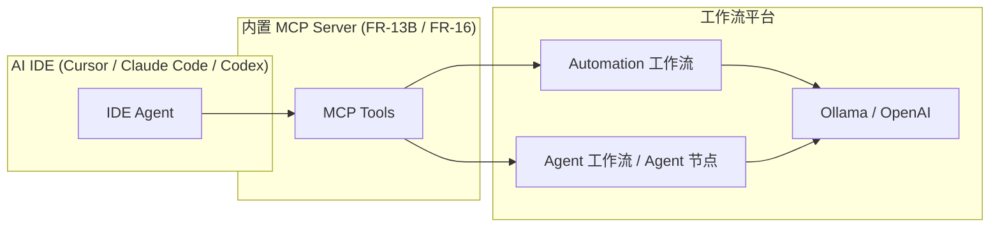
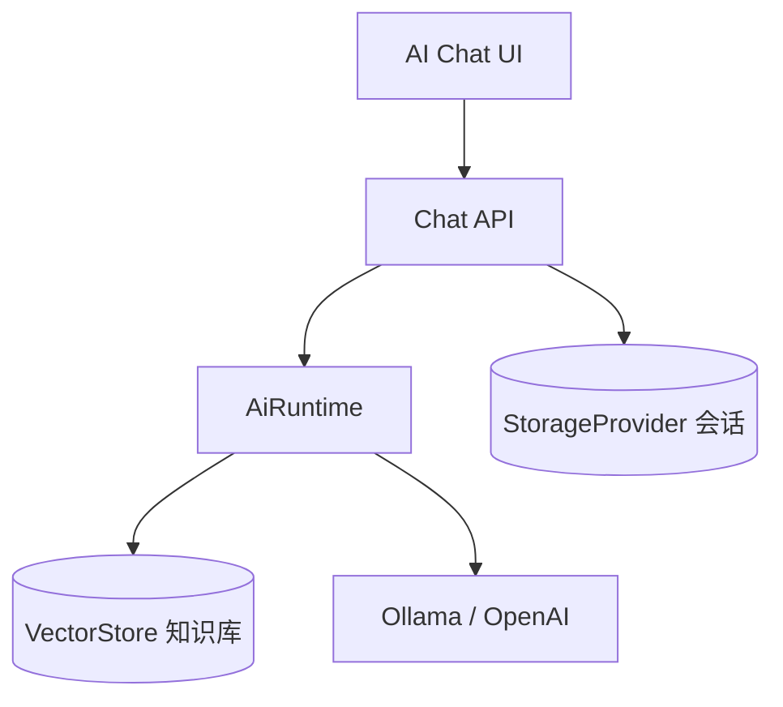
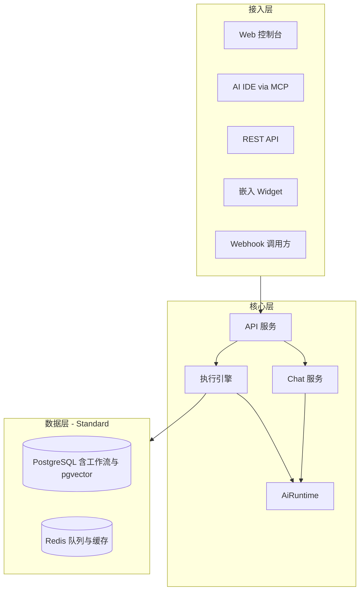
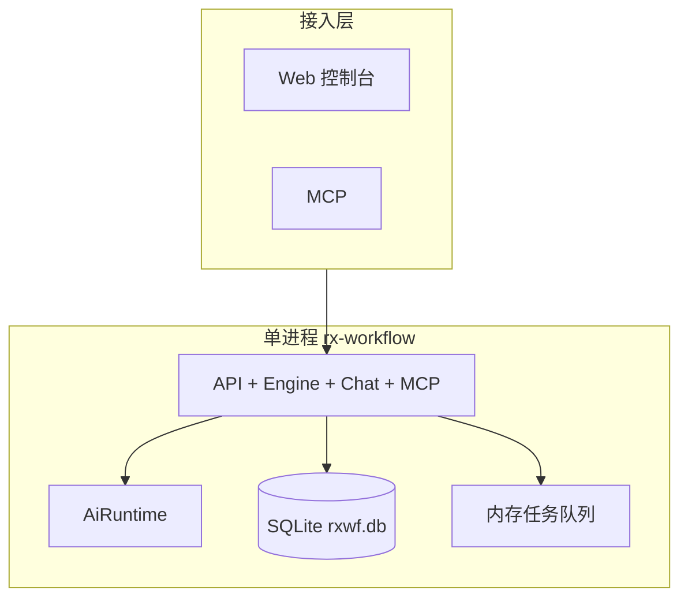

# RX-Workflow — 产品需求文档

**文档版本**: v1.11.0  
**修订日期**: 2026-05-20  
**修订说明**: v1.11.0 新增 FR-23 Node Runner（跨平台执行 Runner）；v1.10.1 新增 OpenAPI 与文档索引  
**关联文档**: [README.md](./README.md)（文档索引） | [openapi.yaml](./openapi.yaml) | [spec-review.md](./spec-review.md) | [ux-ui-design.md](./ux-ui-design.md) | [ux-v1.0-checklist.md](./ux-v1.0-checklist.md) | [error-codes.md](./error-codes.md) | [adr-langchain.md](./adr-langchain.md) | [adr-deployment.md](./adr-deployment.md) | [adr-module-boundaries.md](./adr-module-boundaries.md) | [adr-expression-sandbox.md](./adr-expression-sandbox.md) | [adr-execution-data.md](./adr-execution-data.md) | [adr-node-runner.md](./adr-node-runner.md) | [node-plugin-spec.md](./node-plugin-spec.md) | [schemas/workflow-definition.v1.schema.json](./schemas/workflow-definition.v1.schema.json)

---

## 1. 产品定位与差异化

**产品名称**：RX-Workflow（缩写 RXWF）

### 1.1 一句话定位

面向**研发与运维团队**的 **AI-Native 工作流平台**：具备成熟 DAG 编排基础（对标 n8n 核心体验），以 **Agent 编排、本地模型（Ollama）、双向 MCP（Client + Server）、AI IDE 深度集成** 为核心差异化——开发者可在 **Cursor、Claude Code、Codex** 等 IDE 内编写、调试、发布、运行工作流，无需频繁切换 Web 控制台。

### 1.2 与 n8n 的关系

| 维度 | n8n | 本产品 |
|------|-----|--------|
| 目标用户 | 技术 + 业务混合 | 研发、运维、系统管理员 |
| SaaS 集成 | 400+ 内置连接器 | **不做**海量连接器对标；提供 HTTP + OpenAPI 导入 |
| 数据传递 | Items + 表达式 + Credentials | **v1.0 必做**（同等基础能力） |
| 本地 AI | 支持但非核心 | **一等公民**：模型注册、RAG、Agent 编排、流式输出 |
| MCP | 有 Client 节点 | **双向平台**：Client 调外部工具 + **内置 MCP Server 供 AI IDE 反控本系统** |
| AI IDE 集成 | 无官方一等公民 | **核心差异化**：stdio/HTTP MCP，在 IDE 内完成工作流全生命周期 |
| Agent 编排 | LangChain 节点拼装 | **可视化 Agent 图** + 多 Agent 协作 + 工作流即 Tool |
| 命令 / SSH | 弱（多靠 Code 间接实现） | **强化** + 沙箱与白名单 + **跨平台 Runner**（FR-23） |
| Git / 多环境 | 企业版 Source Control | **v1.0 内置**导入导出；v1.1 Git 同步 |
| 模板市场 | 强 | v1.0 仅内置模板；v2 考虑社区市场 |
| 移动端 | 有 Web | v1.0 仅 Web 桌面端 |
| **AI Chat 对话** | 无独立产品模块 | **内置 AI Chat**：可配模型 + 知识库 RAG 问答 |

### 1.3 刻意不做（差异化边界）

1. 不对标 n8n 的 400+ SaaS 连接器（用 HTTP / OpenAPI 生成节点替代）
2. 首期不做面向业务人员的零代码模板市场运营
3. 首期不做多区域 / 多集群高可用（架构预留 **distributed / ha** 档位，见 FR-21）
4. 首期不交付 **大型企业分布式 / HA** 安装包（仅文档预留）
5. 首期不做站内信 / 邮件 / 短信告警（仅 Webhook 出站）
6. 首期不做 AI 执行成本预估与 BI 报表

### 1.4 必做差异化（v1.0 起）

1. **AI IDE 闭环（MCP Server）**：向 Cursor / Claude Code / Codex 等暴露标准 MCP Tools/Resources，支持在 IDE 内创建、调试、发布、运行、查询工作流
2. **Agent 编排**（**v1.1 起**）：可视化 Agent 图（Model + Tools + Memory + Parser），工作流可作为 Agent Tool；v1.0 仅 MCP + LLM 节点
3. **本地 AI 栈**：Ollama 自动发现、对话（v1.0）；Embedding/RAG（**v1.1**）；OpenAI 兼容网关
4. **MCP 双向**：Client 调用外部 MCP 服务；Server 对外提供本系统能力
5. **研发向执行**：沙箱 Code、命令/SSH（v1.1）、**跨平台 Node Runner**（Win/Linux/macOS，FR-23）、Git 多环境（v1.1）
6. **AI Chat**：Web 端开箱即用的模型对话（v1.0）；知识库 RAG 问答（**v1.1**）
7. **节点插件扩展**：统一规范 + SDK，支持团队自研节点（见 FR-18）
8. **极简部署（Lite）**：个人 / 小团队；**单容器、SQLite、无 Redis**，一条命令跑通核心能力（见 FR-21）

### 1.5 竞品特色能力融合

> 参考：[深度对比 Dify、Coze、n8n、AutoGen、LangChain、CrewAI](https://developer.volcengine.com/articles/7587307778956673043)  
> 策略：**取各家所长**，融入本产品定位（研发向工作流 + AI IDE + 本地模型），**不照搬零代码全民平台**。

#### 1.5.1 六方特色 → 本产品映射

| 平台 | 代表性特色 | 本产品吸收方式 | 对应 FR | 版本 |
|------|------------|----------------|---------|------|
| **Dify** | 模块化、知识库全流程、文档解析、插件热部署 | 知识库流水线增强、插件热加载、应用发布态 | FR-17、FR-18 | v1.1 |
| **Coze** | 零代码、60+ 插件、**长期记忆** | 官方插件包、Chat 长期记忆、Bot 人设 | FR-17、FR-18 | v1.1 / v1.2 |
| **n8n** | 400+ 集成、低代码+代码混用、工作流自动化 | Items/表达式、Code 节点、DAG（已有） | FR-1~3、FR-9 | v1.0 |
| **AutoGen** | **多 Agent 群聊**、人工介入、**Agent 评测** | Group Chat 编排、HITL 节点、评测数据集 | FR-15.4、FR-15.9 | v1.1 / v2.0 |
| **LangChain** | 链式推理、模块化工具、**调试工具链** | LCEL 链调试视图、AiRuntime 追踪 | FR-15.8、FR-11 | v1.1 |
| **CrewAI** | **角色分工**、任务编排可视化、团队模拟 | Agent 角色模板、Crew 顺序/层级流程 | FR-15.4 | v1.1 |

#### 1.5.2 扩展竞品对比（摘要）

| 维度 | Dify | Coze | n8n | AutoGen | CrewAI | **本产品** |
|------|------|------|-----|---------|--------|------------|
| 核心形态 | AI 应用平台 | 零代码 Bot | 工作流自动化 | 多 Agent 代码框架 | 角色团队框架 | **工作流 + AI 双引擎** |
| 知识库/RAG | ★★★★★ | ★★★ | ★★ | ★★ | ★★ | ★★★★（v1.1，偏研发文档） |
| 多 Agent | ★★ | ★★ | ★★ | ★★★★★ | ★★★★★ | ★★★★（v1.1 起） |
| 系统集成 | ★★★ | ★★★（插件） | ★★★★★ | ★★ | ★★ | ★★★（HTTP/MCP，不拼数量） |
| IDE / 开发者 | ★★ | ★ | ★★★ | ★★★★ | ★★★ | ★★★★★（MCP Server） |
| 零代码友好 | ★★★★★ | ★★★★★ | ★★★★ | ★ | ★★ | ★★★（模板+Chat，主战场在研发） |

#### 1.5.3 刻意不照搬

| 来源 | 不照搬项 | 原因 |
|------|----------|------|
| Coze | 60+ 消费级插件全家桶 | 与研发定位不符；改为 **官方插件包** + MCP |
| n8n | 400+ SaaS 连接器 | 维护成本极高；用 OpenAPI 生成 + HTTP |
| Dify | 阿里云绑定交付 | 保持云中立、私有化优先 |
| AutoGen | 仅 Python 运行时 | 统一 Node.js + LangGraph.js |

### 1.6 企业级 AI 平台能力融合

> 参考：[AITOP100 企业级 AI 能力综述](https://www.aitop100.cn/infomation/details/27820)、[Dify 生产级 Agentic 工作流](https://dify.ai/zh)  
> 策略：吸收 **企业安全、多模型网关、原生 RAG、可扩展架构、多平台发布、低代码编排、插件市场** 等成熟能力，结合本产品 **研发向 + 私有化 + AI IDE** 定位做裁剪。

#### 1.6.1 能力映射总表

| 能力域 | 行业标杆做法 | 本产品实现 | 主要 FR | 版本 |
|--------|--------------|------------|---------|------|
| **企业级安全** | SSO、RBAC、审计、加密、合规 | 扩展 §11 + FR-19.1 | FR-6、FR-19.1 | v1.1 / v2 |
| **多模型生态** | 20+ 模型、模型网关、路由降级 | 模型目录 + 路由 + 网关 | FR-15.1、FR-19.2 | v1.0 / v1.1 |
| **原生 RAG 架构** | 混合检索、Rerank、多模态 | 向量+关键词、Rerank、命中测试 | FR-15.3、FR-17 | v1.1 |
| **技术架构与扩展性** | 微服务、K8s、水平扩展 | 模块化单体→可拆分 Worker | NFR、FR-19.4 | v1.0 预留 |
| **多平台发布** | API、嵌入、IM、MCP 发布 | API + Webhook + 嵌入 + MCP | FR-19.5 | v1.1 / v1.2 |
| **零代码 AI 开发** | 可视化 + NL 生成应用 | 模板 + NL 草案 + Diff | FR-15.7 | v1.1 |
| **智能工作流** | 条件/循环/Agent/子流程 | 已有 FR-1~5、FR-15 | v1.0 起 |
| **插件生态** | Marketplace、热加载 | 规范 + 官方包 + 私有源 | FR-18 | v1.0 / v1.2 |
| **LLMOps** | 模型监控、对话质量、Prompt 版本 | 执行遥测 + 评测集 + 发布态 | FR-19.8 | v1.1 / v2.0 |

#### 1.6.2 与 Dify 对比（企业能力维度）

| 维度 | Dify 类平台 | 本产品 |
|------|-------------|--------|
| 目标用户 | 业务 + 技术混合 | **研发 / 运维 / AI 工程** |
| 零代码 | 核心卖点 | **低代码 + 代码节点 + IDE** |
| 模型数量 | 20+ 云端模型 | **不限数量**（OpenAI 兼容 + Ollama + 自建网关） |
| RAG | 产品核心 | 核心（偏技术文档/内网） |
| 多平台发布 | 嵌入、API、MCP | API、Webhook、**嵌入 Widget**、MCP Server |
| 插件市场 | 100+ UGC | **官方包 + 团队私有源**（v1.2） |
| 企业合规 | GDPR/HIPAA 宣称 | **审计 + 脱敏 + 私有化**（v2 SSO） |
| 差异化 | 应用市场运营 | **AI IDE 反控 + Git 工作流即代码** |

### 1.7 四大平台评测参考与能力吸收

> 参考：[2025 AI 工作流自动化平台深度评测：Dify vs n8n vs Make.com vs Coze](https://www.aitop100.cn/infomation/details/27820)  
> 以下按评测维度归纳四家标杆能力，并映射到本产品（§1.6、FR-19），**不照搬 SaaS 运营形态**，优先服务研发向私有化场景。

#### 1.7.1 分平台优势 → 本产品吸收

| 平台 | 评测中的核心优势 | 本产品吸收方式 | 主要 FR |
|------|------------------|----------------|---------|
| **Dify** | 企业级安全（SSO/LDAP/RBAC）、**LLMOps**、**原生 RAG**、20+ 模型统一网关 | FR-19.1～19.3、FR-19.8；知识库全流程 + 命中测试 | FR-15、FR-17、FR-19 |
| **n8n** | 事件驱动、节点热插拔、**子工作流**、400+ 集成思路、K8s 扩展 | Items/表达式、子工作流、插件规范、Error Workflow；HTTP/OpenAPI 替代连接器数量 | FR-1～5、FR-18、FR-19.4 |
| **Make.com** | **Router 多路分支**、**Aggregator 合并**、**Iterator 批处理**、SOC2 类合规 | Switch/Merge/Split In Batches；企业审计与脱敏（v2 SSO） | FR-2、FR-19.1 |
| **Coze** | **零代码 Bot**、1000+ 插件生态、**多平台一键发布**、对话式智能工作流 | 模板 + NL 草案、官方插件包 + 私有源、API/嵌入/MCP/IM 发布、Chat/Crew | FR-17、FR-18、FR-19.5～19.6 |

#### 1.7.2 八大优势能力（用户诉求对照）

| # | 优势能力 | 行业典型做法（评测摘要） | 本产品承诺 |
|---|----------|--------------------------|------------|
| 1 | **企业级安全性** | Dify：LDAP/SAML/RBAC/审计；Make：SOC2/GDPR | 私有化 + RBAC + 审计 ≥90 天 + 脱敏；v2 OIDC/SAML |
| 2 | **多模型生态支持** | Dify：20+ 模型、统一管理与路由 | 模型目录 + OpenAI 兼容 + Ollama；v1.1 **模型网关**主备与限流 |
| 3 | **原生 RAG 架构** | Dify：向量库 + 文档解析 + 混合检索 | 上传→解析→分块→向量；v1.1 **混合检索 + Rerank** |
| 4 | **技术架构与扩展性** | n8n：事件驱动、节点独立；Dify：微服务 | **Lite** 单进程+SQLite；**Standard** PG+Redis；大型预留 |
| 5 | **多平台发布能力** | Coze：抖音/飞书/微信等；Dify：API/嵌入 | REST + Webhook + SSE + **嵌入 Widget** + MCP；v2 IM Bot |
| 6 | **零代码 AI 开发** | Coze/Dify：可视化 + 模板 | 拖拽 DAG + 内置模板；v1.1 **NL 生成工作流/Chat 草案**（须 Diff 确认） |
| 7 | **智能工作流** | 条件/循环/Agent/HITL/子流程 | FR-1～5 + Agent/Crew/Group Chat + RAG 节点链 |
| 8 | **插件生态** | Coze 1000+ 插件；n8n 社区节点 | **node-plugin-spec** + 官方包 + v1.2 私有源；不做 UGC 大市场 |

#### 1.7.3 典型场景映射（评测案例）

| 场景 | 评测推荐平台 | 本产品路径 |
|------|--------------|------------|
| 企业多系统打通（ERP/MES/CRM） | n8n / Make | HTTP + OpenAPI 节点 + 子工作流 + Webhook |
| AI 智能客服 / 知识问答 | Dify / Coze | **AI Chat + 知识库 RAG** + 可选 Chat 触发器工作流 |
| 全渠道营销自动化 | Make | Switch/Router 式分支 + HTTP 对接营销 SaaS |
| 金融级风控与合规问答 | Dify | 私有化部署 + 审计 + RAG 引用溯源 + v2 合规报表 |

---

## 2. 概述

- **Summary**: AI-Native 可视化工作流系统，支持 DAG 与 Agent 双模编排、Items 数据流、可靠执行引擎、双向 MCP 及 AI IDE 集成。开发者可在 Web 或 IDE 中完成自动化流程的全生命周期。
- **Purpose**: 将「写代码 + 配自动化」统一在研发工具链内，降低 AI 应用与运维脚本的交付成本。
- **Target Users**: 开发工程师、AI 应用工程师、DevOps/SRE、系统管理员

---

## 3. 用户故事与典型场景

| ID | 角色 | 场景 | 价值 |
|----|------|------|------|
| US-1 | 后端开发 | 通过 Webhook 接收 GitLab MR 事件，跑 lint、通知钉钉群 | 减少手工 CI 胶水脚本 |
| US-2 | SRE | 定时 SSH 采集服务器指标，异常时触发告警工作流 | 统一运维自动化入口 |
| US-2a | SRE | 在 Windows 域控上注册 Runner，工作流 WMI/命令节点自动派发到 `platform=windows` 的 Agent | 跨 OS 自动化 |
| US-3 | AI 工程师 | 用 Ollama + MCP 工具链处理文档并写入数据库 | 内网可用的 AI 流水线 |
| US-4 | 团队 Lead | 将工作流导出 JSON 纳入 Git，在 staging 验证后晋升 prod | 流程可审计、可回滚 |
| US-5 | 新成员 | 从内置模板复制「HTTP → JSON → If」流程，15 分钟内跑通 | 降低上手成本 |
| US-6 | 全栈开发 | 在 **Cursor** 中用自然语言让 Agent 调用 MCP 创建「MR 检查」工作流并 Partial 调试 | 零切换 IDE 即可完成编排 |
| US-7 | AI 工程师 | 编排多 Agent：检索 Agent + 工具 Agent + 汇总 Agent，RAG 走本地 Ollama | 内网可落地的 Agent 流水线 |
| US-8 | 平台管理员 | 为团队签发 IDE 用 MCP Token，审计所有 IDE 触发的发布/执行操作 | 安全可控的 AI IDE 接入 |
| US-9 | 开发 | 在 **AI Chat** 中选择 Ollama 模型，多轮对话排查问题 | 不必为简单问答搭建工作流 |
| US-10 | 技术支持 | 上传运维手册 PDF 到**知识库**，开启 RAG 模式回答值班问题 | 内网知识问答 |
| US-11 | 内容团队 | 用 **Crew 角色流**（研究员→撰稿→校对）自动生成技术博客 | 多 Agent 分工可视化 |
| US-12 | 质效工程师 | 用 **Agent 评测集** 回归测试 Prompt/模型变更 | 类似 AutoGenBench |
| US-13 | 平台管理员 | 配置 **模型网关** 主备切换，云端故障自动降级 Ollama | 多模型高可用 |
| US-14 | 产品经理 | 将 Chat 应用 **嵌入公司 Wiki**，API + iframe 发布 | 多平台触达用户 |
| US-15 | 安全合规 | 导出 **审计日志** 满足季度合规检查 | 企业级治理 |
| US-16 | 业务运营 | 用 **Router 式 Switch** 按渠道分流潜客，Aggregator 合并多路 HTTP 结果 | 对标 Make 营销自动化 |
| US-17 | 平台工程师 | 在 **模型网关** 配置 GPT 主模型 + Ollama 备用，故障自动切换 | 多模型高可用 |
| US-18 | 产品运营 | 将运维 Bot **同时发布** API、嵌入 Wiki、MCP Tool 三渠道 | 多平台触达 |
| US-19 | 非研发同事 | 用 **自然语言** 描述需求生成工作流草案，Diff 确认后上线 | 零代码协作 |
| US-20 | 管理员 | 从 **私有插件源** 拉取团队节点包，热加载无需重启 | 插件生态治理 |
| US-21 | 海外工程师 | 浏览器为 `en-US` 时自动显示英文界面，顶栏可随时切回中文 | 国际化协作 |
| US-22 | 任意用户 | 白天用 **跟随系统** 浅色、夜间自动切深色，或固定 Dark | 护眼与偏好 |
| US-23 | 独立开发者 | `docker run` 一条命令启动，**无需**安装 Redis/Postgres | 5 分钟内跑通首个工作流 |
| US-24 | 50 人团队 | 需完整 RAG、百级并发时升级 **Standard** compose | 平滑扩容 |

---

## 4. 成功指标

> **版本对齐**：v1.0 指标仅考核 §5 MVP；v1.1+ 指标见下表「目标版本」列。并发能力按 **Deployment Profile** 分别压测（见 NFR-1）。

### 4.1 v1.0 成功指标（MVP 门禁）

| 指标 | 目标 | Profile | 度量方式 |
|------|------|---------|----------|
| 上手时间 | 新用户从创建到首次成功执行 < 15 分钟 | Lite / Standard | 埋点 / 用户调研 |
| 执行成功率 | 生产执行成功率 ≥ 95%（排除用户配置错误） | Lite / Standard | 执行日志统计 |
| 编辑器响应 | 拖拽、保存等操作 P95 < 1s | Lite / Standard | APM |
| 并发能力（Lite） | 稳定支持 **≥ 10** 个并发实例（默认配置 5）；压测通过 20 上限无数据损坏 | **lite** | 压测报告 |
| 并发能力（Standard） | 稳定支持 **≥ 100** 个并发实例；超出公平入队 | **standard** | 压测报告 |
| 月活工作流 | 上线 3 个月内团队内 ≥ 20 个 Active 工作流 | Standard 为主 | 后台统计 |
| AI IDE 采用率 | ≥ 30% 的工作流变更通过 MCP（IDE）完成 | Standard 为主 | MCP 审计日志 |
| 本地模型占比 | 内网部署场景下 ≥ 50% AI 调用走 Ollama（P1 节点启用后） | Lite / Standard | 模型调用遥测 |
| AI Chat 周活 | ≥ 40% 登录用户使用 AI Chat（纯对话） | Lite / Standard | Chat 会话埋点 |
| Lite 部署时长 | 新用户从 `docker run` 到控制台可访问 < **5 分钟** | **lite** | 安装埋点 |
| Lite 组件数 | 运行中 Docker 服务数 = **1**（不含可选 Ollama） | **lite** | 部署检测 |
| 幂等去重有效率 | Webhook/MCP execute 重复投递去重成功率 ≥ 99.9% | Lite / Standard | 幂等表统计 |

### 4.2 v1.1+ 成功指标（非 v1.0 门禁）

| 指标 | 目标版本 | 度量方式 |
|------|----------|----------|
| Agent 工作流占比 | v1.1 | ≥ 15% Active 工作流含 Agent 节点或 Agent 图 |
| RAG 命中率 | v1.1 | 知识库问答「有帮助」反馈 ≥ 70% |
| 多模型切换成功率 | v1.1 | 主备模型故障切换成功率 ≥ 99% |
| 多平台发布数 | v1.2 | 单应用 ≥ 2 种发布渠道（如 API + 嵌入） |

---

## 5. MVP 范围（v1.0）

> **发布分期**：**v1.0-core** 为首个可发布里程碑（发布门禁）；**v1.0-plus** 为同一大版本内的增强包，可并行或顺延 1 个迭代。架构约束见 [adr-module-boundaries.md](./adr-module-boundaries.md)、[adr-execution-data.md](./adr-execution-data.md)、[adr-expression-sandbox.md](./adr-expression-sandbox.md)。

### 5.1 v1.0-core（发布门禁，必交付）

| 模块 | 范围 |
|------|------|
| FR-1 编辑器 | 拖拽、连线校验、撤销/重做、Sticky Notes、未保存提示 |
| FR-9 数据与表达式 | Items、`{{ }}`（受限引擎，ADR-004）、`schemaVersion: 1` |
| FR-10 凭证 | 创建、测试、加密存储、工作流引用 |
| FR-4 环境变量 | 平台 `RXWF_*` 白名单（DB）；用户变量见 `$vars` |
| FR-2 节点 | **仅 P0**（见 5.2） |
| FR-3 执行引擎 | DAG、状态机、**定义快照**、幂等入队、Error Workflow |
| FR-11 开发调试 | Pin、Partial（上游闭包算法见 FR-11）、Dirty |
| FR-12 / FR-5 | 工作流设置、子工作流 ≤5 层 |
| FR-6 | RBAC（Lite 简化）、版本历史 |
| FR-7 模板 | 导入导出 + ≥3 内置模板 |
| FR-8 日志监控 | 时间线、分页、大 I/O 外置 blob |
| FR-13B / FR-16 | **MCP Server 基础 Tools**；stdio/HTTP；IDE CRUD + execute + validate |
| FR-21 | **Lite** 单实例 + SQLite + jobs 队列 |
| FR-20（core） | 内置 zh-CN/en、dark/light/system；**目录 API 只读**（GET locales/themes） |
| §11.6 / §11.3 | 幂等表、Webhook HMAC、Code 沙箱（ADR-004） |
| 安全 | MCP Token scope、限流、危险操作确认 |

**明确不在 v1.0-core**：MCP Client 节点、LLM/Ollama 节点、AI Chat、插件上传、FR-20 Admin 扩展注册、docker MCP。

### 5.1.1 v1.0-plus（同版本增强，建议紧随 core）

| 模块 | 范围 |
|------|------|
| FR-13A | MCP Client（**优先 stdio + http**；docker v1.0-plus P2） |
| FR-15 / FR-2 P1 | Ollama、OpenAI 兼容、LLM 流式 |
| FR-17 | AI Chat 纯对话 |
| FR-18 | 插件规范/SDK、上传启用（无热加载） |
| FR-20（plus） | Admin **注册语言/主题**、bundle/Token 上传（FR-20.4～20.5） |
| FR-22 | 安装向导、首启 checklist（P1） |
| FR-2 P1 | 文件、DB、Split In Batches 等 |
| Standard Profile | compose.standard 与 PG+Redis 集成测试门禁 |

**v1.0 不纳入（见 §6 路线图）**：FR-15.4 Crew/Group Chat、FR-15.9、FR-19 全量、Agent 节点、RAG、插件热加载、SSO 等。

### 5.2 v1.0 节点优先级

| 优先级 | 节点类型 |
|--------|----------|
| **P0** | 手动触发、Webhook 触发、定时触发、HTTP、Set/JSON、If、Switch、**Loop**、Merge、Code（沙箱）、Wait（固定时长）、子工作流触发/调用 |
| **P1** | 文件读写、MySQL/PostgreSQL、**Ollama 对话**、OpenAI 兼容 API、**Chat 触发**、错误触发器、Split In Batches、**LLM 流式输出** |
| **P2（v1.1）** | **Agent 编排节点**、Embedding/RAG、**MCP Server 完整工具集**、SSH/本地命令、OpenAPI 导入、事件/文件触发 |
| **P3（v2.0）** | 多 Agent 协作（Supervisor）、WMI、Agent 评测与追踪导出 |

### 5.3 v1.0 明确不做

- 工作流暂停 / 恢复（v1.1）
- Agent 编排节点、Crew、Group Chat、Agent 评测（v1.1 / v2，见 FR-15.4、FR-15.9）
- 知识库 RAG、Embedding 流水线、命中测试（v1.1，见 FR-15.3、FR-17.5）
- 模型网关主备、多平台嵌入发布、NL 生成工作流（v1.1+，见 FR-19）
- `published` 应用发布态与渠道组合发布（v1.1，见 FR-15.10、FR-19.5）
- 插件热加载（v1.1）、私有插件源（v1.2）
- 模板市场与 UGC 审核
- LDAP / SSO（v2）
- 分布式多集群 HA（仅架构预留）
- 1000+ 节点单工作流（软上限 200，见约束）
- Webhook 可恢复等待（Wait 续跑，v1.1）

### 5.4 能力版本对齐矩阵（摘要）

| 能力域 | v1.0 | v1.1 | v1.2 | v2.0 |
|--------|------|------|------|------|
| P0 DAG + Items + 凭证 | ✓ | | | |
| MCP Server 基础 Tools | ✓ | 扩展 publish/debug | Resources | |
| AI Chat 纯对话 | ✓ | RAG | Bot 人设 | |
| LLM / Ollama 节点 | P1 | | | |
| Agent / Crew / Group Chat | | ✓ | hierarchical | Supervisor |
| RAG / 知识库 | | ✓ | 多库 | 多模态 |
| FR-19 模型网关 / 混合检索 | | ✓ | | |
| 插件热加载 | | ✓ | 私有源 | 市场 |
| SSO / 多租户强隔离 | | | | ✓ |

### 5.5 Active、draft 与 published 决策表

| 概念 | 作用域 | v1.0 | 说明 |
|------|--------|------|------|
| **draft** | 工作流定义 | ✓ | 编辑中版本；可 Partial/Pin；Inactive 时不响应生产触发 |
| **Active** | 工作流开关 | ✓ | `true` 时接受 Webhook/定时等生产触发；与 draft 并存（可先保存 draft 再 Active） |
| **published** | Chat Bot / 应用 | v1.1 | 对外 API/嵌入/MCP Tool 绑定的**冻结配置**；新执行读 published 快照 |
| **版本号** | 工作流历史 | ✓ | 每次手动保存递增；回滚仅影响**新**执行，不改变运行中实例 |

**v1.0 规则**：

- 生产触发条件：工作流 **Active** + 已成功保存的版本。
- 每次创建 `execution` 时写入 **`workflow_version_id` + `definition_snapshot`**（见 [adr-execution-data.md](./adr-execution-data.md)）；运行中实例与审计**只读快照**，不随画布后续保存而改变。
- v1.0 无 `published` 态；v1.1 起 Chat/API 渠道以 `published` 为准。

---

## 6. 版本路线图

| 版本 | 主题 | 主要交付 |
|------|------|----------|
| **v1.0** | AI 就绪 MVP | **v1.0-core**（Lite、P0、MCP Server、快照执行）+ **v1.0-plus**（MCP Client、LLM、Chat、插件、i18n/主题 Admin） |
| **v1.1** | 标准与 AI 深化 | **Standard** compose、pgvector RAG、Lite→PG 迁移；Crew、Group Chat、HITL、插件热加载 |
| **v1.2** | IDE + 发布 | MCP Resources、DSL 同步、**多平台发布**、插件私有源、混合 RAG Rerank |
| **v2.0** | 企业级 | SSO/SAML、插件市场、K8s 扩展、多模态 RAG、合规报表、Supervisor |

---

## 7. 核心目标

1. 提供直观的可视化工作流编辑器（含调试与协作标注能力）
2. 建立 Items + 表达式 + 凭证的标准数据与集成基础
3. 提供可靠的 DAG 执行引擎，支持多种触发与错误处理
4. 支持团队 RBAC、版本管理与工作流共享
5. 以 **AI 平台 + Agent 编排 + AI IDE（MCP Server）** 形成相对 n8n 的核心差异化
6. 在命令执行、Git 多环境、可观测性上增强研发场景能力
7. 提供 **AI Chat** 独立模块，支持可配置模型对话与知识库 RAG 问答

---

## 8. 非目标（Out of Scope）

1. 移动端原生应用（v1.0 仅 Web 桌面端）
2. 复杂 BI 报表与「节省时间」类运营指标
3. 站内信 / 邮件 / 短信 / 钉钉等内置告警（通过 Webhook 集成）
4. 多区域 / 多集群高可用部署（v1.0 以 **Lite/Standard 单机** 为主；大型 **distributed/ha** 仅预留，见 FR-21）
5. 海量 SaaS 连接器与模板市场运营（见 1.3）
6. AI 调用成本预估（v2 再评估）

---

## 9. 背景与上下文

n8n 是流行的开源工作流工具。本产品吸收其成熟的编排范式（Items、表达式、Pin、Partial 执行、Error Workflow），但**不与 n8n 拼连接器数量**。

在 AI 时代，研发主战场已迁移到 **AI IDE**。本产品将工作流平台定位为 IDE 的 **MCP 后端**：开发者在 Cursor / Claude Code / Codex 中通过对话即可完成编排与运维，同时保留 Web 可视化编辑器服务复杂 Agent 图与团队协作。核心差异：**双向 MCP + Agent 编排 + 本地 Ollama/RAG**。

**部署上**：个人与小团队默认 **Lite 档位**（单容器、SQLite、无 Redis），与 Dify/n8n 多组件 compose 形成差异；需完整 RBAC / 百级并发 / Plus 能力时，可 **无代码改镜像配置** 升级 **Standard**（PostgreSQL + Redis），无需重写工作流。详见 FR-21。

---

## 10. 功能需求

### FR-1: 可视化工作流编辑器

- 拖拽式节点添加、连接与删除；无效连接（环路、缺少触发器）实时校验
- 布局：左侧节点面板、中间画布、右侧参数面板
- 画布缩放、平移；节点对齐辅助线（P1）
- **撤销 / 重做**、复制 / 粘贴节点
- **Sticky Notes**：Markdown 注释、分色、可置于节点后方
- **未保存离开提示**
- 工作流 **Active / Inactive** 开关（Inactive 时不响应生产触发）
- 标签与文件夹分类（P1）
- **Agent 图画布**（v1.1）：当工作流类型为 `agent` 时切换专用节点面板与连线规则
- **AI 助手侧栏**（v1.1）：自然语言生成工作流草案（Diff 确认后应用）
- **调试工具栏**（v1.0）：Pin Data、Partial 执行、Dirty 标记、Test/生产模式切换；生产执行禁用 Pin（见 FR-11、ux-ui-design §3.17）
- **Sticky Notes**：画布注释；支持 Markdown、分色（见 ux-ui-design §3.1）
- **未保存离开**：浏览器 `beforeunload` + 路由守卫；文案 i18n（`E1001`）

### FR-2: 节点系统

节点按 **5.2 优先级** 分期交付。所有节点参数支持 **FR-9 表达式** 引用。

#### 触发器

| 节点 | 说明 | 版本 |
|------|------|------|
| 手动触发 | 编辑器内测试 | v1.0 |
| Webhook 触发 | 生产 URL + 开发 Test URL | v1.0 |
| 定时触发 | Cron，受工作流时区影响 | v1.0 |
| 子工作流触发 | 被其他工作流调用 | v1.0 |
| 错误触发器 | 接收 Error Workflow 载荷 | v1.0 |
| 事件触发 | 系统内事件总线（如工作流保存） | v1.1 |
| 文件变化触发 | 需部署侧文件监听 Agent | v1.1 |

#### Webhook 触发器（配置与界面，v1.0）

| 配置项 | 说明 | UI 要求（见 ux-ui-design §3.16） |
|--------|------|----------------------------------|
| **Test URL** | 开发调试专用；仅在手动/Test 模式响应 | 与 **Production URL** 分开展示；一键复制 |
| **Production URL** | Active 工作流生产入口 | 设为 Active 前须二次确认（§11.7） |
| **HMAC Secret** | 签名校验密钥（**v1.0 强制**） | 生成/轮换 Secret；文档说明 `X-AWF-Signature` 算法 |
| **Idempotency-Key** | 调用方请求头，平台 24h 去重（§11.6） | 帮助文案 + 示例 curl |
| **IP 白名单** | 可选（P1） | 列表编辑 + CIDR 校验 |

未带有效签名或签名过期的请求 **拒绝触发**（AC-38）。

#### 数据处理

JSON / Set、Filter、Map、Merge（append / combine by key / **combine all** 对标 Make Aggregator）、Sort、Aggregate、Split In Batches（对标 Make Iterator 批处理）

**Make 式路由模式（v1.0）**：Switch 支持多路条件分支（无限路径语义由引擎保证公平调度）；Merge 支持将并行分支 Items **按 key 合并或 append**；Split In Batches 支持对数组 Items 分批迭代执行下游子图（P1 并行批处理）。

#### 集成与 IO

- **HTTP**: GET/POST/PUT/PATCH/DELETE；支持凭证、超时、重试
- **文件**: 读/写（路径受安全策略限制）
- **数据库**: MySQL、PostgreSQL、SQLite CRUD（P1）

#### AI（详见 **FR-15 AI 平台**、**FR-16 AI IDE 集成**）

| 能力 | 版本 |
|------|------|
| 模型注册 / OpenAI 兼容 / Ollama 对话 | v1.0 P1 |
| LLM 流式输出（SSE） | v1.0 P1 |
| Chat 触发（对话式启动工作流） | v1.0 P1 |
| Embedding + 向量库 RAG | v1.1 |
| Agent 编排节点（Tools Agent） | v1.1 |
| 多 Agent 协作（Supervisor） | v2.0 |
| 工作流作为 Agent Tool | v1.1 |

#### 逻辑与控制

If、Switch、**Loop**、Wait（固定时长 / Webhook 恢复续跑 v1.1）

**Loop 节点（v1.0，对标 Make Iterator + done 汇总）**

| 能力 | 说明 |
|------|------|
| 出口 | `loop`（`0`）连接循环体；`done`（`1`）在全部批次完成后输出汇总 Items |
| 参数 | `batchSize`（默认 `1`）：每轮迭代的 Item 数 |
| 执行 | 按批切分上游 Items → 每轮拓扑执行循环体 → 收集循环体**出口节点**输出并 append 到 done 列表 |
| 空输入 | 无 Items 时跳过循环体与 done，不产生输出 |
| 循环体识别 | 从 `loop` 出口可达、且不在 `done` 分支上的节点；允许循环体末端**回连 Loop main 输入**（合法回环） |
| 校验 | 缺 `loop` 出口 → 错误；缺 `done` 出口 → 警告 `W1020`；循环体内部非法环 → `Workflow graph contains a cycle` |
| 调试 | Partial / 全量调试均按批次迭代；编辑器日志按轮次展开（`节点名 (i/n)`） |

用户操作说明见 [help/zh/nodes/loop.md](./help/zh/nodes/loop.md)。

#### 研发向（差异化）

| 节点 | 说明 | 版本 |
|------|------|------|
| Code | JS，沙箱执行（见安全章） | v1.0 |
| 本地命令 | 白名单、超时、输出截断 | v1.1 |
| SSH | 主机清单、密钥凭证、跳板机（P2） | v1.1 |
| WMI | Windows 远程（P2） | v2 |

#### 工具

加解密、**MCP Client**（npx/docker/http/stdio，可选 Tool，v1.0）、**内置 MCP Server**（见 FR-13、FR-16）

#### OpenAPI 导入（v1.1）

根据 OpenAPI 3.0 规范自动生成 HTTP 节点模板。

---

### FR-3: 工作流执行引擎

- **启动 / 停止**：v1.0 支持；**暂停 / 恢复** 列入 v1.1（v1.0 不支持可恢复挂起，长任务仅整工作流超时）
- 按 **DAG 拓扑** 与分支逻辑执行（非简单线性顺序）
- **并发控制**：每工作流可配置最大并行分支数；全局队列 **加权公平调度**（手动触发 > Webhook > 定时），防止单工作流饥饿
- **Active** 工作流才接受生产触发（见 §5.5）
- 实时执行状态（WebSocket 或 SSE 推送）
- **重试**：节点级配置次数、间隔、仅对可重试错误生效
- **Error Workflow**：失败时触发独立工作流；标准载荷含 `executionId`、`workflowId`、`failedNode`、`errorMessage`、`stack`、`timestamp`
- **Error Workflow 递归限制**：禁止 Error Workflow 再触发自身；全局 **maxErrorDepth = 2**（主流程 → Error → 可选二级），超出则记审计并终止
- **执行模式**：生产执行 / 手动执行 / **Partial 执行**（从指定节点起，仅跑其依赖链，见 FR-11）
- **批量操作**（P1）：批量启用/停用、批量停止运行中实例
- **队列语义**：**at-least-once** 投递；业务副作用依赖 §11.6 幂等键去重
- **触发幂等**：Webhook / API / MCP `workflow_execute` 支持 `Idempotency-Key`（见 §11.6）
- **定义快照**：创建 execution 时固化 `workflow_version_id` + `definition_snapshot`（[adr-execution-data.md](./adr-execution-data.md)）
- **统一入队**：所有触发经 `TriggerIngress` → 鉴权 → 幂等 → `QueueProvider`（[adr-module-boundaries.md](./adr-module-boundaries.md)）
- **定时调度**：`SchedulerService` 扫描 Active 工作流 Cron；Lite 用 DB `scheduler_leases` 防多实例（单实例部署下作崩溃恢复）；tick 生成 execution 走同一入队链
- **Runner 调度**：节点执行前经 `RunnerDispatcher` 解析目标 Runner（工作流 `settings.runnerPolicy` + 节点 `runner` 覆盖 + 节点 manifest `runnerRequirements`）；详见 **FR-23**、[adr-node-runner.md](./adr-node-runner.md)

#### FR-3.1 执行与节点状态机

**Execution（工作流实例）状态**：

| 状态 | 说明 | 可迁移至 |
|------|------|----------|
| `queued` | 已入队待调度 | `running`, `cancelled` |
| `running` | 至少一节点在执行 | `success`, `failed`, `cancelled` |
| `success` | 全部终态节点成功或跳过 | — |
| `failed` | 不可恢复失败或重试耗尽 | — |
| `cancelled` | 用户/MCP 停止 | — |

**NodeRun（单节点）状态**：`pending` → `running` → `success` | `failed` | `skipped` | `cancelled`。v1.1 增加 `waiting`（HITL / Webhook 续跑）。

**异常与补偿**：

| 场景 | 行为 |
|------|------|
| Webhook 重复投递 | 相同 `Idempotency-Key` 且在**同一 scope**（`webhook:production` 或 `webhook:manual`）内 24h 返回首次 `executionId`，不二次调度；测试 URL 与生产 URL 的 scope 分离 |
| 子工作流超时/失败 | 映射为父节点 `failed`；按节点策略重试或走 Error Workflow |
| Error Workflow 失败 | 记主执行审计；不再递归触发（受 maxErrorDepth 约束） |
| MCP / HTTP 中途断开 | 节点 `failed`；可重试则按节点重试策略；不重试则分支或 Error Workflow |
| 优雅停机 | 停止接收新 `queued`；`running` 在超时后标 `failed` 或 `cancelled`（可配置） |

---

### FR-4: 环境变量管理

- **平台环境（`$env`）**：预定义 `RXWF_*` 白名单，保存在数据库 `env_vars`（单环境 `runtime`）；Admin 在「设置 → 平台环境」改值，不可增删；**不展示** OS / `process.env`；catalog 声明 `valueType`（含 `path`+`pathHost`），运行时按类型注入表达式
- **用户变量（`$vars`）**：见「设置 → 变量」页；作用域 global / user / workflow，含 test / prod 维度；始终为字符串
- 引用语法：`{{ $env.RXWF_PUBLIC_URL }}`、`{{ $vars.MY_KEY }}`；bool 比较用 `=== true`（不要用 `'true'`）
- 敏感变量标记，日志与导出时自动脱敏

---

### FR-5: 子工作流

- 工作流可作为子流程被调用；支持输入 / 输出参数映射
- 最大嵌套深度：**5 层**；保存时检测**循环引用**并拒绝
- **默认同步等待**子 execution 完成；超时为父工作流剩余时间；父 `node_run` 记录 `child_execution_id`
- 可作为 AI Agent 的 Tool 调用（v1.1）
- 版本回滚**不影响**已在运行中的执行实例；仅影响新执行

---

### FR-6: 团队协作

#### RBAC 矩阵

| 权限 | Admin | Owner | Editor | Viewer |
|------|-------|-------|--------|--------|
| 系统设置 | ✓ | — | — | — |
| 用户管理 | ✓ | — | — | — |
| 工作流 CRUD | ✓ | ✓ | ✓ | — |
| 执行工作流 | ✓ | ✓ | ✓ | — |
| 查看执行日志 | ✓ | ✓ | ✓ | ✓ |
| 管理凭证 | ✓ | ✓ | — | — |
| 管理 MCP Token（IDE） | ✓ | ✓ | — | — |
| 使用 AI Chat | ✓ | ✓ | ✓ | ✓ |
| 管理知识库 | ✓ | ✓ | ✓ | — |
| 分享工作流 | ✓ | ✓ | ✓ | — |

- 工作流级分享：可指定用户/角色为 Owner/Editor/Viewer
- **版本控制**：每次手动保存递增版本号；可查看 diff、回滚到历史版本
- **审计日志**（P1）：记录工作流/凭证/激活状态的变更人、时间、操作类型
- **资源级授权**：除角色矩阵外，API/MCP 访问 `executionId`、Chat `sessionId`、知识库文档须校验 **工作空间 + 资源 Owner**（防水平越权）

#### Lite 档位 RBAC（`RXWF_DEPLOY_PROFILE=lite`）

Lite 与 Standard **采用相同 RBAC 模型**：系统级 **Admin** + 工作流级 **Owner / Editor / Viewer**（见上表）。Lite 与 Standard 的差异在部署与并发等基础设施（FR-21），**不在角色矩阵**。

---

### FR-7: 工作流模板

- **导入 / 导出**：JSON 格式，含节点、连线、元数据；凭证引用转为占位符
- **内置模板**（v1.0 ≥ 5 个）：含「Webhook → HTTP → JSON」、「定时巡检」、「Ollama 对话」、「MCP Client 调工具」、「Cursor 快速入门（MCP 配置说明）」
- **模板市场**：v2；v1.0 不做 UGC 与审核运营

---

### FR-8: 执行日志与监控

- 每次执行生成唯一 `executionId` 与 `traceId`（可关联子工作流）
- 记录每节点输入/输出 Items（可配置脱敏）；支持二进制元数据索引
- 时间线视图；节点状态色：成功 / 失败 / 运行中 / 等待 / 跳过
- 节点耗时、工作流总耗时统计
- **告警**：v1.0 仅 **Webhook 出站**；载荷可配置
- 执行数据保留策略：跟随 FR-12 工作流设置
- **列表分页**：执行历史 API 默认 `limit=50`，最大 `200`；禁止无分页全量拉取
- **归档**（Standard v1.1 / Lite 可配置）：超过保留期的执行记录可归档为冷存储或聚合统计，详情按需加载
- **大 payload**：单 Item `json` > 1MB 或含大二进制时写入 `execution_blobs`（路径/sha256），`node_runs` 仅存 `input_ref`/`output_ref`（[adr-execution-data.md](./adr-execution-data.md)）
- **保留策略**：跟随 FR-12；默认生产「失败全量 + 成功节点 metadata」可配置

---

### FR-9: 数据模型与表达式

#### 工作流定义 Schema（v1.0）

- 所有工作流 JSON 须含 **`schemaVersion: 1`**，符合 [schemas/workflow-definition.v1.schema.json](./schemas/workflow-definition.v1.schema.json)。
- `workflow_validate`、保存、MCP `workflow_create/update`、导入导出**共用同一校验器**。
- 升级时提供 `migrateDefinition(vN → vN+1)` 与 forward migration（§FR-21.6）。

#### Items 数据模型

- 节点间传递 **Item 数组**；每项包含：
  - `json`: 对象载荷
  - `binary`（可选）: 命名二进制附件（文件、图片等）
- 节点可输出 0~N 个 Items；支持 **Split**（一项变多项）与 **Merge**

#### 表达式

- 语法：`{{ ... }}` 内为 **JavaScript**（`isolated-vm` 沙箱，见 [globals design](./superpowers/specs/2026-06-03-js-expression-globals-design.md)）；**单行表达式可省略 `return`**，多语句须显式 `return`（[implicit return](./superpowers/specs/2026-06-03-expression-implicit-return-design.md)）
- 可引用：`$json`、`$binary`、`$input`、`$nodes["节点名"]`、`$env`、`$vars`、`$execution`、`$workflow`、`$itemIndex` 等
- 所有节点参数字段均可切换为表达式模式（支持裸 JS，无 `{{ }}` 包裹）
- 保存前静态校验表达式（禁止 `process`/`fetch`/`import` 等）；运行期错误 `E1002`
- 表达式 **不设** 执行超时；Code 节点仍按 ADR 子进程超时
- 实现须符合 [adr-expression-sandbox.md](./adr-expression-sandbox.md)

---

### FR-10: 凭证管理（Credentials）

- 与**环境变量分离**：凭证用于 OAuth、API Key、数据库连接串、SSH 密钥等
- 支持类型：Header Auth、Basic Auth、OAuth2、API Key、数据库、SSH Key 等（分期）
- 创建 / 更新时**自动测试**连通性（若适用）
- 加密存储；执行日志中**永不打印**明文
- 凭证可共享范围：私有 / 工作空间 / 全局（Admin）
- 支持凭证字段使用表达式动态注入（v1.1）

---

### FR-11: 开发与调试

| 能力 | 说明 |
|------|------|
| **Pin Data** | 开发态钉住节点输出，后续执行复用，避免重复调用外部系统；**生产执行不使用 Pin** |
| **Partial 执行** | 选中节点 →「从该节点执行」；自动执行其上游依赖链 |
| **Dirty 标记** | 参数变更后标记节点需重新执行 |
| **Mock 输入**（P1） | 手动为节点提供测试 Items |

#### Partial 执行算法（v1.0）

1. 用户选中节点 `N`。
2. 从 `N` 沿连接**反向 BFS** 至所有上游节点集合 `U`（含触发器可达子图）。
3. 若存在 Pin 的上游节点，用 Pin 数据作为该节点输出，不再执行该节点。
4. 对 `U` 中无 Pin 且 Dirty 的节点按拓扑序执行；`N` 及其下游（若 scope 含下游则继续前向，默认仅「从 N 起」为 N 的依赖闭包执行到 N 结束，不自动跑 N 之后除非用户勾选「包含下游」P1）。
5. **生产执行**路径忽略一切 Pin。
6. 路径上含 **Loop** 时：按 `batchSize` 分批迭代循环体；调试日志按轮次展开；循环体内节点保留各轮 INPUT/OUTPUT（见 [help/zh/nodes/loop.md](./help/zh/nodes/loop.md)）。

**Pin Data 生命周期（v1.0）**：

- 仅 `dev` 环境或 **手动/Partial** 执行路径可读取 Pin；**生产执行（含 Active Webhook）强制忽略 Pin**
- 保存工作流、发布 Active、导出 JSON 时：**默认 strip Pin**；可选「保留 Pin 仅开发用」须显式勾选并仅对 Editor+ 可见
- 协作者编辑：后保存者覆盖 Pin 定义；UI 提示「存在他人 Pin 数据」

---

### FR-12: 工作流设置

每项工作流可独立配置：

| 设置项 | 说明 |
|--------|------|
| 时区 | 影响定时触发与日志展示 |
| 超时 | 整工作流最长执行时间 |
| Error Workflow | 失败时触发的工作流 ID |
| 保存执行数据 | 全部 / 仅失败 / 仅成功 / 不保存 |
| 保存执行进度 | 失败后从失败节点续跑（v1.1） |
| 并发上限 | 本工作流最大并行实例数 |
| 数据脱敏规则 | 日志中屏蔽字段名列表 |

---

### FR-13: MCP 双向平台（差异化）

MCP 在本系统中承担两种角色：**向外调用**（Client）与 **对外暴露**（内置 Server，供 AI IDE 与外部 Agent 反控）。

#### FR-13A: MCP Client（调用外部 MCP 服务）

支持主流 MCP 连接方式（与 Cursor / Claude Desktop / Codex 等 `mcp.json` 配置对齐），并在 **MCP Client 节点** 与 **Agent Tool** 中按需选择要调用的 Tool。

##### FR-13A.1 连接类型（MCP Server 注册）

| 类型 | 说明 | 典型场景 | 版本 |
|------|------|----------|------|
| **npx** | 通过 `npx` 启动 stdio 子进程（`command` + `args`） | 官方/社区 MCP 包，如 `@modelcontextprotocol/server-*` | v1.0 |
| **docker** | 通过 `docker run` 启动 stdio 容器（镜像、卷、环境变量） | 隔离依赖、内网镜像仓库 | v1.0 |
| **http** | 远程 HTTP 端点（含 SSE / Streamable HTTP） | 团队共享 MCP 网关、Sidecar 部署 | v1.0 |
| **stdio**（高级） | 自定义本地命令行（`node`/`python` 等），不经过 npx | 自研 MCP Server | v1.0 |
| **sse** | 独立 SSE 传输配置（URL + Headers）；可与 http 合并为「远程」一类 UI | 仅远程、无本地进程 | v1.0 |

**配置结构（存库 JSON，兼容 Cursor `mcpServers` 语义）**：

```json
{
  "id": "mcp-filesystem",
  "name": "Filesystem",
  "transport": "npx",
  "npx": {
    "command": "npx",
    "args": ["-y", "@modelcontextprotocol/server-filesystem", "/data"],
    "env": { "KEY": "{{ $env.MCP_FS_KEY }}" }
  }
}
```

```json
{
  "id": "mcp-custom",
  "transport": "docker",
  "docker": {
    "image": "registry.internal/mcp-gitlab:latest",
    "args": ["--transport", "stdio"],
    "volumes": ["/data/repos:/data:ro"],
    "env": { "GITLAB_TOKEN": "{{ credential.gitlab }}" }
  }
}
```

```json
{
  "id": "mcp-remote",
  "transport": "http",
  "http": {
    "url": "https://mcp.internal/sse",
    "headers": { "Authorization": "Bearer {{ credential.mcp_token }}" },
    "protocol": "sse"
  }
}
```

| 配置项 | 说明 |
|--------|------|
| `command` / `args` | npx、stdio 必填；支持表达式引用凭证与环境变量 |
| `image` / `volumes` / `network` | docker 专用；禁止 `--privileged`（安全策略） |
| `url` / `headers` / `protocol` | http：`sse` \| `streamable-http`（v1.1 完整支持） |
| `timeoutMs` / `maxRetries` | 连接与单次 `tools/call` 超时、重试 |
| `workingDirectory` | stdio/npx 子进程工作目录（可选） |

**安全约束（v1.0）**：禁止挂载 **`/var/run/docker.sock`** 及 `--privileged`；docker 卷仅允许 Admin 配置的路径前缀白名单。

**注册流程**：保存配置 → **测试连接** → `tools/list` 拉取 Tool 列表 → 写入 Schema 缓存。

##### FR-13A.2 Tool 发现与选择

| 能力 | 说明 | 版本 |
|------|------|------|
| **Tool 列表同步** | 连接成功后自动 `tools/list`；支持手动「刷新 Tools」 | v1.0 |
| **Schema 缓存** | 存 `inputSchema` / `description`；Server 变更后提示刷新 | v1.0 |
| **Tool 选择器** | 注册时可勾选「默认启用的 Tools」；节点内再缩小范围 | v1.0 |
| **节点级单 Tool** | MCP Client 节点：每次执行调用 **一个** 选定 Tool | v1.0 |
| **节点级多 Tool**（P1） | 勾选多个 Tool，运行时由上游 Items 指定 `toolName` | v1.1 |
| **Agent 绑定** | Agent 节点勾选多个 MCP Tools，作为 LangChain Tool 暴露 | v1.1 |
| **Tool 禁用** | 管理员可在 Server 级禁用高风险 Tool（如 `execute_command`） | v1.1 |

**MCP Client 节点参数面板**：

| 字段 | 说明 |
|------|------|
| MCP Server | 下拉选择已注册 Server |
| Tool | 下拉/搜索，仅展示该 Server 已启用且未禁用的 Tools |
| 入参映射 | 根据 `inputSchema` 动态表单；支持表达式 `{{ $json.* }}` |
| 出参映射 | Tool 结果写入 Items 的 `json` 字段路径 |
| 失败处理 | 重试 / 继续 / 走错误分支 |

##### FR-13A.3 执行与安全

| 策略 | 说明 |
|------|------|
| 进程隔离 | npx/docker/stdio 每次执行或连接池复用（可配置）；容器资源上限 |
| 网络 | docker 默认 `bridge`；可配置禁止出站（仅内网 MCP） |
| 审计 | 记录 `serverId`、`toolName`、参数摘要（脱敏）、耗时、执行者 |
| 凭证 | `env` / `headers` 引用 FR-10 凭证，不落日志 |

##### FR-13A.4 能力清单（版本）

| 能力 | 版本 |
|------|------|
| npx / docker / http(sse) / stdio 注册与测试连接 | v1.0 |
| Tool 列表、缓存、节点内单 Tool 选择 | v1.0 |
| 工具调用超时、重试、错误映射到节点输出 | v1.0 |
| Streamable HTTP、节点多 Tool、Server 级 Tool 禁用 | v1.1 |
| 调用审计报表 | v1.1 |

#### FR-13B: 内置 MCP Server（对外暴露本系统）

内置 MCP Server 是本产品相对 n8n 的**核心差异化**，使 Cursor、Claude Code、Codex、Windsurf 等支持 MCP 的 AI IDE 可将本系统视为「工作流后端」。

**传输与连接**

| 传输 | 用途 | 版本 |
|------|------|------|
| **stdio** | 本地 IDE 通过子进程启动（`npx @rxwf/mcp-server` 或等价命令） | v1.0 |
| **HTTP + SSE** | 远程 IDE / 团队共享 MCP 端点 | v1.0 |
| **Streamable HTTP** | 对齐 MCP 新传输规范（若目标 IDE 支持） | v1.1 |

**认证**

- 每用户/每 IDE 可创建 **MCP Access Token**（作用域见 FR-16）
- Token 绑定：可读工作流列表、可写、可执行、可发布等细粒度 scope
- 支持 Token 过期、吊销、最后使用时间展示
- stdio 模式可通过环境变量 `ANY_WORKFLOW_TOKEN` 注入

**v1.0 暴露的 MCP Tools（基础集）**

| Tool | 说明 |
|------|------|
| `workflow_list` | 列出工作流（支持标签/关键词过滤） |
| `workflow_get` | 获取工作流定义 JSON |
| `workflow_create` | 从 JSON 创建工作流（草稿） |
| `workflow_update` | 更新工作流定义 |
| `workflow_execute` | 触发执行（手动），传入 input Items |
| `execution_get` | 查询单次执行状态与节点输出摘要 |
| `execution_list` | 按工作流列出近期执行 |
| `workflow_validate` | 静态校验（环路、缺触发器、表达式语法） |

**v1.1 扩展 MCP Tools**

| Tool | 说明 |
|------|------|
| `workflow_publish` | 保存并可选设为 Active |
| `workflow_deactivate` | 停用工作流 |
| `execution_stop` | 停止运行中实例 |
| `workflow_debug_partial` | 从指定节点 Partial 执行（开发态） |
| `workflow_pin_data` | 设置/清除节点 Pin Data |
| `workflow_export` / `workflow_import` | 导入导出 |
| `workflow_run_as_tool` | 将指定工作流以 Tool 形式执行（供 IDE Agent 调用） |
| `model_list` | 列出已注册 AI 模型（Ollama 等） |
| `credential_list` | 列出可用凭证名称（不含密钥） |

**v1.2 扩展 MCP Resources & Prompts**

| 类型 | 说明 |
|------|------|
| **Resources** | `workflow://{id}` 工作流定义；`execution://{id}` 执行详情；`template://{name}` 内置模板 |
| **Prompts** | `create_webhook_workflow`、`debug_failed_execution`、`add_ollama_llm_node` 等可参数化提示模板 |
| **Subscriptions**（可选） | 执行状态变更推送至 IDE（长连接） |

**将工作流暴露为 MCP Tool（v1.1）**

- 工作流可标记 `exposedAsMcpTool: true`，并配置 Tool 名称、描述、输入 Schema
- IDE 内 Agent 可直接调用该 Tool，底层映射为一次工作流执行
- 与 FR-15 Agent 编排中的「工作流 Tool」共用执行引擎

---

### FR-14: Git 与多环境（差异化，v1.1）

- 工作流定义导出为 JSON/YAML 存仓库
- Webhook 接收 Git push，可选自动导入 staging
- 环境晋升 checklist：变量替换、凭证映射、人工确认
- 与 FR-4 环境维度联动

---

### FR-15: AI 平台与 Agent 编排（核心差异化）

本章定义除「单点 LLM 调用」之外的完整 AI 能力栈，对标并超越 n8n LangChain 节点的组合体验，形成**可视化 Agent 编排**与**可复用 AI 流水线**。

#### FR-15.0 技术选型：LangChain / LangGraph（推荐）

**结论：推荐集成，框架本身可免费商用；LangSmith 等云服务为可选项。**

| 组件 | 许可 | 费用 | 在本产品中的用途 |
|------|------|------|------------------|
| **LangChain.js**（`langchain`、`@langchain/core`） | [MIT](https://github.com/langchain-ai/langchainjs/blob/main/LICENSE) | 免费 | LLM/Embedding 抽象、RAG 链、Document Loader、VectorStore 适配 |
| **LangGraph.js**（`@langchain/langgraph`） | MIT | 免费 | Agent 状态图、多步 Tool 循环、Handoff/Supervisor、流式中间步骤 |
| **@langchain/community** | MIT | 免费 | Ollama、OpenAI 兼容、pgvector 等集成 |
| **LangSmith** | 商业 SaaS | 免费档约 5k traces/月；超出按量 | **非必须**；v1.x 优先用自建执行日志 + OpenTelemetry（见 NFR-4） |
| **LangGraph Platform**（托管部署） | 商业 | 按托管计费 | **不采用**；工作流执行引擎由本产品自研 |

**选型理由（Node.js 技术栈）**

1. 与 PRD 技术约束（Node.js 后端）一致，无需为 AI 单独起 Python 服务。
2. n8n 已验证「LangChain 节点拼装」路径；本产品用 LangGraph 承担**运行时**，用自研画布承担**可视化差异**。
3. RAG、Tool Calling、Memory 等有大量现成适配器，缩短 v1.1 交付周期。
4. MIT 许可允许私有化部署与二次封装，不绑定 LangChain 云服务。

**集成架构（逻辑分层）**

```
可视化层（自研）          运行时层（LangChain/LangGraph）     模型层
─────────────────────────────────────────────────────────────────────
Agent 节点 / Agent 图  →  LangGraph StateGraph / createReactAgent
RAG 节点               →  LangChain LCEL：load → split → embed → retrieve
LLM / Embedding 节点   →  ChatModel / Embeddings 接口 → Ollama / OpenAI
MCP Client Tool        →  LangChain StructuredTool 包装 MCP 调用
工作流 Tool            →  自定义 Tool 回调本系统执行引擎
```

**边界与约束**

- **自研保留**：工作流 DAG 执行引擎、MCP Server（IDE 集成）、Items 数据模型、凭证与多环境——**不**交给 LangChain。
- **抽象隔离**：业务代码通过内部 `AiRuntime` 接口调用 LangGraph，避免 LangChain API 泄漏到全仓库，便于将来替换或版本升级。
- **依赖体积**：仅按需引入子路径（如 `@langchain/ollama`、`@langchain/openai`），避免整包膨胀。
- **版本策略**：锁定 LangChain/LangGraph 1.x；主版本升级需通过回归测试与 ADR 评审。
- **实施细节**：见 [docs/adr-langchain.md](./adr-langchain.md)（依赖清单、`AiRuntime` 接口、模块边界）。

**不采用 LangChain 的场景（自研）**

- 简单 HTTP → JSON → If 类纯自动化节点
- 内置 MCP Server 的 Tools 定义与鉴权
- 工作流版本、RBAC、执行队列（BullMQ）

#### FR-15.1 模型注册与管理

| 能力 | 说明 | 版本 |
|------|------|------|
| 模型目录 | 统一管理 LLM、Embedding、重排（Rerank）模型 | v1.0 |
| Ollama 自动发现 | 扫描本地 Ollama `GET /api/tags`，同步模型列表 | v1.0 |
| OpenAI 兼容网关 | 支持自定义 baseURL（Azure、本地网关、OneAPI 等） | v1.0 |
| 模型路由 | 按工作流/节点指定模型；失败时可选 fallback 模型 | v1.1 |
| 并发与队列 | Ollama 本地推理队列长度、超时、GPU 亲和（配置项） | v1.1 |
| 调用遥测 | Token 估算、延迟、错误率（不做费用结算，见非目标） | v1.1 |

#### FR-15.2 LLM 与 Embedding 节点

| 节点 | 说明 | 版本 |
|------|------|------|
| **LLM Chat** | 系统/用户/助手消息；支持多轮；温度、maxTokens 等 | v1.0 |
| **LLM 流式** | SSE 输出；写入 Items 的 `stream` 字段或 Webhook 推送 | v1.0 |
| **Embedding** | 单条/批量文本向量化 | v1.1 |
| **Structured Output** | 绑定 JSON Schema，解析失败可重试或走错误分支 | v1.1 |
| **Vision**（P2） | 多模态输入（图片 binary） | v2.0 |

表达式支持：`{{ $json.prompt }}`、`{{ $nodes["HTTP"].json.body }}` 等动态构造提示词。

#### FR-15.3 RAG（检索增强生成）

| 组件 | 说明 | 版本 |
|------|------|------|
| 向量库连接器 | pgvector（默认）、Milvus、Qdrant（P2） | v1.1 |
| 文档加载 | 文本、Markdown、PDF（解析）、HTTP 拉取 | v1.1 |
| 分块策略 | 固定长度 / 按标题 / 自定义分隔符 | v1.1 |
| 检索节点 | Top-K、相似度阈值、元数据过滤 | v1.1 |
| RAG 流水线模板 | 「加载 → 分块 → Embedding → 入库」「检索 → LLM」 | v1.1 |
| **命中测试**（借鉴 Dify） | 知识库页输入 query，仅看检索片段与分数，不调用 LLM | v1.1 |
| 文档解析增强（借鉴 Dify） | PDF、DOCX、HTML、Markdown；表格抽取（P2）；扫描件 OCR（P2） | v1.1 |
| 清洗规则 | 去页眉页脚、空白段、重复段 | v1.1 |

#### FR-15.4 Agent 编排（相对 n8n 的增强点）

n8n 的 AI Agent 以「单 Agent + 子节点连工具」为主。本产品提供 **Agent 图** 与 **工作流级 Tool** 两种范式。

**范式 A：Agent 节点（Tools Agent，v1.1）**

在普通工作流画布中插入 **Agent 节点**，子图/子面板配置：

```
┌─────────────────────────────────────┐
│  Agent 节点                          │
│  ├─ Language Model（必选）           │
│  ├─ Tools[]（必选，≥1）              │
│  │    ├ MCP Client Tool             │
│  │    ├ HTTP Request Tool           │
│  │    ├ Code Tool                   │
│  │    ├ Workflow Tool（调用子工作流）│
│  │    └ 数据库 / 计算器 等          │
│  ├─ Memory（可选）                   │
│  ├─ Output Parser（可选）            │
│  └─ 配置：systemPrompt, maxIterations│
└─────────────────────────────────────┘
```

| 配置项 | 说明 |
|--------|------|
| `maxIterations` | 默认 10，防止死循环 |
| `systemMessage` | 支持表达式 |
| `returnIntermediateSteps` | 调试时输出每步 Thought/Action/Observation |
| `streaming` | 流式返回最终答案 |
| 错误策略 | 工具失败时重试 / 跳过 / 终止 Agent |

**范式 B：Agent 工作流（独立图类型，v1.1 P1 / v2 增强）**

- 新建工作流时可选择类型：`automation` | `agent`
- **Agent 工作流** 使用专用画布：节点类型含 `Agent`、`Handoff`、`Human-in-the-loop`（审批等待）
- 支持 **多 Agent 协作**：
  - **顺序 Handoff**：Agent A 完成后将上下文交给 Agent B
  - **Supervisor**（v2）：监督者 Agent 动态分派子 Agent
- Agent 工作流可发布为 MCP Tool，供 IDE 或其他工作流调用

**范式 C：工作流即 Tool（v1.1）**

- 任意 `automation` 工作流可勾选「作为 Agent Tool 暴露」
- 自动生成 Tool 的 `name`、`description`、`inputSchema`（来自子工作流触发器入参）
- 在 Agent 节点中一键选用团队内已有工作流

**范式 D：Crew 角色团队（借鉴 CrewAI，v1.1）**

为每个 Agent 配置 **角色（Role）**、**目标（Goal）**、**背景（Backstory）**，模拟真实分工：

| 字段 | 说明 | 示例 |
|------|------|------|
| `role` | 职能名称 | 研究员、架构师、代码审查员 |
| `goal` | 本角色要达成的结果 | 输出 API 设计草案 |
| `backstory` | 行为与语气约束 | 10 年后端经验，偏严谨 |
| `tools` | 该角色可用 Tool 子集 | 仅 HTTP + 代码搜索 |

**流程类型（Process）**：

| 类型 | 说明 | 适用 |
|------|------|------|
| `sequential` | 按画布顺序依次执行各角色 Agent | 流水线（撰写→校对→发布） |
| `hierarchical` | 经理 Agent 拆任务并委派子 Agent（v1.2） | 复杂调研 |
| `consensual`（P2） | 多 Agent 讨论后投票/合并结论 | 方案评审 |

画布提供 **Crew 任务板** 视图：每列一个角色，卡片展示当前任务状态与输出摘要（见 ux-ui-design.md）。

**范式 E：Group Chat 群聊（借鉴 AutoGen，v1.1）**

- 多 Agent 在同一**群聊频道**内用自然语言互相对话、协商、分工
- 可配置：**发言顺序**（round-robin / 自动选下一发言者）、**最大轮次**、**终止条件**（关键词 / 结构化输出满足）
- **UserProxy**：允许人工在群聊中插话、纠偏（与 HITL 联动）
- 群聊记录写入执行时间线，支持导出 Markdown

**范式 F：Supervisor 监督者（v2.0）**

- 监督者 LLM 根据任务动态选择下一个执行的子 Agent（LangGraph Supervisor 模式）

#### FR-15.5 Memory（记忆）

| 类型 | 说明 | 版本 |
|------|------|------|
| 窗口缓冲 | 最近 N 轮对话，存在执行上下文 | v1.1 |
| Token 限制缓冲 | 按 Token 裁剪历史 | v1.1 |
| 向量记忆 | 长期记忆写入向量库，按 query 检索 | v1.2 |
| 跨 Run 持久化 | 绑定 `sessionId`（工作流 Chat 触发器） | v1.1 |
| **Chat 长期记忆**（借鉴 Coze） | AI Chat 用户画像/偏好跨会话保留（向量 + 摘要） | v1.2 |

默认：**单次 Execution 内记忆**；跨 Run 需显式开启并配置保留策略。Chat 长期记忆需用户同意并支持一键清除。

#### FR-15.6 Chat 触发器（工作流入口，≠ AI Chat）

> **与 FR-17 区分**：本节指**工作流画布**上的触发器节点——用户发消息后**启动一条工作流**（DAG/Agent）。**FR-17 AI Chat** 是产品级独立对话页，无需预先编排工作流。

| 能力 | 说明 | 版本 |
|------|------|------|
| Chat 触发节点 | 绑定某条工作流，消息作为 Items 进入流程 | v1.0 P1 |
| Webhook 聊天 API | 外部系统 POST 消息触发工作流 | v1.1 |
| 会话 `sessionId` | 绑定 Memory，支持多轮 | v1.1 |
| 流式回复 | 通过 SSE 将工作流末端 LLM 输出推到客户端 | v1.1 |
| 人机协同（HITL，借鉴 AutoGen） | **等待人工输入**节点：审批/补充/驳回；超时策略 | **v1.1** |

#### FR-15.7 AI 辅助编排（Web + IDE）

| 能力 | 说明 | 版本 |
|------|------|------|
| 自然语言生成工作流草案 | 输入描述 → 输出 JSON 草案 → **Diff 预览** → 用户确认保存 | v1.1 |
| IDE 内编排 | 完全依赖 MCP Server，由 IDE Agent 生成/修改工作流 JSON | v1.0 起 |
| 节点推荐 | 根据上游输出 Schema 推荐下一节点类型 | v2.0 |

**原则**：AI 生成的变更**必须经用户确认**（Web Diff 或 IDE 用户批准）方可写入生产 Active 工作流。

#### FR-15.8 AI 可观测与调试

| 能力 | 版本 |
|------|------|
| Agent 每步 Tool 调用记入执行时间线 | v1.1 |
| **LCEL 链调试视图**（借鉴 LangChain） | 展示 RAG/Agent 链每步输入输出，支持展开 JSON | v1.1 |
| **链断点** | 在指定 Runnable 步骤暂停，人工检查后继续 | v1.2 |
| 导出 Langfuse / OpenTelemetry 兼容 trace | v2.0 |
| Pin Data 与 Partial 执行对 LLM/Agent 节点同样适用 | v1.0 |

#### FR-15.9 智能体评测（借鉴 AutoGenBench，v2.0）

| 能力 | 说明 |
|------|------|
| 评测集 | CSV/JSON：输入、期望关键词/JSON Schema、评分规则 |
| 批量运行 | 对指定工作流/Agent/Crew 批量执行评测集 |
| 指标 | 通过率、平均延迟、Token 消耗、Tool 调用次数 |
| 对比 | 两套 Prompt 或模型的 A/B 对比报告 |
| 回归门禁（P2） | CI 中评测通过率低于阈值则阻断发布 |

v1.1 可先做**简易版**：单条用例「试运行 + 人工标记通过/失败」。

#### FR-15.10 应用发布态（借鉴 Dify 模块化，v1.1）

将「可对外提供服务」的配置与草稿分离：

| 状态 | 说明 |
|------|------|
| `draft` | 编辑中，仅作者与协作者可见 |
| `published` | 已发布；Chat 应用 / Webhook / MCP Tool 使用此版本 |
| `archived` | 下线，保留历史 |

支持对象：**工作流**、**AI Chat Bot**（绑定模型+知识库+人设）、**Crew 应用**。

---

### FR-16: AI IDE 集成（核心差异化）

使本系统成为 AI IDE 生态中的**工作流控制面（Control Plane）**，开发者无需离开 Cursor、Claude Code、Codex 等即可完成工作流全生命周期。

#### FR-16.1 支持的 IDE 与接入方式

| IDE / 客户端 | 接入方式 | 说明 |
|--------------|----------|------|
| **Cursor** | `.cursor/mcp.json` 配置 stdio Server | 官方 MCP 配置路径 |
| **Claude Code / Claude Desktop** | `claude_desktop_config.json` 或项目级 MCP 配置 | stdio |
| **Codex / 其他兼容 MCP 的客户端** | stdio 或 HTTP | 文档提供通用配置片段 |
| **Windsurf、Zed**（P2） | 同上 | 验证兼容性清单 |

**配置示例（Cursor）**：

```json
{
  "mcpServers": {
    "rx-workflow": {
      "command": "npx",
      "args": ["-y", "@rxwf/mcp-server"],
      "env": {
        "ANY_WORKFLOW_URL": "https://workflow.internal",
        "ANY_WORKFLOW_TOKEN": "<mcp-token>"
      }
    }
  }
}
```

#### FR-16.2 IDE 内可完成的生命周期操作

| 阶段 | IDE 内操作（通过 MCP Tool / 对话） | 对应 Tool |
|------|--------------------------------------|-----------|
| **编写** | 描述需求 → Agent 生成 JSON → `workflow_create` / `workflow_update` | create, update, validate |
| **调试** | `workflow_validate` → `workflow_debug_partial` → `workflow_pin_data` | validate, debug_partial, pin_data |
| **测试** | `workflow_execute` + `execution_get` 轮询结果 | execute, execution_get |
| **发布** | `workflow_publish`（保存 + 可选 Active） | publish |
| **运行** | 触发执行、停止、查历史 | execute, execution_stop, execution_list |
| **运维** | 查失败原因、导出日志摘要 | execution_get, Resources |

#### FR-16.3 工作流即代码（IDE 友好，v1.2）

| 能力 | 说明 |
|------|------|
| **DSL 文件** | 仓库内存放 `*.workflow.json` 或 `*.workflow.yaml` |
| **MCP Resource 订阅** | IDE 打开文件时通过 Resource 同步服务端状态 |
| **双向同步** | 本地文件保存 → MCP `workflow_update`；服务端变更 → 通知 IDE 刷新 |
| **Schema 校验** | 提供 JSON Schema，IDE 内补全与校验 |

#### FR-16.4 安全与治理（IDE 场景）

| 策略 | 说明 |
|------|------|
| Token 最小权限 | 只读 Token 禁止 publish/execute |
| 环境隔离 | Token 可绑定 `dev` only，禁止操作 `prod` Active 工作流 |
| 审计 | 记录 MCP 调用：tool 名、参数摘要、用户、IP、耗时 |
| 人工闸门 | `workflow_publish` 到 `prod` 可要求 Web 审批（v2） |
| 速率限制 | 每 Token 每分钟 `execute` 次数上限 |
| **变更幂等** | `workflow_update` / `workflow_publish` 支持 `changeId`（客户端 UUID）；相同 `changeId` 重复提交返回上次结果，不重复写入 |
| **执行幂等** | `workflow_execute` 必填或推荐 `Idempotency-Key`；与 §11.6 共用去重表 |
| **prod 变更** | v1.0：Token 绑定 `prod` 时 `workflow_publish` / `workflow_update` 须 Web 二次确认或仅允许 `draft` 写入；v2 可选审批流 |

#### FR-16.5 典型 IDE 交互场景

**场景 1：在 Cursor 中新建 GitLab MR 检查流**

1. 用户对 Cursor Agent 说：「用 rx-workflow 创建一个 Webhook 工作流，收到 MR 事件后跑 lint」  
2. Agent 调用 `workflow_create` 写入草稿  
3. Agent 调用 `workflow_validate` 确认无错误  
4. Agent 调用 `workflow_debug_partial` 用样本 Payload 试跑  
5. 用户确认后 `workflow_publish` 并返回 Webhook URL  

**场景 2：在 Claude Code 中排查失败执行**

1. 用户：「列出 prod 环境 data-sync 最近 5 次失败执行」  
2. Agent 调用 `execution_list` + `execution_get`  
3. Agent 读取失败节点输出，修改工作流 JSON 后 `workflow_update`  
4. `workflow_execute` 复测  

**场景 3：将现有工作流暴露给 IDE Agent 当 Tool**

1. 团队在 Web 上将「生成日报」工作流标记为 MCP Tool  
2. IDE 配置连接同一 MCP Server 后，写作 Agent 可直接 `workflow_run_as_tool`  

#### FR-16.6 与 FR-15 的协同



---

### FR-17: AI Chat（独立对话与知识问答）

提供产品级 **AI Chat** 模块：用户无需搭建工作流即可与 LLM 对话；可配置 Chat 模型，并可绑定**知识库**开启 RAG 模式进行知识问答。运行时复用 FR-15 `AiRuntime`（见 [adr-langchain.md](./adr-langchain.md)）。

#### FR-17.1 与相关能力的关系

| 能力 | 区别 |
|------|------|
| **FR-17 AI Chat** | 独立页面/侧栏；开箱即用对话 + 可选知识库 RAG |
| **FR-15.6 Chat 触发器** | 工作流节点；消息进入 DAG/Agent 流程 |
| **FR-15.2 LLM 节点** | 工作流内一步；面向自动化而非交互式聊天 |
| **FR-16 IDE MCP** | 在 Cursor 等内控制工作流；非产品内聊天 UI |

#### FR-17.2 对话模式

| 模式 | 说明 | 版本 |
|------|------|------|
| **纯模型对话** | 直接调用已配置的 Chat 模型，多轮上下文 | v1.0 |
| **RAG 知识问答** | 绑定一个或多个知识库，检索后生成回答 | v1.1 |
| **工作流增强对话**（P2） | 对话中可 `@工作流` 触发自动化并回传结果 | v2.0 |

#### FR-17.3 Chat 模型配置

| 能力 | 说明 | 版本 |
|------|------|------|
| 模型选择器 | 会话顶部切换 Chat 模型（来自 FR-15.1 模型目录） | v1.0 |
| 模型参数 | 温度、`maxTokens`、Top P、系统提示词（会话级或应用级） | v1.0 |
| 默认模型 | 用户级 / 工作空间级默认 Chat 模型 | v1.0 |
| 凭证关联 | 模型绑定 Credential；无权限模型灰显 | v1.0 |
| 流式输出 | Token 级 SSE 打字机效果 | v1.0 P1 |
| 多模型对比（P2） | 同一问题并行问多个模型 | v2.0 |

**支持的模型来源**：Ollama（本地）、OpenAI 兼容 API（含 Azure/网关）；Embedding 模型在 RAG 知识库中单独配置。

#### FR-17.4 会话管理

| 能力 | 说明 | 版本 |
|------|------|------|
| 会话列表 | 按时间分组；标题自动取自首条消息 | v1.0 |
| 多轮上下文 | 携带最近 N 轮或 Token 上限内的历史 | v1.0 |
| 新建 / 重命名 / 删除会话 | 软删除，保留审计 | v1.0 |
| 消息操作 | 复制、重新生成、编辑后重发（v1.1） | v1.0 / v1.1 |
| 导出 | 导出会话为 Markdown（v1.1） | v1.1 |
| 分享 | 只读分享链接（v2，需权限控制） | v2.0 |

#### FR-17.5 知识库（RAG）

| 能力 | 说明 | 版本 |
|------|------|------|
| 知识库 CRUD | 名称、描述、Embedding 模型、分块策略 | v1.1 |
| 文档导入 | 上传 PDF/MD/TXT/HTML；单文件 ≤ 50MB | v1.1 |
| 同步源（P2） | 指定目录、Git 仓库、S3 兼容存储定时同步 | v2.0 |
| 入库任务 | 异步分块 + Embedding + 写入 pgvector；进度与失败重试 | v1.1 |
| 文档管理 | 列表、删除、重新索引、预览分块 | v1.1 |
| 检索策略 | Top-K、相似度阈值、是否混合关键词检索（P2） | v1.1 |
| 引用溯源 | 回答中展示引用片段（来源文档、页码/段落、相似度） | v1.1 |
| 多知识库 | 单会话可勾选多个库联合检索 | v1.2 |

**默认分块**：chunkSize 1000、overlap 200；可在知识库级覆盖。

#### FR-17.6 RAG 对话行为

| 能力 | 说明 | 版本 |
|------|------|------|
| 模式切换 | 会话内切换「普通对话」↔「知识库问答」 | v1.1 |
| 无命中处理 | 低于阈值时提示「未找到相关内容」，可选 fallback 纯模型回答 | v1.1 |
| 系统提示词模板 | 内置「技术支持」「代码助手」等 RAG 模板 | v1.1 |
| 反馈 | 每条回答「有帮助 / 无帮助」用于质量统计 | v1.1 |
| 敏感词过滤（P2） | 入库与回答阶段可选过滤 | v2.0 |

#### FR-17.7 UI 入口与布局（详见 ux-ui-design.md）

| 入口 | 说明 |
|------|------|
| 顶栏 **AI Chat** | 一级导航，进入全屏对话页 |
| 编辑器内 **侧栏 Chat**（P1） | 编排工作流时向 AI 询问节点配置（可复用同一后端） |
| 知识库管理 | `AI Chat` → `知识库` 子页 |

#### FR-17.8 API

| 接口 | 说明 | 版本 |
|------|------|------|
| `POST /api/chat/sessions` | 创建会话 | v1.0 |
| `POST /api/chat/sessions/:id/messages` | 发送消息（支持 `stream: true`） | v1.0 |
| `GET /api/chat/sessions/:id/messages` | 历史消息 | v1.0 |
| `POST /api/knowledge-bases` | 创建知识库 | v1.1 |
| `POST /api/knowledge-bases/:id/documents` | 上传文档 | v1.1 |
| `POST /api/knowledge-bases/:id/query` | 调试检索（不经过 LLM） | v1.1 |

请求体示例（RAG 模式）：

```json
{
  "content": "如何重启 worker 服务？",
  "mode": "rag",
  "knowledgeBaseIds": ["kb-ops-manual"],
  "modelId": "ollama/llama3.1",
  "stream": true
}
```

#### FR-17.9 权限与配额

| 规则 | 说明 |
|------|------|
| 查看会话 | 仅创建者 + Admin |
| 知识库 | Owner/Editor 可写；Viewer 可问答只读库 |
| 上传文档 | 需 `Editor` 及以上 |
| 配额（P1） | 每用户每日消息数、知识库存储上限可配置 |

#### FR-17.10 实现说明

- **纯对话**：`AiRuntime.chat` + 会话历史存储（Lite：SQLite；Standard：PostgreSQL）。
- **RAG 问答**：`AiRuntime.ragAnswer` 或 `retrieve` + `chat`；引用元数据写入消息 `citations[]`。
- 不与工作流执行引擎混用队列；**Standard** 下 Chat 可走独立 **chat-worker** 池；**Lite** 与 DAG 同进程异步调度，避免阻塞。



#### FR-17.11 Bot 人设（借鉴 Coze，v1.2）

| 能力 | 说明 |
|------|------|
| Bot 配置 | 名称、头像、开场白、系统人设、回复风格（简洁/详细） |
| 绑定 | 默认 Chat 模型 + 可选知识库 + 长期记忆开关 |
| 发布 | 生成独立 Chat 链接或嵌入 Webhook（`published` 态） |
| 多 Bot | 工作空间内多 Bot，分别服务「运维助手」「代码审查」等场景 |

#### FR-17.12 知识库命中测试（借鉴 Dify）

- 在知识库详情页 **「命中测试」** Tab：输入 query → 展示 Top-K 片段与相似度
- 不调 LLM，用于调优分块与阈值；与 FR-15.3 命中测试一致

---

### FR-18: 节点插件扩展

支持按 **统一节点扩展规范** 自研、打包、分发节点插件，无需修改平台核心代码。技术细节见 **[node-plugin-spec.md](./node-plugin-spec.md)**。

#### FR-18.1 设计原则

| 原则 | 说明 |
|------|------|
| **规范优先** | 所有扩展节点遵循同一份 `NodeDefinition` + `NodeExecutor` 契约 |
| **SDK 隔离** | 插件仅依赖 `@rxwf/node-sdk`，不直接依赖平台内部模块 |
| **最小权限** | manifest 声明 `permissions`；未声明能力不可调用 |
| **与内置节点等价** | 插件节点支持表达式、凭证、Pin、Partial、执行时间线 |
| **可测试** | 提供 CLI 校验、打包与本地 `dev` 链接调试 |

#### FR-18.2 插件类型

| 类型 | 说明 | 规范章节 | 版本 |
|------|------|----------|------|
| **节点插件** | 注册一个或多个工作流节点（主要类型） | spec §2~§6 | v1.0 |
| **MCP 配置插件** | 打包预置 MCP Server 配置 + Tool 白名单 | FR-13A | v1.0 |
| **工具插件** | 仅注册 Agent/Crew 用 Tool，无画布节点 | FR-15 | v1.1 |

#### FR-18.3 统一扩展规范（摘要）

> 完整定义见 [node-plugin-spec.md](./node-plugin-spec.md)。

| 组成部分 | 内容 |
|----------|------|
| **plugin.manifest.json** | 插件 ID、版本、engine 兼容、permissions、credentials、节点列表 |
| **NodeDefinition** | `type`、显示名、分类、inputs/outputs、`properties` UI Schema |
| **NodeExecutor** | `execute(context)` → `outputItems`；通过 `helpers` 访问凭证/HTTP/日志 |
| **注册入口** | `export default function register(registry)` |
| **打包格式** | npm 包或 `.tgz`；`awf-node pack` 生成 |

**节点 `type` 命名**：`{vendor}.{domain}.{action}`，例：`acme.gitlab.createMr`。

**属性类型**：`string` | `number` | `boolean` | `options` | `json` | `code` | `credential` 等；支持 `expressionable` 与 `displayOptions` 条件显示。

#### FR-18.4 平台能力（对插件提供）

| 能力 | API | 版本 |
|------|-----|------|
| 凭证读取 | `helpers.getCredential` | v1.0 |
| 受控 HTTP | `helpers.httpRequest`（需 `network:*` 权限） | v1.0 |
| 环境变量 | `helpers.getEnv` | v1.0 |
| 执行日志 | `helpers.log.info/warn/error` | v1.0 |
| 表达式求值 | `helpers.evaluateExpression` | v1.0 |
| 结构化错误 | `NodeError`（code、retryable） | v1.0 |

#### FR-18.5 插件管理（Web + API）

| 能力 | 说明 | 版本 |
|------|------|------|
| 上传安装 | Admin 上传 `.tgz`；校验 manifest + engine 兼容性 | v1.0 |
| 启用 / 禁用 | 启用后节点出现在左侧面板对应 `category` | v1.0 |
| 版本列表 | 查看历史版本、当前启用版本 | v1.0 |
| **热加载** | 升级插件无需重启 API；失败自动回滚（借鉴 Dify） | v1.1 |
| 签名验证 | 可选强制校验插件包签名 | v1.1 |
| 私有仓库 | 团队内网插件源 URL 拉取 | v1.2 |

路径：**系统设置 → 插件管理**（见 ux-ui-design.md §3.9）。

#### FR-18.6 开发工具链

| 工具 | 说明 | 版本 |
|------|------|------|
| `@rxwf/node-sdk` | 类型、接口、`NodeError`、测试 mock | v1.0 |
| `awf-node create` | 脚手架 | v1.0 |
| `awf-node validate` | 校验 manifest 与 Definition | v1.0 |
| `awf-node pack` | 打包发布 | v1.0 |
| `awf-node dev` | 本地热链接调试 | v1.1 |

#### FR-18.7 官方插件包（借鉴 Coze，v1.1 起）

平台预置或维护的节点插件（本身也遵循 node-plugin-spec）：

| 插件 ID | 节点示例 |
|---------|----------|
| `@rxwf/nodes-git` | GitLab/GitHub MR、Issue |
| `@rxwf/nodes-k8s` | Pod 列表、日志摘要 |
| `@rxwf/nodes-notify` | 钉钉/Slack/企微 |
| `@rxwf/nodes-doc` | 增强文档解析 |

内置节点（HTTP、If、Code 等）与插件节点**共用同一套 Definition/Executor 抽象**，内置实现视为官方插件。

#### FR-18.8 安全与治理

- 插件在 **独立 Worker** 执行；禁止未授权 `fs` / `child_process`
- 权限见 spec §7；违规调用记录安全审计
- 禁用插件后：已有工作流中该类型节点显示警告，**禁止新执行**（运行中实例可配置完成或停止）
- 仅 **Admin** 可上传/启用插件；Editor 可使用已启用节点

#### FR-18.9 与 MCP 的关系

| 方式 | 说明 |
|------|------|
| **独立 MCP** | 外部 MCP 用 FR-13A 注册，不必写节点插件 |
| **MCP 配置插件** | 打包 `mcp.json` 片段，安装时自动注册 MCP Server |
| **节点插件** | 将 MCP Tool 封装为同步节点（内部调 MCP Client SDK） |

不在 v1.x 做开放 UGC 插件市场（见 §1.5.3）；v1.2 支持团队私有源。

---

### FR-19: 企业级 AI 平台能力

本节吸收 Dify 类企业级 AI 应用平台的共性能力，在研发向定位下做**可落地裁剪**（详见 §1.6）。

#### FR-19.1 企业级安全与合规

| 能力 | 说明 | 版本 |
|------|------|------|
| **身份认证** | 用户名密码；v2 **OIDC / SAML SSO**（企业微信、钉钉、Azure AD 等） | v1.0 / v2.0 |
| **RBAC** | 见 FR-6；扩展 **组织/项目/环境** 维度 | v1.0 |
| **API Key 治理** | 作用域（读/写/执行/发布）；过期；可吊销；绑定 IP 白名单 | v1.0 |
| **传输与存储加密** | 全站 TLS 1.2+；凭证/密钥 AES-256；数据库静态加密（部署选项） | v1.0 |
| **审计日志** | 登录、工作流变更、执行、模型调用、插件启停、发布操作；保留 ≥ 90 天 | v1.0 |
| **数据脱敏** | 执行日志、导出、审计中自动脱敏密钥与 PII 字段 | v1.0 |
| **合规支持** | 私有化部署；数据不出境可配置；导出合规报表（谁访问何资源） | v1.1 |
| **密钥管理** | 支持对接外部 KMS（P2）；凭证轮换提醒 | v2.0 |
| **多租户隔离** | 工作空间级数据隔离；跨租户 API 禁止（P2） | v2.0 |

#### FR-19.2 多模型生态与模型网关

| 能力 | 说明 | 版本 |
|------|------|------|
| **模型目录** | 统一注册：提供商、端点、能力标签（chat/embedding/vision） | v1.0 |
| **OpenAI 兼容网关** | 一个 baseURL 对接 Azure、OneAPI、内网网关等多后端 | v1.0 |
| **Ollama 本地** | 自动发现；内网优先路由策略 | v1.0 |
| **云端模型** | OpenAI、Anthropic 兼容、通义/智谱/DeepSeek 等（通过兼容 API） | v1.1 |
| **模型网关** | 为工作流/应用/Chat 配置 **主模型 + 备用模型**；失败自动切换 | v1.1 |
| **路由策略** | 按成本/延迟/能力标签路由；按环境（dev 用便宜模型） | v1.1 |
| **配额与限流** | 每模型 TPM/RPM 限制；超限排队或拒绝 | v1.1 |
| **模型健康检查** | 定期探测端点；不健康自动摘除路由 | v1.1 |
| **用量统计** | 按团队/模型/应用统计 Token 与调用次数（不做费用结算，见非目标） | v1.1 |

#### FR-19.3 原生 RAG 架构（增强）

在 FR-15.3、FR-17 基础上，对标 Dify 类「原生 RAG」能力补强：

| 能力 | 说明 | 版本 |
|------|------|------|
| **混合检索** | **向量检索（pgvector）+ 关键词（BM25/全文）** 融合排序 | v1.1 |
| **Rerank** | 可选 Rerank 模型（本地或 API）对 Top-K 重排 | v1.1 |
| **多路召回** | 向量 Top-K + 关键词 Top-K → 合并去重 → Rerank | v1.1 |
| **文档流水线** | 上传 → 解析 → 清洗 → 分块 → Embedding → 入库 → 可检索 | v1.1 |
| **多模态入库**（P2） | 图片 OCR、音视频转写后入库 | v2.0 |
| **知识库版本** | 文档集版本号；工作流可绑定特定版本 | v1.1 |
| **分段策略模板** | 通用、按标题、按代码块、自定义分隔符 | v1.1 |
| **引用与可解释性** | 回答附带来源；管理员可查看召回链路 | v1.1 |
| **Q&A 对导入**（P2） | 导入 CSV 问答对增强检索 | v2.0 |

#### FR-19.4 技术架构与扩展性

> **部署档位**见 **FR-21**、[adr-deployment.md](./adr-deployment.md)。下表 **Standard** 为全功能基线；**Lite** 将数据层收敛为 SQLite、队列收敛为内存+本地任务表。

| 层级 | Lite（v1.0 默认） | Standard（中小型） | v2.0 预留（大型） |
|------|-------------------|---------------------|-------------------|
| **部署形态** | 单容器 / 单进程 | compose：app + PG + Redis | distributed / ha |
| **执行引擎** | 同进程 + 内存/SQLite 队列 | BullMQ + Redis | 多 Worker 水平扩展 |
| **AI 运行时** | `AiRuntime` 同进程 | 同左；可选 chat-worker | GPU 节点池 |
| **配置中心** | 环境变量 + `data/config` | 环境变量 + DB | 动态配置（P2） |
| **可观测** | 日志 + traceId | + OpenTelemetry | 指标大盘 |
| **高可用** | 单点；备份=data 目录 | 优雅停机 | 多副本 + 无状态 |

架构原则：**模块化单体优先** + **Provider 可替换**；接口边界清晰，便于 Lite → Standard 迁移及后续拆分。

**Standard 逻辑架构**（Lite 将 `PG/Redis` 替换为 `SQLite`，无独立 Redis 框）：



**Lite 逻辑架构**：



#### FR-19.5 多平台发布能力

将工作流、Chat 应用、Agent 应用发布到多种渠道，供内外部系统与用户访问。

| 发布渠道 | 说明 | 版本 |
|----------|------|------|
| **REST API** | 同步/异步执行；OpenAPI 文档自动生成 | v1.0 |
| **Webhook 回调** | 执行完成/失败回调调用方 URL | v1.0 |
| **流式 API（SSE）** | Chat 与 LLM 节点流式输出 | v1.0 P1 |
| **嵌入 Widget** | 生成 `<script>` 或 iframe 嵌入第三方站点 | v1.1 |
| **独立 Chat URL** | 每个 Bot 独立访问链接（见 FR-17.11） | v1.1 |
| **MCP Server 暴露** | 工作流/应用作为 MCP Tool 供 IDE 调用 | v1.1 |
| **IM 机器人**（P2） | 企业微信、钉钉、飞书 Bot Webhook | v2.0 |
| **SDK 嵌入**（P2） | JS/Python SDK 调用执行 API | v2.0 |

**发布管理**：

| 能力 | 说明 | 版本 |
|------|------|------|
| 发布渠道配置 | 同一应用可启用 API + 嵌入 + Webhook 组合 | v1.1 |
| 渠道级密钥 | 嵌入/API 可使用独立 API Key | v1.1 |
| 访问控制 | 公开 / 登录可见 / 指定角色 | v1.1 |
| 发布历史 | 记录每次发布渠道变更 | v1.1 |

#### FR-19.6 零代码 / 低代码 AI 开发

| 能力 | 说明 | 版本 |
|------|------|------|
| **可视化编排** | 拖拽 DAG；无需写代码完成自动化 | v1.0 |
| **模板市场** | 内置场景模板一键克隆 | v1.0 |
| **自然语言生成工作流** | 描述需求 → AI 生成 JSON 草案 → **Diff 预览** → 确认保存 | v1.1 |
| **自然语言生成 Chat 应用** | 描述 Bot 人设与知识库 → 生成配置草案 | v1.1 |
| **智能节点推荐** | 根据上游输出推荐下一节点类型 | v2.0 |
| **表单式配置** | 非技术人员可改提示词、选模型，不改拓扑 | v1.0 |

原则：**零代码完成 80% 场景**；复杂逻辑仍鼓励 Code 节点与 IDE 协作。

#### FR-19.7 智能工作流（能力清单）

以下能力作为「智能工作流」定义，多数已在 FR-1～FR-15 覆盖，此处作企业交付 checklist：

| 能力 | 对应 FR | 状态 |
|------|---------|------|
| 条件分支 / 多分支 | FR-2 If/Switch | v1.0 |
| 循环 / 批处理 | FR-2 Loop（v1.0）、Split In Batches（P1） | v1.0 / P1 |
| 子工作流 | FR-5 | v1.0 |
| 错误工作流 | FR-3 | v1.0 |
| Agent / Crew / Group Chat | FR-15.4 | v1.1 |
| RAG 节点链 | FR-15.3、FR-17 | v1.1 |
| 人机协同 HITL | FR-15.6 | v1.1 |
| 定时 / Webhook 触发 | FR-2 | v1.0 |
| Router / Aggregator / Iterator 范式 | FR-2 Switch、Merge、Split | v1.0 / P1 |

#### FR-19.8 LLMOps 与 AI 应用生命周期（借鉴 Dify）

| 能力 | 说明 | 版本 |
|------|------|------|
| **应用发布态** | draft / published / archived（工作流、Chat Bot、Crew） | v1.1 |
| **模型调用遥测** | 延迟、Token 估算、错误率、按模型/应用聚合 | v1.1 |
| **对话/执行质量** | AI Chat「有帮助/无帮助」；RAG 命中率看板 | v1.1 |
| **Prompt 版本** | 工作流/Agent 保存时记录 systemPrompt 快照；diff 对比 | v1.2 |
| **评测与回归** | 评测集批量跑、A/B 模型对比（见 FR-15.9） | v2.0 |
| **告警 Webhook** | 模型健康检查失败、RAG 入库失败率超阈值 | v1.1 |

原则：LLMOps **不绑定** LangSmith 云服务；优先自建日志 + OpenTelemetry，LangSmith 仅作可选导出（见 FR-15.0）。

---

### FR-20: 国际化（i18n）与可扩展主题

Web 控制台（含 AI Chat、嵌入 Widget）须支持**可扩展**的多语言与多主题：除内置语言/主题外，管理员可通过 **API 注册** 新 locale 与主题包，前端启动时拉取目录并动态加载。UI 规范见 [ux-ui-design.md](./ux-ui-design.md) §4.5、§4.6、§3.22。

**架构原则**：

- **目录与资源分离**：`Locale` / `Theme` 为元数据（Catalog）；文案 bundle、主题 Token 为资源（Resource）。
- **禁止硬编码语言/主题列表**：顶栏下拉选项来自 `GET /api/i18n/locales`、`GET /api/themes`。
- **回退链**：文案 `locale → 平台 defaultLocale → en → key`；主题 `themeId → extends base → 内置 dark/light`。

**v1.0 分期**（见 §5.1）：

| 档位 | 语言 | 主题 |
|------|------|------|
| **core** | 内置 zh-CN/en；GET 目录与 bundle | 内置 dark/light/system；GET 目录与 tokens |
| **plus** | Admin 注册 locale、上传 bundle（FR-20.4） | Admin 注册主题、上传 Token（FR-20.5） |

#### FR-20.1 国际化（i18n）

| 能力 | 说明 | 版本 |
|------|------|------|
| **内置语言** | `zh-CN`、`en` 全量内置（亦可在目录中标记 `source: builtin`） | v1.0 |
| **语言目录** | 服务端维护已启用 locale 列表；前端只展示 `enabled: true` 项 | v1.0 |
| **API 扩展语言** | Admin 通过接口注册新 locale 并上传/关联文案 bundle | **v1.0-plus** |
| **默认语言** | 浏览器 `Accept-Language` 与目录匹配；无匹配用平台 `defaultLocale`（默认 `en`） | v1.0 |
| **动态切换** | 顶栏选择器；切换后拉取缺失 namespace 并热更新 i18n | v1.0 |
| **持久化** | `locale` 存用户偏好 + `localStorage.awf.locale` | v1.0 |
| **覆盖范围** | 导航、表单、错误码（[error-codes.md](./error-codes.md)）、空状态、AI Chat 壳层 | v1.0 |
| **不翻译** | 用户工作流名、节点名、凭证名、执行 I/O、模型输出 | — |
| **节点插件** | `displayNameKey` + 可选 `bundles/{locale}/nodes.json` 扩展（node-plugin-spec） | v1.0 |
| **RTL** | locale 元数据 `direction: rtl` 时切换布局（P2 完整适配） | v2.0 |

**技术约定（前端）**：

- **i18next** + 动态 `backend`：从 `GET /api/i18n/bundles/:locale/:namespace` 加载
- namespace：`common`、`editor`、`chat`、`settings`、`errors` 等
- 启动流程：`fetch locales` → 解析用户/浏览器 locale → `addResourceBundle` 按需加载

#### FR-20.2 可扩展主题（Theme）

| 能力 | 说明 | 版本 |
|------|------|------|
| **内置主题** | `dark`、`light`（完整 Design Token）；目录中 `builtin: true` | v1.0 |
| **跟随系统** | 偏好项 `themePreference: system`；解析 OS 后映射到 `dark`/`light` 的 **themeId** | v1.0 |
| **API 扩展主题** | Admin 注册自定义 `themeId` + Token JSON（可 `extends: dark\|light` 仅覆盖部分变量） | **v1.0-plus** |
| **主题目录** | `GET /api/themes` 返回已启用主题；含 `name`、`preview`、`builtin` | v1.0 |
| **应用方式** | 根节点 `data-theme-id="{id}"` + 注入 `--color-*` CSS 变量 | v1.0 |
| **默认** | 新用户 `themeId: dark`（`themePreference: fixed`） | v1.0 |
| **对比度** | 内置与自定义主题保存时校验必填 Token；可选 WCAG 检查（P1） | v1.0 / P1 |
| **Monaco / 画布** | 随 `themeId` 关联的 `monacoTheme` 字段切换 | v1.0 |

**嵌入 Widget**：`data-locale` / `data-theme-id`；`auto` 沿用宿主解析规则。

#### FR-20.3 用户偏好 API

| 接口 | 说明 | 版本 |
|------|------|------|
| `GET /api/users/me/preferences` | `{ locale, themePreference, themeId }` | v1.0 |
| `PATCH /api/users/me/preferences` | 更新；`locale`/`themeId` 须在对应目录中存在且 enabled | v1.0 |

| 字段 | 类型 | 说明 |
|------|------|------|
| `locale` | string | BCP 47，如 `zh-CN` |
| `themePreference` | `fixed` \| `system` | `system` 时忽略固定 themeId，按 OS 解析 |
| `themeId` | string | `themePreference=fixed` 时生效，如 `dark`、`brand-blue` |

未登录用户：`localStorage`；登录后服务端优先。

#### FR-20.4 语言目录与 Bundle API（可扩展）

**公开（已登录或匿名可读，仅 `enabled` 项）**

| 方法 | 路径 | 说明 |
|------|------|------|
| GET | `/api/i18n/locales` | 语言列表 |
| GET | `/api/i18n/locales/:code` | 单语言元数据 |
| GET | `/api/i18n/bundles/:locale/:namespace` | 合并后文案 JSON（builtin + 覆盖） |
| GET | `/api/i18n/bundles/:locale` | 一次返回多 namespace（可选，`?namespaces=common,editor`） |

**Locale 元数据模型**

```json
{
  "code": "ja-JP",
  "nativeName": "日本語",
  "englishName": "Japanese",
  "direction": "ltr",
  "enabled": true,
  "builtin": false,
  "fallbackLocale": "en",
  "completeness": 0.86
}
```

**Admin**

| 方法 | 路径 | 说明 |
|------|------|------|
| GET | `/api/admin/i18n/locales` | 含未启用项 |
| POST | `/api/admin/i18n/locales` | 注册新语言 |
| PATCH | `/api/admin/i18n/locales/:code` | 启用/禁用、设默认、改 fallback |
| PUT | `/api/admin/i18n/locales/:code/bundles/:namespace` | 上传/覆盖 bundle JSON |
| DELETE | `/api/admin/i18n/locales/:code/bundles/:namespace` | 删除覆盖层（回退 builtin） |
| DELETE | `/api/admin/i18n/locales/:code` | 删除扩展语言（builtin 不可删） |

**校验**：`code` 符合 BCP 47；bundle JSON 须为 flat 或 nested 对象；键名与平台 `namespace` 键规范一致；保存时计算 `completeness`（相对 `en` 键数量）。

#### FR-20.5 主题目录与 Token API（可扩展）

**公开**

| 方法 | 路径 | 说明 |
|------|------|------|
| GET | `/api/themes` | 已启用主题列表 |
| GET | `/api/themes/:themeId` | 元数据 + Token 摘要 |
| GET | `/api/themes/:themeId/tokens` | 完整 CSS 变量 JSON，或 `tokens.css` |

**Theme 元数据模型**

```json
{
  "themeId": "brand-blue",
  "name": "企业品牌蓝",
  "builtin": false,
  "enabled": true,
  "extends": "dark",
  "preview": { "primary": "#3b5bdb" },
  "monacoTheme": "vs-dark"
}
```

**Token  payload**（`PUT` body 片段）

```json
{
  "extends": "dark",
  "tokens": {
    "--color-primary": "#3b5bdb",
    "--color-bg-canvas": "#0f1419"
  }
}
```

**Admin**

| 方法 | 路径 | 说明 |
|------|------|------|
| GET | `/api/admin/themes` | 全部主题 |
| POST | `/api/admin/themes` | 创建自定义主题 |
| PATCH | `/api/admin/themes/:themeId` | 启用/禁用、改名 |
| PUT | `/api/admin/themes/:themeId/tokens` | 更新 Token（合并 extends） |
| DELETE | `/api/admin/themes/:themeId` | 删除自定义主题（builtin 不可删） |

**工作空间默认（v1.1 P1）**：`PATCH /api/admin/workspace/preferences` 设置 `defaultLocale`、`defaultThemeId`。

#### FR-20.6 缓存与版本

| 项 | 说明 |
|----|------|
| ETag | bundle / tokens 响应带 `ETag`；前端 `If-None-Match` |
| 版本号 | 每次 Admin 更新递增 `revision`；`/api/i18n/catalog-version` 与 `/api/themes/catalog-version` 供前端批量失效 |
| CDN | Standard 可将 bundle/tokens 放对象存储；Lite 存 SQLite 表 `locale_bundles`、`theme_tokens` |

---

### FR-21: 多档位部署架构

个人、小团队、中型与大型企业对基础设施依赖差异极大。产品通过 **Deployment Profile** 支持多种部署方式，**同一应用镜像**按配置切换后端实现。详细设计见 **[adr-deployment.md](./adr-deployment.md)**。

#### FR-21.1 部署档位总览

| Profile | 代号 | 目标 | v1.x 范围 |
|---------|------|------|-----------|
| **极简** | `lite` | 个人、小团队 | **v1.0 默认推荐、优先实现** |
| **标准** | `standard` | 中小型企业（需 Lite 以上能力） | v1.0 文档 + 组合模板；v1.1 生产强化 |
| **分布式** | `distributed` | 大型企业多节点 | **仅架构预留**，v2+ 评估 |
| **高可用** | `ha` | 大型企业生产 SLA | **仅架构预留**，v2+ 评估 |

#### FR-21.2 Lite（极简）— 个人 / 小团队

**设计目标**：面向个人与小团队；无需单独安装 Redis、PostgreSQL、MongoDB、消息队列；**一个容器或一个二进制**即可运行。需完整 RBAC、RAG、高并发等能力时可升级 Standard。

| 项 | Lite 方案 |
|----|-----------|
| 进程模型 | 单进程：HTTP API + 工作流执行器 + Chat + MCP（同进程）；**禁止多副本**（`RXWF_SINGLE_INSTANCE=true`） |
| 子进程池 | Code 沙箱、MCP Client 独立池；默认各 ≤5 / ≤3 并发（可配置，ADR-003） |
| 数据存储 | **SQLite** 单文件（`RXWF_DATA_DIR/rxwf.db`） |
| 任务队列 | **内存队列** + SQLite `jobs` 表（崩溃恢复）；**无 Redis** |
| 缓存 | 进程内 LRU（可关闭） |
| 向量 / RAG | v1.0 可关闭；v1.1 可选 sqlite-vec，或引导升级 Standard |
| 文件 | 本地目录 `data/uploads/` |
| 部署 | `docker run` 单容器；或 `compose.lite.yaml`（**仅 1 个 service**） |
| 默认 HTTP 端口 | **8787**（`RXWF_HTTP_PORT`；**不使用** n8n 默认 5678，避免同机共存冲突） |
| 资源建议 | 1 核 2GB 起 |

**Lite 必须可用的功能（v1.0）**：FR-1～3、FR-9～13、FR-15 基础 LLM/Ollama、FR-16 MCP、FR-17 Chat（无 RAG 或降级）、FR-18 插件、FR-20。

**Lite 限制（可配置）**：

| 限制项 | Lite 默认 |
|--------|-----------|
| 并发工作流实例 | ≤ **20**（建议默认 5；指同时运行的实例数） |
| RBAC | 与 Standard 相同（Admin + 工作流 O/E/V；见 FR-6） |
| 审计保留 | 30 天（可配置） |
| 多副本 / HA | 不支持 |

#### FR-21.3 Standard（标准）— 中小型

| 项 | Standard 方案 |
|----|----------------|
| 进程模型 | 模块化单体；v1.1 可选独立 `worker` / `chat-worker` 容器 |
| 数据存储 | **PostgreSQL**（工作流、执行、审计、Chat、用户） |
| 任务队列 | **BullMQ + Redis** |
| 向量 / RAG | **pgvector**（FR-15.3、FR-17） |
| 部署 | `compose.standard.yaml`：`app` + `postgres` + `redis`（**不推荐默认 MongoDB**） |
| 资源建议 | 2 核 4GB 起（不含 Ollama） |
| 并发 | 与 PRD 一致，默认上限 **100** 实例 |

#### FR-21.4 预留档位（本期不实现）

| 档位 | 预留能力 | 说明 |
|------|----------|------|
| `distributed` | API / Worker / AI Worker 拆分、外部向量库、对象存储 | 代码通过 Provider 接口扩展，v1.x 不交付 Helm |
| `ha` | 多副本 API、PG 主从、Redis Sentinel、多 AZ | 与 §1.3「不做多集群 HA」一致，仅文档与接口预留 |

#### FR-21.5 基础设施适配层（实现约束）

业务与节点代码 **禁止** 直接依赖具体数据库/队列 SDK，须经适配层：

| 接口 | Lite | Standard |
|------|------|----------|
| `StorageProvider` | SQLite | PostgreSQL |
| `QueueProvider` | `memory` + SQLite 持久化 | BullMQ |
| `VectorStoreProvider` | 无 / sqlite-vec（v1.1） | pgvector |
| `CacheProvider` | memory | Redis |

环境变量：`RXWF_DEPLOY_PROFILE=lite|standard`（见 adr-deployment §7）。

#### FR-21.6 迁移与运维

| 能力 | 版本 |
|------|------|
| Lite 数据备份 | 停止服务 → 拷贝 `RXWF_DATA_DIR` | v1.0 |
| Lite → Standard 迁移 CLI | `awf migrate --from sqlite --to postgres` | v1.1 |
| **Schema 迁移（forward）** | 内置 `awf db migrate`；每次发版附带 migration；启动时自动执行 | v1.0 |
| **发布回滚** | 保留 N-1 镜像；Runbook：停调度→回滚镜像→`db migrate down`（若有）→恢复 | v1.0 |
| 安装向导 | 首次启动检测 Profile，展示访问 URL 与默认账号 | v1.0 P1 |
| 健康检查 | `GET /health`、`GET /ready`（Lite 检查 SQLite 可写） | v1.0 |

#### FR-21.7 与 FR-19.4 的关系

FR-19.4 描述**逻辑架构**（接入层 / 核心层 / 数据层）；FR-21 描述**物理部署档位**。Standard 档位下的逻辑架构图见 FR-19.4；Lite 档位将 Mongo/PG/Redis **收敛为 SQLite + 可选内存组件**。

---

### FR-22: 首启与上手体验（v1.0）

支撑成功指标「15 分钟首次成功执行」与 Lite 安装（AC-35）。界面规范见 [ux-ui-design.md](./ux-ui-design.md) §3.18、§3.19。

| 能力 | 说明 | 版本 |
|------|------|------|
| **安装完成页** | 展示访问 URL、默认 Admin 账号提示、数据目录路径、`RXWF_DEPLOY_PROFILE` | v1.0 P1 |
| **新手 checklist** | 首登侧栏：① 选模板 ② 执行一次 ③（可选）配置 MCP / Ollama | v1.0 |
| **模板一键克隆** | 从内置模板创建草稿并打开编辑器 | v1.0 |
| **首次执行庆祝** | 首次 `success` 执行后 Toast + 跳转执行详情 | v1.0 P1 |
| **Ollama 未连接引导** | 检测失败时空状态 + 链接系统设置 | v1.0 P1 |
| **IDE 路径提示** | 设置页「在 Cursor 中使用」：复制 `mcp.json` 片段（FR-16） | v1.0 |

**原则**：所有引导可跳过；不阻断已登录用户正常使用。

---

### FR-23: Node Runner（跨平台执行 Runner）

将工作流节点任务派发到 **已注册的 Runner Agent**（Windows / Linux / macOS），或在无匹配时回退 **Embedded Runner**（控制面本机）。架构见 **[adr-node-runner.md](./adr-node-runner.md)**。

#### FR-23.1 Runner 注册与管理

| 能力 | 说明 | 版本 |
|------|------|------|
| **平台信息** | 注册时必填 `platform.os`（`windows` \| `linux` \| `macos`）与 `platform.arch`（`x64` \| `arm64` \| `arm`）；可选 `osVersion` | v1.0 Schema；v1.1 Agent |
| **Runner 列表** | Admin/Member 可查看在线状态、平台、标签、当前负载 | v1.0-core 只读（含 Embedded） |
| **预注册 Token** | Admin 创建一次性 `registrationToken`；Agent `POST /runners/register` 换取长期凭证 | v1.1 |
| **在线与心跳** | v1.1：Agent 经 **WebSocket** 发送 `presence`/`pong`；90s 无更新标 `offline`（sweeper）。HTTP `POST /heartbeat` 已弃用 | v1.1 |
| **吊销 / 排水** | 删除 Runner 或 `draining`（不接新任务、等待在途完成） | v1.1 |
| **标签与能力** | `labels` 用于亲和调度；`capabilities`（`shell`、`ssh`、`code`、`file`、`wmi` 等）须覆盖节点需求 | v1.1 |

**Agent 包**：`packages/runner-agent`（CLI `rxwf-runner`）、`packages/runner-sdk`（扩展）、`packages/runner-protocol`（协议）。快速入门见 [runner-agent-quickstart.md](./runner-agent-quickstart.md)。

#### FR-23.2 工作流 Runner 策略

**三层继承**：节点 `runner` > 工作流 `settings.runnerPolicy` > **全局默认 Embedded**（`resolveEffectiveRunnerPolicy`）。工作流未写入 `runnerPolicy` 表示继承全局。

工作流 `settings.runnerPolicy` 与节点级 `runner`（见 [workflow-definition schema](./schemas/workflow-definition.v1.schema.json)）：

| mode | 行为 |
|------|------|
| `embedded` | 显式使用控制面 Embedded Runner |
| `auto` | 按节点 `runnerRequirements.platforms` / `capabilities` 及策略中的 `platform`、`labels` 过滤 Agent 池，**负载最低**在线 Runner |
| `pinned` | 固定 `runnerId`；离线则失败或按 `fallback` 处理 |
| `label` | 必须匹配 `labels` 全集后再负载均衡 |
| `inherit`（仅节点） | 沿用工作流级策略 |

| fallback | 行为 |
|----------|------|
| `fail` | 无可用 Runner → 节点失败 `E2010` |
| `embedded` | 回退本机 Embedded Runner（**Lite 默认**；仅当节点允许 `any` 或平台匹配） |

**校验**：`workflow_validate` 检查 `pinned` 的 `runnerId` 是否存在；`preferRemote` 节点禁止有效策略为 `embedded` 或 `fallback: embedded`（E1005）。

#### FR-23.3 与节点类型关系

**v1.1 远程白名单**：仅 **`code`**、**`executeCommand`** 可经 Agent WebSocket 远程执行；其他节点在策略指向 Agent 时 **静默回退 Embedded**（`preferRemote=true` 时 `E2016`）。凭证不经远程 Job 下发。

| 节点 | 默认 platforms | v1.1 远程 | 说明 |
|------|----------------|-----------|------|
| HTTP / 逻辑 / 多数内置 | `any` | ✗ | 可在 Embedded 执行 |
| Code | `any` | ✓ | 需要 Runner `code` capability |
| executeCommand | `linux`,`windows`,`macos` | ✓ | 需要 `shell` capability |
| SSH / WMI / 文件等 | 各异 | ✗（v1.1.1+） | v1.1 仍走 Embedded 或延后 |

插件通过 `NodeDefinition.runnerRequirements` 声明（[node-plugin-spec.md](./node-plugin-spec.md) §4.1）。

#### FR-23.4 版本与档位

| 分期 | 范围 |
|------|------|
| **v1.0-core** | Schema + Embedded Runner + `GET /runners`；编辑器可配置 `runnerPolicy`（保存校验） |
| **v1.1** | `rxwf-runner` 三平台、**WebSocket** 远程派发（code + executeCommand）、三层策略、MCP `runner_list` / `runner_create_registration_token`；**API 单实例** |
| **v1.2** | API 多副本 + Redis 路由、Runner 组、更多节点类型远程化 |

Lite：默认仅 Embedded；可选 1 台同机 Agent。Standard：Runner 池与排队（`runnerQueueTimeoutMs` 默认 300s）。

#### FR-23.5 RBAC

| 操作 | Admin | Owner/Editor | Member (Lite) | Viewer |
|------|-------|--------------|---------------|--------|
| 查看 Runner 列表 | ✓ | ✓ | ✓ | ✓ |
| 创建注册 Token / 吊销 Runner | ✓ | — | — | — |
| 配置工作流 runnerPolicy | ✓ | ✓ | ✓ | — |

---

## 11. 安全与合规

### 11.1 认证与授权

- 用户认证：用户名密码 + Session 过期策略
- API Key：可限定作用域（读 / 写 / 执行）与工作流范围
- RBAC 见 FR-6

### 11.2 数据安全

- 全站 HTTPS；凭证与敏感环境变量 AES 加密存储
- 执行日志默认脱敏；导出工作流时凭证替换为占位符
- 审计日志保留：**Standard ≥ 90 天**、**Lite ≥ 30 天**（可配置，见 FR-21.2）

### 11.3 执行沙箱

| 能力 | 策略 |
|------|------|
| Code 节点 | 子进程沙箱，见 [adr-expression-sandbox.md](./adr-expression-sandbox.md)；禁止主进程 `eval` |
| 命令 / SSH | 命令白名单；禁止交互式 shell；输出大小上限；全程审计；**须在已注册 Runner 上执行**（FR-23） |
| Runner Agent | HTTPS 出站；凭证可轮换；仅执行已启用插件且 capability 匹配的节点；见 [adr-node-runner.md](./adr-node-runner.md) §6.2 |
| 文件节点 | 限制可访问目录前缀 |
| Webhook | **强制** HMAC 签名校验 + 时间戳防重放（可配置宽限期 ±300s）；IP 白名单（P1）；全局限流 |
| Code 沙箱 | v1.0 实施前须输出 **Code 节点沙箱 ADR**（隔离 Worker / V8 Isolate 等选型）；禁止未隔离直接 `eval` 用户脚本 |

### 11.4 AI 与 MCP 安全

| 风险 | 缓解措施 |
|------|----------|
| MCP Token 泄露 | 短 Token、scoped、可吊销；禁止在日志打印完整 Token |
| IDE Agent 误发布 prod | Token 环境绑定；`publish` 到 prod 可需二次确认 |
| Prompt 注入经 Tool 入参 | 对用户输入字段做长度限制；敏感操作 Tool 需高权限 Token |
| Agent 无限 Tool 循环 | `maxIterations` 硬上限；单次执行总超时 |
| LLM 输出执行危险命令 | 命令节点白名单；Code 节点沙箱；Agent 默认不直连 shell |
| 工作流 JSON 被 IDE 注入恶意节点 | `workflow_validate` 校验节点类型白名单与资源限制 |
| 知识库文档含恶意指令（Prompt 注入） | RAG 系统提示词约束「仅依据引用回答」；引用片段长度上限 |
| 用户上传敏感文件至知识库 | 知识库级 ACL；可选病毒扫描（P2） |

### 11.5 威胁建模要点

- 防止凭证通过表达式泄露到下游节点日志
- 防止子工作流循环导致资源耗尽
- 防止 Webhook 未授权触发（Secret Token）
- 防止 MCP `workflow_update` 覆盖他人工作流（RBAC + 工作流 Owner 校验）

### 11.6 幂等与发布治理

| 入口 | 幂等键 | 去重窗口 | 行为 |
|------|--------|----------|------|
| Webhook 触发 | Header `Idempotency-Key` 或 body `idempotencyKey` | 24h | 重复请求返回已有 `executionId` + `200`；scope 为 `webhook:production` 或 `webhook:manual`（测试 URL），**测试与生产互不命中** |
| REST `POST /executions` | 同上 | 24h | 同上 |
| MCP `workflow_execute` | 参数 `idempotencyKey` | 24h | 同上 |
| MCP `workflow_update` / `workflow_publish` | `changeId`（UUID） | 7d | 返回上次变更结果，不重复写库 |
| 出站 Webhook 告警 | 内部 `alertId` = hash(executionId + failedNode) | 24h | 防止 Error Workflow 重复告警 |

- 去重表按 Profile 存 SQLite / PostgreSQL；定期清理过期键
- **队列语义**：at-least-once；调用方与平台共同保证副作用不重复
- **表结构**：见 [adr-execution-data.md](./adr-execution-data.md) `idempotency_keys`（唯一索引 `key + scope`）

### 11.7 危险操作与人机确认（v1.0）

以下操作须 **二次确认**（弹窗 + 后果说明）；删除类须 **输入资源名称** 确认：

- 删除工作流 / 知识库 / 凭证 / MCP Token
- 将工作流设为 **Active**（生产生效）
- MCP Token 绑定 `prod` 环境下的 `workflow_publish`（FR-16.4）
- 禁用插件（可选：停止运行中实例 vs 等待完成）
- 吊销 MCP Token、批量停止执行

### 11.8 限流与防刷

| 对象 | 默认策略（可配置） |
|------|-------------------|
| Webhook 入站 | 每工作流 60 req/min；突发 120 |
| API Key / MCP Token | 每 Key 300 req/min；`execute` 子限 30/min |
| 登录 | 失败 5 次锁定 15min（P1） |
| AI Chat 消息 | 每用户 60 msg/min（Lite 可更低） |

---

## 12. 非功能需求

### NFR-1: 性能

**并发与容量**

- 并发工作流实例：**Lite** 默认 ≤5、可配置上限 **20**；**Standard** 不少于 **100**；超出进入公平队列
- 编辑器交互（拖拽、保存）P95 **< 1s**
- 执行状态推送延迟 P95 **< 3s**
- 支持优雅停机：进行中的任务完成或超时后标记失败
- 架构预留水平扩展（v2 Queue Worker 拆分），v1.0 不承诺多集群 HA

**分场景 SLO（v1.0 压测验收）**

| 场景 | 指标 | Lite | Standard |
|------|------|------|----------|
| Webhook 入队 | P99 延迟 | < 200ms | < 100ms |
| 执行列表查询 | P95（分页 50 条） | < 500ms | < 300ms |
| 单工作流导出 JSON | P95 | < 2s | < 1s |
| MCP `workflow_validate` | P95 | < 1s | < 500ms |
| 执行日志详情（含节点 I/O） | P95 | < 1s | < 500ms |

**资源隔离（v1.1）**：RAG 入库、Embedding 批量、Agent 长任务走独立 worker 池，不与 Webhook 短任务抢队列。

### NFR-2: 安全性

- 满足第 10 章全部要求
- 密码强度策略；登录失败锁定（P1）
- v2：OIDC / SAML SSO

### NFR-3: 可扩展性

- v1.0：**统一节点插件规范** + `@rxwf/node-sdk` + 插件管理 API（见 FR-18、[node-plugin-spec.md](./node-plugin-spec.md)）
- RESTful API：工作流 CRUD、执行触发、执行查询、插件上传/启用
- v1.1：插件热加载、`awf-node dev`
- v2.0：可选社区插件市场与签名生态

### NFR-4: 可观测性

- 每次执行生成 `traceId`；v1.1 导出 OpenTelemetry Span
- 健康检查端点：`/health`、`/ready`

### NFR-5: 用户体验

- 响应式桌面布局（≥ 1280px 最佳体验）
- **国际化**：语言列表与 bundle 来自 API（FR-20.4）；切换后界面更新 P95 < 200ms（已缓存 namespace）
- **主题**：主题列表来自 API（FR-20.5）；默认 `themeId=dark`；支持 `system`；FOUC 预注入脚本读取 `themeId` / `themePreference`
- 错误提示含节点名、字段名、可操作建议（错误码 i18n，动态参数如节点名不翻译）
- 错误码全集见 [error-codes.md](./error-codes.md)；UI 映射见 [ux-ui-design.md](./ux-ui-design.md) §6.4
- 内置帮助：表达式 cheatsheet、常见错误码说明（随 locale）
- AI 节点：提示词模板库、MCP IDE 配置向导（一键复制 `mcp.json`）

### NFR-6: AI 性能

- Ollama 本地推理：单请求 P95 延迟受模型硬件制约，平台侧调度开销 < 50ms
- LLM 流式首 Token：P95 < 3s（网络模型，不含模型冷启动）
- MCP Tool 调用：P95 < 500ms（不含工作流实际执行时间）
- Agent `maxIterations=10` 时整节点超时默认 ≤ 5min（可配置）
- **AI Chat** 首 Token P95 < 3s（v1.0 纯对话）；RAG 端到端 P95 < 8s（**v1.1**，含检索）

### NFR-7: 可靠性与运维

- **备份**：Lite 停机拷贝 `RXWF_DATA_DIR`；Standard 每日 PG 逻辑备份 + Redis AOF（运维 Runbook）
- **Schema 迁移**：v1.0 起版本化 forward migration；回滚以 **应用镜像回退 + 迁移 down 脚本** 为准，禁止手工改表
- **发布回滚**：保留上一版本镜像与配置；回滚步骤：停调度 → 切镜像 → 验证 `/ready` → 恢复调度；**运行中实例**不回滚定义，仅阻止新调度
- **插件热加载回滚**（v1.1）：启用失败自动恢复上一启用版本；审计记录 `pluginId@version`
- **熔断**：对外 HTTP/LLM/MCP 端点连续失败达阈值后短时拒绝并走 fallback（模型网关见 FR-19.2）
- **错误码**：用户可见错误采用 `E{域}{编号}` + i18n（域：1 编辑器 / 2 执行 / 3 AI / 4 MCP），见 NFR-5

---

## 13. 约束

### 技术约束

- 前端：React；**i18next**（动态 backend 拉取 bundle）；主题基于 **API 下发的 CSS Variables**（FR-20.5）
- 后端：Node.js `>= 20`
- **默认 HTTP 端口**：**8787**（环境变量 `RXWF_HTTP_PORT`）；对外 URL 由 `RXWF_PUBLIC_URL` 生成（Webhook、MCP HTTP、控制台链接）；**禁止**默认使用 5678（n8n 惯例端口）
- **AI 运行时**：LangChain.js + LangGraph.js（MIT，见 FR-15.0）
- **部署档位（FR-21）** — 实现须支持 Profile 切换，不得写死单一中间件栈：

| Profile | 存储 | 队列 | 缓存 | 向量（RAG） |
|---------|------|------|------|-------------|
| **lite**（v1.0 默认） | SQLite | 内存 + SQLite jobs | 进程内 | v1.1 sqlite-vec 或关闭 |
| **standard** | PostgreSQL（**统一**工作流+执行+审计） | BullMQ + Redis | Redis | pgvector |

- v1.x **不将 MongoDB 作为默认依赖**；若历史文档出现 Mongo，以 **Standard 单 PG** 为准（见 [adr-deployment.md](./adr-deployment.md)）
- **模块边界**：禁止跨包违反 [adr-module-boundaries.md](./adr-module-boundaries.md)（如 execution 直接依赖 LangChain）
- **工作流 Schema**：[schemas/workflow-definition.v1.schema.json](./schemas/workflow-definition.v1.schema.json)
- **OpenAPI**：v1.0-core 交付 [openapi.yaml](./openapi.yaml)（workflow、execution、webhook、preferences、i18n、themes）；`x-rxwf-ac-mapping` 与 AC 对齐

### 业务约束

- 并发工作流实例上限：**Lite 20** / **Standard 100**（均可配置，见 FR-21）
- 单工作流节点软上限：**200**（超出警告，不阻止保存）
- 单 Item `json` 建议 < 1MB；二进制单附件 < 50MB
- 子工作流嵌套 ≤ 5 层
- 单 Agent 节点 `maxIterations` ≤ 20（硬上限）
- 单次 Agent 执行 Tool 调用总次数 ≤ 50（可配置）
- Error Workflow 递归深度 ≤ **2**（见 FR-3）
- 幂等键长度 ≤ 128 字符；去重表保留 7～30 天（可配置）

---

## 14. 假设

- **工作流编排**：用户理解 JSON、HTTP、条件分支等概念
- **Code / 命令节点**：用户具备相应脚本或运维能力
- 系统主要部署在 **Linux** 服务器（WMI 节点仅 Windows 部署侧需要）
- 使用云端 AI 时需可访问互联网；Ollama 场景可完全离线

---

## 15. 术语表

| 术语 | 定义 |
|------|------|
| Workflow | 由节点与连线组成的自动化流程定义；含 `schemaVersion` |
| definition_snapshot | 某次 execution 创建时固化的不可变工作流 JSON |
| TriggerIngress | 统一触发入口（鉴权、幂等、入队） |
| Run / Execution | 工作流的一次运行实例 |
| Node | 工作流中的单个处理单元 |
| Item | 节点间传递的数据单元，含 `json` 与可选 `binary` |
| Credential | 与外部系统认证相关的加密配置 |
| Active | 工作流已启用，可响应生产触发 |
| Pin Data | 开发态下复用的固定节点输出 |
| Error Workflow | 工作流失败时触发的独立流程 |
| MCP | Model Context Protocol；本系统中分 Client（调外部）与内置 Server（供 IDE 调本系统） |
| MCP 连接类型 | npx / docker / http(sse) / stdio，见 FR-13A.1 |
| MCP Server（内置） | 本系统对外暴露的 MCP 端点，含 Tools/Resources/Prompts |
| Agent 节点 | 在工作流中执行多步推理与 Tool 调用的复合节点 |
| Agent 工作流 | 工作流类型为 `agent`，画布面向多 Agent 协作 |
| Tools Agent | 绑定 Model + Tools + Memory 的 Agent 实现范式 |
| RAG | 检索增强生成：Embedding + 向量检索 + LLM |
| MCP Token | 供 AI IDE 连接内置 MCP Server 的访问令牌 |
| AI Chat | 产品内独立对话模块（FR-17） |
| 知识库 | 用于 RAG 的文档集合与向量索引 |
| Chat 触发器 | 工作流节点，用消息启动 DAG（FR-15.6） |
| Crew | 多角色 Agent 按 Process 协作（CrewAI 范式，FR-15.4-D） |
| Group Chat | 多 Agent 群聊协商（AutoGen 范式，FR-15.4-E） |
| HITL | Human-in-the-loop，人工审批/输入节点 |
| 插件包 | 符合 node-plugin-spec 的 `.tgz` / npm 包 |
| NodeDefinition | 节点静态描述（UI、端口、属性 Schema） |
| NodeExecutor | 节点 `execute()` 运行时实现 |
| Runner / Node Runner | 在指定 OS 上注册的执行 Agent；含 `platform` 与 `labels` |
| Embedded Runner | 控制面内置、探测本机 OS 的 Runner（`kind=embedded`） |
| runnerPolicy | 工作流级 Runner 选择策略（`auto` / `pinned` / `label`） |
| Locale | BCP 47 语言标签；目录见 `GET /api/i18n/locales` |
| Theme | 主题实体，含 `themeId` 与 Design Token；目录见 `GET /api/themes` |
| themePreference | `fixed` \| `system`；`system` 时按 OS 解析到 dark/light |
| themeId | 当前固定主题 ID，如 `dark`、`brand-blue` |
| Deployment Profile | `lite` \| `standard` \| `distributed` \| `ha`，见 FR-21 |
| Lite | 极简部署档位：单进程 + SQLite，无 Redis |

---

## 16. 验收标准

### 16.0 AC 版本与档位说明

| AC 编号 | 目标版本 | Profile | 备注 |
|---------|----------|---------|------|
| AC-1～AC-14 | **v1.0** | lite + standard | v1.0 发布门禁 |
| AC-15～AC-17 | v1.1 | standard 为主 | Agent / RAG / MCP Tool |
| AC-18 | v1.0 | lite + standard | AI Chat 纯对话 |
| AC-19 | v1.1 | standard | AI Chat RAG |
| AC-20～AC-23 | v1.1 | standard | Crew / Group Chat / 命中测试 / 热加载 |
| AC-24～AC-27 | v1.0 / v1.1 | 见各条 | MCP Client、插件 |
| AC-28～AC-30 | v1.1 / v1.2 | standard | 模型网关、多平台、NL 编排 |
| AC-31～AC-34 | **v1.0** | lite + standard | i18n / 主题（API 目录驱动） |
| AC-35 | **v1.0** | **lite** | Lite 安装 |
| AC-36 | v1.0 | **standard** | Standard 健康检查 |
| AC-37～AC-38 | **v1.0** | lite + standard | 幂等、Webhook 签名（v1.9 新增） |
| AC-39 | v1.0 P1 | lite + standard | 首启 checklist（FR-22） |
| AC-40 | **v1.0-plus** | lite + standard | API 扩展语言/主题（FR-20.4～20.5） |
| AC-42 | **v1.0-core** | lite + standard | 执行定义快照（ADR-005） |
| AC-43 | **v1.0-core** / v1.1 | lite + standard | Node Runner：Schema + 列表；v1.1 Agent 注册与派发 |

### AC-1: 工作流创建与编辑

- **Given**: 用户已登录
- **When**: 拖拽 P0 节点到画布并合法连线
- **Then**: 画布正确渲染；右侧面板可配置；非法连线给出错误提示
- **Verification**: programmatic + 少量 UX 走查

### AC-2: 工作流保存与版本控制

- **Given**: 用户编辑工作流
- **When**: 点击保存
- **Then**: 版本号递增；可查看历史列表并回滚；回滚不影响运行中实例
- **Verification**: programmatic

### AC-3: 工作流执行

- **Given**: Active 工作流含触发器
- **When**: 手动触发或 Webhook/定时满足条件
- **Then**: 按 DAG 与分支执行；实时状态更新；记录每节点 Items
- **Verification**: programmatic

### AC-4: 错误处理与重试

- **Given**: 节点配置重试 2 次且绑定 Error Workflow
- **When**: 节点持续失败
- **Then**: 重试后仍失败则记录日志并触发 Error Workflow，载荷字段完整
- **Verification**: programmatic

### AC-5: AI 节点（Ollama / OpenAI 兼容）

- **Given**: 已配置模型端点与凭证
- **When**: 执行 AI 节点
- **Then**: 返回文本结果并写入下游 Items
- **Verification**: programmatic

### AC-6: 环境变量

- **Given**: 全局、用户、工作流三级均定义同名变量 `FOO`
- **When**: 工作流执行引用 `{{ $env.FOO }}`
- **Then**: 解析为工作流级值；切换 prod 环境后取 prod 值
- **Verification**: programmatic

### AC-7: 导入导出

- **Given**: 含 3 个节点的工作流
- **When**: 导出 JSON 再导入到新工作区
- **Then**: 拓扑与配置一致；凭证为占位符
- **Verification**: programmatic

### AC-8: RBAC

- **Given**: Viewer 用户
- **When**: 尝试编辑或执行工作流
- **Then**: 编辑和执行被拒绝；查看日志允许
- **Verification**: programmatic

### AC-9: 表达式与 Items

- **Given**: 上游节点输出 `[{ "count": 2 }]`
- **When**: 下游 HTTP URL 使用 `{{ $json.count }}`
- **Then**: 正确解析并发起请求
- **Verification**: programmatic

### AC-10: Pin 与 Partial 执行

- **Given**: 已 Pin 节点 A 的输出
- **When**: 对节点 B 执行 Partial 执行
- **Then**: A 使用 Pin 数据不访问外部系统；B 及依赖正确执行
- **Verification**: programmatic

### AC-11: 子工作流

- **Given**: 主工作流调用子工作流并映射输入
- **When**: 执行主工作流
- **Then**: 子工作流返回结果映射到主流程 Items
- **Verification**: programmatic

### AC-12: 执行日志与 Webhook 告警

- **Given**: 工作流配置失败 Webhook 告警
- **When**: 任意节点失败且重试耗尽
- **Then**: 时间线可见失败节点；Webhook 收到含 executionId 的载荷
- **Verification**: programmatic

### AC-13: MCP Server（IDE 创建并执行工作流）

- **Given**: 用户已配置有效 MCP Token，IDE 已连接内置 MCP Server
- **When**: 通过 `workflow_create` 创建含 Webhook 触发器的工作流，再 `workflow_execute` 传入测试 Items
- **Then**: 工作流创建成功；执行完成；`execution_get` 返回成功状态与节点摘要
- **Verification**: programmatic

### AC-14: MCP Server（发布与校验）

- **Given**: 草稿工作流含无效环路
- **When**: IDE 调用 `workflow_validate`
- **Then**: 返回校验错误详情；`workflow_publish` 被拒绝
- **Verification**: programmatic

### AC-15: Agent 节点 Tool 调用

- **Given**: Agent 节点绑定 Ollama 模型与 HTTP Tool，`maxIterations=5`
- **When**: 输入需要调用 HTTP 的问题
- **Then**: 时间线可见 Tool 调用记录；最终答案写入 Items；未超过迭代上限
- **Verification**: programmatic

### AC-16: RAG 检索回答（工作流）

- **Given**: 向量库已入库文档，RAG 工作流配置 Top-3 检索
- **When**: 用户通过 **Chat 触发器** 提问
- **Then**: 回答引用检索片段元数据；流式输出完整
- **Verification**: programmatic

### AC-18: AI Chat 纯模型对话

- **Given**: 用户已配置 Ollama Chat 模型
- **When**: 在 AI Chat 新建会话并发送消息，开启流式
- **Then**: 收到多轮连贯回复；会话历史可查看；模型切换后新消息使用新模型
- **Verification**: programmatic

### AC-19: AI Chat RAG 知识问答

- **Given**: 知识库已入库运维手册，会话开启 RAG 模式并绑定该库
- **When**: 用户提问文档中存在的问题
- **Then**: 回答包含 ≥1 条引用溯源；流式完成；无相关内容时返回明确提示
- **Verification**: programmatic

### AC-17: 工作流暴露为 MCP Tool

- **Given**: 工作流 A 已标记 `exposedAsMcpTool`
- **When**: IDE Agent 调用 `workflow_run_as_tool` 传入参数
- **Then**: 工作流 A 执行成功，结果返回 MCP Tool 响应体
- **Verification**: programmatic

### AC-20: Crew 顺序角色流

- **Given**: Crew 工作流含研究员→撰稿两角色，`process=sequential`
- **When**: 触发执行并输入主题
- **Then**: 时间线按序出现两角色输出；撰稿输入包含研究员结果摘要
- **Verification**: programmatic

### AC-21: Group Chat 多 Agent 协商

- **Given**: Group Chat 含 2 个 Agent，最大轮次 5，`UserProxy` 启用
- **When**: 人工注入一条纠偏消息后继续
- **Then**: 群聊记录含 Agent 与 User 消息；在轮次上限内终止并输出最终结果
- **Verification**: programmatic

### AC-22: 知识库命中测试（Dify 式）

- **Given**: 知识库已索引文档
- **When**: 在命中测试页输入 query
- **Then**: 返回 Top-K 片段与分数；不调用 LLM；响应 P95 < 2s
- **Verification**: programmatic

### AC-23: 插件热加载

- **Given**: 上传合法插件包且通过签名校验
- **When**: 管理员启用插件
- **Then**: 节点面板出现新节点；无需重启服务；禁用后节点不可选
- **Verification**: programmatic

### AC-24: MCP Client（npx + Tool 选择）

- **Given**: 已注册 npx 方式 MCP Server 且测试连接成功，已同步 ≥2 个 Tool
- **When**: 工作流中 MCP Client 节点选择其中 1 个 Tool 并映射入参后执行
- **Then**: 正确调用该 Tool；返回写入 Items；未选 Tool 不可执行
- **Verification**: programmatic

### AC-25: MCP Client（docker / http）

- **Given**: 分别注册 docker 与 http(sse) 方式 Server
- **When**: 测试连接并刷新 Tool 列表
- **Then**: 两种方式均可 `tools/list`；节点可选择各自 Tool 并成功调用
- **Verification**: programmatic

### AC-26: 自研节点插件

- **Given**: 按 [node-plugin-spec.md](./node-plugin-spec.md) 开发的插件包，含 1 个节点类型
- **When**: Admin 上传、`awf-node validate` 通过并启用
- **Then**: 节点面板出现该节点；拖入工作流执行成功；禁用后不可再执行
- **Verification**: programmatic

### AC-27: 插件权限隔离

- **Given**: 插件未声明 `network:outbound`
- **When**: Executor 内调用 `helpers.httpRequest`
- **Then**: 调用被拒绝；执行失败且错误码含 `PERMISSION_DENIED`；安全审计有记录
- **Verification**: programmatic

### AC-28: 模型网关主备切换

- **Given**: 模型网关配置主模型 A、备用模型 B（Ollama），A 端点不可用
- **When**: 工作流或 AI Chat 发起 LLM 请求
- **Then**: 自动切换至 B 并成功返回；审计日志记录 fallback 事件；切换成功率满足成功指标
- **Verification**: programmatic

### AC-29: 多平台发布

- **Given**: Chat Bot 已 `published`，启用 REST API + 嵌入 Widget + MCP Tool 三渠道
- **When**: 分别通过 API Key、iframe 嵌入页、IDE `workflow_run_as_tool` 访问
- **Then**: 三渠道均可获得一致回答（同一 published 配置）；渠道级 Key 权限隔离有效
- **Verification**: programmatic

### AC-30: 自然语言生成工作流草案

- **Given**: 用户输入「Webhook 收到 GitLab MR 后通知钉钉」
- **When**: 调用 NL 编排生成草案并展示 Diff
- **Then**: 草案含 Webhook 触发器 + HTTP/通知类节点骨架；用户未确认前不写入 Active 工作流
- **Verification**: programmatic + UX 走查

### AC-31: 浏览器默认语言

- **Given**: 新用户浏览器首选语言为 `zh-CN`，且从未设置 `awf.locale`
- **When**: 首次打开 Web 控制台
- **Then**: 界面为简体中文；`document.documentElement.lang` 为 `zh-CN`
- **Verification**: programmatic

### AC-32: 动态切换语言

- **Given**: 当前界面为英文
- **When**: 用户在顶栏切换为「简体中文」
- **Then**: 导航与当前页表单标签立即变为中文；`localStorage.awf.locale` 为 `zh-CN`；刷新后仍为中文
- **Verification**: programmatic

### AC-33: 主题默认与跟随系统

- **Given**: 新用户未设置偏好，OS 为浅色模式；目录含内置 `dark`/`light`
- **When**: 首次打开控制台
- **Then**: `themeId=dark`、`themePreference=fixed`（不随 OS）
- **When**: 用户将 `themePreference` 改为 `system`
- **Then**: 界面变为 Light；OS 切换为深色后自动变为 Dark，无需刷新
- **Verification**: programmatic + 手动 OS 主题切换

### AC-34: 动态切换主题

- **Given**: 当前 `themeId=dark`；`GET /api/themes` 含 `light`
- **When**: 用户切换为 `light`
- **Then**: 画布、侧栏、Monaco 同步更新；`PATCH /api/users/me/preferences` 已持久化
- **Verification**: programmatic

### AC-40: API 扩展语言与主题（FR-20.4～20.5，v1.0-plus）

- **Given**: Admin 已通过 API 注册 `ja-JP`（bundle `common` 含 `nav.workflows`）与主题 `brand-blue`（extends `dark`）
- **When**: 普通用户刷新控制台，顶栏打开语言/主题列表
- **Then**: 下拉出现「日本語」与「企业品牌蓝」；选择后界面应用对应文案与 `--color-primary`；禁用项不出现
- **Verification**: programmatic

### AC-42: 执行定义快照（v1.0-core）

- **Given**: Active 工作流 v3 正在执行中，用户保存为 v4 并修改节点参数
- **When**: 查询该运行中 `executionId` 的 `definition_snapshot` 与节点输出
- **Then**: 快照仍为 **v3** 定义；新 Webhook 触发产生的新 execution 使用 **v4** 快照
- **Verification**: programmatic

### AC-43: Node Runner 跨平台调度（FR-23）

**v1.0-core**

- **Given**: Lite 启动后存在 `kind=embedded` Runner，`platform` 由控制面本机探测
- **When**: `GET /runners` 且工作流 `settings.runnerPolicy.mode=auto`、`fallback=embedded`
- **Then**: 列表含 Embedded 且展示 `platform.os` / `platform.arch`；HTTP 节点可在 Embedded 执行；`node_runs` 写入 `runner_id`
- **When**: 工作流保存 `runnerPolicy.mode=pinned` 且 `runnerId` 不存在
- **Then**: `workflow_validate` 返回 `E1010`
- **Verification**: programmatic

**v1.1**

- **Given**: Admin 创建 `registrationToken`，Windows Agent 注册并上报 `platform: { os: windows, arch: x64 }`
- **When**: 工作流含 WMI 节点（`runnerRequirements.platforms: ['windows']`），`runnerPolicy.mode=auto`
- **Then**: 节点派发到该 Windows Runner；`node_runs.runner_platform` 快照为 windows/x64
- **When**: 无在线 Windows Runner 且 `fallback=fail`
- **Then**: 节点失败 `E2010`
- **Verification**: programmatic + Agent 集成测试

### AC-35: Lite 单容器部署

- **Given**: 宿主机已安装 Docker，无 Redis/PostgreSQL
- **When**: 执行 Lite 安装命令（`RXWF_DEPLOY_PROFILE=lite`，单容器 + 数据卷）
- **Then**: 5 分钟内 Web 控制台可访问；`docker ps` 仅 1 个 rx-workflow 容器；`data/rxwf.db` 已创建；可创建并执行含 Webhook 的 P0 工作流
- **Verification**: programmatic + 安装脚本测试

### AC-36: Standard Profile 健康检查

- **Given**: `compose.standard.yaml` 已启动 app、postgres、redis
- **When**: 请求 `GET /ready`
- **Then**: 返回 200；依赖 PG 与 Redis 连通；BullMQ 可入队测试任务
- **Verification**: programmatic

### AC-37: Webhook 幂等去重

- **Given**: Active 工作流 Webhook 已启用，且请求带相同 `Idempotency-Key`
- **When**: 在 24h 内 POST 两次相同 body（**同一 URL 模式**：均生产或均测试）
- **Then**: 仅创建 1 个 `executionId`；第二次返回首次执行引用（HTTP 200）；审计有两条接收记录、一条调度记录
- **When**: 相同 `Idempotency-Key` 分别 POST 到 `/webhook-test/...` 与 `/webhook/...`
- **Then**: 各创建独立 `executionId`（scope 分别为 `webhook:manual` 与 `webhook:production`）
- **Verification**: programmatic

### AC-38: Webhook 签名校验

- **Given**: 工作流 Webhook 配置 HMAC Secret
- **When**: 发送无签名或签名过期请求
- **Then**: 拒绝触发（401/403）；不创建执行实例
- **Verification**: programmatic

### AC-39: 首启 checklist（FR-22，P1）

- **Given**: 新用户首次登录且无任何工作流
- **When**: 从 checklist 选择内置模板并完成首次手动执行
- **Then**: checklist 第 2 步标记完成；展示成功 Toast；全程 < 15 分钟（埋点）
- **Verification**: programmatic + 埋点

---

## 17. 已关闭问题（原开放问题）

| 问题 | 决策 | 版本 |
|------|------|------|
| 暂停和恢复 | 需要 | **v1.1**（v1.0 仅停止） |
| 预估成本计算 | 不做 | Out of Scope |
| 批量启动/停止 | 需要 | **v1.0 P1** |
| 性能分析与优化建议 | 需要 | **v2.0** |

---

## 18. 变更记录

| 版本 | 日期 | 说明 |
|------|------|------|
| v1.0 | 2026-05-19 | 初稿 |
| v1.1 | 2026-05-19 | 产品评审修订：MVP、差异化、FR-9~14、安全、RBAC、Items/表达式/凭证、验收补全、关闭开放问题 |
| v1.2 | 2026-05-19 | AI 强化：FR-15 AI 平台与 Agent 编排、FR-16 AI IDE 集成、FR-13 双向 MCP、AC-13~17 |
| v1.2.1 | 2026-05-19 | FR-15.0 明确 LangChain/LangGraph 为推荐实现；技术约束补充 AI 运行时 |
| v1.2.2 | 2026-05-19 | 关联 ADR-001：docs/adr-langchain.md |
| v1.3 | 2026-05-19 | 新增 FR-17 AI Chat（模型对话 + 知识库 RAG）；区分 Chat 触发器；AC-18/19 |
| v1.4 | 2026-05-19 | §1.5 竞品融合；FR-15.4 Crew/GroupChat；FR-15.9~15.10；FR-18；FR-17.11~12；AC-20~23 |
| v1.4.1 | 2026-05-19 | FR-13A 扩展：MCP Client 支持 npx/docker/http/stdio 与 Tool 选择；AC-24/25 |
| v1.5 | 2026-05-19 | FR-18 节点插件扩展；docs/node-plugin-spec.md；AC-26/27 |
| v1.6 | 2026-05-19 | §1.7 四大平台评测吸收；FR-19.8 LLMOps；Make Router/Aggregator 范式；US-16~20；AC-28~30 |
| v1.7 | 2026-05-19 | FR-20 国际化与多主题（浏览器默认语言、Dark 默认、跟随系统）；AC-31~34 |
| v1.8 | 2026-05-19 | FR-21 多档位部署；docs/adr-deployment.md；Lite/Standard；AC-35~36；§13 约束按 Profile |
| v1.9 | 2026-05-20 | 架构评审：§4/§5 MVP 收口；§5.4~5.5 对齐矩阵；FR-3 状态机/幂等；FR-6 Lite RBAC；§11.6~11.8；NFR-1 SLO、NFR-7；AC-37~38；MCP docker 安全示例修正 |
| v1.9.1 | 2026-05-20 | Lite 目标用户统一为 **≤20 人**（席位上限）；Standard 调整为 21～200 人；US-24 更新 |
| v1.9.2 | 2026-05-20 | FR-22 首启体验；Webhook 配置表；FR-1 调试 UI；关联 error-codes、ux-v1.0-checklist；§1.4 Agent/RAG 版本口径 |
| v1.9.3 | 2026-05-20 | FR-20 重构：语言/主题 API 可扩展（FR-20.4～20.6）；用户偏好 `themeId` + `themePreference` |
| v1.10 | 2026-05-20 | 架构评审：§5.1 v1.0-core/plus；执行快照（ADR-005）；ADR-003 模块边界、ADR-004 沙箱；workflow schema；Partial 算法；幂等/ jobs 数据模型；FR-20 core/plus 分期 |
| v1.10.1 | 2026-05-20 | 新增 [openapi.yaml](./openapi.yaml)、[README.md](./README.md) 文档索引 |
| v1.11.0 | 2026-05-20 | FR-23 Node Runner；[adr-node-runner.md](./adr-node-runner.md)；OpenAPI Runners；AC-43；UX §3.23 |
| v1.11.1 | 2026-05-23 | 移除 Lite 席位上限与 E5001；Lite/Standard 划分改为能力导向 |
