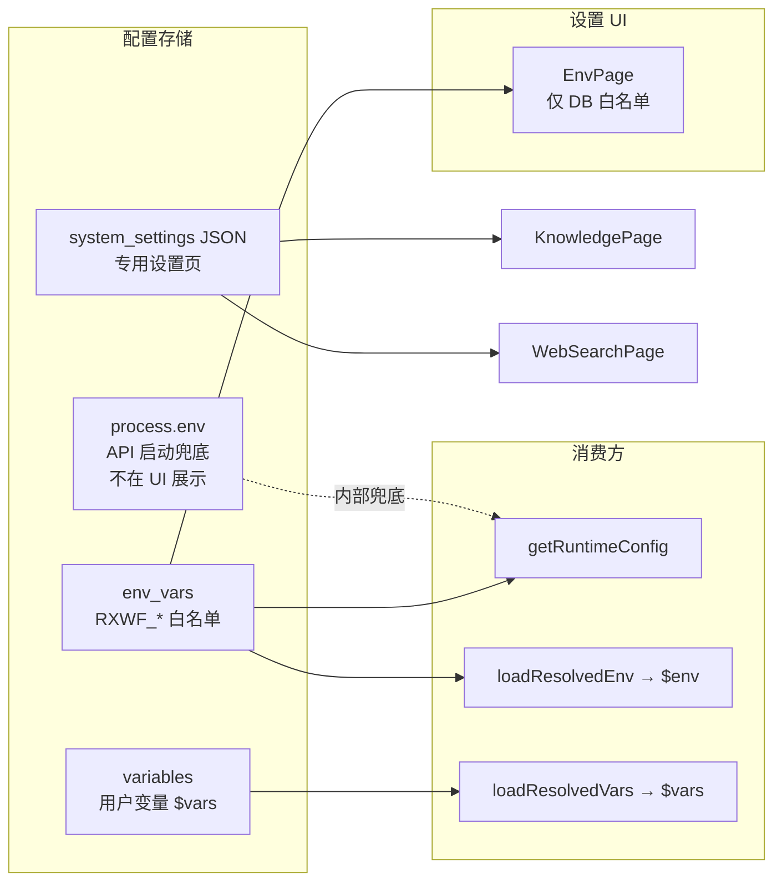

# 平台 RXWF 环境变量重构 Implementation Plan

> **For agentic workers:** REQUIRED SUB-SKILL: Use superpowers:subagent-driven-development (recommended) or superpowers:executing-plans to implement this plan task-by-task. Steps use checkbox (`- [ ]`) syntax for tracking.

**Goal:** 将「设置 → 环境变量」重构为「平台部署与运行时配置」：仅展示并管理 **系统自身**（DB `env_vars`）中的 `RXWF_*` 白名单；Admin 仅可改值、不可增删；取消 test/prod；**不展示** OS 环境变量与 `process.env`；变量页保持现状；工作流仍通过 `$env.RXWF_*` 访问。

**Architecture:** 在 `@rxwf/env` 增加 `platform-env-catalog` + `migratePlatformEnv`；`env_vars` 单环境 `runtime`；API 重构 `/api/env`；`getRuntimeConfig` 从 platform env 读取（`process.env` 仅作 API 进程启动兜底，**不出现在 UI/GET**）；Web `EnvPage` 白名单表格 + Tooltip；`system_settings` 标量项迁入 DB。

**Tech Stack:** TypeScript、Fastify 5、Vitest、React 19、Drizzle、`@rxwf/env`、`@rxwf/system-settings`。

**背景:** 与「变量」页功能重复；原环境变量混有平台配置与用户自定义 key。用户配置改走 **变量**（`$vars`）。

**修订（2026-06-23）:** 环境变量设置页与 `GET /api/env` **仅展示系统本身（DB）的环境变量**，**不展示** OS 系统环境变量与 `process.env` 只读项。

---

## 目标与边界

| 范围 | 处理 |
|------|------|
| **环境变量页 / GET /api/env** | **仅** DB 中平台 `RXWF_*` 白名单（§A）；Admin 改值；非 Admin 只读 |
| **OS / process.env** | **不在 UI 与 GET 中展示**；仅 API 进程内部读取（如 `config.ts` 启动项） |
| **变量页** | **不变**（用户/workflow 级 `$vars`，保留 test/prod、增删） |
| **知识库 / Web 搜索** | `knowledge.config`、`webSearch.config` **不迁入** env 表，仍在专用页 |
| **工作流 `$env`** | 仅暴露白名单中的 `RXWF_*`（不再含用户自定义 key） |

---

## 文件结构总览

| 路径 | 职责 |
|------|------|
| `packages/env/src/platform-env-catalog.ts` | 白名单元数据、校验、i18n key |
| `packages/env/src/platform-env.ts` | list / upsert / resolvePlatformEnvMap |
| `packages/env/src/migrate-platform-env.ts` | 迁移 test/prod、system_settings → RXWF_* |
| `packages/env/src/runtime-config-bridge.ts` | DB platform env → `RuntimeConfig` |
| `packages/env/src/load-resolved.ts` | `$env` 运行时解析 |
| `apps/api/src/env/ensure-platform-env.ts` | bootstrap 迁移 + seed |
| `apps/api/src/routes/env.ts` | GET/PUT 平台 env API |
| `apps/api/src/app-context.ts` | `buildRuntimeConfigFromPlatformEnv` 接线 |
| `apps/web/src/features/env/EnvPage.tsx` | 白名单表格 + Tooltip |
| `apps/web/src/features/settings/settings-nav-config.tsx` | 导航更名 + `adminOnly` |
| `packages/i18n-catalog/src/catalog-ui-ext.ts` | `platformEnv.RXWF_*.*` |

---

## 白名单目录（`platform-env-catalog.ts`）

新建 [`packages/env/src/platform-env-catalog.ts`](../../packages/env/src/platform-env-catalog.ts)，每项包含：

- `key`（必须 `RXWF_` 前缀）
- `labelKey` / `descriptionKey` / `valueHintKey`（i18n：名称 Tooltip、作用说明、取值范围 Tooltip）
- `sensitive: boolean`
- `requiresRestart: boolean`（若将来扩展需重启项；当前 §A 均为运行时生效）
- `defaultValue`（种子与校验兜底）
- `validate(value): string | null`

### A. 可编辑（持久化到 `env_vars`，**UI / GET / PUT 均包含**）

| Key | 原存储 | 说明 |
|-----|--------|------|
| `RXWF_PUBLIC_URL` | `system_settings.publicUrl` | 对外 URL（Webhook/MCP/邮件链接） |
| `RXWF_SMTP_HOST` | smtp.host | SMTP 主机 |
| `RXWF_SMTP_PORT` | smtp.port | 1–65535 |
| `RXWF_SMTP_SECURE` | smtp.secure | `true` / `false` |
| `RXWF_SMTP_USER` | smtp.user | |
| `RXWF_SMTP_PASSWORD` | smtp.password | 敏感，掩码 |
| `RXWF_SMTP_FROM` | smtp.from | 发件人地址 |
| `RXWF_WEBHOOK_SECRET` | webhookSecret | 敏感；Webhook 签名校验 |
| `RXWF_BRAND_NAME` | brand.productName | 产品显示名 |
| `RXWF_BRAND_LOGO_URL` | brand.logoUrl | Logo URL，可空 |
| `RXWF_LANGCHAIN_TRACING_V2` | langchain.tracingV2 | `true` / `false` |
| `RXWF_LANGCHAIN_API_KEY` | langchain.apiKey | 敏感 |
| `RXWF_LANGCHAIN_PROJECT` | langchain.project | 项目名 |
| `RXWF_WORKSPACE_ROOT` | rxwf.workspaceRoot | RxWF 工作区根路径 |
| `RXWF_SANDBOX_CODE_TIMEOUT_MS` | `SANDBOX_CODE_TIMEOUT_MS` | Code 沙箱默认超时；`-1` 不限时 |

> `RXWF_OLLAMA_URL` / `RXWF_OLLAMA_MODEL`：**不纳入**白名单（知识库走 `knowledge.config`；工作流 LLM 走模型目录）。`getRuntimeConfig` 仍可从 `envDefaults` / 模型目录兜底，**不在本页展示**。

### B. 进程启动项（`process.env` / `config.ts`，**不在 UI / GET 展示**）

以下键由部署时在 OS 或容器环境设置，API 进程启动时读取；**不出现在**设置页与 `GET /api/env`：

| Key | 说明 |
|-----|------|
| `RXWF_HTTP_PORT` | HTTP 监听端口 |
| `RXWF_DATA_DIR` | 数据目录 |
| `RXWF_DEPLOY_PROFILE` | `lite` / `standard` |
| `RXWF_DATABASE_URL` | PG 连接串 |
| `RXWF_REDIS_URL` | Standard 档 Redis |
| `RXWF_CREDENTIAL_KEY` | 凭证加密密钥 |
| `RXWF_PLUGIN_SECRET` | 插件签名 |
| `RXWF_CREW_TOOL_BRIDGE_SECRET` | Crew 工具桥密钥 |
| `RXWF_SCHEDULER_*` / `RXWF_JOB_*` / `RXWF_BULLMQ_*` / `RXWF_LITE_JOB_CONCURRENCY` | 调度与队列并发 |

文档中可单独说明「部署环境变量见运维文档 / `config.ts`」，与本设置页分离。

### C. 排除（仍在专用页 / JSON）

- `knowledge.config`、`webSearch.config` — 结构化 JSON，保留 [`KnowledgeSettingsPage`](../../apps/web/src/features/settings/KnowledgeSettingsPage.tsx) 等

---

## 数据模型与迁移

### 存储简化（取消 test/prod）

- [`env_vars`](../../packages/providers/lite/src/drizzle/schema.ts) **保留** `environment` 列，迁移后每 key **仅一行**，固定 `environment = 'runtime'`（常量 `PLATFORM_ENVIRONMENT`）。
- 迁移脚本（bootstrap [`ensure-platform-env.ts`](../../apps/api/src/env/ensure-platform-env.ts) 或 `scripts/rxwf-migrate.mjs`）：
  1. 合并现有 test/prod 双行 → 单行（优先 prod 值，无则 test）
  2. `SANDBOX_CODE_TIMEOUT_MS` → `RXWF_SANDBOX_CODE_TIMEOUT_MS`
  3. 从 `system_settings` 拷贝标量项到对应 `RXWF_*`（若 env 无值）
  4. **删除**不在白名单内的 global `env_vars` 行
  5. （可选）清理已迁移的 `system_settings` 标量键，避免双写

### 仓储 API 收紧

[`packages/env/src/types.ts`](../../packages/env/src/types.ts) + Lite/Standard repository：

- `listPlatformEnvForKey` / `upsertPlatformEnv` — 仅 §A 白名单
- `loadResolvedEnv`：仅返回平台白名单 map（**不再**合并 user/workflow scope 到 `$env`）
- 移除对外任意 key 的 `syncGlobalItem` / `DELETE` 用法

---

## API

重构 [`apps/api/src/routes/env.ts`](../../apps/api/src/routes/env.ts)：

| 方法 | 路径 | 权限 | 行为 |
|------|------|------|------|
| GET | `/api/env` | 已登录 | **仅** §A 白名单 + DB 当前值 + 元数据（labelKey 等）；敏感掩码；**不含** process.env |
| PUT | `/api/env` | **Admin** | `{ items: [{ key, value }] }`；校验白名单 + validate；拒绝未知 key |
| DELETE | — | **移除** | |

[`apps/api/src/routes/settings.ts`](../../apps/api/src/routes/settings.ts)：

- `GET/PUT /api/settings/system` **精简**：已迁入字段改读 platform env；保留测试邮件等能力
- 文档指向 `/settings/env`

---

## 运行时接线

1. **`getRuntimeConfig`** — 从 DB platform env 读取 §A（`buildRuntimeConfigFromPlatformEnv`）；`process.env` / `envDefaults` 仅作 DB 缺省时的**内部**兜底，不暴露给 GET/UI。
2. **`loadResolvedEnv`** — 返回 §A 白名单 key→value；执行期 **不再**按 `execution.environment` 选 test/prod 行。
3. **Code 节点** — [`resolve-code-sandbox-timeout.ts`](../../packages/node-runner/src/executors/resolve-code-sandbox-timeout.ts) 使用 `RXWF_SANDBOX_CODE_TIMEOUT_MS`。
4. **编辑器预览** — [`InputDataPanel.tsx`](../../apps/web/src/features/editor/InputDataPanel.tsx) 加载 platform env（GET `/api/env` 或等价 map）。

---

## Web UI

### 环境变量页 [`EnvPage.tsx`](../../apps/web/src/features/env/EnvPage.tsx)

- 重命名导航/i18n：**「平台部署与运行时配置」**（[`settings-nav-config.tsx`](../../apps/web/src/features/settings/settings-nav-config.tsx) + `adminOnly: true`）
- 表格：**仅** §A 白名单行；名称 Tooltip（作用）、值 Tooltip（取值范围）；敏感掩码
- 移除：添加表单、删除按钮、test/prod 切换、**任何 process.env 只读行**
- 非 Admin：整页只读（对齐知识库设置页）

### 系统设置页 [`SystemSettingsPage.tsx`](../../apps/web/src/features/settings/SystemSettingsPage.tsx)

- 移除已迁入 §A 的字段；保留「测试邮件」或重定向到 `/settings/env`

### i18n

[`catalog-ui-ext.ts`](../../packages/i18n-catalog/src/catalog-ui-ext.ts)：`platformEnv.RXWF_*.{label,description,valueHint}`

---

## 文档与规格

- 更新 [`docs/spec.md`](../spec.md) FR-4：环境变量 = 平台 `RXWF_*` 白名单（DB）；用户配置走 **变量**（`$vars`）；部署用 OS env 不在产品 UI 展示
- 更新 [`docs/expression-guide.md`](../expression-guide.md)：`$env` 仅 `RXWF_*`；示例 `$env.RXWF_PUBLIC_URL`
- 更新 [`docs/README.md`](../README.md) 环境变量表
- Setup 清单 [`SetupPage`](../../apps/web/src/features/setup/SetupPage.tsx) 检查 `RXWF_PUBLIC_URL`

---

## 测试

- `packages/env`：catalog 校验、迁移、loadResolvedEnv
- `apps/api/src/routes/env.test.ts`：member PUT 403、非白名单 400、无 DELETE、GET **仅**白名单项（**无** process.env 项）
- `ensure-platform-env` 迁移与 seed
- 集成：原 env CRUD 场景改写
- `resolve-code-sandbox-timeout.test.ts` 更新 key 名
- E2E：env 相关用例

---

## 实施顺序与 Task

- [ ] **Task 1:** `platform-env-catalog` + 单测
- [ ] **Task 2:** 仓储 + `migratePlatformEnv` + bootstrap seed
- [ ] **Task 3:** `/api/env` + `getRuntimeConfig` 接线
- [ ] **Task 4:** `loadResolvedEnv` / node-runner / InputDataPanel
- [ ] **Task 5:** EnvPage UI + 导航 + i18n
- [ ] **Task 6:** 精简 System 设置页 + 文档 + 全量测试

---

## 风险

| 风险 | 缓解 |
|------|------|
| 现有工作流使用 `$env.API_URL` 等非 RXWF key | 迁移日志 + 文档；引导改用 `$vars` |
| `system_settings` 与 `env_vars` 双写期 | 一次性迁移 + 统一读 platform env |
| 用户找不到 HTTP 端口等部署项 | 运维文档说明 OS env；与产品设置页分离 |
| 敏感值泄露 | GET 掩码；Admin-only PUT |
