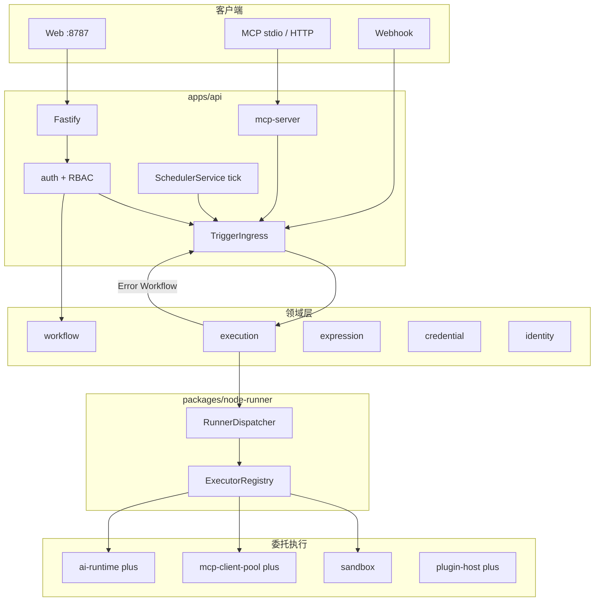
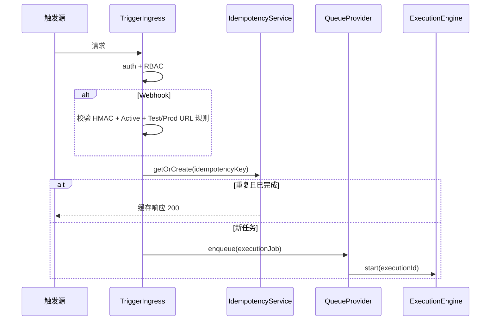
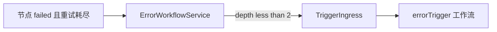

# RX-Workflow v1.0 实现设计规格

| 字段 | 内容 |
|------|------|
| **状态** | Approved — 实施计划见 [plans/2026-05-20-v1-implementation.md](../plans/2026-05-20-v1-implementation.md) |
| **日期** | 2026-05-20 |
| **关联 PRD** | [spec.md](../../spec.md) v1.11.0 |
| **关联 ADR** | [adr-module-boundaries.md](../../adr-module-boundaries.md)、[adr-deployment.md](../../adr-deployment.md)、[adr-execution-data.md](../../adr-execution-data.md)、[adr-expression-sandbox.md](../../adr-expression-sandbox.md)、[adr-langchain.md](../../adr-langchain.md)、[adr-node-runner.md](../../adr-node-runner.md) |
| **决策摘要** | 方案一 Monorepo + 特性开关；交付节奏 A（core GA → plus）；默认 HTTP 端口 **8787** |
| **架构图权威** | 本文 §1；[adr-module-boundaries.md](../../adr-module-boundaries.md) §5（已同步） |

---

## 0. 范围与约束

### 0.1 交付范围

| 维度 | 决策 |
|------|------|
| 产品范围 | **v1.0-core + v1.0-plus**（完整 v1.0 能力） |
| 交付节奏 | **A**：v1.0-core 先行 GA → v1.0-plus 约 1 个迭代 |
| 架构策略 | **方案一**：Monorepo 一次成型 + `RXWF_FEATURE_PLUS` 等特性开关 |
| 架构预留 | v1.1（Agent/RAG/远程 Runner/worker 拆分）、v2（SSO/HA）仅接口与 Schema，不实现 |

> **Lite 能力边界**：单次 GA 范围以 spec **§5.1 / §5.1.1** 为准。FR-21.2 描述档位能力上限；LLM/Chat/插件在 **plus** 打开，非 core 门禁。

### 0.2 网络与端口

| 项 | 值 |
|----|-----|
| 默认 HTTP 端口 | **8787**（`RXWF_HTTP_PORT`） |
| 对外 URL | `RXWF_PUBLIC_URL`（Webhook、文档示例、MCP HTTP） |
| 禁止默认端口 | **5678**（n8n 惯例，同机共存冲突） |

| 路径 | 说明 |
|------|------|
| `/` | Web 控制台（静态资源） |
| `/api/*` | REST API（OpenAPI 契约） |
| `/webhook/{workflowId}/{path}` | Webhook 入站（不经 `/api` 前缀） |
| `/mcp` | MCP HTTP/SSE（v1.0-core 起） |

开发态：Vite `:5173` proxy → `8787`。

### 0.3 UI 与特性开关对齐（spec §5.1）

| UI 能力 | v1.0-core | v1.0-plus |
|---------|-----------|-----------|
| 工作流编辑器、执行监控、Runner 列表 | 显示 | 显示 |
| AI Chat、MCP Client 节点、插件 Admin | **隐藏**（路由 404 或「即将推出」） | 显示 |
| FR-20 Admin 扩展语言/主题 | 隐藏 | 显示 |

实现：`apps/web` 读取 `/api/system/features` 或构建时 `RXWF_FEATURE_PLUS`；**不以** ux-v1.0-checklist #12–15 作为 core 门禁（与 spec §5.1 冲突项以 spec 为准）。

---

## 1. 总体架构



**核心原则**

1. **自研 DAG**：`execution` 负责调度、状态机、快照、Error Workflow、Partial/Pin；**不**实现具体节点逻辑。
2. **节点逻辑唯一入口**：`packages/node-runner`（`ExecutorRegistry` + `RunnerDispatcher`）。
3. **AI 隔离**：LangChain/LangGraph **仅**经 `packages/ai-runtime`；core 使用 **`ai-runtime/stub`**，plus 切换真实实现。
4. **统一触发**：Webhook / API / MCP / **Cron** / 子工作流 / **Error Workflow** → `TriggerIngress`（同一中间件链）。
5. **DB 边界**：`node-runner`、`runner-agent` **禁止**直连 DB；经 `RunnerRepositoryPort` 等注入接口。

---

## 2. Monorepo 结构

```
rx-workflow/
├── apps/
│   ├── api/                 # Fastify、DI、listen(8787)、启动 ensureEmbeddedRunner
│   └── web/
├── packages/
│   ├── identity/            # 用户、会话、RBAC
│   ├── workflow/
│   ├── execution/           # 引擎 + scheduler/ + error-workflow/
│   ├── expression/          # ADR-004：@n8n/tournament 或 AST
│   ├── credential/
│   ├── node-runner/
│   ├── runner-agent/        # v1.1；v1.0 占位
│   ├── sandbox/
│   ├── mcp-server/
│   ├── mcp-client-pool/     # plus
│   ├── ai-runtime/          # plus 实现 + stub 子路径
│   ├── chat/                # plus
│   ├── plugin-host/         # plus
│   ├── i18n-catalog/
│   ├── theme-catalog/
│   ├── providers/
│   │   ├── contracts/       # Storage, Queue, Cache, Blob, RunnerRepositoryPort
│   │   ├── lite/
│   │   └── standard/
│   └── shared/
└── deploy/
```

### 2.1 特性开关

| 变量 | v1.0-core GA | v1.0-plus GA |
|------|--------------|--------------|
| `RXWF_DEPLOY_PROFILE` | `lite`（默认） | `lite` \| `standard` |
| `RXWF_FEATURE_PLUS` | `false` | `true` |
| `RXWF_HTTP_PORT` | `8787` | 同左 |
| `RXWF_SINGLE_INSTANCE` | `true`（Lite 强制） | Lite `true` |

### 2.2 模块依赖（CI 强制）

```
apps/api       → 装配根；唯一组合 RunnerRepositoryPort + Drizzle

execution      → workflow, expression, node-runner, providers(contracts only)
node-runner    → expression, credential, sandbox
               → plus: 动态加载 ai-runtime | plugin-host | mcp-client-pool（非 core 硬依赖）
               → 禁止 → providers 实现层、禁止直连 DB

identity       → providers(contracts)
ai-runtime     → 唯一允许 @langchain/*（plus 构建）
ai-runtime/stub→ 无 langchain 依赖（core 默认）
runner-agent   → node-runner；禁止 → providers
```

### 2.3 平台、认证与安全（v1.0-core）

#### 2.3.1 `packages/identity`

| 能力 | Lite（core） | Standard / plus |
|------|--------------|-----------------|
| 认证 | 会话 Cookie + **API Key**（MCP/自动化） | 同左 |
| 角色 | **Admin**、**Member** | + Owner、Editor、Viewer |
> **注（2026-05-23）**：Lite 席位上限与 E5001 已移除；下文席位行仅作历史记录。

| 席位 | ~~注册用户 ≤ **20**；第 21 拒绝 `E5001`~~ **已废弃** | 可配置上限 |
| MCP Token | 用户级 Token；scope 见 §4 `mcp-server` | 同左 |

**中间件顺序（`apps/api`）**：

```
request → auth(session|apiKey) → rbac(route) → rateLimit(可选)
        → [webhook: HMAC] → [trigger: idempotency] → handler
```

#### 2.3.2 安全（spec §11）

| 项 | 实现位置 |
|----|----------|
| Webhook HMAC `X-AWF-Signature` | `TriggerIngress` |
| 幂等 `Idempotency-Key` | `IdempotencyService` + `idempotency_keys` 表 |
| MCP Token scope | `mcp-server` 按 Tool 校验 |
| 危险操作确认 | API `409` + `confirmToken`；Web §6.6 |
| 命令白名单 | v1.1 节点 + Runner；core 无命令节点 |

#### 2.3.3 `workflow_validate` 硬约束（v1.0-core）

| 约束 | 错误 |
|------|------|
| 子工作流嵌套 ≤ **5** | E1003 |
| Error Workflow 递归深度 ≤ **2** | E1004 |
| `preferRemote: true` 节点禁止 `fallback: embedded` | E1005 |
| 节点数 > 200 | 警告，不阻止保存 |

---

## 3. 核心数据流

### 3.1 TriggerIngress 与幂等



| 组件 | 职责 |
|------|------|
| `IdempotencyService` | 键长 ≤128；保留 7～30 天；表 `idempotency_keys` |
| Webhook Test URL | 仅 `manual`/Test 模式响应；Production 需 **Active** |
| 失败响应 | 签名校验失败 **401**；幂等冲突返回原 execution 摘要 |

### 3.2 执行快照（ADR-005）

创建 `executions` 时固化 `definition_snapshot`、`workflow_version_id`、`trigger_type`。运行中、重跑、幂等响应**仅**读快照。

### 3.3 Items、Blob 与表达式

| 层 | 包 | 说明 |
|----|-----|------|
| Items | `execution` / `node-runner` | 节点间 `Items[]` |
| 表达式 | `expression` | `{{ }}`；引擎 **@n8n/tournament**（首选）或 AST；禁止 eval |
| 大对象 | `BlobProvider` | `execution_blobs`；单 Item JSON < 1MB 建议值 |

### 3.4 执行模式与状态机（FR-11）

| `executions.mode` | 说明 | Pin 数据 |
|-------------------|------|----------|
| `production` | Webhook/Cron/Active 触发 | **忽略** |
| `manual` | 编辑器「执行工作流」 | 可读 Pin（仅 dev 环境配置） |
| `partial` | 从节点 N 执行 | 见下方算法 |

**Partial 算法（v1.0-core）**

1. 计算节点 N 的**上游依赖闭包** `U`（不含 N 之后节点，除非勾选「包含下游」P1）。
2. `U` 中节点：有 Pin → 用 Pin 输出，不执行；无 Pin 且 Dirty → 拓扑序执行。
3. 执行 N；默认不自动执行 N 的下游。
4. `NodeRunJob.mode = 'partial'` 传入 `node-runner`。

**Pin 生命周期**

- 存储：工作流定义内 `pinData` 字段（dev）或独立表 `node_pin_data`（推荐，避免 strip 误伤）。
- 导出：默认 **strip Pin**；可选「保留 Pin（仅开发）」须 Editor+。
- 生产路径：`execution` 在 `mode=production` 时不读取 Pin。

**状态机**

```
execution: queued → running → success | failed | cancelled
node_run:  pending → running → success | failed | skipped | cancelled
```

### 3.5 Node Runner 执行层

> 权威来源：[adr-node-runner.md](../../adr-node-runner.md)、FR-23。

#### 3.5.1 术语与职责

| 概念 | 位置 | 职责 |
|------|------|------|
| **ExecutorRegistry** | `node-runner` | `node.type` → `NodeExecutor.execute()` |
| **RunnerRegistry** | `node-runner` | 内存缓存 + **`RunnerRepositoryPort`** |
| **RunnerDispatcher** | `node-runner` | 解析策略 → embedded / 远程（v1.1） |
| **RunnerRepositoryPort** | `providers/contracts` | DB 读写；**由 apps/api 注入** |
| **Embedded Runner** | 启动 `ensureEmbeddedRunner` | v1.0 唯一执行路径 |

#### 3.5.2 P0 节点 ↔ Executor 映射（v1.0-core）

| spec §5.2 P0 | `node.type`（示例） | executor 模块 | 备注 |
|--------------|---------------------|---------------|------|
| 手动触发 | `manualTrigger` | `triggers/manual.ts` | 仅产生初始 Items |
| Webhook 触发 | `webhookTrigger` | `triggers/webhook.ts` | 配置在 workflow |
| 定时触发 | `scheduleTrigger` | `triggers/schedule.ts` | 与 Scheduler 联动 |
| HTTP | `httpRequest` | `http.ts` | 含表达式 URL |
| Set | `set` | `transform/set.ts` | |
| JSON | `json` | `transform/json.ts` | 解析/构造 Items |
| If | `if` | `control-flow/if.ts` | 多输出分支 |
| Switch | `switch` | `control-flow/switch.ts` | |
| Merge | `merge` | `control-flow/merge.ts` | append / combineByKey / combineAll |
| Code | `code` | `code.ts` | → `sandbox` |
| Wait | `wait` | `control-flow/wait.ts` | 固定时长 |
| 子工作流调用 | `executeWorkflow` | `subworkflow.ts` | 嵌套 ≤5；经 TriggerIngress |
| 错误触发器 | `errorTrigger` | `triggers/error.ts` | 接收 Error Workflow 载荷 |

#### 3.5.3 v1.0-plus P1 Executor（摘要）

| P1 节点 | executor | 依赖 |
|---------|----------|------|
| 文件读写 | `io/file.ts` | BlobProvider |
| MySQL / PostgreSQL | `io/db.ts` | credential |
| Ollama / OpenAI 兼容 | `ai/llm.ts` | `ai-runtime` |
| LLM 流式 | `ai/llm-stream.ts` | SSE 回调 execution |
| Split In Batches | `control-flow/split-batches.ts` | |
| Chat 触发 | `triggers/chat.ts` | plus + chat 服务 |

#### 3.5.4 包内目录与门面接口

```
packages/node-runner/
├── facade/node-runner-facade.ts
├── registry/executor-registry.ts
├── registry/runner-registry.ts      # 依赖 RunnerRepositoryPort
├── dispatch/runner-dispatcher.ts
├── executors/                       # 见上表
└── types/
```

```typescript
/** providers/contracts/runner-repository.ts */
export interface RunnerRepositoryPort {
  ensureEmbedded(platform: RunnerPlatform, caps: string[]): Promise<RunnerRecord>;
  listOnline(filter: RunnerFilter): Promise<RunnerRecord[]>;
  findById(id: string): Promise<RunnerRecord | null>;
  incrementRunningJobs(id: string, delta: number): Promise<void>;
}

export interface NodeRunnerFacade {
  resolveRunner(input: ResolveRunnerInput): Promise<ResolvedRunner>;
  executeNodeRun(job: NodeRunJob): Promise<NodeRunResult>;
}
```

**时序**：`resolveRunner` 在 `node_run` 创建为 `pending` 后、`running` 前调用；结果写入 `node_runs.runner_id` / `runner_platform`。

**Embedded 启动（`apps/api` bootstrap）**：

```typescript
await runnerRepo.ensureEmbedded(detectPlatform(), [
  'code', 'shell', 'file', 'ssh',  // 声明能力；v1.0 仅 code 实际用到
]);
```

#### 3.5.5 Runner 策略校验

| 规则 | v1.0-core |
|------|-----------|
| `preferRemote: true` + `fallback: embedded` | **validate 失败** E1005 |
| `pinned` + runnerId 不存在 | 警告 |
| `pinned` + runner 离线 | 警告；执行仍 embedded |
| WMI / 命令 / SSH 节点 | 画布可选；保存警告「需 v1.1 Runner」 |

#### 3.5.6 API

| 端点 | v1.0-core | v1.1 |
|------|-----------|------|
| `GET /api/runners` | ✓ | ✓ |
| `POST .../registration-tokens` 等 | 501 + `E3001` | ✓ |

#### 3.5.7 core 任务清单

- [ ] P0 executor 全注册（含 **errorTrigger**）
- [ ] `RunnerRepositoryPort` + Lite Drizzle 实现
- [ ] `RunnerDispatcher` embedded-only
- [ ] AC-43

---

### 3.6 Error Workflow（FR-3 core）



| 项 | 规则 |
|----|------|
| 载荷 | `executionId`, `workflowId`, `failedNode`, `errorMessage`, `stack`, `timestamp` |
| `maxErrorDepth` | **2**（主流程 → Error → 可选二级） |
| 禁止 | Error 工作流再触发自身；超出记审计并终止 |
| 实现 | `packages/execution/error-workflow/`；二次入队 `trigger_type=error` |
| 节点 | `errorTrigger` executor 解析载荷为初始 Items |

---

### 3.7 SchedulerService（FR-3 core）

| 项 | 说明 |
|----|------|
| 位置 | `packages/execution/scheduler/` |
| 触发 | `apps/api` 后台 tick（Lite 单进程 **60s** 默认可配置） |
| 数据源 | Active 工作流 + `scheduleTrigger` cron + `workflow.timezone` |
| Lite 租约 | 表 `scheduler_leases`；单实例下用于崩溃恢复 |
| 入队 | tick → 构建 executionJob → **同一 TriggerIngress**（跳过 HMAC，保留 RBAC） |

---

## 4. Packages 职责摘要

### 4.1 领域与平台

| 包 | 职责 |
|----|------|
| `identity` | 用户、会话、API Key、RBAC |
| `workflow` | CRUD、版本、validate、import/export、环境变量解析 |
| `execution` | DAG、重试、Partial/Pin、Error Workflow、Scheduler |
| `expression` | ADR-004 受限表达式 |
| `credential` | 加解密 + test |
| `node-runner` | §3.5 |
| `i18n-catalog` / `theme-catalog` | FR-20；core 内置 bundle；plus Admin API |

### 4.2 `mcp-server`（FR-16 v1.0-core）

**传输**：stdio + HTTP `8787/mcp`；环境变量 `ANY_WORKFLOW_TOKEN`。

| Tool | 调用的内部服务 |
|------|----------------|
| `workflow_list` | `workflow.list` |
| `workflow_get` | `workflow.get` |
| `workflow_create` | `workflow.create`（draft） |
| `workflow_update` | `workflow.update` |
| `workflow_execute` | `TriggerIngress`（manual） |
| `execution_get` | `execution.get` |
| `execution_list` | `execution.list` |
| `workflow_validate` | `workflow.validate` |

**v1.1 扩展**（core 返回 501 或文档标注不可用）：`workflow_publish`、`workflow_debug_partial`、`workflow_pin_data` 等。

**验收**：AC-13（create + execute）、AC-14（validate；publish 属 v1.1 时测 validate 拒绝无效图）。

### 4.3 Plus 包

| 包 | 职责 |
|----|------|
| `ai-runtime` | LangGraph；**stub** 供 core 编译 |
| `chat` | FR-17；`POST /api/chat/sessions` SSE |
| `mcp-client-pool` | FR-13A；子进程池 |
| `plugin-host` | FR-18；`register(registry)` |
| `providers/standard` | PG + BullMQ + Redis |

---

## 5. 分期里程碑

| 阶段 | 交付 |
|------|------|
| **M0** | Monorepo；Drizzle **全表**（含 `runners`, `idempotency_keys`, `scheduler_leases`）；`identity` 最小登录/API Key；8787；`RunnerRepositoryPort` + `ensureEmbeddedRunner` |
| **M1** | `execution` + Scheduler + Error Workflow + TriggerIngress + **P0 executors** + Partial/Pin |
| **M2** | Web 编辑器（ux core #1–11, 17–19）；i18n/theme 只读 API |
| **M3** | **MCP 8 Tools**；HMAC + 幂等；AC-1～14 核心子集；**core GA** |
| **M4** | plus：`RXWF_FEATURE_PLUS`；P1 executors；Chat；MCP Client；插件；AC-18, 24–27, 40 |
| **M5** | `compose.standard`；并发压测；FR-22 安装向导（AC-35）；**v1.0 GA** |

---

## 6. 验收标准映射（AC）

### 6.1 v1.0-core 门禁

| AC | 验证模块 | 里程碑 |
|----|----------|--------|
| AC-1 | `apps/web` 编辑器 + `workflow.validate` | M2 |
| AC-2 | `workflow` 版本历史 | M2 |
| AC-3 | `execution` + P0 + Scheduler + Webhook | M1–M3 |
| AC-4 | 重试 + §3.6 Error Workflow | M1 |
| AC-6 | `workflow` 环境变量 + `expression` | M1 |
| AC-7 | import/export | M2 |
| AC-8 | `identity` RBAC | M0–M2 |
| AC-9 | `expression` + HTTP executor | M1 |
| AC-10 | Partial/Pin §3.4 | M1–M2 |
| AC-11 | `subworkflow` executor | M1 |
| AC-12 | 时间线 + 失败 Webhook 告警节点（若 P0 仅 Error WF） | M1 |
| AC-13 | `mcp-server` 8 Tools | M3 |
| AC-14 | `workflow_validate` | M3 |
| AC-31–34 | `i18n-catalog` + `theme-catalog` + web | M2 |
| AC-37–38 | Idempotency + HMAC §3.1 | M3 |
| AC-42 | 执行快照 §3.2 | M1 |
| AC-43 | Runner §3.5 | M0–M1 |

### 6.2 v1.0-plus

| AC | 验证模块 |
|----|----------|
| AC-5 | `ai-runtime` + P1 LLM executors |
| AC-18 | `chat` |
| AC-24–27 | `mcp-client-pool` + `plugin-host` |
| AC-40 | Admin i18n/theme |
| AC-39 | FR-22 首启 checklist（可跟 M5） |

### 6.3 测试门禁

| 类别 | 要求 |
|------|------|
| 契约 | OpenAPI + workflow schema CI |
| 单元 | node-runner Registry；Error depth；Partial 闭包 |
| 集成 | AC-3,4,10,13,42,43 自动化场景 |
| 边界 | dependency-cruiser：execution↛langchain；node-runner↛providers 实现 |
| 端口 | 默认 8787 |

---

## 7. v1.1+ 架构预留

| 能力 | 扩展点 |
|------|--------|
| 远程 Runner | `RunnerDispatcher` + `runner-agent` |
| Worker | `apps/worker` + BullMQ |
| Agent / RAG | `ai-runtime` + `VectorStoreProvider` |
| MCP publish/partial/pin Tools | `mcp-server` 扩展 |

---

## 8. 变更记录

| 版本 | 日期 | 说明 |
|------|------|------|
| v1.0 | 2026-05-20 | 初稿 |
| v1.1 | 2026-05-20 | 审查修订：§2.3 认证、§3.1 幂等、§3.4 Partial/Pin、§3.6 Error WF、§3.7 Scheduler、RunnerRepositoryPort、P0 映射、MCP 8 Tools、AC 矩阵、§0.3 UI |
