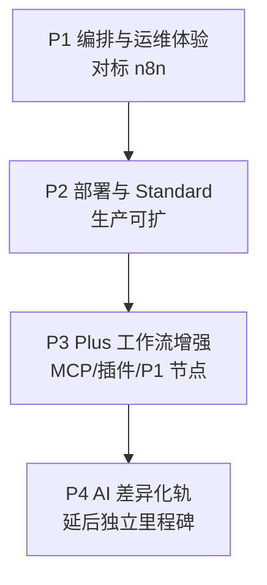

# RX-Workflow 补全设计规格（方案三：n8n 体验优先）

| 字段 | 内容 |
|------|------|
| **状态** | **Approved** — 实施计划见 [plans/2026-05-22-n8n-first-completion.md](../plans/2026-05-22-n8n-first-completion.md) |
| **日期** | 2026-05-22 |
| **策略** | **方案三**：先对标 n8n 的编排/运维/部署体验；AI/Agent/RAG/远程 Runner 整轨后置（P4） |
| **关联 PRD** | [spec.md](../../spec.md) v1.11.0 |
| **关联 UX** | [ux-ui-design.md](../../ux-ui-design.md) v1.3.x、[ux-v1.0-checklist.md](../../ux-v1.0-checklist.md) |
| **终极目标** | 用户诉求「全部」；本设计定义 **P1～P3 先行交付** + **P4 独立里程碑** |

---

## 1. 背景与决策

### 1.1 现状摘要（2026-05-22）

| 层级 | 状态 |
|------|------|
| 后端 v1.0-core | 大体完成：DAG、Webhook/HMAC/幂等、凭证 API、MCP Server、Runner Embedded |
| 后端 v1.0-plus | `RXWF_FEATURE_PLUS=true` 时：Chat SSE、MCP Client 池、插件 Host、P1 executors |
| 前端 Web | 编辑器/执行时间线/Runner/Setup 有基础；[ux-v1.0-checklist](../../ux-v1.0-checklist.md) P0 **未勾选** |
| Standard | `providers/standard` **仅健康检查**；无 PG/BullMQ 业务存储切换 |
| v1.1 | Agent、RAG、知识库、`rxwf-runner` **未实现** |

### 1.2 方案对比与选定

| 方案 | 描述 | 结论 |
|------|------|------|
| 一 | 分波次：v1.0 GA → Standard → AI → Agent | 未选 |
| 二 | 三轨并行 | 未选 |
| **三** | **n8n 体验优先**：编辑器/凭证/Webhook/执行/部署先行；AI/Agent 后置 | **已选** |

### 1.3 刻意不做（即使长期「全部」）

与 [spec.md §1.3](../../spec.md) 一致：400+ SaaS 连接器、UGC 插件市场、SSO/HA 多集群、Coze 式消费插件全家桶、默认端口 5678。

---

## 2. 分期与验收

### 2.1 阶段总览



| 阶段 | 周期（估） | 目标 | 主要验收 |
|------|------------|------|----------|
| **P1** | 2～3 周 | 像 n8n 一样能编、能跑、能查、能管 | ux-v1.0-checklist **P0**；AC-1～12、31～34、37～38、42、43(core) |
| **P2** | 2 周 | Lite/Standard 部署与数据层可上生产 | AC-35/36；PG + BullMQ 真切换 |
| **P3** | 1～2 周 | 工作流侧 plus（非 AI 主轨） | AC-24～27、40；MCP Client UI、插件管理、P1 节点面板 |
| **P4** | 另立里程碑 | Chat RAG、Agent、Runner Agent、插件热加载等 v1.1 | AC-15～22 等；导航由灰显改为实装 |

> **注（2026-05-23）**：Lite 席位功能已移除；SP-DEP 中席位相关描述已废弃。

### 2.2 子项目地图

| ID | 名称 | 阶段 | spec 锚点 |
|----|------|------|-----------|
| SP-UI | Web 对标 n8n | P1 为主 | FR-1～8、FR-10、FR-20、ux checklist |
| SP-DEP | 部署与首启 | P1～P2 | FR-21、FR-22、AC-35 |
| SP-STD | Standard 数据层 | P2 | FR-21.3、ADR-002 |
| SP-PLUS-WF | Plus 工作流集成 | P3 | FR-13A、FR-18、FR-20.4～20.5 |
| SP-AI | AI Chat / 模型 / RAG | **P4** | FR-15、FR-17 |
| SP-AGENT | Agent 编排 | **P4** | FR-15.4 |
| SP-RUN | 远程 Runner | **P4** | FR-23 v1.1 |

### 2.3 与 n8n 对标（P1～P3 完成后）

| 维度 | n8n | 本设计交付点 |
|------|-----|--------------|
| UI | 三栏编辑器、执行、凭证 | P1 对齐 + Pin/Partial + Webhook 配置 + 版本 |
| 部署 | Docker compose | P1 Lite 文档化；P2 Standard 三服务 |
| 数据库 | PG + 队列 | P2 Standard 统一 PG；Lite 保持 SQLite |
| 插件 | 社区节点 | P3 私有上传启用；无大市场 |
| Agent | LangChain 节点 | **P4**；P1～P3 灰显「即将推出」 |
| Chat | 无独立模块 | **P4**（可选 P1 仅灰显入口） |

---

## 3. 架构与模块边界

### 3.1 Web 信息架构

**P1 一级导航（完整壳层）**

```
工作流 | 环境变量 | 执行 | 用户 | 系统设置
```

**P4 灰显入口**：AI Chat、知识库、Agent 相关（侧栏或设置内链，不可进入主流程）。

| 路由 | 页面 | 阶段 |
|------|------|------|
| `/` | 工作流列表 | P1 |
| `/workflows/:id` | 三栏编辑器 | P1 |
| `/executions` | 执行列表（limit 默认 50） | P1 |
| `/executions/:id` | 时间线 + I/O + Runner | P1 |
| `/env` | 环境变量 | P1 |
| `/users` | 用户（Lite Admin/Member；现重定向至 `/settings/profile`） | P1 |
| `/settings/*` | 凭证、主题语言、MCP Token、模型（模型 P4） | P1 / P3 |
| `/templates` | 内置模板画廊 | P1 |
| `/plugins` | 插件管理 | P3（P1 灰显） |
| `/chat` | AI Chat | P4（默认灰显） |
| `/knowledge` | 知识库 | P4 灰显 |

**特性开关**

- `GET /api/system/features` → `featurePlus` 控制 **P3** 路由（插件、MCP Client 节点、Admin i18n/theme）。
- **P1 核心路由不依赖 `featurePlus`。**
- 生产镜像建议默认 `RXWF_FEATURE_PLUS=true`（CI core 测试仍可用 `false`）。

### 3.2 编辑器增量（P1）

在现有 `WorkflowEditorPage` 上扩展：

| 能力 | 要点 |
|------|------|
| 未保存离开 | `beforeunload` + Router `useBlocker`；i18n `E1001` |
| 危险操作 | 共用 `ConfirmDialog`：删工作流、Active、删凭证、吊销 MCP Token、轮换 Webhook Secret |
| Webhook 面板 | `webhookTrigger` 右栏 Tab：Test/Prod URL、HMAC、幂等 curl |
| 版本 | 历史列表 + JSON diff + 回滚确认 |
| Sticky Notes | `stickyNote` 节点或 metadata；不参与执行 |
| 调试工具栏 | Test/Production 模式；Dirty 角标；Pin 清除 |
| 节点面板 P1 | 仅 P0；P3 按 `featurePlus` 展开 P1 分组 |

### 3.3 后端边界（P1 原则）

**P1 以「已有 API 接 UI」为主**，新增薄 API：

| 领域 | 包/路由 | P1 工作 |
|------|---------|---------|
| 工作流版本 | `workflow` | `GET versions`、`POST rollback`（若缺失则补） |
| 执行列表 | `executions` routes | `GET /api/executions` 全局分页 |
| 环境变量 | 新 `packages/env` + Lite 表 | CRUD + 运行期注入 `$env` |
| 模板 | `workflow` | `GET /api/templates`、`POST clone` |
| AI | `ai-runtime/stub` | P4 再接线 LangGraph |

**依赖**：遵守 [adr-module-boundaries.md](../../adr-module-boundaries.md)；Web 仅调 REST。

### 3.4 Standard（P2）

| 接口 | Lite | Standard |
|------|------|----------|
| `StorageProvider` | SQLite（现状） | PostgreSQL（Drizzle） |
| `QueueProvider` | memory + SQLite jobs | BullMQ + Redis |
| `/api/ready` | SQLite 可写 | PG + Redis + 入队探针 |
| 向量 | 无 | pgvector **留 P4** |

**迁移**：`awf migrate --from sqlite --to postgres` 最小路径（workflows、executions、users、credentials、env）。

### 3.5 Plus 工作流（P3）

- MCP Server 注册 UI + MCP Client 节点属性（Server/Tool/Schema 表单）。
- 插件上传/启用/禁用（AC-26/27）。
- Admin i18n/theme（AC-40）。

### 3.6 P4 占位（不实现）

- `AiRuntime` LangGraph、`workflow.type=agent` 画布、知识库、`runner-agent` 远程派发、插件热加载。
- UI：设置页与导航「即将推出」；schema 可预留字段。

---

## 4. 数据流与错误处理

### 4.1 环境变量（FR-4，P1）

**表 `env_vars`**

| 字段 | 说明 |
|------|------|
| `scope` | `global` \| `user` \| `workflow` |
| `scopeId` | workflowId / userId；global 为 null |
| `environment` | `dev` \| `staging` \| `prod` |
| `key` / `value` | |
| `sensitive` | 日志脱敏 |

**解析优先级**：`workflow` > `user` > `global`。

**运行期**

- 用户选择环境：顶栏 + `PATCH /api/users/me/preferences` 字段 `executionEnvironment` + `localStorage.awf.environment`。
- 手动执行：请求带 `environment` + `mode: manual`；`node-runner`/`expression` 注入 `ExpressionContext.env`。
- Webhook/定时：P1 固定 `prod` 解析 `$env`。

**API**

- `GET /api/env?scope=&scopeId=&environment=`
- `PUT /api/env`（批量 upsert）
- `DELETE /api/env/:id`

### 4.2 执行监控（P1）

**新增** `GET /api/executions?limit=50&offset=0&status=&workflowId=`（max limit 200）。

**保留** `GET /api/workflows/:workflowId/executions`、`GET /api/executions/:id`（含 nodeRuns、runner 平台）。

**错误面板**：失败执行展示 `code`、`traceId`、i18n `errors.E2xxx`；节点级 `E2003` 含 `nodeName`。

### 4.3 Webhook（P1）

**链**：`POST /webhook/:workflowId/:path` → active → HMAC + `X-AWF-Timestamp` → idempotency → enqueue。

**节点参数**：`path`、`hmacSecret`（或凭证引用）、test 行为与编辑器 Test 模式联动。

**URL**：`{RXWF_PUBLIC_URL}/webhook/{workflowId}/{path}`。

**Test 模式（实现二选一，代码内固定）**：推荐 Header `X-AWF-Test: true`；Test URL 文档中说明。

**UI**：右栏 curl 示例（`X-AWF-Signature`、`X-AWF-Timestamp`、`Idempotency-Key`）；Secret 轮换走危险确认。

| 代码 | HTTP | 说明 |
|------|------|------|
| E2001 | 403 | Inactive |
| E2005 | 401 | 签名无效 |
| E2006 | 401 | 时间戳过期 |
| E2007 | 200 | 幂等命中 |

### 4.4 保存、版本、Pin（P1）

- 保存前可选 `POST /validate`；`PUT` 递增版本。
- 回滚：写入新版本内容，不影响运行中 execution 快照（AC-42）。
- 保存默认 strip Pin；可选「开发保留 Pin」（Editor+）。

### 4.5 凭证（P1 UI）

对接现有 `/api/credentials`：列表、CRUD、测试连接、删除须输入名称；节点参数 `credentialId` 下拉。

### 4.6 统一错误体

```json
{
  "code": "E2003",
  "message": "...",
  "traceId": "tr_...",
  "details": { "nodeId": "...", "retryable": true }
}
```

| 层级 | UI |
|------|-----|
| 表单 | inline |
| 操作 | Toast + 详情 |
| 危险操作 | 对话框不关闭 |
| 5xx | 通用重试提示 |

P1 不强制覆盖 E3xxx（无 Chat 主轨）。

### 4.7 P2/P3 补充

- **P2**：enqueue → BullMQ → worker `processOnce`（与现 JobProcessor 接口一致）。
- **P3**：MCP Client 节点 → pool → Items；插件启用 → registry。

---

## 5. 测试策略

| 层级 | P1 | P2 | P3 |
|------|----|----|-----|
| 单元 | `packages/env` 优先级；`$env` 表达式 | Standard queue 入队 | plugin-host validate |
| API 集成 | 全局 executions、env CRUD、AC-6 | migrate 冒烟、ready 探针 | AC-24～27、40 |
| Web | validate-connections、ConfirmDialog | — | 插件上传（可选 E2E） |
| 门禁 | checklist P0 + `pnpm test` + `lint:deps` | compose.standard 冒烟 | `featurePlus=true` 路由 |

每阶段结束：全量 `pnpm test`；P2 增加 CI job（postgres + redis services）。

---

## 6. 开放项（已决）

| 项 | 决策 |
|----|------|
| P1 是否开放纯 Chat | **否**；Chat 路由 P4 灰显（方案三） |
| Webhook Test 区分 | Header `X-AWF-Test: true` |
| Plus 默认 | 生产镜像默认 `RXWF_FEATURE_PLUS=true`；P1 路由不依赖 plus |
| 端口 | 保持 **8787**，禁止默认 5678 |

---

## 7. 后续步骤

1. 用户审阅本文件并确认或提出修改。
2. 调用 **writing-plans** 生成 `docs/superpowers/plans/2026-05-22-n8n-first-completion.md`（按 P1→P2→P3 任务分解）。
3. P4 单独立项时再写 `2026-05-xx-ai-agent-milestone-design.md`。

---

## 8. 变更记录

| 日期 | 说明 |
|------|------|
| 2026-05-22 | 初稿：方案三、P1～P4 分期、架构、数据流、测试 |
