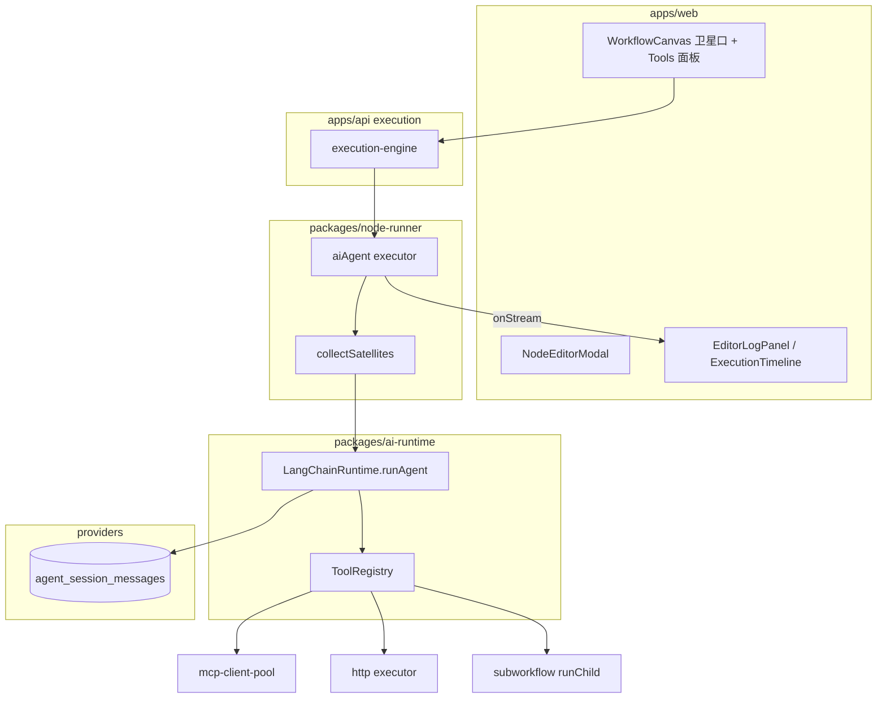

# P4-B：工作流内 AI Agent（n8n Tools Agent 子图模式）

| 字段 | 内容 |
|------|------|
| **状态** | **Approved** — 实施计划见 [plans/2026-05-23-workflow-agent-node.md](../plans/2026-05-23-workflow-agent-node.md) |
| **日期** | 2026-05-23 |
| **里程碑** | P4（v1.1 AI 差异化轨 — 子项目 B） |
| **策略** | **方案 2**：画布 **AI Agent 根节点 + 卫星子节点**（对标 n8n Tools Agent），**不做** `workflow.type=agent` 独立画布 |
| **关联** | [spec.md](../../spec.md) FR-15.4、FR-15.5、[adr-langchain.md](../../adr-langchain.md)、[2026-05-22-n8n-first-completion-design.md](./2026-05-22-n8n-first-completion-design.md) |

---

## 1. 背景与目标

### 1.1 现状

- Plus 已有 `ollama` / `llmStream` / `mcpClient` 等节点；`packages/ai-runtime` 为 Ollama 直连 `chat()`，无 LangGraph Agent。
- 侧栏「知识库」为 P4 其他轨占位；本 spec **不包含** RAG/知识库。
- 工作流连接已支持 `fromOutput` / `toInput`，当前端口主要为 `main`；执行图 `toWorkflowGraph` 按 main 拓扑调度。

### 1.2 目标（P4-B MVP）

1. 用户可在 DAG 中放置 **AI Agent** 根节点，并通过 **连线** 挂载 Chat Model、Memory、Tool 子节点（体验对齐 n8n Tools Agent）。
2. Tool 支持：**MCP**、**HTTP**、**Workflow（同步子执行）** 三类专用 Tool 节点。
3. 模型：**Ollama** + **OpenAI 兼容 API**（`credentialId` + 可选 `baseUrl`）。
4. **跨执行记忆**：`sessionId` 持久化（Lite SQLite / Standard PostgreSQL）。
5. **可观测**：执行时间线展示 Tool 步骤；编辑器日志流式 `tool_start` / `tool_end` / 中间步骤（调试可开 `returnIntermediateSteps`）。

### 1.3 成功标准（验收）

| # | 标准 |
|---|------|
| AC-B1 | 保存含 `aiAgent` 的工作流时，未连 Model 或 Tool 返回校验错误 |
| AC-B2 | 集成测试：Agent + `toolMcp` 完成一轮 tool call 并输出 Items |
| AC-B3 | 同一 `sessionId` 的两次执行，第二次能加载上一轮 assistant 历史 |
| AC-B4 | `nodeRun` 含 `agentSteps`（或等价 metadata），时间线可展开 |
| AC-B5 | Lite、Standard 各 1 条 Agent 冒烟测试通过 |

### 1.4 明确不做（本 spec）

| 能力 | 说明 |
|------|------|
| `workflow.type=agent` 画布 | 范式 B，另立里程碑 |
| Crew / Group Chat / Supervisor / HITL | FR-15.4 扩展，P4-B.2+ |
| `ai_outputParser` 卫星节点 | 预留 `toInput`，P4-B.2 |
| 任意 P0 节点一键变 Tool | n8n 高级能力，首版仅 3 种 Tool 类型 |
| RAG / 知识库 / Embedding 流水线 | P4 其他轨（A） |
| 模型目录 CRUD、路由 fallback | FR-15.1 完整版，后续 |
| LangSmith | 自建日志 + `AiStreamChunk` |
| `$fromAI()` 动态 Tool 参数 | n8n 对标项，**P4-B.3**（见 §12） |
| Workflow Tool「仅 Active / exposeAsTool」 | **已纳入 P4-B′**（见 §4.3、§5.4、§12）— 用户已确认 **方案 C** |

---

## 2. n8n 对标与 AWF 映射

参考 [n8n AI Agent 文档](https://docs.n8n.io/integrations/builtin/cluster-nodes/root-nodes/n8n-nodes-langchain.agent)（Tools Agent，≥1.82 默认）。

| n8n | AWF |
|-----|-----|
| AI Agent 根节点 | `aiAgent` |
| Chat Model → `ai_languageModel` | `aiChatModel` → `aiAgent` |
| Memory → `ai_memory` | `aiMemory` → `aiAgent` |
| Tool 子节点 → `ai_tool` | `toolMcp` / `toolHttp` / `toolWorkflow` → `aiAgent` |
| Tool 名称 = 画布节点名 | `node.name` → LangChain tool `name` |
| main 数据流 | 不变：`main` in/out |

**连接方向**：卫星节点 **输出** → Agent **输入**（`from` = 子节点，`to` = `aiAgent`）。

---

## 3. 架构



### 3.1 模块边界（ADR-001）

| 模块 | 职责 |
|------|------|
| `apps/web` | 卫星端口 UI、Tools 面板、校验徽章、Agent 弹窗摘要 |
| `packages/workflow` | `validate` 扩展：Agent 卫星规则 |
| `packages/execution` | `toWorkflowGraph` 排除卫星节点出 main 拓扑 |
| `packages/node-runner/executors/ai-agent.ts` | 收集卫星、拼 `AgentRunInput`、映射 Items |
| `packages/ai-runtime/agents/` | LangGraph `createReactAgent`（或等价） |
| `packages/ai-runtime/tools/` | MCP / HTTP / Workflow → `StructuredTool` |
| `providers/lite|standard` | `agent-memory-repository` |

**禁止**：`apps/*` 直接 `import '@langchain/*'`。

---

## 4. 图模型：节点与连接

### 4.1 节点类型

| `type` | 角色 | main 端口 | 卫星端口 |
|--------|------|-----------|----------|
| `aiAgent` | Agent 根 | `main` in + out | in: `ai_languageModel`×1, `ai_memory`×0..1, `ai_tool`×N |
| `aiChatModel` | 语言模型 | 无 | out: `ai_languageModel` |
| `aiMemory` | 会话记忆 | 无 | out: `ai_memory` |
| `toolMcp` | MCP Tool | 无 | out: `ai_tool` |
| `toolHttp` | HTTP Tool | 无 | out: `ai_tool` |
| `toolWorkflow` | 子工作流 Tool | 无 | out: `ai_tool` |

卫星节点 **不参与** main 拓扑执行序；仅在父 `aiAgent` 执行时被收集。

### 4.2 连接（`workflow-definition.v1`）

沿用 `connections[].fromOutput` / `toInput`，新增枚举值：

| `fromOutput` / `toInput` | 说明 |
|--------------------------|------|
| `main` | 默认数据流 |
| `ai_languageModel` | Model → Agent |
| `ai_memory` | Memory → Agent |
| `ai_tool` | Tool → Agent |

示例：

```json
{
  "from": "mdl-1",
  "to": "agt-1",
  "fromOutput": "ai_languageModel",
  "toInput": "ai_languageModel"
}
```

### 4.3 校验规则（`POST /validate` + 前端保存）

| 规则 | 级别 | 错误码 |
|------|------|--------|
| 每个 `aiAgent` 必须连 **恰好 1** 个 `aiChatModel` | error | `E1012` |
| 每个 `aiAgent` 必须连 **≥1** 个 Tool（`toolMcp`/`toolHttp`/`toolWorkflow`） | error | `E1013` |
| `ai_languageModel` / `ai_memory` 入边 **≤1** | error | `E1014` |
| Tool 子节点未连任何 Agent | warn | — |
| `toolWorkflow.workflowId` 目标工作流未 **published** | error | `E1023` |
| `toolWorkflow.workflowId` 目标已发布但未 **exposeAsTool** | error | `E1024` |
| `toolWorkflow.workflowId` 目标工作流不存在 | error | `E1022` |
| 卫星节点出现在 main 链上（仅有 ai_* 边无 main） | 允许 | — |

---

## 5. 节点参数

### 5.1 `aiAgent`

| 字段 | 类型 | 默认 | 说明 |
|------|------|------|------|
| `promptType` | `auto` \| `define` | `auto` | auto：由上游 Items 生成 user 消息 |
| `text` | string | — | `define` 时 user 模板，支持 `{{ }}` |
| `systemMessage` | string | `''` | 系统提示，支持表达式 |
| `maxIterations` | number | `10` | 硬上限，执行器传入 LangGraph |
| `timeoutMs` | number | `120000` | Agent 总超时 |
| `returnIntermediateSteps` | boolean | `true` | 调试写入 metadata |
| `sessionId` | string | `''` | 覆盖执行上下文；空则回退 `$execution.sessionId` |

### 5.2 `aiChatModel`

| 字段 | 类型 | 说明 |
|------|------|------|
| `provider` | `ollama` \| `openai-compatible` | — |
| `model` | string | 模型名 |
| `credentialId` | string? | OpenAI 兼容必填 |
| `baseUrl` | string? | 覆盖网关地址 |
| `temperature` | number? | 可选 |
| `maxTokens` | number? | 可选 |

### 5.3 `aiMemory`

| 字段 | 类型 | 默认 | 说明 |
|------|------|------|------|
| `sessionId` | string | `''` | 表达式；空则用 Agent/execution 解析链 |
| `maxTurns` | number | `20` | 加载历史条数上限 |

### 5.4 Tool 子节点（共用）

| 字段 | 类型 | 说明 |
|------|------|------|
| `toolDescription` | string | **必填**；供 LLM 选择工具 |

**toolMcp**：`serverId`，`tools[]`（与现有 `mcpClient` 一致）。

**toolHttp**：`method`，`url`，`headers`（object），`body`（string）；支持表达式；**不含** `$fromAI`（P4-B.2）。

**toolWorkflow**：`workflowId`（须指向 **已发布** 且 `settings.exposeAsTool === true` 的工作流）；同步 `runChild`；继承 `MAX_SUBWORKFLOW_DEPTH=5`。运行时仅加载 **published** 版本定义，不使用草稿。

**LangChain 映射**：

- `name` = `node.name`（画布可改，须唯一于该 Agent 下）
- `description` = `toolDescription`
- `inputSchema` = 由参数静态字段生成 Zod object（P4-B.3 再支持 AI 填参）

### 5.5 工作流设置（P4-B′，`exposeAsTool`）

在 `WorkflowDefinition.settings` 增加（随版本发布进入 published 快照）：

| 字段 | 类型 | 默认 | 说明 |
|------|------|------|------|
| `exposeAsTool` | boolean | `false` | 为 `true` 时，允许其他工作流的 `toolWorkflow` 引用本流（且本流须 **published**） |
| `exposeAsToolDescription` | string | `''` | 可选；供 LLM 选 Tool 时的说明，缺省用工作流 `name` |

**API：** `GET /api/workflows?status=published&exposeAsTool=true` 供编辑器下拉与 Agent Tools 面板（仅返回当前用户有权查看的工作流）。

**废弃：** 原「任意已保存含草稿 + W1011 警告」— 由 `E1023`/`E1024` **error** 替代。

---

## 6. sessionId 与 Memory

### 6.1 解析顺序

1. `aiMemory.sessionId`（表达式求值后非空）
2. `aiAgent.sessionId`（表达式求值后非空）
3. `execution.sessionId`（Manual/Webhook body 字段或 Header `X-AWF-Session-Id`）
4. 皆无 → **不加载/不写入**跨执行 Memory；仅本轮 prompt（UI 提示「未绑定 session」）

### 6.2 表 `agent_session_messages`

与 `chat_messages` **分离**。

| 列 | 说明 |
|----|------|
| `id` | UUID PK |
| `session_id` | 索引 |
| `role` | `system` \| `user` \| `assistant` \| `tool` |
| `content` | text 或 JSON 字符串 |
| `execution_id` | 可选溯源 |
| `created_at` | timestamp |

| 档位 | 存储 |
|------|------|
| Lite | SQLite `agent_session_messages` |
| Standard | PostgreSQL 同表 |

接口：`AgentMemoryRepository`（`append` / `listRecent(sessionId, maxTurns)`），经 `providers-contracts` 注入 `ai-runtime` 或 executor。

### 6.3 与 Chat 模块关系

- FR-17 AI Chat 页面仍用 `chat_sessions` / `chat_messages`。
- 工作流 Agent Memory **不**自动合并 Chat 会话；同 `sessionId` 字符串可人为对齐（文档说明，不做自动同步）。

---

## 7. 执行流程

### 7.1 main 拓扑

`toWorkflowGraph`：

- 节点集合：含 `aiAgent` 及所有 main 可达节点。
- **排除**仅通过 `ai_*` 边连到 Agent 的卫星节点（`aiChatModel`、`aiMemory`、`tool*`）。
- `stickyNote` 继续排除。

### 7.2 `aiAgent` 执行步骤

1. `collectSatellites(definition, agentNodeId)` → `{ model, memory?, tools[] }`。
2. 缺 model → `E3010`；缺 tools → `E3011`。
3. 解析 `sessionId`；若启用 memory 则 `listRecent` 拼进 messages。
4. 由 `promptType` + 上游 Items 构造 `userMessage`。
5. 为每个 Tool 子节点构建 `ToolDefinition` + LangChain tool。
6. `AiRuntime.runAgent({ model, systemPrompt, userMessage, tools, memory, maxIterations, timeoutMs, returnIntermediateSteps }, ctx)`。
7. 流式：`ctx.onStream` → `AiStreamChunk` 写日志通道 + 累积 `agentSteps`。
8. 结束：assistant 写入 memory；输出 `WorkflowItem[]`（含 `json.answer`、`json.agentSteps?`）。

### 7.3 Tool 运行时

| Tool type | 实现 |
|-----------|------|
| `toolMcp` | `mcp-client-pool.callTool(serverId, toolName, args)` |
| `toolHttp` | 复用 `httpRequest` executor 逻辑（同凭证/表达式上下文） |
| `toolWorkflow` | `SubworkflowExecutorDeps.runChild`；**等待**子 execution 完成；`depth+1` |

子工作流使用 **已发布版本** 的定义。保存时若 `workflowId` 未 published 或未 `exposeAsTool`，校验 **error**（`E1023` / `E1024`）。Agent「加 Tool」列表仅展示合格工作流（见 §9.3）。

### 7.4 执行上下文扩展

`ExecutionEnqueue` / `NodeExecutorContext` 增加：

- `sessionId?: string`
- 已有 `parentExecutionId`、`subworkflowDepth` 继续用于 Workflow Tool

---

## 8. AiRuntime（`packages/ai-runtime`）

### 8.1 实现要点

- 新增 `createLangChainAiRuntime(config)`，实现 [adr-langchain.md §6.2](../../adr-langchain.md) 的 `runAgent`。
- 使用 `@langchain/langgraph` 预构建 ReAct Agent（或等价 tool-calling 图）。
- `createOllamaAiRuntime` 保留给简单 `chat()`；Plus bootstrap **切换**为 LangChain 实现（`featurePlus=true`）。
- LangChain 异常映射 → `AwfError`：`E3001` 模型不可用，`E3004` 迭代上限，`E3012` Tool 失败。

### 8.2 `AiStreamChunk`

```typescript
type AiStreamChunk =
  | { type: 'token'; content: string }
  | { type: 'tool_start'; tool: string; input: unknown }
  | { type: 'tool_end'; tool: string; output: unknown }
  | { type: 'agent_step'; step: unknown };
```

持久化字段：`node_runs.metadata` JSON，键 `agentSteps: AgentStepRecord[]`（含 `tool`、`status`、`durationMs` 等）。

`outputData.json.agentSteps` 仅作调试回退；API 与 UI **优先** 读 `metadata`。

全量执行可通过轮询 `GET /api/executions/:id` 刷新步骤（无需 SSE）。

---

## 9. 前端（n8n 式）

### 9.1 节点面板

Plus 分组 **Agent**：

- AI Agent、`aiChatModel`、`aiMemory`、`toolMcp`、`toolHttp`、`toolWorkflow`

### 9.2 端口与布局

- `aiAgent`：顶部/左侧 `main`；底部卫星区：`ai_languageModel`（紫）、`ai_memory`（蓝）、`ai_tool`（绿，可多连）。
- 卫星节点：**仅**卫星 out 手柄，无 main。
- `getNodePorts()` / `node-port-defs.ts` 扩展。

### 9.3 Tools 面板

- 点击 Agent 的 **Tool 口** → 弹出面板（MCP / HTTP / Workflow）。
- 选择后在 Agent 旁 **自动创建** 对应 Tool 节点并连 `ai_tool`。
- **Workflow** 项：仅列出 `published` 且 `settings.exposeAsTool === true` 的工作流（调用 §5.5 列表 API）；无合格项时提示先去目标工作流设置中开启并发布。
- 与 n8n「从 Agent 加 Tool」一致。

### 9.4 NodeEditorModal

| 节点 | 弹窗内容 |
|------|----------|
| `aiAgent` | Prompt、`systemMessage`、`maxIterations`、`sessionId`；**已连子节点只读列表**（点击定位画布） |
| `aiChatModel` | provider / model / credential |
| `aiMemory` | sessionId / maxTurns |
| `tool*` | 各类型参数 + `toolDescription` |

### 9.5 可观测 UI

- **执行时间线**：节点展开 `agentSteps`（tool 名、耗时、状态）。
- **EditorLogPanel**：调试执行时订阅 SSE/WebSocket 或轮询 `agentSteps`，流式追加行。

---

## 10. API 与错误码

### 10.1 执行 API 扩展

Manual / debug 执行 body 可选：

```json
{ "sessionId": "sess_abc", "environment": "dev" }
```

Webhook：Header `X-AWF-Session-Id` 或 body `sessionId` 写入 execution 记录。

### 10.2 新增/沿用错误码

| 码 | 说明 |
|----|------|
| `E1012` | Agent 未连接 Chat Model |
| `E1013` | Agent 未连接 Tool |
| `E1014` | Agent 卫星连接重复（多 Model/Memory） |
| `E3010` | 运行时无 Model |
| `E3011` | 运行时无 Tool |
| `E3012` | Tool 执行失败 |
| `E3004` | 达到 maxIterations |

更新 [error-codes.md](../../error-codes.md) 与 i18n 键。

---

## 11. 测试策略

| 层级 | 内容 |
|------|------|
| 单元 | `collectSatellites`；sessionId 解析；Tool schema 生成 |
| 集成 | Agent + toolMcp；Agent + toolWorkflow 深度；memory 两轮 session |
| Web | 端口连线校验；Tools 面板创建节点（可选 Playwright） |
| 门禁 | `pnpm test`；`featurePlus=true` job |

---

## 12. 分期（P4-B 内）

| 阶段 | 交付 |
|------|------|
| **P4-B.1** | Schema/validate、卫星端口 UI、collectSatellites、`runAgent`、toolMcp + aiChatModel(ollama)、基础时间线 |
| **P4-B.2** | toolHttp、toolWorkflow（宽松版，已 superseded）、OpenAI 兼容凭证、跨执行 memory、编辑器流式日志 |
| **P4-B′** | **Workflow Tool 方案 C**：published + `exposeAsTool`、列表 API、运行时仅 published |
| **P4-B.3** | `$fromAI`、ai_outputParser 卫星、HITL（可选） |

---

## 13. 开放项（已决）

| 项 | 决策 |
|----|------|
| 架构方案 | **方案 2**（n8n 子图），非单节点参数表 |
| Tool 范围 | MCP + HTTP + Workflow |
| 模型 | Ollama + OpenAI 兼容（credentialId） |
| Memory | 跨执行 sessionId 持久化 |
| sessionId | Memory → Agent → execution 回退 |
| Workflow Tool | **方案 C**：仅 **published** 且 `settings.exposeAsTool === true`；运行时 published 定义；见 [plan](../plans/2026-05-23-workflow-tool-expose-as-tool.md) |
| 可观测 | 时间线 + 编辑器流式 |
| 部署 | Lite + Standard |

---

## 14. 后续步骤

1. 用户审阅本 spec 并确认或修改。
2. 调用 **writing-plans** 生成 `docs/superpowers/plans/2026-05-23-workflow-agent-node.md`。
3. 实施完成后更新侧栏（Agent 相关入口）、RELEASE 说明；知识库仍属 P4 其他轨。

---

## 15. 变更记录

| 日期 | 说明 |
|------|------|
| 2026-05-23 | 初稿：方案 2 n8n Tools Agent 子图、节点/连接/执行/前端/测试/分期 |
| 2026-05-23 | P4-B′：Workflow Tool 方案 C（published + exposeAsTool）；校验 E1022–E1024 |
| 2026-05-23 | strict-closeout：`metadata.agentSteps`、全量轮询可观测；`$fromAI` 统一为 P4-B.3 |
