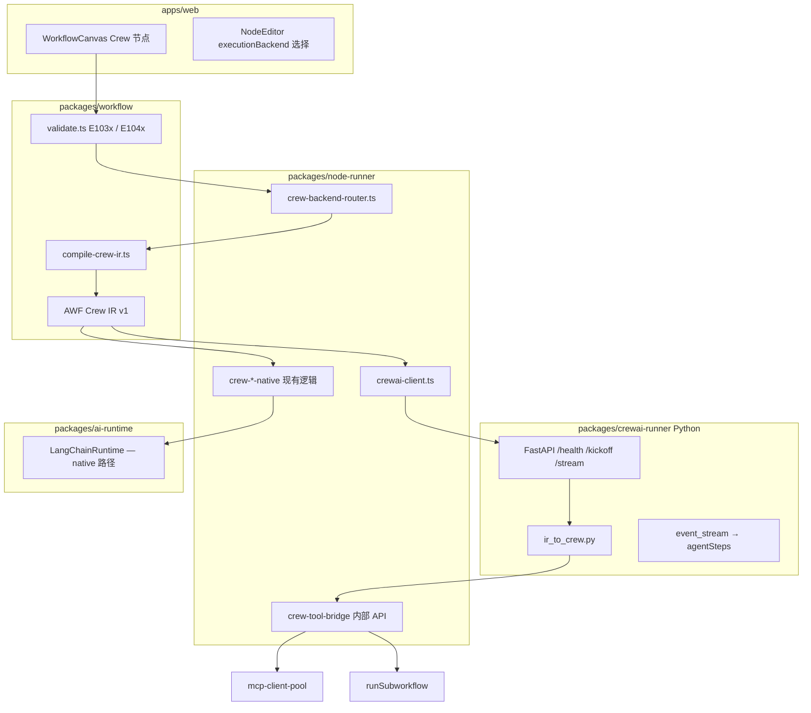

# P4-D：CrewAI 生态集成设计


| 字段      | 内容                                                                                                                                                                                                                                                                                                                                    |
| ------- | ------------------------------------------------------------------------------------------------------------------------------------------------------------------------------------------------------------------------------------------------------------------------------------------------------------------------------------- |
| **状态**  | **Approved** — 实施计划见 [plans/2026-05-29-crewai-integration.md](../plans/2026-05-29-crewai-integration.md) |
| **日期**  | 2026-05-29                                                                                                                                                                                                                                                                                                                            |
| **里程碑** | P4-D（v1.3 AI 差异化轨 — CrewAI 可选后端）                                                                                                                                                                                                                                                                                                      |
| **前置**  | P4-B（aiAgent）、P4-C（Crew 编排 native 后端）、[adr-langchain.md](../../adr-langchain.md)、[adr-module-boundaries.md](../../adr-module-boundaries.md)                                                                                                                                                                                           |
| **关联**  | [2026-05-23-crew-sequential-design.md](./2026-05-23-crew-sequential-design.md)、[2026-05-23-crew-hierarchical-design.md](./2026-05-23-crew-hierarchical-design.md)、[2026-05-23-crew-supervisor-design.md](./2026-05-23-crew-supervisor-design.md)、[2026-05-23-p4-c-ai-milestone-roadmap.md](./2026-05-23-p4-c-ai-milestone-roadmap.md) |


---

## 1. 背景与动机

### 1.1 现状

rx-workflow 已实现 **Crew 范式 D/F** 的 native 后端：


| 节点类型               | 编排方式              | 执行引擎                               |
| ------------------ | ----------------- | ---------------------------------- |
| `crewSequential`   | 画布顺序 Handoff      | `runAiAgentNode` → LangGraph ReAct |
| `crewHierarchical` | 经理 JSON 委派 / 并行委派 | 同上                                 |
| `crewSupervisor`   | 监督者动态选人           | 同上                                 |


每个成员为画布 `aiAgent`，通过卫星子图挂载 Model / Memory / Tool / Knowledge。Crew 层仅注入 `role` / `goal` / `backstory` 与成员间上下文传递。

### 1.2 动机

[CrewAI](https://github.com/crewAIInc/crewAI) 提供持续演进的 Agent 团队能力：

- **Crews**：Sequential / Hierarchical Process、Task 一等公民（`expected_output`、`context`、`human_input`）
- **Flows**：`@start` / `@listen` / `@router` 事件驱动编排、条件分支、状态管理
- **内置 Tool 生态**：搜索、文件、Scrape 等预集成工具
- **Knowledge / Memory**：Agent 级知识源与多种 Memory 策略
- **路线图能力**：Consensual Process、训练与评测等

自研 native Crew 可维护「画布能跑」，但 **长期跟进 CrewAI 生态的维护成本由我方承担**。引入 CrewAI 作为 **可选执行后端**，可在保留画布 UX 与 Node.js 主栈的前提下，获得框架侧能力更新红利。

### 1.3 目标

1. **画布与校验不变**：现有 `crewSequential` / `crewHierarchical` / `crewSupervisor` 节点与 `crew_member` / `crew_manager` 连线保持兼容。
2. **执行后端可切换**：Crew 节点参数 `executionBackend: 'native' | 'crewai'`，默认 `native`。
3. **统一可观测**：无论后端，输出 `NodeRunResult` + `metadata.agentSteps` 格式一致。
4. **Tool 不重复实现**：MCP / HTTP / Workflow Tool 经 **回调桥** 由 node-runner 执行，不在 Python 侧重写。
5. **Lite 可降级**：未配置 CrewAI Sidecar 时，`crewai` 后端返回明确错误，不影响 `native` 路径。

### 1.4 非目标（本里程碑）


| 能力                       | 说明                                |
| ------------------------ | --------------------------------- |
| 删除或替换 native Crew 后端     | native 为默认且长期保留                   |
| 全面切 Python 主栈            | Node.js 仍为控制面与执行引擎                |
| CrewAI Flows 完整可视化编辑器    | P4-D 仅支持 IR 级 Flow 子集或后续里程碑       |
| 在 Python 内直接调用 LangGraph | 双运行时并存，不合并                        |
| CrewAI 内置 Tool 全量镜像到画布   | 可选启用 `crewaiBuiltinTools` 白名单     |
| Lite 单进程内嵌 Python        | Lite 仅支持 `native` 或远程 Sidecar URL |


---

## 2. 方案对比

### 方案 A：全面替换为 CrewAI（不推荐）

将 `crew-sequential.ts` 等执行器改为 HTTP 调用 Python CrewAI，删除 native 编排逻辑。


| 优点            | 缺点                             |
| ------------- | ------------------------------ |
| 代码路径单一        | 破坏现有模板、集成测试、Lite 零依赖部署         |
| 直接吃 CrewAI 更新 | 画布卫星子图 → CrewAI 映射复杂，每次大版本全量回归 |
|               | 与 ADR（Node.js 统一栈）冲突           |


**结论**：否决。

### 方案 B：双后端 Pluggable Architecture（推荐）

引入 **AWF Crew IR**（中间表示），native 与 CrewAI 共用 compile 层，执行时分流。

```
画布 Crew 节点 + aiAgent 成员
        │ compileCrewIr()
        ▼
   AWF Crew IR (v1)
        │
   ┌────┴────┐
   ▼         ▼
Native     CrewAI
Backend    Sidecar
```


| 优点               | 缺点                      |
| ---------------- | ----------------------- |
| 渐进迁移，默认行为不变      | 需维护 IR + Adapter 两层     |
| Lite 可无 Python   | Sidecar 部署与运维           |
| Tool/Memory 统一桥接 | CrewAI 版本升级需 Adapter 回归 |
| 可按工作流/节点选后端      |                         |


**结论**：采纳。

### 方案 C：CrewAI 仅作外部 Workflow Tool（最小改动）

不新增后端；用户将 CrewAI 脚本部署为 HTTP 服务，经 `toolWorkflow` 或 `toolHttp` 调用。


| 优点    | 缺点                      |
| ----- | ----------------------- |
| 零架构变更 | 无 Crew 画布集成、无可观测统一步骤    |
|       | 无法复用 `crew_member` 卫星子图 |
|       | 用户自行维护 Crew 定义，与画布脱节    |


**结论**：可作为 P4-D 之前的临时方案，不作为正式集成。

---

## 3. 推荐架构

### 3.1 逻辑分层




### 3.2 模块边界（遵守 ADR-003）


| 包                        | 新增职责                                                  | 禁止                       |
| ------------------------ | ----------------------------------------------------- | ------------------------ |
| `packages/workflow`      | `compileCrewIr()`、IR 类型、`E104x` 校验                    | 不 import CrewAI / Python |
| `packages/node-runner`   | `crew-backend-router`、`crewai-client`、Tool 桥接 handler | 不直连 DB                   |
| `packages/crewai-runner` | Python Sidecar（新包）                                    | 不访问 AWF DB；Tool 仅经回调     |
| `apps/api`               | Sidecar 健康检查、内部 Tool 桥路由、配置 `CREWAI_RUNNER_URL`       | 不把 CrewAI import 进 api   |
| `apps/web`               | `executionBackend` 编辑器字段                              | —                        |


### 3.3 与现有 Crew 文档关系

- P4-C 已实现的 native 行为 **不变**，作为 `executionBackend: 'native'` 的规范。
- P4-D 在相同画布模型上增加 `crewai` 后端；IR 字段对齐 [crew-hierarchical-design](./2026-05-23-crew-hierarchical-design.md) 的 JSON 协议语义，但委派逻辑由 CrewAI Process 执行。

---

## 4. AWF Crew IR（中间表示）

### 4.1 设计原则

- **版本化**：`irVersion: 1`，后续 CrewAI API 变更时 bump Adapter，不破坏画布。
- **与实现无关**：native 与 CrewAI 共用同一份 IR。
- **可序列化**：JSON，经 HTTP POST 传给 Sidecar。

### 4.2 类型定义（TypeScript 草案）

```typescript
/** packages/workflow/src/crew-ir.ts */
export type CrewExecutionBackend = 'native' | 'crewai';

export type CrewProcessType =
  | 'sequential'
  | 'hierarchical'
  | 'supervisor'; // native 专用；crewai 映射为 hierarchical + manager_agent

export interface AwfCrewIrV1 {
  irVersion: 1;
  process: CrewProcessType;
  executionBackend: CrewExecutionBackend;

  /** 原始任务，来自 main 输入 Items */
  inputTask: string;

  /** Crew 根节点参数 */
  crewParams: {
    maxIterations?: number;
    maxDelegations?: number;
    maxSteps?: number;
    allowParallel?: boolean;
    allowParallelDelegation?: boolean;
    /** crewai 专用 */
    crewaiProcess?: 'sequential' | 'hierarchical';
    crewaiVersion?: string; // pin，如 "0.86.0"
    enableBuiltinTools?: string[]; // 白名单，如 ["SerperDevTool"]
  };

  manager?: AwfCrewMemberIr;
  members: AwfCrewMemberIr[];

  /** 执行上下文（传给 Tool 桥） */
  execution: {
    executionId: string;
    workflowId: string;
    crewNodeId: string;
    sessionId?: string;
    environment: 'test' | 'prod';
    /** 内部回调基址，Sidecar 调 Tool 时使用 */
    toolBridgeBaseUrl: string;
    toolBridgeToken: string; // 单次执行 JWT/HMAC
  };
}

export interface AwfCrewMemberIr {
  nodeId: string;
  name: string;
  role?: string;
  goal?: string;
  backstory?: string;

  model: {
    provider: 'ollama' | 'openai-compatible';
    model: string;
    baseUrl?: string;
    /** 凭证不落 IR 明文；Sidecar 用 credentialRef 向桥接层解析 */
    credentialRef?: string;
  };

  memory?: {
    sessionId: string;
    maxTurns: number;
  };

  knowledge?: {
    knowledgeBaseIds: string[];
  };

  tools: AwfCrewToolIr[];

  /** crewai Task 扩展 */
  task?: {
    description?: string;
    expectedOutput?: string;
    asyncExecution?: boolean;
  };
}

export type AwfCrewToolIr =
  | { type: 'mcp'; bridgeId: string; serverId: string; toolName: string; description: string }
  | { type: 'http'; bridgeId: string; method: string; url: string; description: string }
  | { type: 'workflow'; bridgeId: string; workflowId: string; description: string }
  | { type: 'crewai-builtin'; name: string }; // 可选白名单
```

### 4.3 `compileCrewIr()` 流程

1. `collectCrewWorkers` / `collectCrewManager`（已有）。
2. 对每个 `aiAgent` 成员调用 `collectSatellites`（已有）。
3. 解析 `executionBackend`（节点参数，默认 `native`）。
4. 生成 `toolBridgeToken`（api 层，单次执行）。
5. 输出 `AwfCrewIrV1`。

**文件位置**：`packages/workflow/src/compile-crew-ir.ts`（与 `crew-members.ts` 同包，供 node-runner 与测试使用）。

---

## 5. CrewAI Sidecar 服务

### 5.1 包结构

```
packages/crewai-runner/
├── pyproject.toml          # crewai, fastapi, uvicorn, httpx
├── Dockerfile
├── README.md
└── crewai_runner/
    ├── main.py             # FastAPI app
    ├── health.py
    ├── kickoff.py          # POST /v1/kickoff
    ├── stream.py           # SSE /v1/kickoff/stream
    ├── adapter/
    │   ├── ir_to_crew.py   # AwfCrewIrV1 → CrewAI Crew
    │   └── process_map.py  # sequential / hierarchical
    ├── tools/
    │   └── bridge_tool.py  # Dynamic tool → HTTP callback
    ├── credentials/
    │   └── resolver.py     # credentialRef → 桥接 API
    └── events/
        └── to_agent_steps.py
```

### 5.2 HTTP API

#### `GET /health`

```json
{ "status": "ok", "crewaiVersion": "0.86.0", "supportedIrVersions": [1] }
```

#### `POST /v1/kickoff`

Request: `AwfCrewIrV1` JSON body.

Response:

```json
{
  "status": "success",
  "answer": "...",
  "crewSteps": [
    { "nodeId": "...", "role": "Researcher", "name": "...", "answer": "...", "task": "..." }
  ],
  "agentSteps": [
    { "tool": "search", "status": "success", "durationMs": 120 }
  ],
  "raw": { "crewai_output": "..." }
}
```

#### `POST /v1/kickoff/stream`

SSE 事件类型（对齐 `AiStreamChunk`）：


| event        | payload                                  |
| ------------ | ---------------------------------------- |
| `tool_start` | `{ tool, input }`                        |
| `tool_end`   | `{ tool, output }`                       |
| `agent_step` | `{ crewMember, status, task?, output? }` |
| `token`      | `{ content }`                            |
| `done`       | `{ answer, crewSteps, agentSteps }`      |
| `error`      | `{ code, message }`                      |


### 5.3 IR → CrewAI 映射规则


| AWF IR                                    | CrewAI                                                                  |
| ----------------------------------------- | ----------------------------------------------------------------------- |
| `process: sequential`                     | `Process.sequential`                                                    |
| `process: hierarchical`                   | `Process.hierarchical` + `manager_llm` 或 `manager_agent`                |
| `process: supervisor` + `backend: crewai` | `Process.hierarchical`，`manager_agent` 由 IR.manager 或专用 supervisor 配置生成 |
| `member.role/goal/backstory`              | `Agent(role=..., goal=..., backstory=...)`                              |
| `member.task.description`                 | `Task(description=..., expected_output=...)`                            |
| `member.tools[*]` type mcp/http/workflow  | `bridge_tool.BridgeTool` → 回调 AWF                                       |
| `member.tools[*]` type crewai-builtin     | CrewAI 内置 Tool 类（白名单）                                                   |
| `member.model`                            | `LLM` 配置；Ollama 经 `baseUrl`                                             |
| `member.memory`                           | CrewAI memory 或回调 AWF `agent_session_messages`（P4-D2）                   |


**Supervisor 与 crewai**：`crewSupervisor` 在 `crewai` 后端上映射为 hierarchical process；native 保留现有监督循环。IR 中 `process: 'supervisor'` 时 Adapter 设置 `manager_agent` 并启用 CrewAI 委派验证。

### 5.4 版本策略

- Sidecar 镜像 **pin** `crewai==X.Y.Z`（`pyproject.toml`）。
- `AwfCrewIrV1.crewParams.crewaiVersion` 可选覆盖（Admin 配置）。
- CI：`packages/crewai-runner` 独立 job，`pytest` + 契约测试（固定 IR fixture）。
- 升级流程： bump 镜像 → Adapter 回归 → 更新 `supportedIrVersions` 文档。

---

## 6. Tool / Memory / Credential 桥接

### 6.1 Tool 桥接（P4-D1 必做）

Sidecar 不实现 MCP/HTTP/Workflow，改为 **Dynamic Tool** 回调 node-runner：

```
CrewAI Agent 调用 BridgeTool
  → POST {toolBridgeBaseUrl}/internal/crew-tool/{bridgeId}
     Authorization: Bearer {toolBridgeToken}
     Body: { args }
  → apps/api 路由 → node-runner 现有 invokeTool 逻辑
  → 返回 JSON 给 Sidecar
```

**安全**：

- `toolBridgeToken`：单次执行、短 TTL（如 15min）、绑定 `executionId`。
- 仅 localhost / 内网 URL；生产 Sidecar 与控制面同 VPC。
- 不传递凭证明文给 Sidecar；`credentialRef` 在回调时由 api 解析。

**新增 API**（`apps/api`）：

- `POST /internal/crew-tool/:bridgeId` — 执行 Tool（需内部 token）
- `POST /internal/crew-credential/:ref` — 解析 credentialRef（Sidecar 建 LLM 时用）

### 6.2 Memory 桥接（P4-D2）

**阶段 1（P4-D1）**：CrewAI 后端 **不启用**跨执行 Memory；`sessionId` 仅传入 IR 供日志。

**阶段 2（P4-D2）**：

- 方案 2a：Sidecar 启动前从 api `GET /internal/crew-memory/:sessionId` 拉历史，注入 CrewAI
- 方案 2b：自定义 CrewAI Memory 类，读写 `agent_session_messages` 表（经 api 桥）

推荐 **2b**，与 native `agentMemory` 共用存储。

### 6.3 Knowledge / RAG（P4-D2）

`member.knowledge.knowledgeBaseIds` 存在时：

- P4-D1：compile 时 **预检索**（复用 `deps.knowledge.queryMany` + `buildRagSystemPrompt`），结果写入 `member.task.description` 或 `backstory` 后缀。
- P4-D2：CrewAI Knowledge 源适配器（若框架 API 稳定）。

---

## 7. 节点与画布变更

### 7.1 Crew 节点新增参数

适用于 `crewSequential` / `crewHierarchical` / `crewSupervisor`：


| 参数                   | 类型                              | 默认              | 说明                 |
| -------------------- | ------------------------------- | --------------- | ------------------ |
| `executionBackend`   | `'native' | 'crewai'`           | `'native'`      | 执行后端               |
| `crewaiProcess`      | `'sequential' | 'hierarchical'` | 随节点类型推断         | 仅 `crewai` 后端      |
| `crewaiVersion`      | string                          | 空（用 Sidecar 默认） | 可选 pin             |
| `enableBuiltinTools` | string[]                        | `[]`            | CrewAI 内置 Tool 白名单 |


**aiAgent 成员**（可选扩展，P4-D2）：


| 参数                | 说明                           |
| ----------------- | ---------------------------- |
| `taskDescription` | 映射 CrewAI `Task.description` |
| `expectedOutput`  | 映射 `Task.expected_output`    |


### 7.2 校验（`packages/workflow/src/validate.ts`）


| 代码        | 条件                                                                                     |
| --------- | -------------------------------------------------------------------------------------- |
| **E1040** | `executionBackend: 'crewai'` 但系统未配置 `CREWAI_RUNNER_URL` 且非 Standard 远程 Sidecar         |
| **E1041** | `crewai` 后端 + `crewSupervisor` + `enableBuiltinTools` 含未白名单项                           |
| **W1013** | `crewai` 后端但成员无 `toolMcp`/`toolHttp`/`toolWorkflow` 且无 `enableBuiltinTools`（警告：无 Tool） |


### 7.3 编辑器（`apps/web`）

- Crew 节点编辑器增加 **执行后端** 下拉：`Native (LangGraph)` / `CrewAI`。
- 选 CrewAI 时显示：需 Sidecar 提示、内置 Tool 多选（白名单）、`expectedOutput` 字段（成员节点）。
- 执行时间线：**不区分**后端，仍读 `metadata.agentSteps`。

### 7.4 模板

- 保留现有 `agent-crew-*.json` 模板（默认 `native`）。
- 新增 `agent-crew-sequential-crewai.json` 示例（`executionBackend: 'crewai'`）。

---

## 8. node-runner 执行路径

### 8.1 路由（`crew-backend-router.ts`）

```typescript
export async function executeCrew(
  ctx: NodeExecutionContext,
  deps: PlusExecutorDeps,
  crewNodeType: 'crewSequential' | 'crewHierarchical' | 'crewSupervisor',
): Promise<NodeRunResult> {
  const ir = compileCrewIr(ctx.workflowDefinition!, ctx.nodeId, crewNodeType, ctx, deps);
  if (ir.executionBackend === 'crewai') {
    return runCrewViaCrewAi(ir, ctx, deps);
  }
  return runCrewNative(ctx, deps, crewNodeType); // 现有 executor 逻辑抽取
}
```

现有 `crew-sequential.ts` 等改为调用 `executeCrew` 或保留 thin wrapper。

### 8.2 `crewai-client.ts`

- `kickoff(ir)` → POST Sidecar
- `kickoffStream(ir, onChunk)` → SSE，转发到 `ctx.onAgentStream`
- 超时：`crewParams` 与节点 `timeoutMs`（默认 300_000）
- 失败：映射 Sidecar `error.code` → `E104x` / `E3012`

### 8.3 配置（`apps/api`）

环境变量：


| 变量                                 | 说明                        |
| ---------------------------------- | ------------------------- |
| `CREWAI_RUNNER_URL`                | 如 `http://127.0.0.1:8071` |
| `CREWAI_RUNNER_TIMEOUT_MS`         | 默认 300000                 |
| `CREWAI_ALLOWED_BUILTIN_TOOLS`     | 全局白名单，逗号分隔                |
| `CREWAI_RUNNER_HEALTH_INTERVAL_MS` | api 启动时健康检查               |


`bootstrap-plus.ts`：若 URL 配置则注册 `CrewAiRunnerClient` 到 `PlusExecutorDeps`。

---

## 9. 可观测性

### 9.1 agentSteps 统一

无论后端，`metadata.agentSteps` 结构保持与 [P4-B strict closeout](../plans/2026-05-23-workflow-agent-node-strict-closeout.md) 一致：

```typescript
interface AgentStepRecord {
  tool?: string;
  status: 'running' | 'success' | 'failed';
  durationMs?: number;
  crewMember?: string;
  task?: string;
  message?: string;
}
```

Sidecar `to_agent_steps.py` 负责将 CrewAI 事件转换为上述格式；`crewSteps` 写入 `outputItems[0].json.crewSteps`（与 native 一致）。

### 9.2 LangSmith（P4-C4 已有）

- native：继续 `LANGCHAIN_*` 环境变量。
- crewai：Sidecar 进程可独立配置 `LANGCHAIN_TRACING_V2`；执行时间线仍以 `metadata.agentSteps` 为准。

### 9.3 日志

- api：记录 `executionBackend`、`crewaiVersion`、Sidecar 延迟。
- Sidecar：结构化 JSON 日志，`executionId` 关联。

---

## 10. 部署

### 10.1 Lite


| 模式  | 行为                                                |
| --- | ------------------------------------------------- |
| 默认  | 仅 `native`；未配置 `CREWAI_RUNNER_URL`                |
| 可选  | 用户自建 Sidecar，`CREWAI_RUNNER_URL=http://host:8071` |


Lite **不**捆绑 Python 镜像。

### 10.2 Standard / Docker Compose

```yaml
# docker-compose.plus.yml 片段
services:
  crewai-runner:
    build: ./packages/crewai-runner
    ports:
      - "8071:8071"
    environment:
      - CREWAI_TELEMETRY=false
    healthcheck:
      test: ["CMD", "curl", "-f", "http://localhost:8071/health"]
  api:
    environment:
      - CREWAI_RUNNER_URL=http://crewai-runner:8071
```

### 10.3 资源

- Sidecar 建议：1 CPU、1–2GB RAM（视 Crew 规模）；与 api 同机或同 K8s namespace。
- 并发：Sidecar 无状态；多副本 + 负载均衡；`toolBridgeToken` 保证回调打到正确 api 实例（token 含 api 实例 id 或 sticky session）。

### 10.4 CrewAI 自动联署（已确认）

**原则**：CrewAI Sidecar **opt-in 自动拉起**；Lite 单进程仍不内嵌 Python；与现有 `rxwf deps` / `rxwf start` 编排对齐（见 [2026-05-28-standard-lite-deployment-design.md](./2026-05-28-standard-lite-deployment-design.md)）。

#### 10.4.1 产品决策

| 决策项 | 选择 |
|--------|------|
| 默认是否捆绑 CrewAI | **否**；`executionBackend: 'native'` 为零依赖默认 |
| Lite 自动联署 | **`rxwf start --lite --with-crewai`** 时 Docker 拉起 Sidecar；否则不启 |
| Standard 自动联署 | **`rxwf start --standard --with-crewai`** 或 `rxwf deps up --services crewai` |
| 外部 Sidecar | 提供 `CREWAI_RUNNER_URL` 或 `--crewai-url` 时 **跳过** Docker 拉起（混合补齐） |
| 镜像来源 | CI 发布 `ghcr.io/<org>/crewai-runner:<awf-version>`；开发可用 `build: ./packages/crewai-runner` |
| api 环境变量 | 联署成功后 **自动注入** `CREWAI_RUNNER_URL`，用户无需手写 |

#### 10.4.2 CLI 扩展

在现有 `rxwf start` / `rxwf deps` 上增加：

```
rxwf start [--lite | --standard] [--with-crewai] [--crewai-url <url>] [options]
rxwf deps up [--services redis,postgres,crewai] [--docker-compose-file <path>]
rxwf deps status|logs|down   # crewai 纳入同一 compose project
```

| 参数 / 环境变量 | 说明 |
|----------------|------|
| `--with-crewai` | 启动前确保 `crewai-runner` 容器 healthy，并注入 `CREWAI_RUNNER_URL` |
| `--crewai-url` | 外部 Sidecar 地址；设置后不与 Docker 补齐冲突 |
| `CREWAI_RUNNER_URL` | 运行时单一来源（CLI 注入 > 环境变量 > 自动探测） |
| `RXWF_CREWAI_PORT` | Docker 映射宿主机端口，默认 `8071`（绑定 `127.0.0.1`） |
| `RXWF_CREWAI_IMAGE` | 覆盖默认镜像 tag（升级 CrewAI pin 时用） |

**`rxwf start --with-crewai` 状态机**（与 Redis/PG 补齐并列）：

1. 若已设 `CREWAI_RUNNER_URL` 或 `--crewai-url` → 仅健康检查，失败则 `AWF-START-008` 退出。
2. 否则若 `--no-docker-auto` → 报错提示配置 URL 或去掉该 flag。
3. 否则 `docker compose up -d crewai-runner` → 等待 `/health`（默认 60s，`--startup-timeout` 共用）。
4. 解析 URL：`http://127.0.0.1:{RXWF_CREWAI_PORT}`（Lite/本机）或 compose 内 `http://crewai-runner:8071`（全栈 compose）。
5. 将 `CREWAI_RUNNER_URL` 写入子进程 env，启动 api。

**Lite + `--with-crewai`**：api 仍为单进程 SQLite；仅 **额外** 起 Sidecar 容器，不将 Python 嵌入 api 进程。

#### 10.4.3 Compose 文件布局

| 文件 | 用途 |
|------|------|
| `deploy/docker-compose.standard.yml` | 现有 postgres + redis；**不默认**含 crewai |
| `deploy/docker-compose.crewai.yml` | 仅 `crewai-runner` 服务（可被 merge） |
| `deploy/docker-compose.plus.yml` | 全栈：api + web + postgres + redis + crewai-runner（生产/演示） |

**`deploy/docker-compose.crewai.yml`**（独立 overlay，供 CLI merge）：

```yaml
services:
  crewai-runner:
    image: ${RXWF_CREWAI_IMAGE:-ghcr.io/rxwf/crewai-runner:1.3.0}
    ports:
      - "${RXWF_CREWAI_PORT:-127.0.0.1:8071:8071}"
    environment:
      CREWAI_TELEMETRY: "false"
      # Sidecar 回调控制面 Tool 桥（同机 Lite 默认）
      RXWF_TOOL_BRIDGE_HOST: host.docker.internal
    extra_hosts:
      - "host.docker.internal:host-gateway"
    healthcheck:
      test: ["CMD", "curl", "-f", "http://localhost:8071/health"]
      interval: 5s
      timeout: 3s
      retries: 12
      start_period: 30s
```

CLI 合并示例：

```bash
docker compose \
  -f deploy/docker-compose.standard.yml \
  -f deploy/docker-compose.crewai.yml \
  -p rxwf-standard up -d crewai-runner
```

**`deploy/docker-compose.plus.yml`**（全栈自动联署）：

```yaml
services:
  crewai-runner:
    image: ${RXWF_CREWAI_IMAGE:-ghcr.io/rxwf/crewai-runner:1.3.0}
    healthcheck:
      test: ["CMD", "curl", "-f", "http://localhost:8071/health"]
      interval: 5s
      timeout: 3s
      retries: 12
      start_period: 30s
    environment:
      CREWAI_TELEMETRY: "false"
      RXWF_TOOL_BRIDGE_HOST: api

  api:
    depends_on:
      crewai-runner:
        condition: service_healthy
    environment:
      CREWAI_RUNNER_URL: http://crewai-runner:8071
      FEATURE_PLUS: "true"
    # build / image 见发布流水线

  web:
    depends_on:
      - api
```

生产推荐：`docker compose -f deploy/docker-compose.plus.yml up -d` 一键启全栈含 CrewAI。

#### 10.4.4 api 启动集成（`bootstrap-plus.ts`）

```typescript
// 伪代码 — 启动时
const crewAiUrl =
  process.env.CREWAI_RUNNER_URL ??
  (opts.autoDetectedCrewAiUrl from rxwf start injection);

if (crewAiUrl) {
  const healthy = await probeCrewAiHealth(crewAiUrl, { timeoutMs: 5000 });
  if (!healthy) {
    log.warn('CREWAI_RUNNER_URL set but health check failed; crewai backend will error at runtime (E1042)');
  }
  deps.crewAiClient = createCrewAiRunnerClient({ baseUrl: crewAiUrl, ... });
}
```

- **探测周期**：可选 `CREWAI_RUNNER_HEALTH_INTERVAL_MS` 后台重试（默认关闭，仅启动时探测）。
- **校验联动**：工作流保存时若 `executionBackend: 'crewai'` 且运行时无 healthy Sidecar → **E1040**（设计已有）；联署后 E1040 仅在用户停掉 Sidecar 时出现。

#### 10.4.5 Tool 桥与联署网络

Sidecar 在容器内、api 在宿主机（Lite `--with-crewai`）时：

- IR 中 `toolBridgeBaseUrl` 使用 `http://host.docker.internal:{apiPort}`（Linux 通过 `extra_hosts: host-gateway`）。
- 全栈 compose 内：`http://api:8787`。

`toolBridgeToken` 仍单次执行、短 TTL；不随联署方式变化。

#### 10.4.6 镜像版本与升级

| 层级 | 策略 |
|------|------|
| 镜像 tag | 与 AWF 发行版对齐，如 `crewai-runner:1.3.0` |
| 内含 crewai pin | `pyproject.toml` 锁定 `crewai==X.Y.Z`，写入 `/health` 响应 |
| 用户升级 | 改 `RXWF_CREWAI_IMAGE` 或 compose tag → `rxwf deps up --services crewai` 拉新镜像 |
| 回滚 | 保留上一 tag；IR `crewaiVersion` 可选与 Sidecar 协商 |

CI：`packages/crewai-runner` 构建并 push 镜像；与 api/web 镜像同流水线或独立 job。

#### 10.4.7 非目标（联署）

- K8s Helm 一键安装（P4-D 后独立里程碑；compose 为 v1.3 交付物）。
- Lite 无 Docker 环境下自动安装 Python/CrewAI。
- 默认 `rxwf start` 不带 `--with-crewai`（避免强依赖 Docker 与镜像拉取）。

---

## 11. 错误码


| 代码    | 含义                       | 处理                                 |
| ----- | ------------------------ | ---------------------------------- |
| E1040 | CrewAI 后端未配置 Sidecar     | 配置 `CREWAI_RUNNER_URL` 或改 `native` |
| E1041 | 不允许的内置 Tool              | 检查白名单                              |
| E1042 | Sidecar 健康检查失败           | 检查 crewai-runner 服务                |
| E1043 | Sidecar kickoff 超时       | 增大 timeout 或简化 Crew                |
| E1044 | IR 版本不支持                 | 升级 Sidecar                         |
| E1045 | Tool 桥接 token 无效         | 执行异常，重试                            |
| E1046 | crewai 后端不支持该 process 组合 | 改用 native 或调整参数                    |

**CLI 启动错误**（`packages/cli`）：

| 代码 | 含义 |
|------|------|
| AWF-START-008 | `--with-crewai` 已指定但 Sidecar 健康检查超时或 Docker 拉起失败 |

i18n：`packages/i18n-catalog` 同步中英文。

---

## 12. 分期实施

### P4-D1 — MVP（4–6 周）

**目标**：`crewSequential` + `crewHierarchical` 在 `crewai` 后端跑通，Tool 桥接 MCP。


| 任务   | 交付                                                                                       |
| ---- | ---------------------------------------------------------------------------------------- |
| D1.1 | `AwfCrewIrV1` 类型 + `compileCrewIr()` + 单元测试                                              |
| D1.2 | `packages/crewai-runner` Sidecar：`/health`、`/v1/kickoff`、sequential/hierarchical adapter |
| D1.3 | `bridge_tool.py` + api `POST /internal/crew-tool/:bridgeId`                              |
| D1.4 | `crew-backend-router` + `crewai-client`；`crewSequential` / `crewHierarchical` 接入         |
| D1.5 | 编辑器 `executionBackend` 字段；E1040 校验                                                       |
| D1.6 | 集成测试：mock Sidecar + 可选 `RXWF_TEST_CREWAI=1` 真实 Sidecar 冒烟                                 |
| D1.7 | `docs/RELEASE-v1.3-crewai.md`、Docker Compose 片段                                          |
| D1.8 | **自动联署**：`deploy/docker-compose.crewai.yml`、`docker-compose.plus.yml`；CLI `--with-crewai`、`rxwf deps up --services crewai`；`bootstrap-plus` 健康探测与 `CREWAI_RUNNER_URL` 注入 |


**验收 AC-D1**：

- AC-D1.1：`executionBackend: 'crewai'` 的 sequential 工作流在 Sidecar 下完成并返回 `answer` + `crewSteps`
- AC-D1.2：成员 `toolMcp` 经桥接被调用，agentSteps 含 tool 记录
- AC-D1.3：`native` 默认路径回归全绿
- AC-D1.4：未配置 Sidecar 时保存校验 E1040
- AC-D1.5：`metadata.agentSteps` 时间线可展示（crewai 后端）
- AC-D1.6：`rxwf start --lite --with-crewai` 自动拉起 Sidecar 并完成一次 crewai sequential 执行

### P4-D2 — 能力对齐（3–4 周）


| 任务   | 交付                                           |
| ---- | -------------------------------------------- |
| D2.1 | Memory 桥接（`agent_session_messages`）          |
| D2.2 | Knowledge 预检索注入；成员 `expectedOutput`          |
| D2.3 | `crewSupervisor` + `crewai` 映射               |
| D2.4 | SSE `/v1/kickoff/stream` + 执行中 agentSteps 增量 |
| D2.5 | `enableBuiltinTools` 白名单（SerperDev 等）        |


### P4-D3 — Flows 与进阶（后续里程碑）


| 任务   | 交付                                  |
| ---- | ----------------------------------- |
| D3.1 | IR 扩展 `flowGraph` 子集 → CrewAI Flows |
| D3.2 | Consensual process（随 CrewAI GA）     |
| D3.3 | CrewAI 评测结果回写执行详情                   |


---

## 13. 测试策略


| 层级     | 内容                                                        |
| ------ | --------------------------------------------------------- |
| 单元     | `compileCrewIr` fixture；`to_agent_steps` Python 单测        |
| 契约     | IR JSON Schema 快照；Sidecar mock 响应契约                       |
| 集成     | `apps/api` `p4d-crewai.integration.test.ts`（mock Sidecar） |
| 可选 E2E | `RXWF_TEST_CREWAI=1` + docker compose up crewai-runner     |
| 回归     | 全部 `p4c-crew` + `p4b-agent` 在 `native` 下必绿                |


---

## 14. 风险与缓解


| 风险                | 缓解                                 |
| ----------------- | ---------------------------------- |
| CrewAI 破坏性 API 变更 | IR 版本化 + pin + Adapter 隔离          |
| Python 运维负担       | 可选组件；Standard Compose 一键启；Lite 不依赖 |
| Tool 桥延迟          | 同 VPC；批量 Tool 考虑连接池                |
| 双后端行为不一致          | 文档标明差异表；集成测试覆盖共有场景                 |
| 凭证泄露到 Sidecar     | credentialRef + 回调解析，IR 无密钥        |
| Sidecar 单点        | 多副本 + health check；失败 E1042 明确     |


---

## 15. 成功标准（P4-D1）


| #       | 标准                           |
| ------- | ---------------------------- |
| AC-D1.1 | crewai sequential 端到端成功      |
| AC-D1.2 | MCP Tool 桥接成功                |
| AC-D1.3 | native 回归无破坏                 |
| AC-D1.4 | 未配置 Sidecar 校验 E1040         |
| AC-D1.5 | `metadata.agentSteps` 时间线可展示 |
| AC-D1.6 | `rxwf start --with-crewai` 自动联署 Sidecar 并成功执行 |


---

## 16. 开放项

- `crewSupervisor` 在 CrewAI 上是否映射为 hierarchical 或等待 CrewAI Supervisor 原生模式
- Flows 可视化是否纳入 Agent 画布（P4-D3+）
- Sidecar 是否纳入 `runner-agent` 远程执行（跨机 Python）
- CrewAI Enterprise 许可与私有化部署约束（若用户启用）

---

## 17. 变更记录


| 版本  | 日期         | 说明                         |
| --- | ---------- | -------------------------- |
| 0.1 | 2026-05-29 | 初稿：双后端架构、IR、Sidecar API、分期 |
| 0.2 | 2026-05-29 | §10.4 CrewAI 自动联署；CLI `--with-crewai`；compose overlay；D1.8 / AC-D1.6 |
| 0.3 | 2026-05-29 | Approved；实施计划 [plans/2026-05-29-crewai-integration.md](../plans/2026-05-29-crewai-integration.md) |
| 0.4 | 2026-05-30 | P4-D1–D3 实施完成；Consensual 占位 E1046；可选 E2E `RXWF_TEST_CREWAI=1` |
| 0.5 | 2026-05-30 | P4-D+：Flow router、Knowledge native、openai-compatible、Runner 远程 Sidecar |


