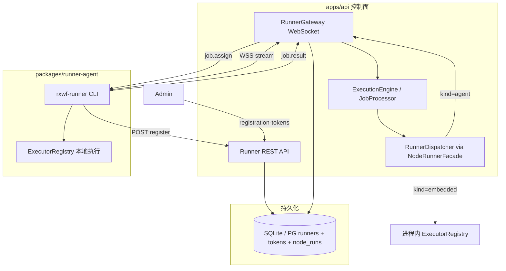
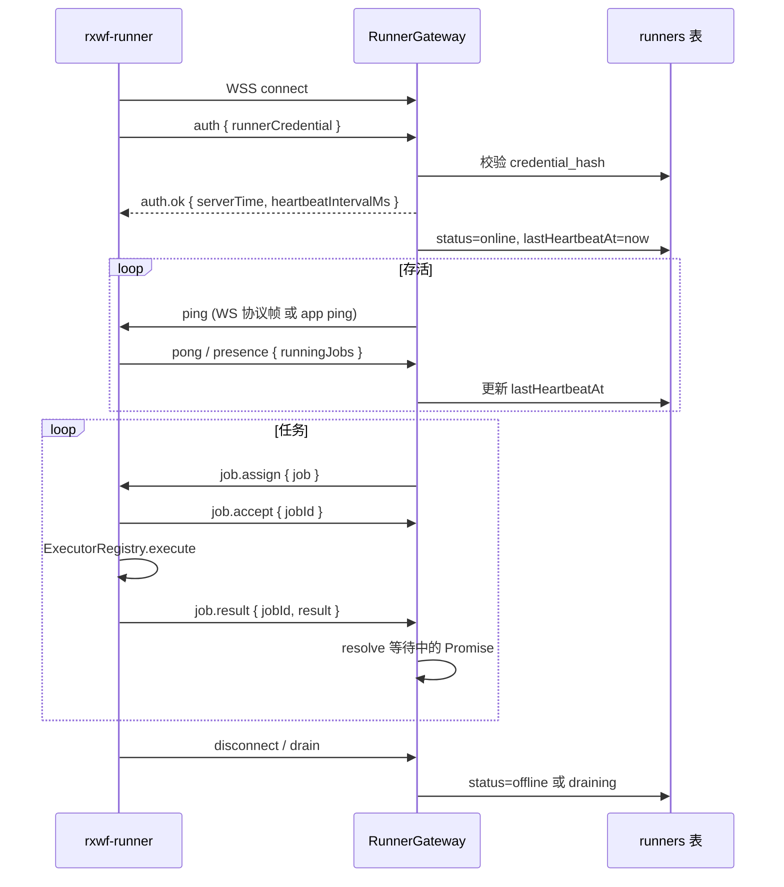
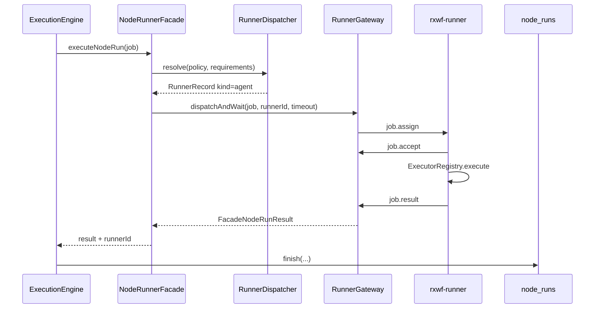

# Runner v1.1 实施方案（WebSocket 通道）

| 字段 | 内容 |
|------|------|
| **状态** | Draft — 待评审 |
| **日期** | 2026-05-29 |
| **里程碑** | v1.1（远程 Runner Agent） |
| **前置** | v1.0-core Embedded Runner、[adr-node-runner.md](../../adr-node-runner.md)、[2026-05-20-v1-implementation-design.md](./2026-05-20-v1-implementation-design.md) §3.5 |
| **协议选型** | **WebSocket**（替代 ADR 中的 HTTP 长轮询 + 独立心跳轮询） |

---

## 1. 执行摘要

### 1.1 WebSocket 是否替代 Heartbeat 轮询？

**是，在 v1.1 中不再要求 Agent 周期性调用 `POST /runners/{id}/heartbeat`。**

| 能力 | ADR 原设计（HTTP） | v1.1 WebSocket 方案 |
|------|-------------------|---------------------|
| 存活检测 | 每 30s HTTP heartbeat | WebSocket 连接存在 + 协议级 ping/pong + 应用层 `presence` 消息 |
| 任务下发 | 长轮询 `GET /jobs` | 服务端经 WS **主动推送** `job.assign` |
| 结果上报 | HTTP `POST /jobs/{id}/result` | Agent 经 WS 发送 `job.result` / `job.failed` |
| `lastHeartbeatAt` | heartbeat 请求更新 | 每次 pong / `presence` / `status.report` 更新 |
| 离线判定 | 90s 无 heartbeat | WS 断开即标记 offline（+ 后台 sweeper 兜底） |

**保留但降级 `POST /heartbeat`：** 标记为 `deprecated`，仅用于 **WebSocket 被企业防火墙阻断** 时的降级路径（v1.1 可实现为 no-op 或最小兼容桩，完整 HTTP 降级推迟至 v1.1.1）。主路径仅为 WebSocket。

### 1.2 交付范围（v1.1 完整）

1. **控制面 REST**：注册 Token、Agent 注册、吊销、drain、凭证轮换、`GET /runners` 扩展字段。
2. **WebSocket 网关**：`WSS /api/runners/{runnerId}/stream` — 认证、存活、任务推送、结果回收。
3. **`packages/runner-agent`**：`rxwf-runner` CLI — 注册、建连、执行循环、优雅退出。
4. **`RunnerDispatcher` 远程分支**：`auto` / `pinned` / `label` 完整调度算法。
5. **`NodeRunnerFacade` 远程执行路径**：解析到 `kind=agent` 时经 Gateway 派发，等待结果后持久化 `node_runs`。
6. **Demo Runner**：可独立运行的示例 Agent（见 §12）。
7. **MCP Tools**：`runner_list`、`runner_create_registration_token`（v1.1）。
8. **前端**：Runner 列表增强（在线状态、最后活跃、注册 Agent 引导）；工作流 `runnerPolicy` 校验与执行警告对齐 v1.1。

**不在 v1.1 范围（v1.2+）：** Runner 组、地理区域标签、多 API 实例 Redis 路由（Standard 多副本 WS 粘性会话仅文档预留）。

---

## 2. 背景与现状差距

### 2.1 已实现（v1.0）

- `runners` 表 + `RunnerRepositoryPort`（`ensureEmbedded` / `listOnline` / `listAll` / `findById` / `incrementRunningJobs`）。
- `RunnerDispatcher` **embedded-only**（`listOnline({ kind: 'embedded' })`）。
- `NodeRunnerFacade.executeNodeRun()` 始终进程内 `ExecutorRegistry.execute()`。
- `GET /api/runners` 只读列表；前端 `RunnerListPage`。
- 工作流 Schema：`settings.runnerPolicy`、`node.runner`；`validate.ts` 对 `preferRemote` + `fallback: embedded` 报错 E1005。

### 2.2 未实现（v1.1 需补齐）

| 缺口 | 说明 |
|------|------|
| `runner_registration_tokens` 表 | ADR 已定义，Lite schema 未建 |
| 注册 / 吊销 / drain / rotate REST | OpenAPI 有规格，无路由 |
| WebSocket 基础设施 | 项目内零 WebSocket 代码 |
| `packages/runner-agent` | 包不存在 |
| 远程任务队列与等待 | Execution 与 Agent 之间无桥接 |
| `RunnerDispatcher` agent 分支 | 无平台/标签/负载均衡 |
| `incrementRunningJobs` | Port 已定义，生产路径未调用 |
| `executeCommand` 等本地节点 | 需远程 Runner 才能真正跨平台执行 |

---

## 3. 架构总览



### 3.1 模块边界（延续 ADR-006）

| 模块 | 新增/变更 | 禁止 |
|------|-----------|------|
| `packages/runner-protocol` | WS 消息类型、错误码、序列化（**新包**，供 api + agent 共享） | 依赖 providers / DB |
| `packages/runner-agent` | CLI、WS 客户端、本地执行循环 | 直连 DB；import providers 实现层 |
| `packages/node-runner` | `RunnerDispatcher` 扩展、`RemoteNodeRunExecutor` 接口 | 直连 DB |
| `packages/providers/contracts` | `RunnerRepositoryPort` 扩展、`RunnerGatewayPort` | — |
| `packages/providers/lite` | tokens 表、agent CRUD、凭证哈希 | — |
| `apps/api` | REST 路由、`RunnerGateway`、WS 插件、装配 | 业务逻辑泄漏到 routes |

---

## 4. WebSocket 协议规范

### 4.1 端点

```
WSS /api/runners/{runnerId}/stream
```

- **认证**：连接后首条消息必须为 `auth`（见下）；或 Query `?credential=<runnerCredential>`（日志中禁止打印）。
- **子协议**（可选）：`rxwf-runner.v1`。
- **TLS**：生产强制 WSS；Lite 开发允许 WS。

### 4.2 消息信封

所有帧为 **JSON 文本帧**（`application/json` UTF-8）：

```typescript
interface RunnerWsEnvelope {
  type: string;           // 消息类型
  id?: string;            // 关联 id（jobId、requestId）
  ts?: string;            // ISO8601
  payload?: unknown;
}
```

### 4.3 连接生命周期



### 4.4 消息类型目录

#### Agent → Server

| type | 时机 | payload 要点 |
|------|------|-------------|
| `auth` | 连接后 5s 内首条 | `{ runnerCredential: string }` |
| `presence` | 每 `heartbeatIntervalMs`（默认 30s） | `{ runningJobs, agentVersion? }` |
| `job.accept` | 收到 assign 且有空闲槽位 | `{ jobId }` |
| `job.progress` | 可选，长任务 | `{ jobId, percent?, message? }` |
| `job.result` | 执行成功 | `{ jobId, status, outputItems, metadata?, durationMs }` |
| `job.failed` | 执行失败 | `{ jobId, errorCode, errorMessage, durationMs }` |
| `pong` | 响应 app-level ping | `{ echoId }` |

#### Server → Agent

| type | 时机 | payload 要点 |
|------|------|-------------|
| `auth.ok` | 认证成功 | `{ serverTime, heartbeatIntervalMs, maxConcurrent }` |
| `auth.fail` | 认证失败 | `{ errorCode, message }` → 关闭连接 |
| `ping` | 应用层心跳（补充 WS 协议 ping） | `{ echoId }` |
| `job.assign` | 有 pending 远程任务 | 完整 `RemoteNodeRunJob`（§5.2） |
| `job.cancel` | 执行取消 / 超时 | `{ jobId, reason }` |
| `config.update` | drain 等 | `{ status: 'draining' }` |

### 4.5 存活与离线策略

| 事件 | 动作 |
|------|------|
| `auth.ok` | `status → online`（若原为 offline）；更新 `lastHeartbeatAt` |
| 收到 `presence` / `pong` | 更新 `lastHeartbeatAt`、`runningJobs` |
| WS `close` / `error` | 立即 `status → offline`；正在执行的任务按 §7.4 处理 |
| 后台 Sweeper（每 60s） | `lastHeartbeatAt < now - 90s` 且 `kind=agent` → `offline`（防半开连接） |
| `draining` | 仍维持 WS；不再推送新 `job.assign`；`runningJobs → 0` 后可断开 |

**结论：** `lastHeartbeatAt` 字段保留，语义从「HTTP heartbeat 时间」变为「最后 WebSocket 活跃时间」。

### 4.6 并发与背压

- Agent 本地维护 `runningJobs` 计数；仅当 `runningJobs < maxConcurrent` 时回复 `job.accept`。
- Server 侧 `RunnerGateway` 维护每 Runner 的 **待派发队列**（内存）；派发前检查 `runningJobs < maxConcurrent`。
- 若所有在线 Agent 满载：任务进入 **runner 级等待**（默认 `runnerQueueTimeoutMs = 300_000`），超时返回 `E2011`（Runner 队列超时，新错误码）。

---

## 5. 远程执行数据流

### 5.1 调度时序（Execution → Agent → DB）



### 5.2 `RemoteNodeRunJob` 载荷

与现有 `NodeRunJob` 对齐，经 WS 传递时需 **序列化安全**：

```typescript
interface RemoteNodeRunJob {
  jobId: string;              // 全局唯一，= nodeRunId 或独立 UUID
  executionId: string;
  nodeRunId: string;
  nodeType: string;
  nodeConfig: Record<string, unknown>;
  inputItems: WorkflowItem[];
  inputBranches?: WorkflowItem[][];
  mode: 'production' | 'manual' | 'partial';
  workflowSettings: Record<string, unknown>;
  env?: Record<string, string>;    // 已解析的执行级 env（不含 secret 明文策略见 §9）
  vars?: Record<string, string>;
  timeoutMs: number;               // 节点级 + 全局上限
}
```

**不通过 WS 传递：** `workflowDefinition` 全文、`onAgentStream` 回调、Credential 明文。AI 流式节点 v1.1 远程执行返回 **非流式** 或拒绝远程（`preferRemote` 节点若需流式则 fallback fail）。

### 5.3 `RunnerGatewayPort`（contracts）

```typescript
export interface RunnerGatewayPort {
  /** Agent WS 连接注册（由 api WS handler 调用） */
  registerConnection(runnerId: string, conn: RunnerConnectionHandle): void;
  unregisterConnection(runnerId: string): void;

  /** 派发并等待结果（由 NodeRunnerFacade 远程路径调用） */
  dispatchAndWait(
    runnerId: string,
    job: RemoteNodeRunJob,
    options?: { timeoutMs?: number },
  ): Promise<RemoteNodeRunResult>;

  /** 查询 Runner 是否在线（内存 + DB 状态） */
  isConnected(runnerId: string): boolean;
}
```

Lite 实现：`InMemoryRunnerGateway`（单进程 Map）。Standard 多副本：v1.1 文档约定 **单 API 实例** 或 **Sticky Session**；Redis Pub/Sub 桥接列入 v1.2。

### 5.4 `NodeRunnerFacade` 变更

```typescript
async executeNodeRun(job, overrides?) {
  const resolved = overrides?.resolvedRunner ?? await dispatcher.resolve(...);
  if (resolved.kind === 'embedded') {
    // 现有进程内路径不变
  }
  // kind === 'agent'
  await runnerRepo.incrementRunningJobs(resolved.id, +1);
  try {
    const result = await runnerGateway.dispatchAndWait(resolved.id, toRemoteJob(job));
    return { ...result, runnerId: resolved.id, runnerPlatform: ... };
  } finally {
    await runnerRepo.incrementRunningJobs(resolved.id, -1);
  }
}
```

---

## 6. RunnerDispatcher 完整算法

### 6.1 输入

- `workflowPolicy`：`mode` / `fallback` / `runnerId` / `platform` / `labels`
- `nodeRunner`：节点级覆盖
- `requirements`：来自节点 manifest `runnerRequirements`（platforms / capabilities / preferRemote）

### 6.2 `auto` 模式步骤

1. 合并策略：节点 `inherit` → 工作流 `runnerPolicy`。
2. 候选集：`listOnline()` 过滤 `kind=agent`（**不再**仅限 embedded）。
3. 过滤：`platform.os` 匹配（`any` 通配）、`labels` 超集、`capabilities` 超集。
4. 排除：`status=draining` 除非 `pinned` 且显式指定。
5. 排序：`runningJobs/maxConcurrent` 升序 → `lastHeartbeatAt` 降序。
6. 取第一名；若无候选：
   - `fallback=embedded` 且节点允许 embedded → embedded；
   - `preferRemote=true` → 抛 `E2010`；
   - 否则 `E2010`。

### 6.3 `pinned` / `label`

- `pinned`：`findById(runnerId)`，离线且 `fallback` 不允许 → `E2010`。
- `label`：候选必须包含 `labels` 全集。

### 6.4 在线判定

- `kind=embedded`：进程存活即 online（现有逻辑）。
- `kind=agent`：`status=online` **且** `RunnerGateway.isConnected(runnerId) === true`（防止 DB 状态滞后）。

---

## 7. REST API 实现规格

### 7.1 端点清单

| 方法 | 路径 | 认证 | 说明 |
|------|------|------|------|
| GET | `/api/runners` | Session/API Key | 扩展返回 `lastHeartbeatAt`、`labels`、`agentVersion` |
| POST | `/api/runners/registration-tokens` | Admin | 创建一次性 Token |
| POST | `/api/runners/register` | 无（Token） | Agent 注册 |
| DELETE | `/api/runners/{id}` | Admin | 吊销；强制断开 WS |
| POST | `/api/runners/{id}/drain` | Admin | `status=draining`；通知 WS `config.update` |
| POST | `/api/runners/{id}/rotate-credential` | Admin | 新 credential；旧连接 60s 内断开 |
| POST | `/api/runners/{id}/heartbeat` | Runner Credential | **Deprecated**；更新 `lastHeartbeatAt`（兼容桩） |

### 7.2 注册 Token 流程

1. Admin `POST /registration-tokens` → `{ registrationToken, expiresAt }`（明文 Token 仅此次返回）。
2. DB 存 `token_hash = sha256(token)`，`expires_at`，`created_by`。
3. Agent `POST /register` with `registrationToken` + `name` + `platform` + ...
4. 校验：未过期、未使用、hash 匹配。
5. 创建 `runners` 行：`kind=agent`，`credential_hash=hash(runnerCredential)`，`status=offline`（待 WS 连接后 online）。
6. 标记 Token `used_at`；返回 `{ runnerId, runnerCredential }`。

### 7.3 凭证安全

- `runnerCredential`：32+ 字节随机，base64url；仅注册/rotate 响应一次。
- 存储：`credential_hash = scrypt(credential, salt)` 或 `sha256`（与现有 api_key 模式对齐）。
- WS `auth`、deprecated heartbeat：校验 hash。
- 轮换：新 hash 写入；Gateway 通知旧连接 `auth.fail` reason=`rotated`。

### 7.4 断开与任务恢复

| 场景 | 行为 |
|------|------|
| Agent 执行中崩溃 | `node_run` 保持 `running`；Sweeper 90s 后标 Runner offline；等待 Promise reject `E2012`（Runner 失联） |
| 执行引擎超时 | `job.cancel` → 若 Agent 无响应，`node_run` → `failed` E2003 |
| Runner drain 中 | 不分配新任务；已在跑任务允许完成 |
| 同一 runnerId 重复连接 | 新连接成功后 **踢掉** 旧连接（单活） |

---

## 8. 数据库变更

### 8.1 新表 `runner_registration_tokens`

```sql
CREATE TABLE runner_registration_tokens (
  id TEXT PRIMARY KEY,
  token_hash TEXT NOT NULL UNIQUE,
  expires_at INTEGER NOT NULL,
  created_by TEXT REFERENCES users(id),
  labels_default TEXT NOT NULL DEFAULT '[]',
  used_at INTEGER,
  created_at INTEGER NOT NULL
);
```

### 8.2 `runners` 表

现有列已满足 v1.1；迁移无需改列。确保 `listAll` / `toRunnerRecord` 暴露 `lastHeartbeatAt`、`labels`、`agentVersion`。

### 8.3 Drizzle 迁移

- Lite：`packages/providers/lite` 新增 migration + repository 方法。
- Standard：对齐 PG schema（v1.1 可 Lite-first，Standard 跟进同一 migration 编号）。

---

## 9. `packages/runner-agent`（rxwf-runner）

### 9.1 包结构

```
packages/runner-agent/
├── package.json          # bin: rxwf-runner
├── src/
│   ├── cli.ts            # 命令行入口
│   ├── config.ts         # RXWF_SERVER_URL, RXWF_RUNNER_CREDENTIAL, RXWF_RUNNER_ID
│   ├── register.ts       # 首次注册（--token 模式）
│   ├── ws-client.ts      # WebSocket 连接、重连、消息路由
│   ├── job-loop.ts       # accept → execute → result
│   ├── platform.ts       # detectPlatform()
│   └── main.ts           # start 子命令
└── README.md
```

### 9.2 CLI 命令

```bash
# 首次注册（交互或 env）
rxwf-runner register --server https://rxwf.example.com --token <registrationToken> --name dev-macbook

# 常驻运行（使用本地保存的 credential）
rxwf-runner start --config /etc/rxwf-runner.json

# 打印平台信息（调试）
rxwf-runner info
```

### 9.3 本地执行

- 依赖 `@rxwf/node-runner` 的 `ExecutorRegistry` + `registerBuiltinExecutors`（+ plus 可选）。
- **不启动 HTTP 服务**；纯出站 WS 客户端。
- 能力声明 `capabilities` 应与实际注册的 executor 一致。

### 9.4 重连策略

- 断线：指数退避 1s → 2s → 4s → … → 60s cap。
- 重连携带同一 `runnerCredential`；无需重新 `register`。
- `auth.fail` + `rotated`：进程退出并打印「需重新 register 或更新配置」。

### 9.5 三平台交付

| OS | 构建 | 服务化 |
|----|------|--------|
| Linux | `pkg` / `node --experimental-sea` 单二进制 | systemd unit 示例 |
| macOS | 同上 | launchd plist 示例 |
| Windows | 同上 | Windows Service 示例（文档） |

v1.1 最低交付：**Node.js 直接运行**（`node dist/main.js start`）；单二进制可作为 v1.1 尾声或 v1.1.1。

---

## 10. `packages/runner-protocol`

共享类型，避免 api 与 agent 循环依赖：

```
packages/runner-protocol/
├── src/
│   ├── messages.ts       # RunnerWsEnvelope, 所有 type 的 payload
│   ├── remote-job.ts     # RemoteNodeRunJob, RemoteNodeRunResult
│   ├── errors.ts         # E2010-E2012 等
│   └── index.ts
```

依赖：仅 `@rxwf/shared`（WorkflowItem 等）。

---

## 11. API 层实现要点

### 11.1 依赖

- `@fastify/websocket`（Fastify 5 兼容）。
- 在 `bootstrap.ts` 注册 WS 路由（与 REST 同端口 8787）。

### 11.2 文件布局

```
apps/api/src/runners/
├── routes.ts              # 扩展 REST（自 routes/runners.ts 迁入或 re-export）
├── ws-handler.ts          # WebSocket 连接处理
├── runner-gateway.ts      # InMemoryRunnerGateway 实现
├── registration-service.ts
├── credential.ts          # hash / verify
└── sweeper.ts             # 离线检测定时任务
```

### 11.3 装配

`createAppContext` / `createExecutionRuntime` 注入：

- `RunnerRepositoryPort`（扩展后）
- `RunnerGatewayPort`（单例，与 WS handler 共享）
- `NodeRunnerFacade` 构造时传入 `runnerGateway`

### 11.4 Execution 集成点

修改 `createPersistingNodeRunExecutor` / `buildExecutionRuntimeCore`：

- `resolveRunner` 传入工作流 `runnerPolicy` 与节点 `runner` 覆盖（当前硬编码 `auto` + `embedded` fallback）。
- 从 `workflowDefinition.settings.runnerPolicy` 读取策略。

---

## 12. Demo Runner

### 12.1 目标

提供 **可复制、可端到端验证** 的最小 Agent，无需生产级服务化。

### 12.2 交付物

| 文件 | 说明 |
|------|------|
| `packages/runner-agent/examples/demo-runner.mjs` | 单文件脚本：register + start |
| `docs/runner-agent-quickstart.md` | 5 分钟上手：创建 Token → 启动 Demo → 跑 `executeCommand` 工作流 |
| `apps/api/scripts/seed-demo-runner-token.ts` | 开发环境一键生成 Token（可选） |

### 12.3 Demo 验证场景

1. 启动 Lite API（`pnpm dev`）。
2. Admin 创建 registration token（UI 或 curl）。
3. 运行 Demo Runner（本机第二终端）。
4. `GET /api/runners` 出现 `kind=agent`，`status=online`。
5. 创建工作流：`runnerPolicy.mode=auto`，节点 `executeCommand`（`echo hello`）。
6. 触发执行 → `node_runs.runner_id` 为 Agent id，`runner_platform` 为本机平台。

---

## 13. 前端变更

### 13.1 RunnerListPage

- 显示 `lastHeartbeatAt`（相对时间）、`labels`、`agentVersion`。
- 区分 `embedded` / `agent` 徽章。
- 「注册新 Runner」按钮 → 调用 `POST /registration-tokens` → 展示 Token（一次性复制）+ 安装命令。

### 13.2 RunnerPolicyEditor

- v1.1：`pinned` 下拉选择在线 Agent 列表。
- `preferRemote` 节点保存时：若无非 embedded Runner，警告（非阻塞）。

### 13.3 执行监控

- 节点详情展示 `runner_id` / `runner_platform`（已有字段，确认 UI 暴露）。

---

## 14. MCP Tools（v1.1）

| Tool | 说明 |
|------|------|
| `runner_list` | 等同 `GET /runners` |
| `runner_create_registration_token` | 等同 Admin POST tokens |

实现于 `packages/mcp-server`，复用 `registration-service`。

---

## 15. 错误码

| 代码 | 场景 |
|------|------|
| E2010 | 无可用 Runner（现有） |
| E2011 | Runner 队列等待超时 |
| E2012 | Runner 执行中失联 |
| E2013 | Runner 认证失败 |
| E2014 | 注册 Token 无效或过期 |
| E3001 | 功能未启用（v1.0 占位，v1.1 移除相关 501） |

---

## 16. 测试策略

### 16.1 单元测试

| 包 | 重点 |
|----|------|
| `runner-protocol` | 消息序列化 round-trip |
| `node-runner` | Dispatcher：platform/label/load；Facade 远程 mock |
| `providers/lite` | Token CRUD、register、credential verify、incrementRunningJobs |
| `apps/api` | registration-service、auth 失败、drain |

### 16.2 集成测试

- **WS 环回**：测试用 `ws` 客户端模拟 Agent，完成 assign → result。
- **Execution pipeline**：Agent mock 在线，跑 `executeCommand` 工作流，断言 `node_runs.runner_id`。
- **离线检测**：断开 WS → `listOnline` 不包含该 Agent。

### 16.3 E2E（可选 CI nightly）

- 启动 api + 真实 `rxwf-runner start` 子进程，跑 Demo 场景 §12.3。

### 16.4 边界

- `dependency-cruiser`：`runner-agent` ↛ `providers` 实现；`node-runner` ↛ `apps/api`。

---

## 17. 实施阶段与任务分解

### Phase R0：协议与契约（2–3 天）

- [ ] R0-1 创建 `packages/runner-protocol`
- [ ] R0-2 扩展 `RunnerRepositoryPort`（registerAgent、revoke、drain、rotate、updateHeartbeat、verifyCredential）
- [ ] R0-3 Lite：`runner_registration_tokens` migration + repository
- [ ] R0-4 更新 `docs/openapi.yaml`：标注 heartbeat deprecated；新增 WS 文档段落

### Phase R1：控制面 REST（2–3 天）

- [ ] R1-1 `registration-service` + REST 路由（tokens、register、delete、drain、rotate）
- [ ] R1-2 凭证 hash/verify（对齐 api_key 模式）
- [ ] R1-3 扩展 `GET /runners` 响应字段
- [ ] R1-4 单元 + API 集成测试

### Phase R2：WebSocket 网关（3–4 天）

- [ ] R2-1 引入 `@fastify/websocket`
- [ ] R2-2 `InMemoryRunnerGateway` + `ws-handler`（auth、ping/presence、sweeper）
- [ ] R2-3 `dispatchAndWait` + 超时 + `job.cancel`
- [ ] R2-4 单活连接、drain、rotate 踢线
- [ ] R2-5 WS 集成测试（mock Agent）

### Phase R3：调度与远程执行（3–4 天）

- [ ] R3-1 `RunnerDispatcher` 完整算法 + 测试矩阵
- [ ] R3-2 `NodeRunnerFacade` 远程分支 + `incrementRunningJobs`
- [ ] R3-3 Execution 传入真实 `runnerPolicy` / 节点覆盖
- [ ] R3-4 `workflow/validate.ts` 调整 pinned 离线警告逻辑
- [ ] R3-5 Execution pipeline 集成测试

### Phase R4：runner-agent + Demo（3–4 天）

- [ ] R4-1 `packages/runner-agent` 骨架 + `register` / `start`
- [ ] R4-2 WS 客户端 + 重连 + job-loop
- [ ] R4-3 本地 ExecutorRegistry 装配
- [ ] R4-4 Demo Runner + quickstart 文档
- [ ] R4-5 三平台 `detectPlatform` 手动验证清单

### Phase R5：UI + MCP（2 天）

- [ ] R5-1 RunnerListPage 增强 + 注册引导
- [ ] R5-2 RunnerPolicyEditor pinned 下拉
- [ ] R5-3 MCP `runner_list` / `runner_create_registration_token`

### Phase R6：收尾与文档（1–2 天）

- [ ] R6-1 更新 `adr-node-runner.md` §4（WebSocket 为主、heartbeat deprecated）
- [ ] R6-2 Standard 多副本限制说明
- [ ] R6-3 CHANGELOG / 迁移说明（v1.0 → v1.1 无破坏性变更）

**预估总工期：15–20 人日**（单人约 3–4 周）。

---

## 18. 风险与缓解

| 风险 | 缓解 |
|------|------|
| 企业网络阻断 WebSocket | 保留 deprecated HTTP heartbeat + 文档说明；v1.1.1 可选 HTTP 长轮询降级 |
| Lite 单进程 Gateway 内存等待 | `dispatchAndWait` 设硬超时；队列长度上限 per runner |
| 大 `inputItems` 超 WS 帧限制 | 默认 1MB 上限；超限走 `execution_blobs` 引用（v1.1 可简化为拒绝并 E2015） |
| AI 流式节点远程执行 | v1.1 远程路径禁用 `onAgentStream`；仅非流式结果 |
| Credential 泄露 | 仅 WSS；日志脱敏；rotate 流程 |

---

## 19. OpenAPI / ADR 修订项

实施前需同步修订：

1. **adr-node-runner.md** §4：远程协议改为「WebSocket 主路径」；heartbeat HTTP 标 deprecated。
2. **openapi.yaml**：新增 `webSocket` 或 `description` 块描述 `/api/runners/{runnerId}/stream`；`heartbeat` 加 `deprecated: true`。
3. **spec.md FR-23**：补充 WebSocket 交付标准。

---

## 20. 验收标准（Definition of Done）

- [ ] Admin 可创建 registration token；Agent 可注册并在列表显示为 `online`。
- [ ] Agent 断线 90s 内置 `offline`；重连恢复 `online`。
- [ ] `auto` 模式将 `executeCommand` 派发到匹配平台 Agent；结果正确写入 `node_runs`。
- [ ] `pinned` 指定离线 Agent + `fallback=fail` → 执行失败 E2010。
- [ ] `drain` 后不接新任务；`rotate-credential` 后旧连接失效。
- [ ] Embedded 路径回归测试全部通过。
- [ ] Demo Runner quickstart 文档可独立跑通。
- [ ] 无 `node-runner` / `runner-agent` 直连 DB 违规。

---

## 21. 变更记录

| 版本 | 日期 | 说明 |
|------|------|------|
| v0.1 | 2026-05-29 | 初稿：WebSocket 替代 HTTP 心跳/长轮询；v1.1 完整实施分解 |
