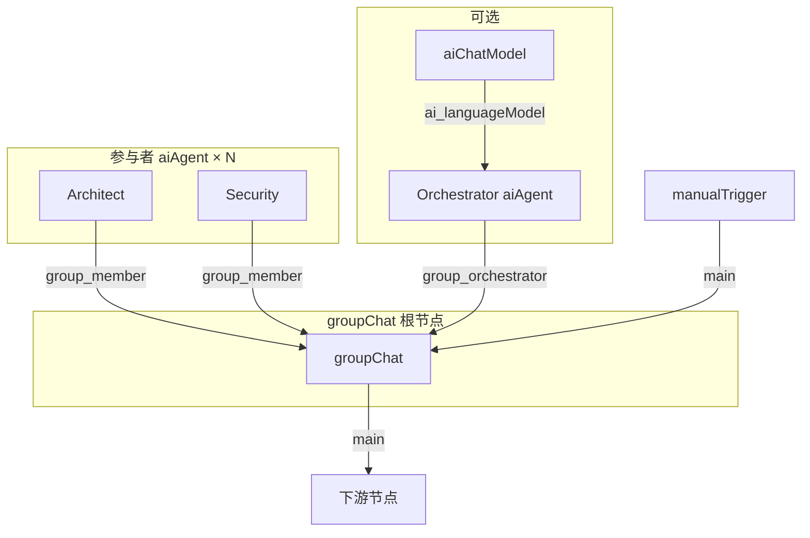

# P4-E：Group Chat 群聊（范式 E）

| 字段 | 内容 |
|------|------|
| **状态** | **Approved** — 实施计划见 [plans/2026-05-30-group-chat.md](../plans/2026-05-30-group-chat.md) |
| **日期** | 2026-05-30 |
| **里程碑** | P4-E（v1.3+，FR-15.4-E） |
| **前置** | P4-B `aiAgent` 卫星子图、P4-C Crew 编排、P4-B.3 HITL（`humanApproval` + resume API） |
| **关联** | [spec.md](../../spec.md) FR-15.4-E、AC-21、[adr-langchain.md](../../adr-langchain.md) §7 |

---

## 1. 背景与目标

### 1.1 现状

- 已交付 **Crew Sequential / Hierarchical / Supervisor**（任务委派范式）。
- **Group Chat** 在 spec / ADR 中规划为 LangGraph 多 Agent 消息图，**尚未实现**。
- HITL 基础设施已就绪：`humanApproval` 节点、`waiting` 状态、`POST /api/executions/:id/hitl/resume`。

### 1.2 目标（P4-E MVP）

1. 画布新增 **`groupChat` 根节点**，通过 `group_member` 端口挂载 ≥2 个 `aiAgent` 参与者。
2. 支持 **round-robin** 与 **orchestrator（LLM 选发言者）** 两种发言策略。
3. 支持 **最大轮次**、**关键词终止**；可选 **UserProxy** 人工插话（复用 HITL resume，带 checkpoint）。
4. 群聊消息写入 `metadata.agentSteps` / 输出 Items，执行时间线可展开；满足 **AC-21**。
5. **不做** CrewAI Sidecar 后端、Magentic-One、Consensual 投票（后续里程碑）。

### 1.3 成功标准

| # | 标准 |
|---|------|
| AC-21 | 2 Agent、maxRounds=5、UserProxy 启用；人工纠偏后续跑；记录含 User/Agent 消息；轮次内终止并输出最终结果 |
| AC-E1 | 保存时未连 ≥2 个 `group_member` → 校验错误 E1041 |
| AC-E2 | round-robin 集成测试：Researcher ↔ Reviewer 至少 2 轮对话 |
| AC-E3 | orchestrator 模式集成测试：LLM 选出下一发言者并完成 |
| AC-E4 | `nodeRun.metadata.agentSteps` 含 `groupChatTurn` 步骤 |

---

## 2. 与 Crew / Supervisor 的差异

| | Crew Sequential | Crew Supervisor | **Group Chat** |
|--|-----------------|-----------------|----------------|
| 交互形态 | 单向流水线 | 监督者派任务 | **共享频道多轮对话** |
| 上下文 | 上一角色输出摘要 | 经理任务 + 工人结果 | **完整群聊 transcript** |
| 调度 | 固定顺序 | 动态选工人 | **Orchestrator 选发言者** |
| 人工介入 | 外部 HITL 节点 | 同左 | **内置 UserProxy** |
| 典型场景 | 撰写→校对→发布 | 复杂调研委派 | 方案评审、头脑风暴 |

---

## 3. 节点与端口设计

### 3.1 拓扑



### 3.2 节点类型

| 类型 | 角色 | main 流 | 资源端口 |
|------|------|---------|----------|
| `groupChat` | 群聊根节点 | in / out | `group_member`（≥2）、`group_orchestrator`（可选） |
| `aiAgent` | 参与者 | 可选 | 新增 `group_member` **resourceOutput** |

**连接方向**：参与者 **输出** `group_member` → 根节点 **输入** `group_member`（与 Crew 一致）。

### 3.3 `groupChat` 参数

| 参数 | 类型 | 默认 | 说明 |
|------|------|------|------|
| `task` | text | `''` | 群聊初始任务；空则用 upstream Items |
| `maxRounds` | number | `8` | 最大 **发言轮次**（一次 Agent 发言 = 1 round） |
| `speakerSelection` | select | `roundRobin` | `roundRobin` \| `orchestrator` |
| `userProxyEnabled` | select | `false` | 是否允许人工插话 |
| `userProxyPrompt` | text | `请输入纠偏或补充…` | waiting 时展示 |
| `userProxyEveryNRounds` | number | `0` | `0`=仅 orchestrator 请求时；`N`=每 N 轮暂停 |
| `terminationKeywords` | text | `TERMINATE,FINISH,完成` | 命中则提前结束（大小写不敏感） |
| `orchestratorProvider` | select | `ollama` | inline orchestrator 模型（无 `group_orchestrator` Agent 时） |
| `orchestratorModel` | text | `llama3` | |
| `orchestratorBaseUrl` | text | | |
| `orchestratorCredentialId` | text | | |
| `returnTranscript` | select | `true` | 输出 Items 含完整 transcript |
| `returnIntermediateSteps` | select | `true` | 调试：流式 agentSteps |

### 3.4 参与者 `aiAgent` 约束

- 每个参与者 **必须** 连接 **Chat Model**（E1012，沿用 `collectSatellites` 校验）。
- **Tool 可选 0~n**（与 Crew 工人、独立 `aiAgent` 统一）：可按需连接 `toolMcp` / `toolHttp` / `toolWorkflow`；有 Tool 时走 ReAct，无 Tool 时纯 LLM 对话。
- 建议配置 `role` / `goal` / `backstory`（复用 `buildCrewRolePrompt` 注入 system 前缀）。
- 参与者 **不参与 main 拓扑**（纯资源节点时从执行图排除，与卫星节点规则一致）。

---

## 4. 运行时架构

### 4.1 执行循环（MVP：node-runner 原生循环）

与 `crew-native.ts` / `crewSupervisor` 一致，**MVP 不引入 LangGraph 新图**；P4-E.2 可选迁移至 `AiRuntime.runGroupChat`。

```
1. 收集 group_member 列表（按画布 x 坐标排序）
2. 构建初始 task + 空 transcript[]
3. FOR round = 1 .. maxRounds:
     a. IF userProxy 触发 → return waiting + checkpoint
     b. 选下一发言者 (roundRobin | orchestrator LLM)
     c. 组装 messages = transcript + task reminder
     d. runAiAgentNode(participant) — system 含角色 + 群聊规则
     e. append { author, role, content, round } to transcript
     f. IF terminationKeywords 命中 OR orchestrator 返回 finish → BREAK
4. 合成 finalAnswer（最后一轮或 orchestrator 摘要）
5. return success Items { answer, transcript, groupChatSteps }
```

### 4.2 群聊消息格式（内部 + 输出）

```typescript
interface GroupChatMessage {
  author: string;       // 节点 name
  authorNodeId: string;
  role: 'agent' | 'user' | 'system';
  content: string;
  round: number;
  at: string;           // ISO timestamp
}

interface GroupChatStepRecord {
  type: 'groupChatTurn' | 'groupChatUserProxy' | 'groupChatFinish';
  round: number;
  speaker?: string;
  content?: string;
  selectionReason?: string;
}
```

### 4.3 UserProxy 与 HITL 集成

当需要人工输入时，执行器返回：

```typescript
{
  status: 'waiting',
  metadata: {
    hitl: {
      prompt: userProxyPrompt,
      allowReject: false,
      allowSupplement: true,
      // ...
    },
    groupChat: {
      checkpoint: {
        transcript: GroupChatMessage[],
        round: number,
        task: string,
        memberIds: string[],
      },
    },
  },
}
```

**Resume 路径**（扩展，非破坏）：

1. 客户端 `POST .../hitl/resume` with `{ decision: 'approve', supplement: '...' }`。
2. `resumeHitlExecution` 检测 waiting 节点 `nodeType === 'groupChat'`：
   - **不**写入 precomputed approve output；
   - 改为设置 `ctx.orchestrationResume = { groupChatCheckpoint, userMessage: supplement }`；
   - **重新执行**同一 `groupChat` 节点（非从 trigger 重跑全图）。
3. 执行器读取 checkpoint，将 user 消息 append 到 transcript，继续循环。

> 若全图重跑成本过高，P4-E.1 可先实现 **UserProxy 仅首轮前**（从 input Items 读取 `userMessage`），AC-21 完整 UserProxy 在 Task 8 交付。

### 4.4 Orchestrator 选发言者

**roundRobin**：`members[round % members.length]`

**orchestrator**（LLM JSON）：

```json
{
  "action": "speak",
  "member": "Security",
  "reason": "上一轮架构方案需安全评审"
}
```

或：

```json
{ "action": "finish", "answer": "综合结论…" }
```

- 模型来源：`group_orchestrator` 端口连接的 `aiAgent`，或 inline `orchestratorModel`。
- Prompt 含：成员 roster、transcript 摘要、剩余轮次。

### 4.5 与 `runAiAgentNode` 的集成

每次发言调用：

```typescript
await runAiAgentNode(ctx, deps, {
  agentNodeId: member.id,
  agentParams: member.parameters,
  inputItems: [{ json: { task, transcript, round } }],
  systemMessageExtra: `${rolePrompt}\n\nYou are in a group chat. Respond to the conversation; be concise.`,
});
```

**不**使用各 Agent 独立 Memory 会话（群聊 transcript 由 orchestrator 统一管理，避免 session 分叉）。

**无 Tool 参与者**：`runAiAgentNode` 在无 Tool 时调用 `AiRuntime.runAgent` 的纯 chat 分支（与有 Tool 时 ReAct 分支同一入口）；Crew 工人、Group Chat 成员、独立 `aiAgent` 均适用。

---

## 5. 校验与错误码

| 代码 | 级别 | 说明 |
|------|------|------|
| E1041 | error | `groupChat` 需要 ≥2 个 `group_member` aiAgent |
| E1045 | error | `speakerSelection=orchestrator` 但未配置 orchestrator 模型/Agent |
| E1046 | error | 群聊轮次超限且无有效 finalAnswer |
| E1047 | error | UserProxy resume 时 checkpoint 损坏 |
| W1012 | Crew / Group Chat 成员未配置 role | 在对应 `aiAgent` 参数中填写 **Role** |

`to-workflow-graph`：`group_member` / `group_orchestrator` 连线不参与 main 边（新增 `isGroupChatOrchestrationConnection`，与 Crew 并列）。

---

## 6. 前端 UX（MVP）

### 6.1 编辑器

- 节点面板 Agent 分组新增 **Group Chat**。
- `groupChat` 节点显示已连接参与者数量 badge。
- 参数面板：speakerSelection、maxRounds、UserProxy 开关。

### 6.2 执行时间线（Phase 1）

- 复用 `agentSteps` 折叠列表，新增 `groupChatTurn` 图标/文案。
- Phase 2（非 MVP）：专用群聊 transcript 面板（见 ux-ui-design.md §3.7）。

### 6.3 模板

- `fixtures/templates/agent-group-chat-round-robin.json`
- `fixtures/templates/agent-group-chat-orchestrator.json`

---

## 7. 明确不做（P4-E MVP）

| 能力 | 说明 |
|------|------|
| CrewAI Sidecar 后端 | 仅 `native` |
| LangGraph `runGroupChat` | P4-E.3（可选） |
| 导出 Markdown transcript | P4-E.3（可选） |
| Consensual 投票 | FR-15.4 P2 |
| 群聊专用独立画布 | 复用 `workflowKind=agent` |
| Microsoft Agent Framework 集成 | 见架构讨论 |

---

## 8. 测试策略

| 层级 | 内容 |
|------|------|
| 单元 | `collectGroupMembers`、`selectNextSpeaker`、`shouldTerminate` |
| 集成 | `p4e-group-chat.integration.test.ts` — mock AI，AC-21 |
| 前端 | `editor-agent-stream-format` 识别 `groupChatTurn` |

---

## 9. 里程碑拆分

| 阶段 | 交付 |
|------|------|
| **P4-E.1** | 节点模型 + round-robin + 校验 + 集成测试（无 UserProxy） |
| **P4-E.2** | UserProxy + orchestrator + 时间线 + 模板 + AC-21 |
| **P4-E.3**（可选） | `AiRuntime.runGroupChat` LangGraph 实现、Markdown 导出 |
