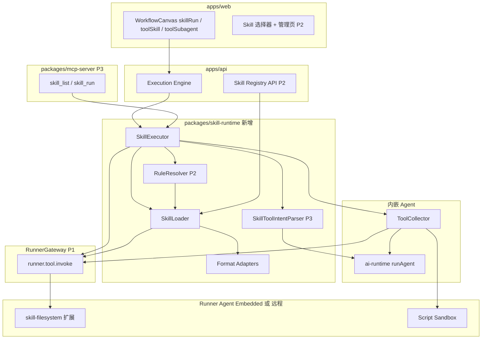
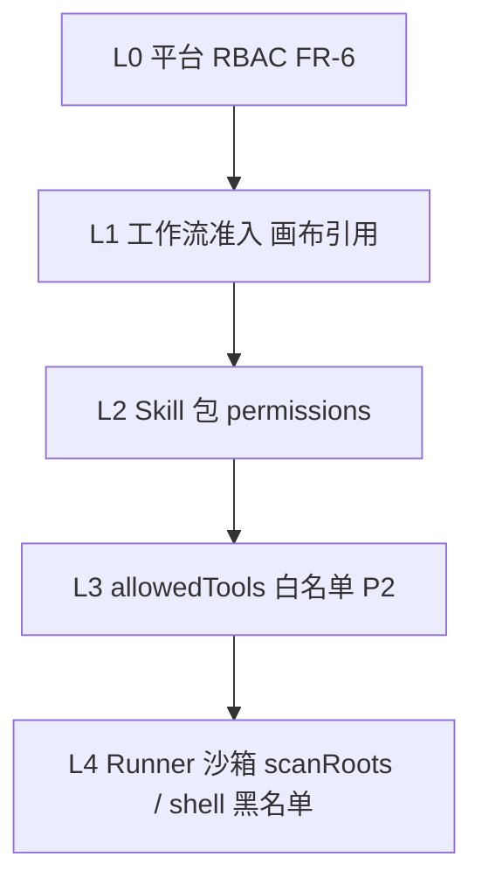

# Skill 集成：执行 Cursor / Claude / AGENTS.md 等 Agent Skill

| 字段 | 内容 |
|------|------|
| **状态** | **Draft** — 实施计划 [2026-05-31-skill-integration.md](../plans/2026-05-31-skill-integration.md) |
| **日期** | 2026-05-31 |
| **里程碑** | P4+（AI 平台扩展轨） |
| **策略** | **方案 B**：Skill IR + 适配器层；**运行时仅** `{root}/.rxwf/`、`~/.rxwf/`（§3.3）；Cursor/Claude/Codex 等原生目录**不**扫描（§3.3.1）；第三方 **import 安装**至 `.rxwf/`（§3.4）；L1+L2 远程 Runner（§4.5） |
| **关联** | [spec.md](../../spec.md) FR-13、FR-15、FR-16、[2026-05-23-workflow-agent-node-design.md](./2026-05-23-workflow-agent-node-design.md)、[adr-langchain.md](../../adr-langchain.md)、[adr-node-runner.md](../../adr-node-runner.md)、[node-plugin-spec.md](../../node-plugin-spec.md)、[runner-sdk.md](../../runner-sdk.md)、[平台对标矩阵](./2026-05-31-skill-platform-parity-matrix.md) |

---

## 1. 背景与目标

### 1.1 现状

- 平台已有 `aiAgent` 根节点 + 卫星 Tool（`toolMcp` / `toolHttp` / `toolWorkflow`），`packages/ai-runtime` 提供 `runAgent()` ReAct 循环。
- MCP Client/Server 双向能力已落地；Node Runner + `@rxwf/runner-sdk` 支持本地扩展与文件系统访问。
- **远程 Runner Agent**（v1.1）已落地：`RunnerGateway` WebSocket 派单、`runnerPolicy`、`code` / `executeCommand` / `httpRequest` 整节点远程（[adr-node-runner.md](../../adr-node-runner.md)）；Skill 轨 P1 扩展 **`runner.tool.invoke`**（§4.5）。
- **尚无** Skill 相关实现：无法在工作流中加载/执行 Cursor `SKILL.md`、Claude Code Skills、`.agents/skills` 等指令包。

### 1.2 目标

1. **执行 Skill**：在工作流 DAG 中通过 `skillRun` 节点加载并执行外部 Skill 包（Phase 1 优先）。
2. **Skill 注册中心**：统一管理、上传、扫描、版本化 Skill 包（Phase 2）。
3. **Agent Tool 集成**（Phase 2）：`toolSkill` 调用 Skill 包；`toolSubagent` 通用子 Agent（对齐 Cursor Task）。
4. **多格式导入**：Cursor / Claude / AGENTS.md / OpenCode / OpenClaw / Antigravity 等 SKILL·Rules **仅经导入**写入 `.rxwf/`；运行时只读 `.rxwf/`（§3.4）。
5. **编写与导出**：Web 编辑器编写 Skill 并导出为 Cursor/Claude 格式（Phase 3）。
6. **MCP 桥接**：`skill_list` / `skill_get` / `skill_run` 等 MCP Tool（Phase 3）。
7. **Tool 策略**：Phase 1 **卫星连线**（MCP 等）+ **§6.7 builtin**（Read/Grep/Shell/Web Search，权限门控）；Phase 3 **自动解析 SKILL 正文 Tool 意图**并映射到已装配 Tool。
8. **Rules / Instruction Context**（P2）：运行时**仅** `{root}/.rxwf/rules/`、`~/.rxwf/rules/`；跨工具 **Context 仅** `AGENTS.md` / `agents.md`（§3.7.0），经 **rules_import** 写入 `.rxwf/`；**不支持** `CLAUDE.md`；`.cursor/rules` 等其它格式亦仅 import；默认 `ruleMode=off`。
9. **多平台 Skill 安装**（P1+）：Cursor/Claude/AGENTS/OpenCode/OpenClaw/Antigravity 等格式**仅**经 `skill_import` 写入 `{root}/.rxwf/skills/` 或 `~/.rxwf/skills/`（§3.4）；**不**扫描各工具原生目录（§3.3.1）。
10. **远程 Runner**（P1）：builtin Read/Grep/Shell 与 Skill 包读盘落在 **已解析 Runner Agent**；**Web Search** 在控制面 API 执行（§6.7.10）；LLM ReAct 默认在控制面 API（§4.5）。
11. **`.rxwf/` 原生目录**（P1–P3）：`skills`、`rules`、`agents`、`hooks`、`scripts`、`commands`、**`workflows`**（§3.8.10）。
12. **Workflow 模板**（P2 导入/索引，P3 执行）：Antigravity `.agent/workflows/*.md` 等经 **`workflow_import`** → `.rxwf/workflows/`；可 **编译为平台 DAG** 或 `toolWorkflow` 子图（§3.8.10）。

### 1.2.1 已确认设计决策

| 议题 | 选项 | 确认 |
|------|------|------|
| Rule / Instruction Context 默认 | A `inherit` / **B `off`** | **B**：默认不加载任何 Rules；需 `ruleMode=inherit` 或 `explicit` + `ruleSources` |
| 运行时目录 | 多路径共存 / **仅 `.rxwf/`** | **仅** `~/.rxwf/`、`{root}/.rxwf/`；**不**读取 Cursor/Claude/Codex/Antigravity/OpenCode/OpenClaw 的**任何**原生 Skill/Rule 路径（含 `~/.cursor`、`{root}/.cursor`、`~/.claude`、`.agents/`、`.opencode/`、`.agent/`、`~/.openclaw` 等，§3.3.1） |
| Rules 源（运行时） | 多 RuleSource / **`rxwf_rules` only** | **仅** `rxwf_rules`（`.rxwf/rules/`、`~/.rxwf/rules/`）；第三方 Rules **仅 import** |
| 第三方 Skill 安装目标 | 写回第三方目录 / **仅 `.rxwf`** | `skill_import` **只**写入 `{root}/.rxwf/skills/` 或 `~/.rxwf/skills/`；**不**安装到 `.cursor/skills` 等 |
| Subagent 首版 | A 仅 `toolSkill` / **B `toolSubagent`** | **B**：P2 交付 `toolSubagent` 通用卫星（§3.10） |
| Builtin / Skill 读盘 Runner | API 本机 only / **同 `runnerPolicy`** | **同策略**：`skillRun` 解析出的 Runner 同时用于 **SkillLoader 读盘** 与 **builtin invoke**；跨机场景须 `pinned` + Agent 本机 `workspaceRoot` |
| 整节点远程 `skillRun` | P1 必须 / **P2+ 可选** | **P2+ 可选**；P1 仅 `runner.tool.invoke`（§4.5.3） |

### 1.3 成功标准（验收）

| # | 阶段 | 标准 |
|---|------|------|
| AC-S1 | P1 | `skillRun` + **`.rxwf/skills/.../SKILL.md`**（扁平或**多级子目录**，§3.8.3）；**拒绝** `skillPath` 指向 `.cursor/skills`（E1066）；builtin 可用；冒烟 1 条 |
| AC-S1c | P1 | 嵌套路径：`.rxwf/skills/team/ops/foo/SKILL.md` 以 `workspace://.rxwf/skills/team/ops/foo` 可执行；**符号链接**包根在 `scanRoots` 内可发现（§3.8.3） |
| AC-S1d | P1 | Skill 声明 `network` + 已配置搜索 Provider 时，`web_search` 可调用并返回摘要；无 `network` → **E1072**；未配置 Provider → **E1071** |
| AC-S1b | P1 | **远程 Runner**：`runnerPolicy.pinned` 到含仓库的 Agent；`workspaceRoot` 为 Agent 本机路径；`read_file` 在 `node_runs.runner_id` 为该 Agent；`fallback: embedded` 时不应用于跨机仓库场景（文档/example 说明） |
| AC-S2 | P2 | `ruleMode=explicit` + `ruleSources: ['rxwf_rules']` 加载 `.rxwf/rules/*.md`；`off` 无注入 |
| AC-S2b | P2 | **导入**：从 `{root}/.cursor/skills/foo` 执行 `skill_import` → 写入 `.rxwf/skills/foo/` 后可被 `skillRun` 执行 |
| AC-S2c | P2 | **Workflow**：`workflow_import` 自 `.agent/workflows/startcycle.md` → `.rxwf/workflows/startcycle.workflow.yaml`；`import-to-workflow` 生成可导入画布的 DAG 片段 |
| AC-S3 | P3 | **导出**至 Cursor/Claude 等（可选）；MCP `skill_import` / `skill_run`；`toolIntentMode=hint`；path-scoped rules；**workflow 模板执行**（`workflow_run` / `commands`） |

### 1.4 明确不做（本 spec 范围外）

| 能力 | 说明 |
|------|------|
| 替代 Cursor/Claude IDE 完整 Agent 运行时 | 外部 IDE 代理为 Phase 3 可选扩展 |
| SKILL 正文解析后凭空创建 Tool | 意图解析**仅**映射到已装配 Tool |
| 零连线自动获得 **MCP** 能力 | `toolMcp` 等须画布连线 |
| 无 Runner 时执行 Shell/读盘 | 无 Embedded/远程 Agent 时 builtin 不可用（E1055）；非「API 进程直接读开发者笔记本磁盘」 |
| API 侧伪造远程路径 | `workspaceRoot` 填 API 容器路径但 `pinned` 到远程 Agent → E1060 / 读盘失败 |
| Skill 市场 / 付费分发 | 后续里程碑 |
| OpenClaw bundled skills / 安装包内 Skill | 不扫描系统目录；可 **import** 至 `.rxwf/skills` |
| **运行时读取第三方 Skill/Rule 目录** | **不做**（§3.3.1 全表）：含各平台**项目级**与**用户全局**目录；仅 **import → `.rxwf/`** |
| **运行时安装到第三方目录** | **不做**：不向 `~/.cursor/skills`、`{root}/.claude/skills` 等写入 |
| **`CLAUDE.md` / `CLAUDE.local.md`** | **不做** import、export、运行时解析；项目 Context **仅** `AGENTS.md` / `agents.md`（§3.7.0） |
| Codex 专有 Skill 目录 | 无；MCP + **import** 至 `.rxwf`（§14） |

---

## 2. 架构选型

### 2.1 候选方案

| 方案 | 描述 | 结论 |
|------|------|------|
| A | Skill 即 Agent 配置，直接读 SKILL.md → systemPrompt | 过快 MVP，难扩展多格式 |
| **B** | **Skill IR + 格式适配器**（推荐） | 长期可维护，支持注册/导出 |
| C | MCP 优先，Skill 仅作 MCP Resource | 与 FR-16 一致但 P1 无法独立交付 |

**选定方案 B**，分三阶段交付。

### 2.2 整体架构



### 2.3 模块边界（ADR-001）

| 模块 | 职责 |
|------|------|
| `packages/skill-runtime` | Skill IR、**RuleResolver / InstructionContext**、格式适配、执行、Tool 收集、意图解析（P3） |
| `packages/ai-runtime` | ReAct Agent 循环；SkillExecutor 调用 `runAgent()` |
| `packages/node-runner` | `skillRun` executor、`RunnerDispatcher` 解析、builtin `dispatchTool` |
| `packages/runner-protocol` | `RunnerToolInvoke*`、WS `tool.invoke` / `tool.result`（§4.5.7） |
| `packages/providers/contracts` | `RunnerGatewayPort.invokeTool` |
| `packages/runner-agent` | Agent 侧 `skill-filesystem` + `tool.invoke` 处理 |
| `packages/workflow` | 校验、卫星收集、`skillRun`/`toolSkill`/`toolSubagent` 端口扩展 |
| `packages/mcp-server` | Phase 3 MCP Tools |
| `apps/api` | Skill Registry API、路由 |
| `apps/web` | 节点 UI、Skill 管理页 |
| `providers/lite\|standard` | skill repository |

**禁止**：`apps/*` 直接解析 `SKILL.md`；所有格式适配在 `skill-runtime` 内。

---

## 3. Skill IR 与格式适配

### 3.1 Skill 包结构

```
skill-package/
├── skill.manifest.json    # rxwf 原生格式（可选）
├── SKILL.md               # 主指令（Cursor/Claude 兼容）
├── reference.md           # 引用文档
├── scripts/               # 可执行脚本（Phase 2）
│   └── validate.sh
└── assets/                # 模板、示例
```

### 3.2 Skill IR（内部中间表示）

```typescript
interface SkillIR {
  id: string;                    // 全局唯一，如 "rxwf/code-review" 或 "rxwf/team/ops/deploy"
  /** 自 `.rxwf/skills/` 起的相对路径（POSIX `/`），指向 Skill 包根目录；见 §3.8.3 */
  skillRelPath: string;          // 如 "code-review" | "team/ops/deploy"
  name: string;
  description: string;
  version: string;
  sourceFormat: 'rxwf';              // 存储格式；运行时仅 .rxwf/
  provenance?: 'rxwf' | 'cursor' | 'claude' | 'agents_md' | 'opencode' | 'openclaw' | 'antigravity';  // import 来源

  systemPrompt: string;          // SKILL.md body（去掉 frontmatter）
  references: Array<{ path: string; content: string }>;
  scripts: Array<{
    path: string;
    runtime: 'node' | 'shell' | 'python';
    hash: string;
  }>;

  allowedTools?: string[];       // rxwf 扩展：白名单（Phase 2）
  maxIterations?: number;
  disableModelInvocation?: boolean;

  permissions: Array<
    'filesystem:read' | 'network' | 'code:execute' | 'network:write'
  >;
  scanRoots?: string[];
}

### 3.2.1 WorkflowTemplateIR（P2，§3.8.10）

```typescript
interface WorkflowTemplateIR {
  id: string;                    // 如 "startcycle"
  name: string;
  description?: string;
  provenance?: 'rxwf' | 'antigravity';
  triggers?: { slashCommand?: string };
  steps: Array<{
    id: string;
    agentRole?: string;
    skillRef?: string;           // → .rxwf/skills 下 skillRelPath
    skillPath?: string;
    promptTemplate?: string;
    gate?: { type: 'human_approval'; onReject?: 'loop' | 'fail' };
    kind?: 'skill_run' | 'subworkflow';
  }>;
}
```

### 3.3 Skill 运行时目录（仅 `.rxwf/`）

**执行期** `SkillLoader` / `RuleResolver` **只**识别下列路径；其它路径一律 **E1066**（可引导使用 `skill_import`）。

| 作用域 | 合法 Skill 路径 | 说明 |
|--------|----------------|------|
| **项目** | `{root}/.rxwf/skills/**/{pkg}/SKILL.md` | **扁平**或**任意深度子目录**（§3.8.3）；`{pkg}` = 含 `SKILL.md` 的包根目录 |
| **用户全局** | `~/.rxwf/skills/**/{pkg}/SKILL.md` | 与项目树规则相同 |

示例：

| 布局 | `skillRelPath` | `skillPath` 简写 |
|------|----------------|------------------|
| `.rxwf/skills/code-review/SKILL.md` | `code-review` | `workspace://.rxwf/skills/code-review` |
| `.rxwf/skills/team/ops/deploy/SKILL.md` | `team/ops/deploy` | `workspace://.rxwf/skills/team/ops/deploy` |
| `.rxwf/skills/vendor/foo` → symlink 至包根 | 以**逻辑路径**注册（见 §3.8.3） | 同上，使用链接路径 |

**禁止作为 `skillPath` / 扫描 glob 的运行时路径**（非穷举）：

`~/.cursor/`、`{root}/.cursor/`、`~/.claude/`、`{root}/.claude/`、`{root}/.agents/skills/`、`.opencode/skills/`、`~/.config/opencode/skills/`、`~/.openclaw/`、`{root}/.agent/skills/`、`~/.gemini/antigravity/skills/` 等。

上述第三方目录内容须通过 **§3.4 导入** 复制/转换到 `.rxwf/skills/` 后再执行。

**发现与解析规则**：

1. 输入：**Skill 包目录**（含 `SKILL.md` 的 `{pkg}/`）、`**/.rxwf/skills/.../SKILL.md` 绝对路径**、或 **`workspace://.rxwf/skills/{skillRelPath}`**（§3.6）；`skillRelPath` 可含 `/`。
2. 路径校验：规范化（含符号链接解析，§3.8.3）后 **realpath** 须落在 `**/.rxwf/skills/**` 或 `~/.rxwf/skills/**` 之下；禁止将 `.rxwf/skills/` 目录本身当作包根（其下须至少有一层 `{pkg}/`）→ **E1067**。
3. 扫描（P2）：`scanRoots` 下 glob `**/.rxwf/skills/**/SKILL.md`（及 `~/.rxwf/skills/**/SKILL.md`，若配置 home）；**跟随**符号链接参与发现，**realpath 去重**（§3.8.3）。
4. `SkillIR.provenance`（可选）：`cursor` | `claude` | `agents_md` | `opencode` | `openclaw` | `antigravity` | `rxwf`；**存储位置始终在 `.rxwf/`**。
5. Runner 执行时 **cwd** = Skill **包根** `{pkg}/`（逻辑路径；包根为 symlink 时仍用链接侧路径解析 `reference.md`、`scripts/`）。

#### 3.3.1 第三方平台路径：仅导入、不运行时（全平台）

rx-workflow **不**实现 Cursor/Claude/Codex/Antigravity/OpenCode/OpenClaw 的「原生 Skill/Rules 发现路径」。这些路径**仅**在 `skill_import` / `rules_import` 时由用户**显式指定** `sourcePath` 读取；读取结果**只**安装到 `.rxwf/`。

| 平台 | 业界 Skill 路径（运行时 ❌） | 业界 Rules 路径（运行时 ❌） | rx-workflow 安装目标（✅） |
|------|---------------------------|-----------------------------|-------------------------|
| **Cursor** | `{root}/.cursor/skills/`、`~/.cursor/skills/`、`~/.cursor/skills-cursor/` | `{root}/.cursor/rules/` | `{root}/.rxwf/skills/`、`~/.rxwf/skills/`、`{root}/.rxwf/rules/imported/cursor/` |
| **Claude Code** | `{root}/.claude/skills/`、`~/.claude/skills/` | `CLAUDE.md`、`~/.claude/CLAUDE.md`、`.claude/rules/`（**不** import） | `.rxwf/skills/`（Skill **仅**）；Context 用 **AGENTS.md** |
| **AGENTS.md** | `{root}/.agents/skills/`、`~/.agents/skills/` | `AGENTS.md`、`agents.md`、`**/AGENTS.md`、`**/agents.md` | `.rxwf/skills/`、`rules/imported/agents-md/` |
| **OpenCode** | `{root}/.opencode/skills/`、`~/.config/opencode/skills/` | `opencode.json`、`AGENTS.md` / `agents.md`（**无** CLAUDE 回退） | `.rxwf/skills/`、`rules/imported/opencode/` |
| **OpenClaw** | `{workspace}/skills/`、`~/.openclaw/skills/`、bundled、`extraDirs` | （多源 AGENTS 等） | `.rxwf/skills/`（单包合并，§3.9.3） |
| **Antigravity** | `.agent/skills/`、`~/.gemini/.../skills/` | `.agent/rules/`、`.agent/workflows/*.md` | `.rxwf/skills/`、`rules/imported/antigravity/`、**`.rxwf/workflows/`** |
| **Codex** | 无标准目录 | 宿主仓库内任意文件 | **仅** MCP `skill_import` → `.rxwf/` |

**`skillPath` / `registry://` / 注册中心扫描**：合法前缀**仅** `.rxwf/skills/`、`~/.rxwf/skills/`（及 `user://skills/...` 映射到后者）。命中上表任一路径 → **E1066**。

**`scanRoots`**：默认含 `{root}`、`{root}/.rxwf`、`Skill 包目录`、可选 `~/.rxwf`；**不**默认包含 `.cursor`、`.claude` 等。

仓库内可保留 `.cursor/`、`.claude/` 等供 **IDE 自用**；与 rx-workflow 执行轨**解耦**。

### 3.4 第三方格式：导入 / 导出（非运行时路径）

**格式适配器**用于 **一次性读取** 用户指定的第三方 `sourcePath`（可为 `{root}/.cursor/...` 或 `~/.cursor/...` 等），**写入且仅写入** `{root}/.rxwf/` 或 `~/.rxwf/`；**不**在 `skillRun` / `RuleResolver` 时访问第三方目录。

| 格式 | 典型 `sourcePath`（**仅 import**；可为任意磁盘路径） | **安装目标**（仅此二处） | 阶段 |
|------|------------------------------------------------------|------------------------|------|
| **Cursor** | `{any}/.cursor/skills/{name}/`、`~/.cursor/skills/{name}/` 等 | `target=project` → `{root}/.rxwf/skills/...`；`target=user` → `~/.rxwf/skills/...` | P1 |
| **Claude Code** | `{any}/.claude/skills/{name}/` | `.rxwf/skills/...` | P2 |
| **AGENTS.md Skill** | `{any}/.agents/skills/{name}/SKILL.md` | `.rxwf/skills/...` | P2 |
| **OpenCode** | `.opencode/skills/{name}/`、`~/.config/opencode/skills/` | `.rxwf/skills/...` | P2 |
| **OpenClaw** | 多路径 Skill 包（§3.9.3 映射表） | `.rxwf/skills/...` + `provenance: openclaw` | P3 |
| **Antigravity** | `{any}/.agent/skills/{name}/` | `.rxwf/skills/...` | P2 |
| **Cursor Rules** | `.cursor/rules/**/*` | `.rxwf/rules/imported/cursor/...` | P2 |
| **AGENTS.md Context** | `AGENTS.md`、`agents.md`、`**/AGENTS.md`、`**/agents.md`（单文件或目录） | `.rxwf/rules/imported/agents-md/` | P2 |
| **Antigravity Rules** | `.agent/rules/**` | `.rxwf/rules/imported/antigravity/...` | P2 |
| **Antigravity Workflows** | `{root}/.agent/workflows/*.md`、`.agents/workflows/*.md` | `.rxwf/workflows/{id}.workflow.yaml` | P2 |
| **OpenCode** | `opencode.json` `instructions[]` | `.rxwf/rules/imported/opencode/...` | P3 |

#### 3.4.1 `skill_import` / `rules_import` / `workflow_import`

```typescript
interface SkillImportRequest {
  /** 第三方 Skill 包目录或 SKILL.md 路径；须在 importScanAllowlist 内（通常=用户显式选择） */
  sourcePath: string;
  format: 'auto' | 'cursor' | 'claude' | 'agents_md' | 'opencode' | 'openclaw' | 'antigravity';
  target: 'project' | 'user';       // 仅 → {root}/.rxwf/skills/ 或 ~/.rxwf/skills/；禁止写入 .cursor 等
  skillName?: string;               // 覆盖包目录名（叶子目录名）
  /** 相对 `.rxwf/skills/` 的目标子路径，如 "team/cursor-imports"；默认 ""（扁平） */
  targetSubdir?: string;
  /** 导入时保留源目录中的符号链接（默认 true）；循环链接 → E1045 */
  preserveSymlinks?: boolean;
  overwrite?: boolean;              // 默认 false，冲突 → E1068
}

interface RulesImportRequest {
  sourcePath: string;               // 文件或目录（如 .cursor/rules）
  format: 'auto' | 'cursor' | 'claude' | 'agents_md' | 'antigravity' | 'opencode';
  target: 'project' | 'user';
  subdir?: string;                  // 默认 imported/{format}/
}
```

| API / MCP | 说明 | 阶段 |
|-----------|------|------|
| `POST /api/skills/import` | Skill 包导入 | P1 |
| `POST /api/rules/import` | Rules 批量导入 | P2 |
| MCP `skill_import` | 同 API；`sourcePath` + `format` | P2 |
| `POST /api/workflows/import` | Workflow 模板导入（§3.8.10） | P2 |
| `POST /api/rxwf-catalog/workflows/import-to-workflow` | 模板 → 画布 `WorkflowDefinition` JSON 片段 | P2 |
| MCP `workflow_import` / `workflow_compile` | 导入 + 编译预览 | P3 |
| Web Skill 管理页 | 「从 Cursor/Claude/Antigravity 导入…」 | P2 |

```typescript
interface WorkflowImportRequest {
  sourcePath: string;              // 如 .agent/workflows/startcycle.md
  format: 'auto' | 'antigravity' | 'rxwf';
  target: 'project' | 'user';      // → {root}/.rxwf/workflows/ 或 ~/.rxwf/workflows/
  workflowId?: string;             // 覆盖 id（默认取文件名）
  overwrite?: boolean;
  /** 导入时解析步骤内 skillRef → 校验 .rxwf/skills 是否存在；缺失 → E1074 警告 */
  validateSkillRefs?: boolean;
}
```

`format: 'auto'`：按路径启发式（`.cursor` → cursor，`.claude/skills` → claude Skill，`AGENTS.md`/`agents.md` → `agents_md`，`.agent/workflows` / `workflows/` → `antigravity` workflow）。**`CLAUDE.md` 路径** → **E1070**，提示改用 `AGENTS.md` / `agents.md`。

导入后：`skillRun.skillPath = '.rxwf/skills/{skillRelPath}'` 或 `registry://rxwf/{skillRelPath}`（`skillRelPath` 可含 `/`）。

#### 3.4.2 OpenCode 导入阶段（P2 vs P3，矩阵 §8.3）

| 能力 | P2（无 `OpenCodeSkillAdapter`） | P3（专用适配器） |
|------|--------------------------------|------------------|
| **Skill 包** `.opencode/skills/{name}/`、`~/.config/opencode/skills/` | ✅ `skill_import` + `format: 'opencode'` 或 `'auto'`；`SKILL.md` 按 **Cursor 同构**解析；`provenance: opencode` | `OpenCodeSkillAdapter`：保留 `opencode.json` 邻近元数据 |
| **平铺** `.agents/skills/*.md` | ✅ `format: 'agents_md'` | — |
| **Rules** `opencode.json` → `instructions[]` | ❌ | ✅ `OpenCodeRulesAdapter` → `.rxwf/rules/imported/opencode/` |
| **`permission.skill`** | ❌ 运行时不读 | ✅ **导入时** → `skillDenylist`（§9.1.3）；`ask` → warn |
| **执行** | 仅 `.rxwf/skills/**`（§3.3.1） | 同左 |

**结论**：P2 可把 OpenCode Skill 目录装进 `.rxwf/` 并 `skillRun`；P3 才需专用适配器处理 Rules + permission 元数据。

### 3.5 Skill 来源（SkillSource）

| 来源 | URI / 参数示例 | 阶段 |
|------|---------------|------|
| 相对工作区 | `workspace://.rxwf/skills/brainstorming` 或 `.../team/ops/deploy` | P1 |
| 绝对路径 | `file:///data/my-app/.rxwf/skills/team/ops/deploy/SKILL.md` | P1 |
| 用户全局 | `file://~/.rxwf/skills/brainstorming` 或 `user://skills/team/ops/deploy` | P1 |
| 表达式 | `{{ $json.repoRoot }}/.rxwf/skills/code-review` | P1 |
| 内联 | `inline://` + 文本 | P1 |
| 注册中心 | `registry://rxwf/{skillRelPath}@version`（`skillRelPath` 可含 `/`） | P2 |
| MCP Resource | `mcp://server-id/resource-uri` | P3 |
| ~~第三方路径~~ | ~~`.cursor/skills/...`~~ | **禁止** → E1066，请 import |

### 3.6 工作区根（workspace root）解析

当 `skillSource: 'path'` 且 `skillPath` 为相对路径时，**仅**接受以 **`.rxwf/skills/`** 开头（或 `skills/{skillRelPath}` 简写，解析为 `.rxwf/skills/{skillRelPath}`；`skillRelPath` 可多级）。

1. **优先**：工作流 Git 仓库根 `{root}`，拼接 `.rxwf/skills/...`。
2. **其次**：Runner CWD 向上查找含 **`.rxwf/skills`** 的祖先目录作为 `{root}`。
3. **显式**：`workspaceRoot` 或 `SKILL_WORKSPACE_ROOT`。
4. **远程 Runner**（§4.5）：`workspaceRoot` 为 Agent 主机上含 **`.rxwf/`** 的仓库根路径。

**不**根据 `.cursor/skills` 等目录推断 `{root}`。

### 3.7 Instruction Context 与 Rules 总览

**Skill**（流程）与 **Rule / Instruction Context**（持久约束）必须分轨：

| 轨 | 典型文件 | IR 类型 | 加载时机 |
|----|---------|---------|---------|
| **Skill** | `.rxwf/skills/**/SKILL.md` | `SkillIR` | `skillRun` / `toolSkill` |
| **Rule** | `.rxwf/rules/**/*.{md,mdc}` | `InstructionContextIR` | 执行前注入（可关） |

统一入口：`RuleResolver.resolve()` — 运行时 **仅** `rxwf_rules`（§3.9）。第三方 Context（**仅 AGENTS.md 族**）、`.cursor/rules` 等须 **rules_import** → `.rxwf/rules/`（§3.4）。

### 3.7.0 AGENTS.md / agents.md 与 Skill 目录（仅导入）

[AGENTS.md](https://agents.md/) 为跨工具 **项目 Context** 标准；`.agents/skills/` 为可执行 Skill 包。rx-workflow **不**支持 Claude 专有的 `CLAUDE.md`、`CLAUDE.local.md`、`~/.claude/CLAUDE.md` 或 `.claude/rules/` 作为 Context 导入源（Claude Code 项目约束应写在 `AGENTS.md` / `agents.md` 中）。

#### 支持的 Context 文件名

| 文件名 | 说明 |
|--------|------|
| `AGENTS.md` | 推荐；与 [agents.md](https://agents.md/) 规范一致 |
| `agents.md` | 小写变体；与 `AGENTS.md` **等价**，import 后合并入同一 `imported/agents-md/` 树 |

**不识别**：`CLAUDE.md`、`CLAUDE.local.md`、`.claude/CLAUDE.md` 等 → `rules_import` 返回 **E1070**。

| 业界语义 | 第三方路径 | rx-workflow 做法 |
|----------|-----------|------------------|
| 项目 Context | `AGENTS.md`、`agents.md`、`**/AGENTS.md`、`**/agents.md` | **rules_import**（`format: 'agents_md'`）→ `.rxwf/rules/imported/agents-md/` |
| 可执行 Skill | `{root}/.agents/skills/{name}/SKILL.md` | **skill_import** → `.rxwf/skills/...`，`provenance: agents_md` |
| Claude Skill 包 | `{root}/.claude/skills/{name}/` | **skill_import**（`format: 'claude'`）→ `.rxwf/skills/`；**不**导入 `CLAUDE.md` |

**不**在运行时从仓库直接加载 `AGENTS.md` / `agents.md` 或 `.agents/skills`。

#### 3.7.1 InstructionContextIR

与 `SkillIR` 并列，供所有 Rule 源使用：

```typescript
type InstructionSourceFormat =
  | 'rxwf_rules';         // 运行时唯一：{root}/.rxwf/rules/**、~/.rxwf/rules/**
  // 导入溯源（metadata only）：'cursor' | 'claude' | 'agents_md' | ...

interface InstructionContextIR {
  id: string;
  sourceFormat: InstructionSourceFormat;
  scope: 'project-root' | 'nested' | 'rules-dir' | 'global';
  rootPath: string;
  filePath: string;
  content: string;
  /** P2: always；P3: path-scoped 见 paths */
  loadPhase: 'always' | 'on-path-match';
  /** P3：来自 `.cursor/rules` 或 `.rxwf/rules/*.mdc` frontmatter（import 后） */
  paths?: string[];
  priority: number;       // 合并排序用，越大越靠后（越接近「覆盖」）
}
```

#### 3.7.2 `.rxwf/rules/` 发现规则（P2）

| 项 | 约定 |
|----|------|
| Glob | `{root}/.rxwf/rules/**/*.{md,mdc}`、`~/.rxwf/rules/**` |
| 合并 | 文件名排序；`imported/*` 子目录与手写规则同一套合并算法 |
| walk-up | 运行时 **不** walk-up；**import** 可选自 `startDir` 向上收集 `AGENTS.md`/`agents.md` 写入 `imported/agents-md/` |
| P3 | `paths` / `alwaysApply` frontmatter（语义同原 Cursor `.mdc`） |

#### 3.7.3 （保留节号）导入型 Context 的等效行为

若用户 **rules_import** 自 `AGENTS.md`，导入器可将 monorepo 多份 `AGENTS.md` 转为 `.rxwf/rules/imported/agents-md/{relative-path}.md`，由 `rxwf_rules` 一次性加载；**不**在执行时扫描 `{root}/AGENTS.md`。

#### 3.7.4 RuleResolver（统一 API，实现见 §3.9）

```typescript
// packages/skill-runtime/src/rule-resolver.ts
/** 运行时仅支持单一 Rule 源类型 */
type RuleSource = 'rxwf_rules';

interface ResolveRulesInput {
  workspaceRoot: string;
  ruleMode: 'off' | 'inherit' | 'explicit';
  /** explicit 或 inherit 时生效；inherit 默认全集（见 §3.9.1） */
  ruleSources?: RuleSource[];
  explicitPaths?: string[];
  contextPaths?: string[];      // P3 path-scoped 过滤
  walkUpMode?: 'walk-up' | 'nearest-only';
  maxRuleTokens?: number;
}

async function resolveRules(input: ResolveRulesInput): Promise<InstructionContextIR[]>;
```

| `ruleMode` | 行为 |
|------------|------|
| `off` | 不加载任何 Rule（**默认**） |
| `inherit` | 若存在 `{workspaceRoot}/.rxwf/rules` 或 `~/.rxwf/rules`（配置时）则加载 **`rxwf_rules`** |
| `explicit` | 须 `ruleSources: ['rxwf_rules']`（唯一合法值） |

> **废弃**：`ruleSources` 含 `agents_md`、`cursor_rules` 等 → 校验警告 **E1069**，提示先 `rules_import`。

#### 3.7.5 与 SkillExecutor 的组合

```
finalSystemPrompt =
  composeInstructionContext(instructionContexts)   // AGENTS.md 等，见下
  + "\n\n---\n\n"
  + skill.systemPrompt                             // SKILL 流程
  + toolIntentHints (P3)

composeInstructionContext:
  "## Project instructions (rules)\n\n"
  + 按 priority 排序的各段（每段标注 `<!-- source: path -->`）
```

**合并顺序（P2）**：

1. `~/.rxwf/rules/**`（若启用用户全局 Rules）
2. `{workspaceRoot}/.rxwf/rules/**`（含 `imported/agents-md/`、`imported/cursor/` 等，按相对路径排序）
3. P3：匹配 `contextPaths` 的 path-scoped 规则追加在最后

**优先级**：用户 prompt / Items > Skill 正文 > 上述 Rule 链（对齐「用户对话覆盖文件指令」）。

#### 3.7.6 扫描与注册（P2）

| glob | 注册为 |
|------|--------|
| `**/.rxwf/rules/**/*.{md,mdc}` | InstructionContext |
| `**/.rxwf/skills/**/SKILL.md` | Skill 注册中心（任意深度 + symlink，§3.8.3） |
| `**/.rxwf/agents/**/AGENT.md`、`**/.rxwf/agents/*.md` | Agent 模板索引 |
| `**/.rxwf/hooks/*.hook.yaml` | Hook 声明 |
| `**/.rxwf/commands/*.command.yaml` | Command 索引 |
| `**/.rxwf/workflows/*.{workflow.yaml,yml}` | Workflow 模板索引（§3.8.10） |

API 扩展：

| 方法 | 路径 | 说明 |
|------|------|------|
| GET | `/api/instruction-contexts` | 列出已索引 AGENTS.md |
| POST | `/api/instruction-contexts/resolve` | 传入 `workspaceRoot`，返回合并预览 |

#### 3.7.7 节点参数扩展（Rules）

`skillRun` / `aiAgent` 共享：

```typescript
  ruleMode?: 'off' | 'inherit' | 'explicit';  // 默认 off
  ruleSources?: RuleSource[];   // explicit 必填；inherit 可省略则用 §3.9.1 默认集
  ruleExplicitPaths?: string[]; // 额外绝对路径文件，任意格式
  contextPaths?: string[];      // P3：path-scoped 过滤，如 ["src/**/*.ts"]
  ruleWalkUpMode?: 'walk-up' | 'nearest-only';
  maxRuleTokens?: number;       // 默认 8000，超出 E1047 截断
```

**卫星节点（P2 可选）** `ruleInject`：

| 属性 | 值 |
|------|-----|
| `type` | `ruleInject` |
| 端口 | out: `ai_instruction` → `skillRun` / `aiAgent` |
| 参数 | `ruleSources: RuleSource[]` — 为本节点单独追加 Rule 段，与节点参数合并 |

未连 `ruleInject` 时仅使用节点上的 `ruleMode` / `ruleSources`。

#### 3.7.8 校验

| 错误码 | 条件 |
|--------|------|
| E1045 | `.rxwf/` 树（含 Skills/Rules/AGENTS.md import）符号链接循环 |
| E1067 | `SKILL.md` 位于 `.rxwf/skills/` 根下且无包目录层级 |
| E1046 | `ruleMode=explicit` 但 `ruleSources` 为空，或指定源未找到任何文件（警告） |
| E1047 | 合并后 context 超过 `maxRuleTokens`（警告，截断后继续） |
| E1051 | （保留）`ruleExplicitPaths` 指定路径不存在（警告） |
| E1066 | `skillPath`/扫描路径非 `.rxwf/skills` 或 `~/.rxwf/skills`（含 `.cursor`、`.claude` 等，§3.3.1） |
| E1069 | `ruleSources` 含已废弃的 `cursor_rules`、`agents_md` 等 → 须 `rules_import` |
| E1052 | `.rxwf/rules` 内 `@import` 循环引用（P3） |
| E1070 | `rules_import` 源为 `CLAUDE.md` 或 `.claude/rules`（请改用 `AGENTS.md` / `agents.md`） |
| E1053 | `@import` 路径越出 `scanRoots`（P3） |
| E1054 | OpenClaw Skill `metadata.openclaw` 不满足，Skill 不可用（P3） |
| E1064 | 多平台同名 Skill 共存：非优先源 shadowed（警告，§3.8.3） |
| E1065 | `.rxwf/hooks` 声明未知 `event` 或缺少必填字段（P2 校验） |

---

### 3.8 `.rxwf` 原生项目目录（rx-workflow）

rx-workflow **运行时唯一**配置树：`{root}/.rxwf/` 与 `~/.rxwf/`。仓库内可保留 `.cursor/`、`.claude/` 等供 **IDE 使用** 或作为 **import 源**，但 **SkillExecutor 不读取**（§3.3）。

#### 3.8.1 目录总览

```
{root}/.rxwf/
├── rxwf.project.json       # 可选：项目 manifest（§3.8.2）
├── rules/                  # Rule 轨 → InstructionContext（P2）
│   ├── *.md
│   └── *.mdc               # P3：paths / alwaysApply 同 .cursor/rules
├── skills/                 # Skill 轨 → SkillIR（P1）；支持任意深度子目录与符号链接（§3.8.3）
│   ├── {skill-name}/       # 扁平示例
│   │   ├── SKILL.md
│   │   └── ...
│   └── {category}/         # 嵌套示例：category/.../{pkg}/SKILL.md
│       └── {team}/
│           └── {pkg}/
│               ├── SKILL.md
│               ├── skill.manifest.json
│               ├── reference.md
│               ├── scripts/
│               └── assets/
├── agents/                 # Agent 模板轨（P2）→ 画布 `toolSubagent` / `aiAgent` 预置
│   └── {agent-name}/
│       ├── AGENT.md        # 或平铺 agents/{agent-name}.md
│       └── tools.json      # 可选：推荐卫星 Tool 类型列表
├── hooks/                  # 生命周期钩子声明（P2 校验，P3 执行）
│   └── *.hook.yaml
├── scripts/                # 项目级脚本（P2）→ 工作区 `script:*` Tool
│   └── *.{sh,mjs,ps1}
├── commands/               # 快捷命令（P2 索引，P3 Web/CLI）
│   └── *.command.yaml
└── workflows/              # 多步编排模板（P2 导入/索引，P3 执行）§3.8.10
    └── {id}.workflow.yaml
```

**全局**（可选，与项目目录对称）：

| 路径 | 用途 | 阶段 |
|------|------|------|
| `~/.rxwf/skills/**/{pkg}/` | 用户级 Skill（与项目树同规则） | P1 |
| `~/.rxwf/rules/**/*.md` | 用户级 Rule | P2 |
| `~/.rxwf/agents/` | 用户级 Agent 模板 | P2 |
| `~/.rxwf/workflows/` | 用户级 Workflow 模板 | P2 |

`scanRoots` 与 `workspaceRoot` 解析须包含 `{root}/.rxwf`（§3.6、§4.5）。

#### 3.8.2 `rxwf.project.json`（可选）

```json
{
  "manifestVersion": 1,
  "name": "my-app",
  "defaultRuleSources": ["rxwf_rules"],
  "enableProjectScripts": true,
  "hooks": { "enabled": true },
  "workflows": { "enabled": true }
}
```

| 字段 | 说明 |
|------|------|
| `defaultRuleSources` | `inherit` 时默认 `['rxwf_rules']` |
| `enableProjectScripts` | 为 true 时，`skillRun` 自动挂载 `.rxwf/scripts/` 为 `script:*` Tool |
| `hooks.enabled` | 为 false 时忽略 `.rxwf/hooks/` |
| `workflows.enabled` | 为 false 时忽略 `.rxwf/workflows/` 索引与 P3 执行入口 |

发现：存在 `{root}/.rxwf/rxwf.project.json` 时，`SkillLoader` / `RuleResolver` 读取并合并 defaults（文件缺失则用内置默认）。

#### 3.8.3 `skills/`（P1）

**目录布局**：`skills/` 下既可**扁平**（`.rxwf/skills/foo/SKILL.md`），也可**多级**（`.rxwf/skills/xxx/ggg/foo/SKILL.md`）。不要求中间目录有特殊语义（分类、团队名等仅为组织用途）。

| 概念 | 定义 |
|------|------|
| **Skill 包根 `{pkg}`** | 直接包含 `SKILL.md` 的目录；`{pkg}` 名不必等于 frontmatter `name` |
| **`skillRelPath`** | 自 `.rxwf/skills/`（或 `~/.rxwf/skills/`）至 `{pkg}` 的相对路径，POSIX `/`，无首尾 `/` |
| **`SkillIR.id`** | `rxwf/{skillRelPath}` |
| **`SkillIR.name`** | frontmatter `name` 优先；否则取 `skillRelPath` 最后一段 |

**发现（Glob）**：

| Glob | 说明 |
|------|------|
| `**/.rxwf/skills/**/SKILL.md` | 项目树；每个匹配文件的**父目录**即一个 `{pkg}` |
| `~/.rxwf/skills/**/SKILL.md` | 用户全局（若启用） |

**禁止**：`.rxwf/skills/SKILL.md`（无 `{pkg}` 层级）→ **E1067**。

**并存**：`skills/foo/SKILL.md` 与 `skills/foo/bar/SKILL.md` 为两个 Skill（`skillRelPath` 分别为 `foo`、`foo/bar`）。

**符号链接 / 联接（Windows junction 视同 symlink）**：

| 场景 | 行为 |
|------|------|
| `{pkg}` 或中间目录为 symlink | **跟随**参与 glob；`skillRelPath` 使用**逻辑路径**（链接路径，非 target 字符串） |
| `skills/vendor/foo` → 另一 `{pkg}` | 允许；target 的 realpath 须在 `scanRoots` 内，否则 **E1056** |
| 发现/读取时同一 realpath 多次命中 | 注册中心保留**先扫描到**的 `skillRelPath`；其余 **E1064**（警告，shadowed） |
| 解析 realpath 时环 | **E1045** |
| `skill_import` + `preserveSymlinks: true`（默认） | 复制/写入时保留相对 symlink；写入后仍须通过 §9 边界检查 |
| Runner `list` / `read` | 默认跟随 symlink；`resolvePath` 返回 `{ logical, realpath }` 供审计 |

| 项 | 约定 |
|----|------|
| `sourceFormat` | 存储层恒为 `'rxwf'`；`provenance` 记录导入来源（§3.4） |
| 解析 | P1：`RxwfSkillAdapter`；合并 `skill.manifest.json` |
| `skillPath` 示例 | `workspace://.rxwf/skills/code-review`；`workspace://.rxwf/skills/team/ops/deploy` |
| `skillDenylist` glob | 匹配 `skillRelPath` 或完整 `SkillIR.id`（如 `team/*`、`rxwf/team/ops/*`） |

#### 3.8.4 `rules/`（P2）

| 项 | 约定 |
|----|------|
| Glob | `**/.rxwf/rules/**/*.{md,mdc}` |
| `RuleSource` | `rxwf_rules` |
| `InstructionSourceFormat` | `rxwf_rules` |
| 合并顺序 | 见 §3.7.5（仅 `.rxwf/rules` 树） |
| P3 frontmatter | `paths`、`alwaysApply` 语义同 §3.9.5 Cursor `.mdc` |

`ruleSources` 显式包含 `rxwf_rules` 或 `inherit` + 探测到 `.rxwf/rules` 即加载。

#### 3.8.5 `agents/`（P2）

预置 **子 Agent / Agent 配置**，供 Web「从模板添加 `toolSubagent`」或 API 列出，**不**自动实例化到所有工作流。

**`AGENT.md` frontmatter**：

```yaml
---
name: explore-codebase
description: 探索代码库并返回摘要
systemPrompt: |
  你是代码库探索子 Agent…
readonly: true
maxIterations: 8
builtinToolsMode: from-skill-permissions
recommendedTools: [toolMcp]   # 画布需用户连线
model: ollama/llama3.1
---
```

| 字段 | 映射 |
|------|------|
| `systemPrompt` | `toolSubagent` 参数 |
| `description` | `toolDescription` |
| `readonly` / `model` / `maxIterations` | 同名参数 |

API（P2）：`GET /api/rxwf-catalog/agents?workspaceRoot=` 返回索引；`POST .../import-to-workflow` 生成卫星节点 JSON（可选）。

#### 3.8.6 `hooks/`（P2 声明，P3 执行）

声明文件 `*.hook.yaml`：

```yaml
id: lint-before-skill
event: pre_skill_run          # 见下表
command: .rxwf/scripts/lint.sh
timeoutMs: 30000
```

| `event` | 触发点 | 阶段 |
|---------|--------|------|
| `pre_skill_run` / `post_skill_run` | `SkillExecutor` 前后 | P3 |
| `pre_node_run` / `post_node_run` | 任意节点（filter: `nodeTypes`） | P3 |
| `runner_session_start` | Agent 连接 WS 后 | P3（对接 runner-sdk lifecycle） |

P2：仅 **校验 + 索引**；P3：Runner 扩展或 API 编排器执行 `command`（须 `code:execute` + 路径在 `scanRoots`）。

#### 3.8.7 `scripts/`（项目级，P2）

与 **Skill 包内** `skills/{name}/scripts/` 区分：

| 维度 | `.rxwf/scripts/` | `skills/{name}/scripts/` |
|------|------------------|---------------------------|
| 作用域 | 整个工作区 `skillRun` / `aiAgent`（节点开关） | 仅该 Skill 执行 |
| Tool 名 | `script:{filename}` 或 manifest 指定 | `script:{skillScriptName}` |
| 启用 | `rxwf.project.json` `enableProjectScripts` 或节点 `projectScripts: true` | Skill `permissions` 含 `code:execute` |

#### 3.8.8 `commands/`（P2 目录，P3 产品化）

`*.command.yaml` 描述**面向用户**的快捷操作（非 LangChain Tool）：

```yaml
id: run-code-review-skill
label: 运行 Code Review Skill
action:
  type: workflow_execute      # 或 skill_run
  workflowId: ...
  # 或 skillPath: .rxwf/skills/code-review
```

| 消费方 | 阶段 |
|--------|------|
| Web 命令面板 / 节点右键 | P3 |
| CLI `rxwf run-command <id>` | P3 |
| MCP | 不暴露为默认 Tool（避免与 `skill_run` 混淆） |

`action.type: workflow_execute` 引用 **`workflowRelPath`**（如 `startcycle` → `.rxwf/workflows/startcycle.workflow.yaml`）或已编译的 `workflowId`（平台工作流实体，P3）。

#### 3.8.10 `workflows/`（P2 模板，P3 执行）

对标 Antigravity **`.agent/workflows/*.md`**（链式多 Agent / 多 Skill 编排，如 `/startcycle`）：rx-workflow **不**在运行时读取 `.agent/workflows/`；须 **`workflow_import`** 落入 `.rxwf/workflows/`，再**编译**为平台 DAG 或由编排器解释执行。

| 概念 | 定义 |
|------|------|
| **Workflow 模板** | `.rxwf/workflows/{id}.workflow.yaml`（canonical） |
| **`workflowRelPath`** | 相对 `workflows/` 的 id（无扩展名），如 `startcycle` |
| **`WorkflowTemplateIR`** | 内部中间表示（步骤、角色、Skill 引用、人工关卡） |
| **执行** | P3：`workflow_run` 节点 / `toolWorkflow` 引用模板 / `commands` 触发；**非** IDE slash 宏 |

**原生格式**（`*.workflow.yaml`）：

```yaml
manifestVersion: 1
id: startcycle
name: Start Development Cycle
description: PM → Engineer → QA → DevOps
provenance: antigravity   # 可选
triggers:
  slashCommand: startcycle   # 导入自 Antigravity 时保留；映射为 commands/ 或 Web 快捷入口（P3）
steps:
  - id: pm-spec
    agentRole: product_manager
    skillRef: write_specs          # 解析为 .rxwf/skills/... 或 import 时记录的 skillRelPath
    promptTemplate: "Execute skill using idea: {{input.idea}}"
    gate:
      type: human_approval
      onReject: loop                 # 对齐 Antigravity「改 spec 直至 Approved」
  - id: implement
    agentRole: full_stack_engineer
    skillRef: generate_code
  - id: qa
    agentRole: qa_engineer
    skillRef: audit_code
  - id: deploy
    agentRole: devops
    skillRef: deploy_app
```

| 步骤 `kind`（P3） | 编译为 DAG 节点 |
|------------------|----------------|
| `skill_run` | `skillRun` + `skillPath` |
| `agent_role` + `skillRef` | `toolSubagent`（`agentRole` → `.rxwf/agents/{role}` 或内联 prompt）+ 可选 `skillRun` |
| `human_gate` | `humanApproval` 或 `ruleInject` + 暂停语义 |
| `subworkflow` | `toolWorkflow` → 子工作流 id |

**Antigravity 导入**（`AntigravityWorkflowAdapter`，P2）：

| 源 | 行为 |
|----|------|
| `.agent/workflows/{name}.md` | 解析规则见 **§3.8.11**（numbered 步骤、角色、skill、`gate`）→ `WorkflowTemplateIR` |
| `agents.md` 角色名 | 映射为 `agentRole`；无对应 `.rxwf/agents/` 时生成占位 `AGENT.md` 或仅保留 `agentRole` 字符串 |
| `skills/*.md` 引用 | `skillRef` = 文件名（无扩展名）；建议同批 `skill_import` 将 skill 落入 `.rxwf/skills/` |
| 输出 | `{target}/.rxwf/workflows/{id}.workflow.yaml` + 可选 `commands/{id}.command.yaml`（`slashCommand` 触发） |

**编译为平台 DAG**（P2 API，P3 一键）：

```
POST /api/rxwf-catalog/workflows/import-to-workflow
  body: { workflowRelPath: "startcycle", workspaceRoot }
  → WorkflowCompileResult（§3.8.12；`connections` + `meta`）
```

画布用户可「插入模板」后微调 Runner、卫星 Tool；**执行引擎仍为 rx-workflow DAG**（平台强项），非 Antigravity 会话内 slash 解释器。

**发现**：

| Glob | 注册 |
|------|------|
| `**/.rxwf/workflows/*.{workflow.yaml,yml}` | Workflow 模板目录 |
| `~/.rxwf/workflows/*.{workflow.yaml,yml}` | 用户全局 |

**与 `toolWorkflow` 关系**：现有 `toolWorkflow` 卫星执行**已保存**的子工作流；`workflows/` 模板是**可版本化的源码级编排**，编译后得到子工作流 definition 或运行时展开。

**校验**：

| 错误码 | 条件 |
|--------|------|
| E1073 | `workflow.yaml` schema 无效或 `workflow_import` 解析失败 |
| E1074 | 步骤 `skillRef` / `skillPath` 在 `.rxwf/skills` 中不存在（警告，可 `validateSkillRefs: false`） |
| E1075 | P3 执行模板但 `rxwf.project.json` `workflows.enabled: false` |

**附录**（AC-S2c 冒烟）：§3.8.11 Antigravity Markdown 解析；§3.8.12 `WorkflowCompiler` 与 fixture。

#### 3.8.11 附录 A — Antigravity Workflow Markdown 解析（`AntigravityWorkflowAdapter`）

**参考**：[Google Codelabs — Autonomous AI Developer Pipelines](https://codelabs.developers.google.com/autonomous-ai-developer-pipelines-antigravity)（`.agent/workflows/startcycle.md` 样板）。

##### A.1 源文件约定

| 项 | 规则 |
|----|------|
| **路径** | `{root}/.agent/workflows/{id}.md`、`.agents/workflows/{id}.md`；`format: auto` 且路径含 `workflows/` + `.md` → `antigravity` |
| **`workflowId`** | 默认 = 文件名去扩展名（`startcycle.md` → `startcycle`）；`WorkflowImportRequest.workflowId` 可覆盖 |
| **`slashCommand`** | 优先 frontmatter `slashCommand` / `command`；否则取 `workflowId` |
| **正文** | frontmatter 之后的 Markdown；步骤在 **有序列表**（`1.` … `n.`）中解析 |
| **平铺 skill** | `.agents/skills/*.md`（非目录包）→ **不支持** workflow 内引用；须先 `skill_import` 为目录包 |

##### A.2 Frontmatter（可选）

```yaml
---
description: Start the Autonomous AI Developer Pipeline sequence with a new idea
slashCommand: startcycle
name: Start Development Cycle
---
```

| 字段 | 映射 |
|------|------|
| `description` | `WorkflowTemplateIR.description` |
| `name` | `WorkflowTemplateIR.name`（缺省用 `workflowId` 标题化） |
| `slashCommand` / `command` | `triggers.slashCommand` |

无 frontmatter 时：`name` = `workflowId`；`description` 取首段非列表正文（≤ 240 字符）或省略。

##### A.3 解析流水线

```
readFile(sourcePath)
  → splitFrontmatter()           // 首段 ---...--- 为 YAML；失败则整文件为 body
  → parseFrontmatter(yaml)       // 仅允许 string 键；非法 YAML → E1073
  → extractSteps(body)           // §A.4
  → normalizeRolesAndSkills()    // §A.5–A.6
  → attachHumanGates()           // §A.7
  → emit WorkflowTemplateIR + write *.workflow.yaml
```

##### A.4 步骤切分（`extractSteps`）

在 **body** 上按行扫描，识别 **一级有序列表项** 作为步骤边界：

| 规则 | 正则（ECMAScript，`m` + `i`） | 说明 |
|------|-------------------------------|------|
| **步骤头** | `^\s*(\d+)\.\s+(.+)$` | 捕获组 1 = 序号（仅用于排序/告警）；组 2 = 首行摘要 |
| **续行** | 非步骤头且非空行 | 并入当前步骤 `rawText`（保留换行） |
| **子 bullet** | `^\s+[-*]\s+(.+)$` | 并入 `rawText`；供 §A.7 门禁检测 |

**约束**：

- 至少 1 步；0 步 → **E1073**
- 序号不要求从 1 连续；乱序时按出现顺序编号 `step-1`…`step-n`
- 无序列表（`-` 顶格）**不**当作步骤，仅作说明性正文

**步骤 `id`**（优先级）：

1. 行内 HTML 注释 `<!-- id: pm-spec -->`（可选扩展，Antigravity 源文件通常无）
2. **Codelab 四段流水线**（`skillRef` 集合恰为 `write_specs`、`generate_code`、`audit_code`、`deploy_app` 各出现一次）：固定映射 `pm-spec` → `implement` → `qa` → `deploy`
3. 否则 `slugify(skillRef)`；仍冲突则 `slugify(首行摘要)` + 后缀 `-2`…

canonical `*.workflow.yaml` 以 **2** 为准（与 §3.8.10 示例一致）。

##### A.5 角色提取（`agentRole`）

在单步 `rawText` 内匹配（先命中者优先）：

| 优先级 | 正则 | 捕获 → `agentRole` |
|--------|------|-------------------|
| 1 | `Act\s+as\s+(?:the\s+)?\*\*([^*]+)\*\*` | 原文 trim |
| 2 | `Shift\s+context,?\s+act\s+as\s+(?:the\s+)?\*\*([^*]+)\*\*` | 同上 |
| 3 | `act\s+as\s+(?:the\s+)?([A-Za-z][A-Za-z0-9 /-]{2,48})` | 同上（无粗体） |

**规范化 slug**（写入 `agentRole` 字段，并保留 `agentRoleLabel` 可选扩展字段存显示名）：

| 显示名（大小写不敏感） | `agentRole` |
|------------------------|-------------|
| Product Manager | `product_manager` |
| Full-Stack Engineer / Full Stack Engineer | `full_stack_engineer` |
| QA Engineer | `qa_engineer` |
| DevOps Master / DevOps | `devops` |
| 其它 | `slugify(显示名)` → 小写、空格与 `/` 变 `_` |

无角色匹配时：省略 `agentRole`；编译时该步退化为纯 `skillRun`（§3.8.12）。

##### A.6 Skill 引用（`skillRef`）

| 优先级 | 正则 | 捕获 |
|--------|------|------|
| 1 | `execute\s+(?:the\s+)?\*\*?([A-Za-z0-9_.-]+\.md)\*\*?` | 文件名 |
| 2 | `execute\s+(?:the\s+)?\`([A-Za-z0-9_.-]+\.md)\`` | 文件名 |
| 3 | `execute\s+(?:the\s+)?([A-Za-z0-9_.-]+\.md)\b` | 文件名 |
| 4 | `skills?/([A-Za-z0-9_.-]+\.md)` | 文件名 |

`skillRef` = 文件名 **去 `.md`**（`write_specs.md` → `write_specs`）。无匹配 → **E1073**（该步无法执行）。

**`promptTemplate`**：若首行或子 bullet 含 `using the <idea>` / `using \`<idea>\`` / `{{input.idea}}` 占位，生成  
`"Execute skill using idea: {{input.idea}}"`；否则省略（由 Skill 默认提示驱动）。

##### A.7 人工门禁（`gate`）

在步骤 `rawText` 的子 bullet 或括号说明中检测：

| 条件 | `gate` |
|------|--------|
| 含 `approve` / `Approved` / `explicitly approve`（不区分大小写）且含 `loop` / `re-read` / `revise` / `until` | `{ type: 'human_approval', onReject: 'loop' }` |
| 仅含 `approve` / `wait for` / `approval` | `{ type: 'human_approval', onReject: 'fail' }` |

**语义对齐**：Antigravity 在 IDE 内由用户对话循环；rx-workflow 将 `onReject: loop` **保留在 IR**，P2 编译仅插入 `humanApproval` 节点（§3.8.12）；**P3** 再由编排器在 `reject` 时回连上游 `skillRun`（当前 `resume-hitl` 的 `reject` 会失败结束，见 §3.8.12 注）。

##### A.8 端到端样例（源 → IR → canonical YAML）

**源文件**（fixture）：[`docs/superpowers/fixtures/workflows/antigravity-startcycle.source.md`](../fixtures/workflows/antigravity-startcycle.source.md)

**解析得到的 `WorkflowTemplateIR`（节选）**：

```json
{
  "id": "startcycle",
  "name": "Start Development Cycle",
  "description": "Start the Autonomous AI Developer Pipeline sequence with a new idea",
  "provenance": "antigravity",
  "triggers": { "slashCommand": "startcycle" },
  "steps": [
    {
      "id": "pm-spec",
      "agentRole": "product_manager",
      "skillRef": "write_specs",
      "promptTemplate": "Execute skill using idea: {{input.idea}}",
      "gate": { "type": "human_approval", "onReject": "loop" }
    },
    {
      "id": "implement",
      "agentRole": "full_stack_engineer",
      "skillRef": "generate_code"
    },
    { "id": "qa", "agentRole": "qa_engineer", "skillRef": "audit_code" },
    { "id": "deploy", "agentRole": "devops", "skillRef": "deploy_app" }
  ]
}
```

**写入** `.rxwf/workflows/startcycle.workflow.yaml`：与 §3.8.10 示例一致；见 fixture [`startcycle.workflow.yaml`](../fixtures/workflows/startcycle.workflow.yaml)。

##### A.9 解析失败与警告

| 码 | 条件 |
|----|------|
| **E1073** | 无步骤、YAML frontmatter 非法、任一步骤无 `skillRef` |
| **E1074** | `validateSkillRefs: true` 且 `.rxwf/skills/{skillRef}` 不存在（**警告**，不阻断写入） |
| **warn** | 角色未识别 → 仅用 slug；序号不连续；使用无序列表作步骤 |

#### 3.8.12 附录 B — `WorkflowCompiler`（模板 → `WorkflowDefinition`）

将 `WorkflowTemplateIR` 或 `*.workflow.yaml` 编译为平台 **`WorkflowDefinition`**（`schemaVersion: 1`），供 `import-to-workflow` 插入画布。校验目标：[`docs/schemas/workflow-definition.v1.schema.json`](../../schemas/workflow-definition.v1.schema.json)。

##### B.1 API 与类型

```typescript
interface WorkflowCompileRequest {
  workflowRelPath: string;       // 无扩展名，如 "startcycle"
  workspaceRoot: string;
  /** P2 默认 linear_skillRun；P3 可选 subagent_satellite */
  compileMode?: 'linear_skillRun' | 'subagent_satellite';
  /** 为 true 时校验 skillRef，缺失写入 meta.warnings（E1074） */
  validateSkillRefs?: boolean;
  /** 画布插入时的起始坐标 */
  layoutOrigin?: { x: number; y: number };
}

interface WorkflowCompileResult {
  schemaVersion: 1;
  name: string;
  nodes: WorkflowDefinition['nodes'];
  connections: WorkflowDefinition['connections'];
  meta: {
    source: string;              // 如 "rxwf/workflow/startcycle"
    templateId: string;
    compileMode: 'linear_skillRun' | 'subagent_satellite';
    compileVersion: 1;           // 编译器语义版本，与 schemaVersion 无关
    provenance?: string;
    warnings: Array<{ code: string; message: string; stepId?: string }>;
    /** gate.onReject===loop 且当前 HITL 不支持回边时为 true */
    pendingHitlLoop?: boolean;
  };
}
```

```
POST /api/rxwf-catalog/workflows/import-to-workflow
  body: WorkflowCompileRequest
  → 200 WorkflowCompileResult
```

##### B.2 编译算法（`compileMode: linear_skillRun`，P2 默认）

1. **加载模板**：读 `{workspaceRoot}/.rxwf/workflows/{workflowRelPath}.workflow.yaml` → `WorkflowTemplateIR`。
2. **创建触发器**：`manualTrigger` 节点 `id: wf-trigger`，`position: origin`。
3. **逐步骤**（`steps[]` 顺序）：
   - 添加 **`skillRun`** 节点 `id: wf-{step.id}`：
     - `parameters.skillSource: 'path'`
     - `parameters.skillPath: '.rxwf/skills/{skillRef}'`（`skillRef` 可含 `/`）
     - `parameters.promptType: 'define'` 当存在 `promptTemplate`，否则 `'auto'`
     - `parameters.prompt` ← `promptTemplate`
     - `parameters.agentRoleHint` ← `agentRole`（扩展字段，供 UI 与 P3 `toolSubagent` 升级）
     - `parameters.workspaceRoot` ← 请求中的 `workspaceRoot`（可选）
   - 若 `step.gate?.type === 'human_approval'`：在其后插入 **`humanApproval`** `id: wf-hitl-{step.id}`：
     - `parameters.prompt`：默认 `"请审批步骤 {step.id} 产出后继续"`
     - `parameters.allowReject: true`
     - `meta.pendingHitlLoop: true` 当 `gate.onReject === 'loop'`
4. **主链连接**：`wf-trigger` → `wf-step1` → [`wf-hitl-step1`] → `wf-step2` → …（仅 `main` 端口，`fromOutput` / `toInput` 省略即 `main`）。
5. **布局**：`x += 280`，`y = origin.y`；`humanApproval` 与前置 `skillRun` 同列或 `y + 80`（实现自定，须满足画布最小间距）。
6. **`name`**：`WorkflowTemplateIR.name`；超长截断至 255。
7. **校验**：对结果跑 `validateWorkflowDefinition`；结构非法 → **E1073**。

**`subagent_satellite`（P3 可选）**：每步生成 `aiAgent` + `toolSubagent`（`agentRoleHint`）+ `toolSkill`（`skillRef`）卫星连线；超出 P2 冒烟范围，AC-S2c 不强制。

##### B.3 HITL 与 `onReject: loop`（实现注）

| 阶段 | 行为 |
|------|------|
| **P2 编译** | 插入 `humanApproval`；`pendingHitlLoop: true` 写入 `meta`；**不**生成 `reject → 上游` 回边（与现有 `resume-hitl` 一致：`reject` 结束执行） |
| **P3 执行** | `workflow_run` 编排器或扩展 HITL：在 `approve` 时继续主链；`reject` + `onReject: loop` 时重新调度上游 `skillRun` 节点 |

##### B.4 冒烟 fixture（AC-S2c）

| 文件 | 用途 |
|------|------|
| [`antigravity-startcycle.source.md`](../fixtures/workflows/antigravity-startcycle.source.md) | `workflow_import` 输入 |
| [`startcycle.workflow.yaml`](../fixtures/workflows/startcycle.workflow.yaml) | import 后期望 canonical 模板 |
| [`startcycle.compiled.linear_skillRun.json`](../fixtures/workflows/startcycle.compiled.linear_skillRun.json) | `WorkflowCompiler` 期望输出（`linear_skillRun`） |

**测试向量**（伪代码）：

```typescript
const ir = AntigravityWorkflowAdapter.parse(read('antigravity-startcycle.source.md'));
expect(ir).toMatchObject(/* §A.8 JSON 节选，steps.length === 4 */);

const yaml = WorkflowTemplateWriter.write(ir);
expect(yaml).toEqual(read('startcycle.workflow.yaml')); // 或语义等价 diff

const compiled = WorkflowCompiler.compile({
  workflowRelPath: 'startcycle',
  workspaceRoot: FIXTURE_ROOT,
  compileMode: 'linear_skillRun',
});
expect(compiled).toEqual(read('startcycle.compiled.linear_skillRun.json'));
validateWorkflowDefinition(compiled); // schema + 端口规则
```

##### B.5 `import-to-workflow` 响应示例（节选）

见 fixture 全文；结构要点：`nodes` 含 1×`manualTrigger`、4×`skillRun`、1×`humanApproval`；`connections` 长度 6；`meta.source === "rxwf/workflow/startcycle"`。

#### 3.8.9 与 `inherit` / 扫描

- `DEFAULT_INHERIT_RULE_SOURCES` 首位为 `rxwf_rules`（§3.9.1）。
- 注册中心 glob 扩展见 §3.7.6（含 `.rxwf/agents`、`.rxwf/hooks`、`.rxwf/commands`、**.rxwf/workflows** 索引，P2）。

---

### 3.9 Rules 运行时解析（仅 `rxwf_rules`）

#### 3.9.1 `inherit` 与默认源（P2）

```typescript
const DEFAULT_INHERIT_RULE_SOURCES: RuleSource[] = ['rxwf_rules'];
```

存在 `{workspaceRoot}/.rxwf/rules` 或已配置 `~/.rxwf/rules` 时加载；否则跳过（不报错）。

#### 3.9.2 `RxwfRulesAdapter`（P2）

| 项 | 约定 |
|----|------|
| 路径 | 仅 §3.8.4 glob |
| 解析 | Markdown / `.mdc` frontmatter（`paths`、`alwaysApply` P3） |
| 高级 | §3.9.4 |

#### 3.9.3 第三方 Rules / Skill：仅导入（对照表）

运行时 **不** 调用下列适配器做 discover；仅在 **`rules_import` / `skill_import`** 时使用。

| 平台 | 导入源（示例） | 写入 `.rxwf/` |
|------|---------------|---------------|
| Cursor | `.cursor/skills/{n}/`、`.cursor/rules/` | `skills/{n}/`、`rules/imported/cursor/` |
| Claude | `.claude/skills/`（Skill only） | `skills/` |
| AGENTS.md | `AGENTS.md`、`agents.md`、`.agents/skills/` | `rules/imported/agents-md/`、`skills/` |
| OpenCode | `.opencode/skills/`、`opencode.json` | `skills/`、`rules/imported/opencode/` |
| OpenClaw | 多路径 Skill（见下） | `skills/{n}/`，`provenance: openclaw` |
| Antigravity | `.agent/skills/`、`.agent/rules/`、`.agent/workflows/*.md` | `skills/`、`rules/imported/antigravity/`、**`workflows/`** |
| Codex | 无标准目录 | MCP `skill_import` 指向任意用户选择路径 |

**OpenClaw 导入映射**（`skill_import` 合并为单包，不保留多路径优先级）：

| 导入扫描顺序（仅 import） | 说明 |
|-------------------------|------|
| 用户指定的 `sourcePath` | 必填 |
| `metadata.openclaw` | 导入时校验 `requires` / `os`，不满足 → 警告 |

**OpenCode `permission.skill`**：见 §9.1；导入时生成 `skillDenylist` 元数据，非运行时读 `opencode.json`。

#### 3.9.4 RuleResolver 合并算法（P2）

```
resolveRules(input):
  if ruleMode == 'off': return []
  assert ruleSources ⊆ { 'rxwf_rules' } or use DEFAULT ['rxwf_rules']
  contexts := RxwfRulesAdapter.discover(workspaceRoot, ~/.rxwf/rules?)
  if contextPaths: contexts := filterByPaths(contexts, contextPaths)  // P3
  sort by (priority, relativePath under .rxwf/rules)
  truncate to maxRuleTokens
  return contexts
```

**sourceOrder**：`~/.rxwf/rules` < `{root}/.rxwf/rules/imported/*` < `{root}/.rxwf/rules/*`（手写）< `ruleExplicitPaths`。

对标矩阵见 [平台对标矩阵](./2026-05-31-skill-platform-parity-matrix.md) §2 — 第三方均为 **import**，非运行时 Rule 源。

#### 3.9.5 Rules 高级能力（P3）

#### path-scoped 规则

当 `skillRun` / `aiAgent` 传入 `contextPaths: string[]`（来自节点参数或 Items `json.workingFiles`）：

```typescript
function filterByPaths(
  contexts: InstructionContextIR[],
  contextPaths: string[],
): InstructionContextIR[] {
  return contexts.filter((ctx) => {
    if (ctx.loadPhase === 'always') return true;
    if (!ctx.paths?.length) return true; // P2 已加载的「适用提示」保留
    return ctx.paths.some((g) => micromatch(contextPaths, g));
  });
}
```

| 场景 | `contextPaths` 来源 |
|------|---------------------|
| 手动 | 节点参数 `["src/**/*.ts"]` |
| 子工作流 | 上游 Items `workingFiles` |
| P4 | Git diff 变更文件列表 |

#### `.rxwf/rules` 内 `@import` 展开（P3）

| 项 | 约定 |
|----|------|
| 语法 | `@relative/or/absolute/path.md`，行内或独立行（**非** `CLAUDE.md` 专有语法） |
| 深度 | max 4；循环引用 E1052 |
| 安全 | 仅允许 `workspaceRoot` 与 `scanRoots` 内路径；越界 E1053 |
| 审计 | 展开文件列表写入 `instructionContextSources` |

#### Cursor `.mdc` frontmatter

| 字段 | P3 行为 |
|------|---------|
| `alwaysApply: true` | 注入（同 P2） |
| `alwaysApply: false` | **不**注入 systemPrompt |
| 缺省 | 视为 `true`（与 Cursor 默认一致） |
| `globs` / `paths` | 映射为 `InstructionContextIR.paths`，参与 path-scoped 过滤 |

#### `ruleWalkUpMode: 'nearest-only'`

仅取工作点目录单层已导入的 Context 段（对应原 `AGENTS.md` / `agents.md` 工作点），不合并祖先链（省 token）。

---

### 3.10 Subagent 与 `toolSubagent`（P2，用户确认 B）

对齐 Cursor **Task** / Claude 子 Agent：父 `aiAgent` 将子任务委派给隔离的 ReAct 循环，返回摘要给父 Agent 继续推理。

**与现有能力关系**：

| 机制 | 场景 | P2 |
|------|------|-----|
| `crewSupervisor` / `crewHierarchical` | 画布级多 Agent 编排、多轮委派 | 已有，不替代 |
| `toolSkill` | 调用打包好的 **Skill 流程** | P2 |
| **`toolSubagent`** | 通用子 Agent（自定义 prompt/model/tools） | **P2 新增** |
| `toolWorkflow` | 确定性 DAG 子执行 | 已有 |

#### 3.10.1 节点：`toolSubagent`

| 属性 | 值 |
|------|-----|
| `type` | `toolSubagent` |
| 端口 | out: `ai_tool` → `aiAgent` |
| 注册为 LangChain Tool | `name` = 画布节点名 |

```typescript
interface ToolSubagentParameters {
  toolDescription: string;       // 父 Agent 可见的描述（何时调用此子 Agent）
  systemPrompt: string;          // 子 Agent 系统指令
  taskPromptTemplate?: string;   // 可选，用 {{ $fromAI.x }} 接收父 Agent 参数

  provider?: 'ollama' | 'openai-compatible';
  model?: string;
  baseUrl?: string;
  credentialId?: string;

  maxIterations?: number;        // 默认 8
  timeoutMs?: number;            // 默认 90_000
  readonly?: boolean;            // true：子 Agent 仅 filesystem:read + 只读 MCP

  /** 子 Agent 可用 Tool：连到本节点的 ai_tool 卫星（toolMcp/toolHttp/toolWorkflow） */
  /** 画布上：toolX --ai_tool--> toolSubagent --ai_tool--> aiAgent */

  maxDepth?: number;             // 子 Agent 内禁止再嵌套 subagent，默认 2
}
```

**连线拓扑**（`toolSubagent` 作为 Tool 枢纽）：

```
[toolMcp] ──ai_tool──┐
[toolHttp] ──ai_tool──┼── [toolSubagent] ──ai_tool── [aiAgent]
[toolWorkflow] ──ai_tool──┘
```

`toolSubagent` 节点除 `ai_tool` **输出**（连父 Agent）外，还带 `ai_tool` **输入**（收集子 Agent 专用 Tool 卫星）。

#### 3.10.2 执行语义

```
父 aiAgent 调用 tool(name=toolSubagent节点名, args={...})
  → SubagentExecutor.run({
       systemPrompt,
       userMessage: resolveTemplate(taskPromptTemplate, args),
       tools: collectSatellites(toolSubagentNodeId),  // 子 Tool 集
       parentDepth: ctx.agentDepth,
     })
  → deps.ai.runAgent(...)   // 独立 ReAct
  → 返回 JSON 摘要字符串给父 Agent（含 subagentSteps 可选）
```

**深度控制**：

- 执行上下文维护 `agentDepth`（根 `aiAgent` = 0）。
- `toolSubagent` / `toolSkill`（sub-agent 模式）执行时 `agentDepth + 1`。
- 若 `agentDepth + 1 > maxAgentDepth`（工作流级默认 **2**，可配置）→ `E1048`。

**与 `toolSkill` 分工**：

| | `toolSkill` | `toolSubagent` |
|---|-------------|----------------|
| 输入 | Skill 包（SKILL.md） | 手写 `systemPrompt` |
| 适用 | 复用 Cursor/Claude Skill | 一次性探索、代码库检索、临时子任务 |
| `ruleMode` | 可随 Skill 继承 AGENTS.md | 可选 `ruleMode` 参数（默认 `off`） |

#### 3.10.3 安全与审计

| 策略 | 说明 |
|------|------|
| `readonly: true` | 子 Tool 集不得含 `toolWorkflow` 写路径；MCP 仅 allowlist 只读方法（P2 基础黑名单） |
| 深度 | `maxAgentDepth` 默认 2 |
| 审计 | `agentSteps` 含 `{ type: 'subagent_start'|'subagent_end', tool, parentNodeId, childDepth }` |
| Token | 子 Agent 结果截断 `maxSubagentResultTokens`（默认 4000）再回传父 Agent |

#### 3.10.4 校验

| 错误码 | 条件 |
|--------|------|
| E1048 | 超过 `maxAgentDepth` |
| E1049 | `toolSubagent` 无 `toolDescription` 或 `systemPrompt` |
| E1050 | `readonly` 模式下调用了 workflow 写操作类 Tool |

#### 3.10.5 阶段说明

- **P2**：交付 `toolSubagent` + `toolSkill`（不再将 sub-agent 能力仅压在 `toolSkill` 上）。
- **P3**：SKILL 正文「Task / subagent」意图可映射到已连线的 `toolSubagent`（复用 §6.5 SkillToolIntentParser）。

### 3.11 节点：`ruleInject`（P2）

画布上通过 `ai_instruction` 端口向 `skillRun` / `aiAgent` **追加** Rule 段，与节点参数 `ruleMode` / `ruleSources` **并集**（见 §3.7.7 摘要）。

```typescript
interface RuleInjectParameters {
  ruleSources: RuleSource[];
  ruleExplicitPaths?: string[];
  label?: string;
}
```

| 校验 | 说明 |
|------|------|
| 至少一个 `ruleSources` | 否则保存/运行警告 |
| 无匹配文件 | 警告，不阻断父节点 |
| 与父节点 `ruleMode=off` | 仍注入 `ruleInject` 所声明源（显式覆盖默认 off） |

### 3.12 `packages/skill-runtime` 目录结构

```
packages/skill-runtime/
├── src/
│   ├── types/
│   │   ├── skill-ir.ts
│   │   └── instruction-context-ir.ts
│   ├── loaders/
│   │   └── skill-loader.ts
│   ├── rules/
│   │   ├── rule-resolver.ts
│   │   ├── adapters/
│   │   │   ├── agents-md-adapter.ts      # AGENTS.md / agents.md import only
│   │   │   ├── cursor-rules-adapter.ts
│   │   │   ├── rxwf-rules-adapter.ts            # P2 .rxwf/rules
│   │   │   ├── antigravity-rules-adapter.ts
│   │   │   ├── opencode-rules-adapter.ts      # P3
│   │   │   └── import-expander.ts             # P3 @import
│   │   └── merge.ts
│   ├── skills/
│   │   ├── adapters/
│   │   │   ├── cursor-skill-adapter.ts
│   │   │   ├── rxwf-skill-adapter.ts            # P1 .rxwf/skills（可委托 cursor 解析）
│   │   │   ├── claude-skill-adapter.ts
│   │   ├── rxwf/
│   │   │   ├── agent-catalog.ts                 # P2 .rxwf/agents
│   │   │   ├── hook-catalog.ts                  # P2 .rxwf/hooks
│   │   │   ├── command-catalog.ts               # P2 .rxwf/commands
│   │   │   ├── workflow-catalog.ts              # P2 .rxwf/workflows
│   │   │   └── project-scripts.ts               # P2 .rxwf/scripts
│   ├── workflows/
│   │   ├── workflow-template-ir.ts
│   │   ├── workflow-compiler.ts                 # P2 → WorkflowDefinition JSON
│   │   └── adapters/
│   │       └── antigravity-workflow-adapter.ts
│   │   │   ├── agents-md-skill-adapter.ts
│   │   │   ├── opencode-skill-adapter.ts      # P3
│   │   │   └── openclaw-skill-adapter.ts      # P3
│   │   └── openclaw-metadata.ts               # P3
│   ├── executor/
│   │   ├── skill-executor.ts
│   │   ├── tool-collector.ts
│   │   ├── builtin-tools.ts           # P1 mergeBuiltinTools
│   │   ├── web-search.ts              # P1 web_search → WebSearchPort
│   │   └── subagent-executor.ts
│   ├── runner/
│   │   ├── skill-filesystem-extension.ts  # P1 Agent 侧
│   │   └── remote-skill-loader.ts         # P1 invoke 读 SKILL.md
│   ├── intent/
│   │   └── skill-tool-intent-parser.ts        # P3
│   └── index.ts
└── package.json
```

**禁止** `apps/*` 直接 import 适配器；仅通过 `createSkillRuntime(deps)` 门面（与 `createLangChainAiRuntime` 同级）。

---

## 4. 执行架构（混合运行时）

### 4.1 三层运行时

| 层级 | 职责 | 位置 |
|------|------|------|
| **L1 内嵌 Agent** | LLM 推理 + Tool ReAct 循环 | API 进程（`createLangChainAiRuntime`） |
| **L2 Runner Agent** | 读盘 / Grep / Shell / `scripts/` | **Embedded 或远程 Agent**（§4.5）；`skill:filesystem`、`shell` capability |
| **L3 外部 IDE 代理** | 调用 Cursor/Claude CLI 执行 Skill | Runner Sidecar（Phase 3 可选） |

### 4.2 SkillExecutor 流程

```
0. runnerDispatcher.resolve(skillRun job)    → ResolvedRunner { embedded | agent, runnerId? }
1. loader.resolve(source, { runner })        → SkillIR（远程时经 runner.tool.invoke 读 SKILL.md，§4.5.6）
2. [P2] ruleResolver.resolve(..., { runner }) → InstructionContextIR[]（远程读 `.rxwf/rules`）
3. composeSystemPrompt(contexts, skill)      → systemPrompt
4. buildUserMessage(prompt, items)           → userMessage
5. toolCollector.collect(..., { runner })    → ToolDefinition[]（含 mergeBuiltinTools）
6. assertPermissions(...)                    → 权限校验
7. [P3] toolIntentParser.match(...)          → 意图映射 / systemPrompt 增强
8. ai.runAgent({
     systemPrompt, userMessage, tools,
     invokeTool: (def, args) => dispatchTool(def, args, runner)  // builtin → Gateway
   })
9. 映射结果为 Items { answer, agentSteps, runnerId?, instructionContextSources? }
```

`dispatchTool`：卫星 Tool 仍在 API 进程执行（MCP/HTTP/workflow）；`source.type === 'builtin' | 'script'` 走 §4.5.1。

### 4.3 与 aiAgent 的关系

| 节点 | 角色 | Tool 来源 |
|------|------|----------|
| `skillRun` | 独立 DAG 节点，自带 Model 或连 `aiChatModel` | 自身卫星 + scripts + builtin |
| `toolSkill` | `aiAgent` 的 `ai_tool` 卫星 | Skill 包 + 可选预配 Tool |
| `toolSubagent` | `aiAgent` 的 `ai_tool` 卫星 | 子 Agent 独立 ReAct + 子 Tool 卫星 |

三者共用 `packages/skill-runtime`（`SubagentExecutor`），`invokeTool` 分发逻辑复用 `run-ai-agent-node.ts`。

### 4.4 Runner 扩展

通过 `@rxwf/runner-sdk` 注册 `skill-filesystem` 扩展：

- capability: `skill:filesystem`
- RPC：`read` / `list` / `grep` / `resolvePath`（§6.7.4）
- 允许读取 `scanRoots` 内路径；扫描 glob 见 §3.7.6（Skill + Rules 全量）
- 执行 `scripts/` 时工作目录为 Skill 包根
- **Shell**：`run_terminal_cmd` 使用既有 **`shell` capability**（与 `executeCommand` 节点同源沙箱，§6.7.4）

### 4.5 远程 Runner 执行（与 ADR-006 对齐）

平台 **已具备** Runner Agent 注册、WebSocket 派单与 `runnerPolicy`（`embedded` | `auto` | `pinned` | `label`），见 [adr-node-runner.md](../../adr-node-runner.md)。Skill 轨 **必须** 复用该模型，使 Read/Grep/Shell 落在**仓库所在主机**（开发者笔记本、Windows 构建机等），而非仅 API 服务器本机。

#### 4.5.1 推荐：L1 控制面 + L2 远程工具（P1）

```
[API / Embedded]  skillRun executor
    ├─ L1: ai.runAgent() — LLM、ReAct 循环（可用云端 API Key）
    ├─ invokeTool(builtin:filesystem/shell) ──RunnerGateway.invokeTool──► [远程 Runner Agent]
    │         read_file / grep / run_terminal_cmd              ↑ workspaceRoot = Agent 主机路径
    └─ invokeTool(builtin:web_search) ──► API WebSearchPort（§6.7.10，不需 Runner 磁盘）
```

| 要点 | 说明 |
|------|------|
| 整节点不强制远程 | P1 **不**要求把 `skillRun` 列入 `REMOTE_V1_1_NODE_TYPES` 整包下发；仅 **builtin / script** 调用走 Runner |
| 协议扩展 | `@rxwf/runner-protocol` 新增 **`runner.tool.invoke`** 信封（`capability`、`method`、`args`、`scanRoots`），由 `RunnerGatewayPort.invokeTool()` 封装；Agent `ExtensionHost` 路由到 `skill-filesystem` / `shell` |
| Runner 解析 | 与 `executeCommand` 相同：`resolveEffectiveRunnerPolicy` + 节点 `runner` 覆盖 + `runnerRequirements` |
| 路径语义 | `workspaceRoot`、`skillPath`、`scanRoots` 均相对于 **被选中的 Runner 主机** 文件系统 |
| Embedded 回退 | `fallback: embedded` 时 builtin 在 **API 同进程 Embedded Runner** 执行（读的是服务器本机盘，易与开发者仓库不一致）；生产/跨机开发推荐 `pinned` + `fallback: fail` |
| 无 Runner | 无 Agent 且非 Embedded 能力满足 → **E1055**（**仅** filesystem/shell builtin）；`web_search` 仅需 API Provider（§6.7.10） |
| Web Search | 出站检索在 **API 控制面**；搜索 API Key 经 `credentialId` / 系统配置，**不下发** Runner |

#### 4.5.2 节点 `runner` 与 manifest

`skillRun` / `toolSkill`（sub-agent）/ `toolSubagent` 的插件 manifest：

```typescript
runnerRequirements: {
  capabilities: ['skill:filesystem', 'shell'],
  platforms?: Array<{ os: 'linux' | 'windows' | 'macos'; arch?: string }>;
  preferRemote?: boolean;   // true 时禁止有效策略为 embedded-only（E1005，与 httpRequest 一致）
}
```

节点参数（可选，覆盖工作流 `settings.runnerPolicy`）：

```typescript
runner?: {
  mode: 'inherit' | 'embedded' | 'auto' | 'pinned' | 'label';
  runnerId?: string;
  labels?: string[];
  platform?: { os: string; arch?: string };
};
```

**典型配置**：仓库在 Mac 上 → 注册 `rxwf-runner`（macOS）→ 工作流 `runnerPolicy: { mode: 'pinned', runnerId: '...', fallback: 'fail' }` → `skillRun.workspaceRoot` = `/Users/dev/my-app`（Agent 本机路径）。

#### 4.5.3 可选：整节点远程（P2+，非 P1 阻塞）

将 `skillRun` 加入 `REMOTE_V1_1_NODE_TYPES`，整段 `RemoteNodeRunJob` 在 Agent 内执行。前提：Agent 侧具备 **本地 LLM**（Ollama）或 **Credential Bridge**（v1.1.1+）；否则 LLM 仍在 API。默认 **不采用**，以免与云端模型部署冲突。

#### 4.5.4 与现有远程白名单关系

| 节点 / 能力 | v1.1 今日 | Skill spec |
|-------------|----------|------------|
| `executeCommand` | ✅ 整节点远程 | Shell builtin 与之 **同源** `shell` capability，可走 §4.5.1 细粒度调用 |
| `code` / `httpRequest` | ✅ 整节点远程 | 与 Skill 无冲突 |
| `skillRun` | ❌ 未在白名单 | P1 用 **tool.invoke**；P2+ 可选整节点远程 |
| `aiAgent` | ❌ 通常 Embedded | `toolSkill` builtin 随 §4.5.1 解析到的 Runner |

#### 4.5.5 审计

`node_runs` 写入 `runner_id`、`runner_platform`（与现有远程节点一致）。`agentSteps` 中 builtin 步骤增加 `runnerId` 字段，便于区分 Embedded vs 远程 Agent。

#### 4.5.6 SkillLoader 与 Rules 的远程读盘（P1 / P2）

| 操作 | Embedded Runner | 远程 Agent |
|------|-----------------|------------|
| 读 `SKILL.md` | 本地 `fs.readFile` | `invokeTool(skill:filesystem, read, { path })` |
| 读 `reference.md` | 本地 | 同上 |
| 解析 `workspaceRoot`（walk-up） | API/Embedded CWD | Agent 侧 `resolveWorkspace` RPC（§4.5.7）；或节点显式 `workspaceRoot` |
| P2 `RuleResolver` | 本地 glob + read | 批量 `read` / `list` via invoke；或 P2 缓存索引（§7.3） |

`inline` / `registry` 来源不依赖 Agent 磁盘；`path` 来源在远程场景 **强依赖** §4.5。

#### 4.5.7 `runner.tool.invoke` 协议（P1）

在 [2026-05-29-runner-v1.1-websocket-design.md](./2026-05-29-runner-v1.1-websocket-design.md) WS 信封上扩展，**不**复用 `job.assign` 整节点语义。

**Server → Agent**：`tool.invoke`

```typescript
// packages/runner-protocol/src/tool-invoke.ts
interface RunnerToolInvokeRequest {
  invokeId: string;              // UUID
  executionId: string;
  nodeRunId: string;
  capability: 'skill:filesystem' | 'shell';
  method: string;                  // read | list | grep | resolvePath | resolveWorkspace | exec
  args: Record<string, unknown>;
  scanRoots: string[];             // 本次调用合法根，Agent 强制校验
  timeoutMs: number;
}

interface RunnerToolInvokeResult {
  invokeId: string;
  status: 'success' | 'failed';
  result?: unknown;
  errorCode?: string;
  errorMessage?: string;
  durationMs: number;
}
```

**Agent → Server**：`tool.result`（载荷为 `RunnerToolInvokeResult`）。

**`RunnerGatewayPort` 扩展**（`packages/providers/contracts`）：

```typescript
invokeTool(
  runnerId: string,
  request: RunnerToolInvokeRequest,
  options?: { timeoutMs?: number },
): Promise<RunnerToolInvokeResult>;
```

| `method` | `capability` | 说明 |
|----------|--------------|------|
| `read` | `skill:filesystem` | 同 §6.7 `read_file` |
| `list` | `skill:filesystem` | 列目录 |
| `grep` | `skill:filesystem` | 同 §6.7 |
| `resolvePath` | `skill:filesystem` | 规范化 + 越界检查 |
| `resolveWorkspace` | `skill:filesystem` | 从 `startDir` 向上找含 **`.rxwf/skills`** 的 `{root}` |
| `exec` | `shell` | 同 §6.7 `run_terminal_cmd` |

并发：同一 `nodeRunId` 默认串行 invoke（避免 TOCTOU）；超时未响应 → `E1061`。

#### 4.5.8 P2 `scripts/` 与远程 Runner

`scripts/*.sh` 注册为 `script` Tool 时，`invokeTool` 使用 `shell.exec`，`cwd` = Skill 包目录（须在 Agent 磁盘上）。若 Skill 仅存在于 API 注册中心而无 Agent 副本 → 执行前须 **同步** 到 Agent `scanRoots`（§7 注册中心推送）或报错 E1062。

#### 4.5.9 工作流配置示例（远程开发机）

```json
{
  "settings": {
    "runnerPolicy": {
      "mode": "pinned",
      "runnerId": "550e8400-e29b-41d4-a716-446655440000",
      "fallback": "fail"
    }
  },
  "nodes": [
    {
      "id": "skill-1",
      "type": "skillRun",
      "parameters": {
        "skillSource": "path",
        "skillPath": ".rxwf/skills/code-review",
        "workspaceRoot": "/Users/dev/my-app",
        "preferRemote": true,
        "builtinToolsMode": "from-skill-permissions"
      }
    }
  ]
}
```

`rxwf-runner` 须在 macOS 上注册且 `capabilities` 含 `skill:filesystem`、`shell`（扩展 manifest 声明）。

#### 4.5.10 `auto` / `label` 调度

与现有 `RunnerDispatcher` 一致：按 `runnerRequirements.capabilities` 过滤；`platform` 与 `labels` 超集匹配；负载最低者优先。Skill 节点 `preferRemote: true` 时有效策略不得为纯 Embedded（E1005）。

---

## 5. 节点模型与 UI

### 5.1 节点类型

| `type` | 阶段 | main 端口 | 卫星端口 |
|--------|------|-----------|---------|
| `skillRun` | P1 | `main` in + out | in: `ai_languageModel`×0..1, `ai_tool`×N, `ai_instruction`×0..N（P2） |
| `toolSkill` | P2 | 无 | out: `ai_tool` |
| `toolSubagent` | P2 | 无 | in: `ai_tool`×N；out: `ai_tool` |
| `ruleInject` | P2 | 无 | out: `ai_instruction` |
| `workflow_run` | P3 | `main` in + out | 无（§5.6） |

`ai_instruction` 连接：`ruleInject` 或（P3）`ruleAgentsMd` 等 → `skillRun` / `aiAgent`。

`packages/workflow` 扩展：`AI_INSTRUCTION_INPUT = 'ai_instruction'`；`collectInstructionSources(definition, nodeId)` 合并 `ruleSources`。

卫星节点不参与 main 拓扑；`skillRun` 收集 `ai_languageModel` / `ai_tool` / `ai_instruction`；`toolSubagent` 收集其输入侧 `ai_tool`。

### 5.2 `skillRun` 参数

```typescript
interface SkillRunParameters {
  skillSource: 'registry' | 'path' | 'inline';
  skillId?: string;
  skillPath?: string;           // 仅 .rxwf/skills/...、workspace://、file://~/.rxwf/...；第三方路径 → E1066
  workspaceRoot?: string;       // 可选：显式指定 {root}，见 §3.6
  skillInline?: string;

  promptType: 'auto' | 'define';
  prompt?: string;
  maxIterations?: number;       // 默认 10
  timeoutMs?: number;           // 默认 120000

  provider?: 'ollama' | 'openai-compatible';
  model?: string;
  baseUrl?: string;
  credentialId?: string;

  sessionId?: string;

  /** P2：Rules，见 §3.7、§3.9；默认 off */
  ruleMode?: 'off' | 'inherit' | 'explicit';
  ruleSources?: RuleSource[];
  ruleExplicitPaths?: string[];
  contextPaths?: string[];
  ruleWalkUpMode?: 'walk-up' | 'nearest-only';
  maxRuleTokens?: number;

  /** P1：内置工作区 Tool，见 §6.7 */
  builtinToolsMode?: 'off' | 'from-skill-permissions' | 'explicit';  // 默认 from-skill-permissions
  builtinTools?: Array<'read' | 'grep' | 'shell' | 'web_search'>;
  scanRoots?: string[];           // 覆盖 Runner 默认；须包含 workspaceRoot 与 Skill 包目录

  /** 执行 Runner，见 §4.5；inherit 用工作流 runnerPolicy */
  runner?: NodeRunnerOverride;
  preferRemote?: boolean;

  /** P2：挂载 {root}/.rxwf/scripts/ 为项目级 script Tool */
  projectScripts?: boolean;

  /** P3：Tool 意图解析模式，P1/P2 固定 off */
  toolIntentMode?: 'off' | 'hint' | 'preflight' | 'auto';
}
```

`aiAgent` / `toolSkill` / `toolSubagent` 在 sub-agent 模式下复用相同 `builtinToolsMode` / `scanRoots`（`toolSkill` 另可从 SkillIR 推断）。

`aiAgent` 参数包含相同 `ruleMode` / `ruleSources` 字段（P2）。

### 5.3 `toolSkill` 参数（P2）

```typescript
interface ToolSkillParameters {
  skillSource: 'registry' | 'path';
  skillId?: string;
  skillPath?: string;
  toolDescription: string;      // LangChain tool description
  mode: 'sub-agent' | 'single-shot';  // 默认 sub-agent
  defaultToolNodeIds?: string[];      // sub-agent 模式预配 Tool 引用
}
```

### 5.4 校验规则

| 错误码 | 条件 |
|--------|------|
| E1040 | `skillRun` 未配置 Skill 来源 |
| E1041 | Skill 包解析失败 |
| E1042 | Skill 声明 permission 超出 Runner 能力 |
| E1043 | 无 Model（既无 `aiChatModel` 卫星也无内联 model 参数） |
| E1044 | `allowedTools` 白名单与已装配 Tool 无交集（警告，P2） |
| E1045 | `.rxwf/` 树符号链接循环（Skills/Rules/AGENTS.md 等，P2） |
| E1067 | `SKILL.md` 直接在 `.rxwf/skills/` 下，缺少包目录层级 |
| E1046 | `ruleMode=explicit` 但无有效 `ruleSources` 或全部源空（警告，P2） |
| E1047 | Rule context 超 `maxRuleTokens`（警告，P2） |
| E1051 | `ruleExplicitPaths` 路径不存在（警告，P2） |
| E1066 | 非 `.rxwf` Skill 路径（§3.3.1） |
| E1069 | 废弃 `ruleSources`（含 `claude_md`，须 `rules_import` + `AGENTS.md`，P2） |
| E1070 | `rules_import` 指向 `CLAUDE.md` / `.claude/rules`（P2） |
| E1048 | 超过 `maxAgentDepth`（P2） |
| E1049 | `toolSubagent` 缺少必填字段（P2） |
| E1050 | `readonly` 子 Agent 调用不允许的 Tool（P2） |
| E1055 | 需要 filesystem/shell builtin 但无 Embedded 且无在线 Agent |
| E1071 | 未配置 Web Search Provider |
| E1072 | 无 `network` 却调用 `web_search` |
| E1056 | 路径越出 `scanRoots` |
| E1057 | 无 Shell 权限却调用 `run_terminal_cmd` |
| E1058 | Shell 黑名单或超时 |
| E1059 | `preferRemote` + `fallback: fail` 且无 Agent（E2010 族） |
| E1060 | `workspaceRoot` 在目标 Runner 上不存在 |
| E1061 | `runner.tool.invoke` 超时或 Agent 断开 |
| E1062 | `script` Tool 目标路径在 Runner 上不存在（P2） |
| E1063 | `skillDenylist` / `skillAllowlist` / 注册中心 `disabled`（§9.1.7） |
| E1064–E1068、E1073–E1076 | 见 **§17** |

> **完整 Skill 轨错误码表**（E1040–E1076）：见 **§17**。

### 5.5 UI（摘要）

| 组件 | 阶段 | 功能 |
|------|------|------|
| Skill 选择器 | P1 | path / inline / registry（P2） |
| Runner 执行目标 | P1 | 继承工作流 `runnerPolicy`；节点 `runner` 覆盖；显示解析结果（Embedded / Agent 名 + platform） |
| `workspaceRoot` 提示 | P1 | 远程 Agent 时文案：「须为 Runner 主机绝对路径」 |
| Skill 预览面板 | P1 | frontmatter、permissions、scripts 列表；远程时预览经 resolve API 读 Agent 盘 |
| Settings → Skills | P2 | 上传、扫描、版本、启用/禁用 |
| Rules 预览 | P2 | `POST /instruction-contexts/resolve` 合并预览 |
| ruleInject / ruleMode UI | P2 | 多选 `ruleSources`、inherit / explicit |
| toolSubagent 配置面板 | P2 | systemPrompt、readonly、子 Tool 连线指引 |
| Workflow 模板导入/编译 | P2 | `workflow_import`、`import-to-workflow` 预览（§3.8.12） |
| `workflow_run` 配置 | P3 | 选择 `workflowRelPath` 或已发布 `workflowId` |
| Tool 意图映射预览 | P3 | 展示 parser 匹配结果 |

### 5.6 `workflow_run`（P3，AC-S3）

按 `.rxwf/workflows/*.workflow.yaml`（`WorkflowTemplateIR`）或**已发布**子工作流定义执行多步编排；对标 Antigravity slash 链，但走平台 DAG / 执行引擎（§3.8.10）。

| 项 | 约定 |
|----|------|
| `type` | `workflow_run` |
| **阶段** | P3（P2 仅 `import-to-workflow` 编译预览，不执行本节点） |
| **main 端口** | `main` in + out（与 `skillRun` 相同拓扑） |
| **卫星** | 无；步骤内 `skillRun` / `humanApproval` 由编译展开子图或子执行实例化 |

```typescript
interface WorkflowRunParameters {
  /** template：读 .rxwf/workflows/{workflowRelPath}.workflow.yaml；published：按平台 workflowId */
  workflowSource: 'template' | 'published';
  /** 无扩展名，如 startcycle → .rxwf/workflows/startcycle.workflow.yaml */
  workflowRelPath?: string;
  /** 已 publish 且 exposeAsTool 的子工作流（与 toolWorkflow 相同准入，E1023/E1024） */
  workflowId?: string;
  workspaceRoot?: string;
  /** 注入模板步骤 promptTemplate 的 {{input.*}} */
  input?: Record<string, unknown>;
  /**
   * template 模式：true = 按 WorkflowTemplateIR 展开（§3.8.12 linear_skillRun 或 P3 编排器）；
   * false = 仅触发已 materialize 的 published 定义（等同 toolWorkflow 子图）
   */
  expandTemplate?: boolean;       // 默认 true（workflowSource=template 时）
  /** 解释模板 gate.onReject===loop（§3.8.12 B.3）；P3 前编译产物仅 pendingHitlLoop */
  enableHitlLoop?: boolean;       // 默认 true
  runner?: NodeRunnerOverride;
  preferRemote?: boolean;
}
```

| 校验 | 错误码 |
|------|--------|
| `workflowSource=template` 且缺 `workflowRelPath` | **E1076** |
| `workflowSource=published` 且缺 `workflowId` 或未 publish | **E1023** / **E1024**（沿用母 spec） |
| `rxwf.project.json` `workflows.enabled: false` | **E1075** |
| 模板文件不存在或 schema 无效 | **E1073** |

**与 `toolWorkflow` / `commands` 关系**：

| 机制 | 触发 | 定义来源 |
|------|------|----------|
| `toolWorkflow` 卫星 | 父 `aiAgent` ReAct 调 Tool | **已发布** `workflowId` |
| `workflow_run` 节点 | 主 DAG 顺序执行 | 模板 **或** 已发布 |
| `.rxwf/commands/*.yaml` | P3 Web/CLI `workflow_execute` | `workflowRelPath` 或 `workflowId`（§3.8.10） |

**执行器（P3）概要**：`WorkflowRunExecutor` 加载 IR → 若 `expandTemplate` 则调用 `WorkflowCompiler`（§3.8.12）→ 子 `ExecutionEnqueue` 或内联子图；`enableHitlLoop` 时在 `reject` 且 `gate.onReject=loop` 时重调度上游步骤（扩展 §3.8.12 B.3）。

---

## 6. Tool 处理与意图解析

> **用户确认策略**：P1 **卫星连线**（MCP 等）+ **内置工作区 Tool**（§6.7）；P3 在已装配 Tool 集合内解析 SKILL 正文意图。

### 6.1 Cursor 与 rx-workflow 的差异

在 Cursor 中，Skill（SKILL.md）是**操作手册**，Tool（Shell、Read、CallMcpTool 等）由 **IDE 运行时内置**。Skill 正文描述「何时用哪个 Tool」，但不声明可执行 Tool 定义。

rx-workflow **没有** IDE 进程级内置 Tool，但通过 **§6.7 builtin** 对齐 Cursor 的 Read / Grep / Shell / **Web Search**（前三者在 Runner 沙箱，检索在 API）；**MCP** 仍须画布连线。

### 6.2 Tool 来源与阶段

| 来源 | 说明 | 阶段 |
|------|------|------|
| **① 卫星连线** | `toolMcp` / `toolHttp` / `toolWorkflow` → `ai_tool` 连入 `skillRun` | **P1** |
| **④ builtin** | `read_file` / `grep` / `run_terminal_cmd`（Runner，§6.7）；`web_search`（API，§6.7.10） | **P1** |
| **② scripts/** | Skill 包内脚本自动注册为 `script` Tool | P2 |
| **③ allowedTools** | frontmatter 白名单过滤已装配 Tool | P2 |
| **⑤ 意图解析** | 从 SKILL 正文映射到已装配 Tool | **P3** |

### 6.3 Phase 1：显式连线 Tool

```
[skillRun] ←── ai_languageModel ── [aiChatModel]
           ←── ai_tool ─────────── [toolMcp / toolHttp / toolWorkflow]
```

- `SKILL.md` body → **仅**作为 `systemPrompt`
- **不**解析正文中的 Shell/MCP 工具名
- `tools.length === 0` → 纯 LLM 单轮；有卫星 → ReAct + `invokeTool`
- `invokeTool` 按 `ToolDefinition.source.type` 分发：

| source.type | 执行路径 |
|-------------|---------|
| `mcp` | `deps.callMcpTool({ serverId, toolName, args })` |
| `http` | `executeHttpRequest(...)` |
| `workflow` | `deps.runSubworkflow(...)` |
| `script` | Runner sandbox（P2） |
| `builtin` | Runner：`skill:filesystem` / `shell`；API：`web_search`（§6.7.10） |

逻辑复用 `packages/node-runner/src/executors/run-ai-agent-node.ts` 中卫星 Tool 收集与 `invokeTool`；**builtin** 由 `ToolCollector.mergeBuiltinTools()` 在卫星 Tool 之后合并。

### 6.4 Phase 2：扩展 Tool 来源

**scripts/ 自动注册**（需 `permissions: ["code:execute"]`）：

```typescript
{
  name: "validate",
  description: "Run skill script scripts/validate.sh",
  parameters: { type: "object", properties: { args: { type: "string" } } },
  source: { type: "script", path: "scripts/validate.sh", runtime: "shell" }
}
```

**allowedTools 白名单**（rxwf frontmatter 扩展）：

```yaml
---
name: automate
allowed-tools:
  - mcp:slack
  - script:validate
---
```

```
最终 Tool 集 = (①卫星 + ②scripts + ④builtin) ∩ allowedTools
```

**toolSkill 两种模式**：

| 模式 | 行为 |
|------|------|
| `sub-agent`（默认） | 启动完整 Skill 子循环，使用预配 Tool |
| `single-shot` | 单次 LLM 调用，无子 Tool 循环 |

### 6.5 Phase 3：SkillToolIntentParser

**前置条件**：画布已为 `skillRun` 装配至少一个 Tool（卫星或 scripts）。解析器**只在已装配集合内匹配**，不凭空创建 Tool。

#### 6.5.1 解析信号

| 信号 | 示例 | 权重 |
|------|------|------|
| 显式工具名 | `CallMcpTool`、`Shell`、`Read`、`Grep` | 高 |
| MCP 语义 | 「Slack MCP」「查 GitHub repo」 | 中 |
| 脚本路径 | `` `python scripts/validate.py` `` | 高 → script Tool |
| 步骤序 | 「先 list_tools，再 call X」 | 中 |

#### 6.5.2 映射接口

```typescript
interface ToolIntentMatch {
  intent: string;
  matchedTool: string;
  confidence: number;
  evidence: string;
}

function matchToolIntents(
  skillBody: string,
  wiredTools: ToolDefinition[],
): ToolIntentMatch[];
```

映射优先级：

1. **精确名**：正文工具名与已装配 Tool `name` 或 MCP `toolName` 一致
2. **别名表**：`CallMcpTool` → 任意 `mcp` Tool；`Shell` → `script` Tool
3. **语义匹配**（可选 LLM）：正文「查 Slack 频道」+ 已连 Slack MCP

无匹配：不自动调用；可选在 systemPrompt 追加「以下步骤需 Agent 自行选择 Tool：…」

#### 6.5.3 toolIntentMode

| 模式 | 行为 | 默认 |
|------|------|------|
| `off` | 不解析意图 | P1/P2 固定 |
| `hint` | 匹配结果写入 systemPrompt，引导 LLM 优先选用 | P3 默认 |
| `preflight` | 启动前按意图顺序预调只读 Tool，结果注入 context | P3 可选 |
| `auto` | 高置信意图时规则引擎直接 `invokeTool` | P3 可选，需 Editor+ 或环境开关 |

#### 6.5.4 安全与审计

- 仅调用已连线且通过 `allowedTools` 的 Tool
- `preflight` / `auto` 默认禁止写操作（POST/DELETE 等），除非 Skill 声明 `network:write`
- 自动调用记入 `agentSteps`，类型 `tool_intent_auto`
- `auto` 模式需审计日志：intent、matchedTool、confidence、evidence

### 6.6 Cursor 行为对照

| Cursor | rx-workflow |
|--------|-------------|
| Shell | **P1** `run_terminal_cmd`（§6.7，`code:execute`）；P2 另可用 `script` Tool |
| Read / Grep | **P1** `read_file` / `grep`（§6.7，`filesystem:read`） |
| Web Search | **P1** `web_search`（§6.7.10，`network`） |
| CallMcpTool | P1: `toolMcp` 卫星 |
| Task（子 Agent） | P2: `toolSubagent`；或 `toolWorkflow` / 嵌套 `skillRun` |
| AskQuestion | `humanApproval` 节点 |
| Skill 正文写「用 X 工具」 | P1/P2: **不自动生效**；P3: 意图解析 → 已装配 Tool |

### 6.7 内置 Tool（Read / Grep / Shell / Web Search，P1）

对齐 Cursor Agent 常用的 **Read**、**Grep**、**Shell**（仓库内，Runner 沙箱）与 **Web Search**（联网检索，控制面 API）。经 `ToolDefinition.source.type === 'builtin'` 进入 `invokeTool` 分发链；**不**要求画布为每项能力单独连线。

#### 6.7.1 设计原则

| 原则 | 说明 |
|------|------|
| 权限门控 | 未声明或未推断权限时**不**注入对应 Tool |
| 路径沙箱 | 所有读盘/搜索路径须在 `scanRoots` 内（含 `workspaceRoot`、Skill 包目录） |
| 与 MCP 正交 | `CallMcpTool` 仍仅通过 `toolMcp`；builtin 不替代 MCP |
| Runner 必选 | **filesystem/shell** builtin 须 Embedded 或远程 Agent（§4.5）；无 Runner → `E1055` |
| Web Search 执行面 | **API 控制面**（§6.7.10）；与 Runner 磁盘无关；须配置搜索 Provider |
| 远程路径 | `workspaceRoot` 为 **Runner 主机** 路径（读盘类 builtin） |
| 别名兼容 | P3 `SkillToolIntentParser` 映射 `Read`/`Grep`/`Shell`/`WebSearch` 等 |

#### 6.7.2 Tool 定义

| Cursor 称谓 | LangChain Tool `name` | `permissions` / 节点 `builtinTools` | Runner 能力 |
|-------------|----------------------|-------------------------------------|-------------|
| Read | `read_file` | `filesystem:read` 或 `read` | `skill:filesystem.read` |
| （目录列举） | `list_dir` | 同上 | `skill:filesystem.list` |
| Grep | `grep` | `filesystem:read` 或 `grep` | `skill:filesystem.grep` |
| Shell | `run_terminal_cmd` | `code:execute` 或 `shell` | `shell`（复用 `executeCommand` 沙箱策略） |
| Web Search | `web_search` | `network`（只读出站；**不**等同 `network:write`） | API `builtin:web_search`（§6.7.10） |

**`read_file` 参数**（JSON Schema）：

```typescript
{ path: string; offset?: number; limit?: number }  // offset/limit 为 1-based 行号，缺省读全文（上限见 §6.7.5）
```

**`grep` 参数**：

```typescript
{
  pattern: string;           // 正则或字面量（由 patternType 控制）
  path?: string;             // 文件或目录，默认 workspaceRoot
  glob?: string;             // 如 "**/*.ts"
  patternType?: 'regex' | 'literal';
  caseInsensitive?: boolean;
  maxResults?: number;       // 默认 50
}
```

**`run_terminal_cmd` 参数**：

```typescript
{
  command: string;
  cwd?: string;              // 默认 workspaceRoot；须在 scanRoots 内
  timeoutMs?: number;        // 默认 60_000，最大 300_000
}
```

实现优先在 **目标 Runner** 调用 **ripgrep**（`rg`）；不可用时回退 Node 遍历（性能降级，日志标注 `grepFallback: true`）。远程 Agent 须预装 `rg` 或接受回退（`agentSteps.grepFallback`）。

`invokeTool` 实现（P1）：

```typescript
// packages/skill-runtime → node-runner facade
async function invokeBuiltinOnRunner(
  resolved: ResolvedRunner,
  call: { capability: string; method: string; args: unknown },
): Promise<unknown> {
  if (resolved.kind === 'embedded') {
    return localExtensionHost.invoke(call);
  }
  return runnerGateway.invokeTool(resolved.id, call, { timeoutMs });
}
```

见 §4.5.1 `runner.tool.invoke` 协议（**不含** `web_search`）。

**`web_search` 参数**（JSON Schema）：

```typescript
{
  search_term: string;       // 检索词，必填
  explanation?: string;    // 可选，供审计/日志说明调用目的（不发给模型以外的第三方）
}
```

**返回**（摘要结构，供 ReAct 观察）：

```typescript
{
  search_term: string;
  results: Array<{ title: string; url: string; snippet: string }>;
  truncated?: boolean;       // 结果条数或总字符超限时 true
}
```

#### 6.7.3 启用逻辑（`builtinToolsMode`）

```
mergeBuiltinTools(skill, params, workspaceRoot):
  if params.builtinToolsMode === 'off' → 返回 []

  effective = params.builtinToolsMode === 'explicit'
    ? params.builtinTools ?? []
    : permissionsToBuiltin(skill.permissions)   // 见下表

  // 项目 Skill 默认只读（无 frontmatter permissions 时）
  if effective 为空
     and params.builtinToolsMode === 'from-skill-permissions'
     and skill 为项目级（`skillPath` 在 `{root}/.rxwf/skills/` 下，非 `~/.rxwf/`）
    → effective = ['read', 'grep']

  按 effective 生成 ToolDefinition[]，并写入 source: { type: 'builtin', capability, method }
```

| Skill `permissions` / 推断 | 注入 Tool |
|---------------------------|-----------|
| `filesystem:read` | `read_file`, `list_dir`, `grep` |
| `code:execute` | `run_terminal_cmd` |
| `network` | `web_search`（**不**自动注入 `toolHttp`；写操作仍须 `network:write` + 卫星） |
| 无声明 + **项目** Skill + `from-skill-permissions` | `read_file`, `grep`（**不含** Shell / Web Search） |
| 无声明 + **用户全局** Skill（`~/.rxwf/skills/`） | 无（须 `explicit` + `builtinTools`） |

`toolSkill` / `toolSubagent` 在 `sub-agent` 模式下对子循环调用同一 `mergeBuiltinTools`（`toolSubagent.readonly: true` 时剔除 `run_terminal_cmd` 与写路径 workflow Tool；**保留** `web_search` 若 L2 含 `network`）。

#### 6.7.4 Runner 扩展 `skill-filesystem`

在 §4.4 基础上，扩展注册 **RPC 方法**（由 API `invokeTool` → Runner SDK 转发）：

| 方法 | 说明 |
|------|------|
| `read` | 读文本文件，返回 `{ content, encoding, truncated }` |
| `list` | 列目录（非递归默认可配置 `maxEntries`） |
| `grep` | 在 `scanRoots` 内搜索，返回 `{ matches: [{ path, line, column, text }] }` |
| `resolvePath` | 规范化路径；**跟随 symlink** 得 realpath；校验 realpath 在 `scanRoots` 内；环 → E1045（内部用） |

`run_terminal_cmd` **不**放入 `skill-filesystem`，而走现有 **`shell` capability**（与内置 `executeCommand` 节点共用沙箱配置：`cwd`、`timeoutMs`、`maxBuffer`）。

**`scanRoots` 默认**（可被节点参数覆盖）：

1. `workspaceRoot`（§3.6 解析结果或 Runner CWD）
2. Skill 包根目录（`{pkg}/`，§3.8.3；可为嵌套路径或 symlink 包根）
3. `skillRun` / Runner 配置中的额外 `scanRoots`

#### 6.7.5 限额与安全

| 项 | 默认 |
|----|------|
| 单文件最大读取 | 512 KiB（超出截断 + `truncated: true`） |
| `grep` 最大匹配条数 | 50（可参数上调至 200） |
| Shell 命令超时 | 60 s |
| Shell 禁止子串（可配置） | `rm -rf /`、`format`、`diskpart` 等（`runner-config` 黑名单表） |
| 并发 | 同一 `executionId` 内 builtin 调用串行化可选（P1 实现串行即可） |
| `web_search` 每 execution 最大次数 | 10（工作流 `settings.webSearch.maxQueriesPerExecution` 可覆盖） |
| `web_search` 单次超时 | 30 s |
| `web_search` 返回条数上限 | 10 条 snippet；单条 snippet 最大 2 KiB |

审计：`agentSteps` 记录 `{ type: 'builtin_tool', name, path?, commandRedacted?, searchTerm? }`；Shell 脱敏；**不**把完整搜索结果写入长期日志（仅条数 + 域名列表）。

#### 6.7.6 与 `allowedTools`（P2）及 scripts 的关系

```
最终 Tool 集 =
  (①卫星 + ④builtin[P1] + ②scripts[P2])
  ∩ allowedTools（P2，未配置则不过滤）
```

P1 无 `allowedTools` 时，builtin 仅受 §6.7.3 权限门控。

#### 6.7.7 校验与错误码

| 错误码 | 条件 |
|--------|------|
| E1055 | 需要 builtin 但当前执行无可用 Runner |
| E1056 | 路径越出 `scanRoots` |
| E1057 | 无 `code:execute` / `shell` 权限却调用 `run_terminal_cmd` |
| E1058 | Shell 命中命令黑名单或超时 |
| E1059 | `preferRemote: true` 但无在线 Agent 且 `fallback: fail`（同 E2010 族） |
| E1060 | `workspaceRoot` 在目标 Runner 主机上不存在或不可读 |
| E1061 | `runner.tool.invoke` 超时或 WS 断开 |
| E1062 | P2：`script` 在 Runner 主机无对应文件 |
| E1063 | L1：`skillDenylist` / `skillAllowlist` / registry `disabled`（§9.1） |
| E1071 | 调用 `web_search` 但平台未配置搜索 Provider（§6.7.10） |
| E1072 | 无 `network` 权限却调用 `web_search` |

#### 6.7.8 P3 意图解析别名

`SkillToolIntentParser` 别名表扩展（须目标 Tool 已在 §6.7.3 注入）：

| 正文关键词 | 映射 Tool |
|-----------|-----------|
| `Read`, `read_file` | `read_file` |
| `Grep`, `ripgrep`, `rg` | `grep` |
| `Shell`, `run_terminal_cmd`, `terminal` | `run_terminal_cmd` |
| `WebSearch`, `web_search`, `search the web` | `web_search` |

#### 6.7.9 远程 Runner 小结

| 问题 | 结论 |
|------|------|
| 能否远程执行 Read/Grep/Shell？ | **能**，P1 通过 §4.5.1 工具下沉到已注册 Agent |
| Web Search 是否依赖 Runner？ | **否**；在 API 出站，仅需 Provider + `network` 权限 |
| LLM 是否在远程？ | **默认否**（控制面 API）；可选 P2+ 整节点远程 + 本地模型 |
| 与 Cursor 差异 | Cursor IDE 本机一体；rx-workflow 显式 **runnerPolicy + workspaceRoot（Agent 路径）** |

#### 6.7.10 Web Search（P1，控制面）

对齐 Cursor **WebSearch** / 同类 Agent 的联网检索能力；**不**经 `runner.tool.invoke`，避免向 Runner 下发搜索 API 密钥。

| 项 | 约定 |
|----|------|
| Tool 名 | `web_search` |
| 执行位置 | `packages/skill-runtime` → `WebSearchPort`（`packages/providers/contracts`）；在 **API 进程**调用出站 HTTP |
| 配置 | 工作流或租户级 `settings.webSearch`：`{ enabled, provider, credentialId?, maxQueriesPerExecution }` |
| Provider（P1） | 至少实现一种：`brave` \| `bing` \| `tavily`（实施计划选型）；`custom` 预留 Webhook URL |
| 凭证 | `credentialId` 指向加密存储的 Provider API Key；**不下发** Runner Job（同 §9.1.2 LLM Key 策略） |
| L2 门控 | `SkillIR.permissions` 含 `network` 才注入；`network:write` **不**隐含 `web_search` |
| L4 | 无 `scanRoots` 校验；可选域名 allowlist（P2 `settings.webSearch.allowedDomains`） |
| `dispatchTool` | `source: { type: 'builtin', capability: 'web_search', method: 'search' }` → 本地 `webSearchPort.search(args)` |

```typescript
// packages/providers/contracts/src/web-search-port.ts
interface WebSearchPort {
  search(
    request: { searchTerm: string; explanation?: string },
    options: { credentialId?: string; timeoutMs?: number },
  ): Promise<WebSearchResult>;
}
```

节点参数 `builtinTools: ['web_search']` 可在 `explicit` 模式下强制启用（仍须平台 Provider 已配置 + 建议 Skill 声明 `network`）。

**与 `toolHttp` 区别**：`web_search` 为固定 Schema 的**只读检索**；任意 REST 调用仍用 `toolHttp` 卫星 + `network:write`。

##### 6.7.10.1 `WorkflowDefinition.settings.webSearch`（与母 spec 对齐）

与 [spec.md](../../spec.md) FR-23 的 `settings.runnerPolicy` 同级，写入工作流定义 JSON（实施时扩展 [`workflow-definition.v1.schema.json`](../../schemas/workflow-definition.v1.schema.json) 的 `settings.properties`）：

```typescript
/** 工作流级；节点未覆盖时使用。租户级默认值由 API Settings 注入（实施细节） */
interface WorkflowWebSearchSettings {
  enabled?: boolean;              // 默认 false；true 且 Provider 可用才注入 builtin
  provider?: 'brave' | 'bing' | 'tavily' | 'custom';
  credentialId?: string;
  maxQueriesPerExecution?: number; // 默认 10；覆盖 §6.7.5 全局默认
  allowedDomains?: string[];      // P2 可选；空=不限制
  timeoutMs?: number;             // 默认 30000
}
```

**继承顺序**（单次 `web_search` 调用）：节点 `builtinTools` / `builtinToolsMode` → 工作流 `settings.webSearch` → 租户默认 Provider。

**与 `rxwf.project.json` 关系**：项目级不放 Provider 密钥（仅 `workflows.enabled` 等）；`credentialId` 走平台凭证表（同 LLM）。

**示例**（片段，可与 §4.5.9 `runnerPolicy` 并存）：

```json
{
  "schemaVersion": 1,
  "name": "Skill + Search",
  "settings": {
    "runnerPolicy": { "mode": "auto", "fallback": "embedded" },
    "webSearch": {
      "enabled": true,
      "provider": "brave",
      "credentialId": "cred-brave-prod",
      "maxQueriesPerExecution": 5
    }
  },
  "nodes": []
}
```

---

## 7. Skill 注册中心（Phase 2）

### 7.1 数据模型

```sql
CREATE TABLE skills (
  id            TEXT PRIMARY KEY,
  slug          TEXT NOT NULL UNIQUE,
  name          TEXT NOT NULL,
  description   TEXT,
  source_format TEXT NOT NULL,
  version       TEXT NOT NULL DEFAULT '1.0.0',
  status        TEXT NOT NULL DEFAULT 'active',
  permissions   JSONB NOT NULL DEFAULT '[]',
  created_by    TEXT,
  created_at    TIMESTAMPTZ NOT NULL,
  updated_at    TIMESTAMPTZ NOT NULL
);

CREATE TABLE skill_files (
  skill_id      TEXT NOT NULL REFERENCES skills(id),
  path          TEXT NOT NULL,
  content       TEXT,
  content_hash  TEXT NOT NULL,
  PRIMARY KEY (skill_id, path)
);

CREATE TABLE skill_scan_roots (
  id            TEXT PRIMARY KEY,
  runner_id     TEXT,
  root_path     TEXT NOT NULL,   -- 扫描起点（仓库根、磁盘目录等），非限于 ~/.cursor
  last_scan_at  TIMESTAMPTZ,
  skills_found  INTEGER DEFAULT 0
);
```

扫描逻辑：自 `root_path` 起递归发现 Skill 目录（§3.3）及 **`.rxwf/rules`** 索引（§3.7.6）；**不**索引仓库内 `AGENTS.md` / `agents.md`（须先 `rules_import`）。

### 7.2 API

| 方法 | 路径 | 说明 |
|------|------|------|
| GET | `/api/skills` | 列表 |
| GET | `/api/skills/:id` | 详情 + 文件树 |
| POST | `/api/skills` | 上传 Skill 包 |
| POST | `/api/skills/scan` | 触发 Runner 扫描 |
| POST | `/api/skills/:id/validate` | 解析校验，返回 Skill IR 预览 |
| DELETE | `/api/skills/:id` | 软删除 |

### 7.3 Instruction Context 索引（P2）

`RuleResolver` 在 `ruleMode !== 'off'` 时可走 DB 索引（加速）或 P2 初版直接读 `.rxwf/rules/**` 磁盘；下表为 **推荐** 持久化形状（与 `skills` 表风格一致）。

```sql
CREATE TABLE instruction_contexts (
  id              TEXT PRIMARY KEY,                    -- uuid
  slug            TEXT NOT NULL,                       -- 稳定键，如 "rxwf-rules:proj-abc"
  source_format   TEXT NOT NULL,                       -- rxwf_rules | agents_md | cursor | ...
  file_path       TEXT NOT NULL,                       -- 磁盘绝对路径或 logical path
  root_path       TEXT NOT NULL,                       -- workspaceRoot / 扫描根
  content_hash    TEXT NOT NULL,                       -- sha256(hex) 全文
  paths           JSONB,                               -- path-scoped globs；NULL = 全局
  load_phase      TEXT NOT NULL DEFAULT 'always'
                    CHECK (load_phase IN ('always', 'on_request')),
  token_estimate  INTEGER,                             -- 可选：上次 resolve 估算
  status          TEXT NOT NULL DEFAULT 'active'
                    CHECK (status IN ('active', 'stale', 'deleted')),
  last_scanned_at TIMESTAMPTZ NOT NULL,
  created_at      TIMESTAMPTZ NOT NULL DEFAULT now(),
  updated_at      TIMESTAMPTZ NOT NULL DEFAULT now(),
  UNIQUE (root_path, file_path, content_hash)
);

CREATE INDEX idx_instruction_contexts_root_format
  ON instruction_contexts (root_path, source_format)
  WHERE status = 'active';

CREATE INDEX idx_instruction_contexts_slug
  ON instruction_contexts (slug);
```

| 字段 | 说明 |
|------|------|
| `slug` | `{source_format}:{hash(root_path)}:{relative_path}` 或 import 批次 id |
| `paths` | Cursor `.mdc` 的 `globs` / P3 path-scoped；无则对全工作区生效 |
| `status=stale` | 扫描发现 `content_hash` 变更前标记；resolve 时可触发后台重扫 |
| `token_estimate` | `POST .../resolve` 写回，供 UI 预警（超 `maxRuleTokens` → E1047） |

**迁移（Phase 2）**：`packages/db/migrations/00xx_instruction_contexts.sql`；无外键至 `skills`；删除项目时按 `root_path` 前缀批量 `status=deleted`。

| 方法 | 路径 | 说明 |
|------|------|------|
| GET | `/api/instruction-contexts` | 列表（filter: `source_format`, `root_path`, `status`） |
| POST | `/api/instruction-contexts/resolve` | body: `workspaceRoot`, `ruleMode`, `ruleSources?`, `contextPaths?` → 合并预览 + token 估算 |
| POST | `/api/instruction-contexts/reindex` | body: `workspaceRoot` → 扫描 `.rxwf/rules/**` 更新索引（P2） |

---

## 8. 编写、导出与 MCP（Phase 3）

### 8.1 rxwf 原生 manifest

```json
{
  "manifestVersion": "1",
  "id": "rxwf/code-review",
  "name": "Code Review",
  "version": "1.0.0",
  "permissions": ["filesystem:read"],
  "exportTargets": ["cursor", "claude"]
}
```

### 8.2 导出目标

| 方向 | 说明 |
|------|------|
| **canonical（运行时）** | 始终在 `.rxwf/`（§3.8） |
| **导出 → Cursor** | 自 `.rxwf/skills/{name}/` 生成 `.cursor/skills/{name}/SKILL.md`（可选，供 IDE 使用） |
| **导出 → Claude** | 自 `.rxwf/skills/` 生成 `.claude/skills/`（**不**生成 `CLAUDE.md`） |
| **导出 → AGENTS** | 自 `.rxwf/rules/` 生成 `AGENTS.md` 或 `agents.md`；skills → `.agents/skills/` |
| **导入 ← 第三方** | `skill_import` / `rules_import`（§3.4），**不**在执行时读第三方路径 |

### 8.3 MCP Tools 扩展

| Tool | 参数 | 说明 |
|------|------|------|
| `skill_list` | `format?`, `keyword?` | 列出已注册 Skill |
| `skill_get` | `skillId` | 获取 Skill IR |
| `skill_run` | `skillId`, `prompt`, `input?`, `workspaceRoot?`, `runnerId?`, `toolIntentMode?`, `ruleMode?`, `ruleSources?` | 同步执行；`runnerId` 可选 pin Agent；builtin 同 §4.5 |
| `skill_import` | `path`, `format?` | 导入到注册中心 |
| `rules_resolve` | `workspaceRoot`, `ruleMode`, `ruleSources?`, `contextPaths?` | 返回合并后的 Instruction Context 预览（P3） |
| `rules_list` | `workspaceRoot?`, `format?` | 列出已索引 Rule 文件（P3） |

### 8.4 外部 IDE 代理（可选）

当 Skill 依赖 Cursor 专有运行时：

```
skillRun(runtimeMode: 'external')
  → Runner 启动 cursor/claude CLI
  → 捕获 stdout/stderr → Items
```

预留 `ExternalSkillAdapter` 插件接口；**不阻塞 P1/P2**。

---

## 9. 安全

### 9.1 Skill 权限与授权（分层模型）

各平台「Skill 权限」语义不一：OpenCode 用 `opencode.json` 的 **`permission.skill` 通配**（allow/deny/ask）控制「是否允许加载某 Skill」；Cursor/Claude 多在 **SKILL frontmatter** 声明 `permissions`（工具能力）；rx-workflow 用 **分层组合**，**不**在运行时解析 OpenCode 通配符。

#### 9.1.1 五层模型（推荐实现顺序）



| 层 | 机制 | 回答的问题 | 阶段 |
|----|------|-----------|------|
| **L0 平台 RBAC** | [spec.md](../../spec.md) FR-6：Viewer 不可执行；Editor+ 可保存含 `skillRun` 的工作流；Admin 管理 Runner 注册 | **谁**能在平台上触发该工作流 | 已有 |
| **L1 工作流准入** | 画布必须配置 `skillRun` / `toolSkill` 并指定 `skillPath` / `skillId`；未引用则 Skill 包**不会**被加载 | 等同 OpenCode「未 allow 则不加载」；**无** `permission.skill: "*"` 自动加载 | P1 |
| **L2 Skill 包能力** | `SkillIR.permissions`：`filesystem:read`、`code:execute`、`network`、`network:write` → §6.7 builtin / 卫星能力上限 | Skill **最多**能做什么 | P1 |
| **L3 Tool 白名单** | frontmatter `allowed-tools` / `allowedTools` ∩（卫星 + builtin + script） | 在 L2 内再收窄到**具体 Tool 名** | P2 |
| **L4 执行面** | `scanRoots`、`runnerPolicy`、`toolSubagent.readonly`、Shell 黑名单、远程 Runner 可信列表 | **在哪台机器、哪条路径**执行 | P1 |

**生效顺序**（执行前）：

```
1. L0：API 执行接口 RBAC 拒绝 → 403
2. L1 + denylist：skillPath/skillId 命中 skillDenylist 或 registry disabled → E1063
3. L2：mergeBuiltinTools / assertPermissions — 无 permission 不注入对应 builtin
4. L3：allowedTools 过滤已装配 Tool 集
5. L4：每次 invokeTool / runner.tool.invoke 做路径与命令校验 → E1056–E1058
```

#### 9.1.2 凭证（credentials）≠ Skill 权限

| 概念 | 用途 | 示例 |
|------|------|------|
| **credentialId** | 出站调用**身份**（LLM API Key、MCP OAuth、HTTP Basic） | `skillRun.credentialId` → Ollama/OpenAI |
| **Skill permissions** | 本机/Runner **读盘与 Shell** 能力门控 | `filesystem:read` → `read_file` |
| **平台 RBAC** | 谁可编辑/执行工作流 | Editor vs Viewer |

三者**正交**：仅有凭证、无 `code:execute` → **不能** `run_terminal_cmd`；仅有 `filesystem:read`、无 MCP 连线 → **不能** `CallMcpTool`。

#### 9.1.3 OpenCode `permission.skill` 映射（P3）

`OpenCodeRulesAdapter` 读取 `opencode.json` 片段（**只读、导入时**处理，非每次执行解析）：

```json
{
  "permission": {
    "skill": {
      "internal-*": "deny",
      "experimental-*": "ask",
      "*": "allow"
    }
  }
}
```

| OpenCode 值 | rx-workflow 行为 | 说明 |
|-------------|------------------|------|
| `allow` / 缺省 | 无额外限制 | 仍受 L0–L4 |
| `deny` | 合并入 **`settings.skillDenylist`**（skill name glob）或注册中心 `skills.status=disabled` | 执行前 `SkillLoader` 匹配 → **E1063** |
| `ask` | **不实现**运行时弹窗（OQ-6）；导入时 **warn** | 可选 P4：工作流前置 `humanApproval` 节点 |

工作流级配置（P2 起可用，不依赖 OpenCode 文件）：

```typescript
// workflow.settings 扩展
interface WorkflowSkillSettings {
  /** skill name 或 path glob，命中则禁止加载 */
  skillDenylist?: string[];
  /** 仅允许列表内 skill name（非空时优先于 denylist） */
  skillAllowlist?: string[];
}
```

#### 9.1.4 Cursor / Claude frontmatter `permissions`

| 声明 | 映射 |
|------|------|
| `filesystem:read`（或 Cursor 等价） | L2：`read_file`、`grep` |
| `code:execute` | L2：`run_terminal_cmd` |
| `network` | L2：`web_search`（§6.7.10） |
| `network:write` | L2：`toolHttp` 写操作 / P3 `toolIntentMode=auto` 写（§6.5.4） |
| 无声明 + 项目 Skill | §6.7.3 默认只读 builtin |
| `disable-model-invocation: true` | `SkillIR.disableModelInvocation`；仅作流程说明，不自动调 LLM（P1 适配器读取） |

#### 9.1.5 OpenCode Agent 权限（`edit` / `bash` deny）

OpenCode Agent 级 `permission.bash` / `permission.edit` **不等价**于 `permission.skill`。rx-workflow 对应：

| OpenCode Agent | rx-workflow |
|----------------|-------------|
| `bash: deny` | `toolSubagent.readonly: true` + 无 `run_terminal_cmd`；或 `builtinTools` 不含 `shell` |
| `edit: deny` | `readonly` + 无 `toolWorkflow` 写路径 |

#### 9.1.6 注册中心（P2）与审计

| 字段 | 用途 |
|------|------|
| `skills.status` | `enabled` / `disabled`（平台级 deny，≈ OpenCode 全局 deny） |
| `skills.permissions` | 从 frontmatter 复制，供 UI 展示与 `assertPermissions` |
| `skills.deny_patterns` | P3：从 `opencode.json` 导入的 glob |
| 审计 | `node_runs.metadata` 记录 `skillId`、`permissionsEffective[]`、`runnerId` |

#### 9.1.7 错误码

| 错误码 | 层 | 条件 |
|--------|-----|------|
| E1063 | L1 | `skillDenylist` / `skillAllowlist` / `disabled` 拒绝加载 |
| E1042 | L2 | Skill 声明 permission 超出 Runner capability |
| E1044 | L3 | `allowedTools` 与已装配 Tool 无交集（警告） |
| E1056–E1058 | L4 | 路径 / Shell 沙箱 |

### 9.2 执行期策略一览

| 策略 | 说明 |
|------|------|
| 默认最小权限 | 未声明 permission 且无项目 Skill 推断时：仅 LLM + 已连卫星 Tool |
| permission 映射 | `filesystem:read` → `read_file`/`grep`；`code:execute` → `run_terminal_cmd`；`network` → `web_search` |
| builtin 路径 | 越界拒绝 `E1056`；读盘/ grep 限额 §6.7.5 |
| Shell 黑名单 | `run_terminal_cmd` 子串黑名单 + 超时（§6.7.5） |
| allowedTools | 白名单过滤已装配 Tool |
| 路径隔离 | FS 访问限制在 `scanRoots`（**realpath** 边界）；Skill 发现 glob §3.8.3；Rules §3.7.6、§3.9 |
| symlink | Skill/Rules 发现与 `read`/`list`/`resolvePath` 默认跟随；越界 **E1056**；环 **E1045** |
| Rule 注入 | 默认 `off`；生产 `ruleMode=explicit` 须评审 token 预算 |
| `@import` | 仅 `scanRoots` 内；深度 ≤4（§3.9.5） |
| 意图 auto 模式 | 需 Editor+；写操作需 `network:write` |
| 审计 | Skill 执行、自动 Tool 调用、subagent 起止记入 execution / nodeRun metadata |
| Subagent 深度 | 工作流级 `maxAgentDepth` 默认 2；`toolSubagent.readonly` 限制写操作 |
| 远程 Shell | 命令在 **Agent 主机** 执行；仅 `pinned`/`auto` 到可信 Runner；生产禁用 `fallback: embedded` 跨机 |
| 凭证 | v1.1 远程 Job **不下发** Credential；LLM API Key 留在控制面；builtin 不携带密钥 |
| Gateway 单活 | v1.1 单 API 实例 WS（[runner v1.1 design](./2026-05-29-runner-v1.1-websocket-design.md)）；多副本 Sticky/Redis 为 v1.2 |

---

## 10. 分阶段实施计划

### Phase 1 — MVP（约 3 周）

| # | 任务 | 包 |
|---|------|-----|
| 1 | Skill IR 类型 + Cursor / **Rxwf** 适配器（`.rxwf/skills`，§3.8） | `packages/skill-runtime` |
| 2 | SkillLoader（path + inline + **远程 read**，§4.5.6） | `packages/skill-runtime` |
| 3 | SkillExecutor + ToolCollector + **mergeBuiltinTools** + `dispatchTool(runner)` | `packages/skill-runtime`, `node-runner` |
| 3a | `runner-protocol`：`RunnerToolInvoke*` + WS `tool.invoke`/`tool.result` | `runner-protocol`, `runner-agent` |
| 3b | `RunnerGatewayPort.invokeTool` + **`skill-filesystem`** 扩展 | `providers/contracts`, `apps/api`, `runner-sdk` |
| 3c | `skillRun` 接入 `RunnerDispatcher` + `runnerRequirements` | `packages/node-runner`, `packages/workflow` |
| 4 | `skillRun` executor 接线 `createSkillRuntime` | `packages/node-runner` |
| 5 | 节点元数据、参数 Schema、`runner` / `preferRemote` | `apps/web`, `packages/workflow` |
| 6 | Skill 选择器 + Runner 目标 UI | `apps/web` |
| 7 | 校验 E1040–E1043、E1055–E1061、E1071–E1072；`WebSearchPort` + `web_search` builtin | `packages/workflow`, `providers/contracts`, `skill-runtime` |
| 8 | 集成测试：Embedded + **runner-remote**（AC-S1b） | `packages/node-runner`, `apps/api` |

### Phase 2 — 注册中心 + 多格式 + toolSkill + toolSubagent（约 4 周）

> 含 `toolSubagent`（用户确认 B），较原 3 周 +1 周缓冲。

| # | 任务 |
|---|------|
| 1 | skills / skill_files 表 + API |
| 2 | Skill 管理 UI |
| 3 | Runner `skill-filesystem` + 扫描 |
| 4 | Claude Skill 适配器 |
| 5 | **RuleResolver**（运行时仅 `rxwf_rules`）+ **Import Adapters**（读第三方 → 写 `.rxwf/rules/imported/*`） |
| 5b | `.rxwf/agents` 目录、`AGENT.md` 导入 `toolSubagent`；`.rxwf/scripts` 项目级 Tool | `skill-runtime`, `apps/web` |
| 5c | `.rxwf/hooks` / `.rxwf/commands` / **`.rxwf/workflows`** 校验与索引；`workflow_import` + `import-to-workflow` | `skill-runtime`, `apps/web` |
| 5d | `AntigravityWorkflowAdapter`；AC-S2c 冒烟 | `skill-runtime` |
| 6 | 多格式 **skill_import** 适配器（Cursor/Claude/agents/opencode 等）；`ruleInject` + `ai_instruction` |
| 7 | scripts/ 自动注册、**allowedTools** 过滤（含 builtin） |
| 8 | **`toolSubagent`**：executor、`SubagentExecutor`、`agentDepth` |
| 9 | `toolSkill` 卫星节点 |
| 10 | 画布/UI：Rules 预览、ruleSources 多选、校验 E1045–E1051 |
| 11 | `instruction_contexts` 表 + resolve API |
| 12 | Antigravity **import** 适配器（`.agent/skills` 仅作 sourcePath） |

### Phase 3 — Rules 高级 + 多平台 Skill + MCP（约 4 周）

| # | 任务 |
|---|------|
| 1 | Rules P3：path-scoped、`@import`、`alwaysApply`、nearest-only |
| 2 | `OpenCodeSkillAdapter` + `OpenCodeRulesAdapter`（**import only**） |
| 3 | `OpenClawSkillAdapter` + `metadata.openclaw` 过滤 + `{baseDir}`（**import only**） |
| 4 | 多源 import 冲突与 `provenance` 去重（非运行时多路径扫描） |
| 5 | SkillToolIntentParser + toolIntentMode |
| 6 | rxwf 原生 Skill/Rules 编辑器 |
| 7 | 导出适配器（含 Rules 目录） |
| 8 | MCP `skill_*` + `rules_resolve` / `rules_list` |
| 9 | ExternalSkillAdapter 接口 |
| 10 | 示例仓库：多平台 Skill + Rules + **Antigravity workflows** 样板 |
| 11 | **`workflow_run`** 节点或编排器：按 `WorkflowTemplateIR` 展开为 DAG 执行（AC-S3） |

### Phase 4 — 可选增强（未排期）

| # | 任务 |
|---|------|
| 1 | Antigravity `~/.gemini/antigravity/skills` **import** 源（非运行时扫描） |
| 1 | Items `workingFiles` 自动填充 `contextPaths` |
| 2 | `rxwf_rules` 增强：`hooks` 执行、`commands` + **workflows** Web 面板（slash 触发） |

---

## 11. 测试计划

| 类型 | 内容 |
|------|------|
| 单元 | CursorSkillAdapter、AgentsMdAdapter、CursorRulesAdapter、RxwfRulesAdapter、RuleResolver.merge、ToolCollector、**mergeBuiltinTools** |
| 集成 | **read_file / grep / run_terminal_cmd** 沙箱与 `E1056`；**web_search** AC-S1d；**pinned Agent** AC-S1b；`tool.invoke` 超时 E1061 |
| 冒烟 | Lite Embedded + Standard pinned Agent 各 1 条（AC-S1 / AC-S1b） |
| 安全 | allowedTools 拒绝未授权 Tool；auto 模式写操作拦截 |

---

## 12. 开放问题

| # | 问题 | 状态 |
|---|------|------|
| OQ-1 | OpenClaw/OpenCode Skill 路径与优先级 | **已关闭** — §3.9.3 import 合并；不运行时多路径 |
| OQ-4 | `.mdc` `alwaysApply` | **已关闭** — §3.9.5 |
| OQ-5 | Rules `@import` | **已关闭** — §3.9.5 `.rxwf/rules` 内展开；不支持 `CLAUDE.md` |
| OQ-2 | `preflight` MCP 只读黑名单 | 实施 P3 前定表 |
| OQ-3 | 外部 IDE CLI headless | P3 `ExternalSkillAdapter` 试点 |
| OQ-6 | OpenCode `permission.skill` ask 语义 | **已关闭** — §9.1.3：导入 warn；可选 P4 `humanApproval` |
| OQ-7 | `micromatch` vs `minimatch` 用于 `paths` | 实施时统一用 `micromatch` |
| OQ-8 | 多 API 副本下 `RunnerGateway` 粘性 | 沿用 runner v1.1：**v1.2** Redis Pub/Sub；Skill P1 文档约定单实例或 Sticky |
| OQ-9 | 注册中心 Skill 包同步到 Agent | P2：执行前 push 或共享 NFS；P1 path 模式要求 Skill 已在 Agent 盘 |

---

## 13. Codex 与 MCP 客户端（说明）

Codex 及同类 **仅 MCP 集成** 的客户端：

| 能力 | 支持方式 |
|------|---------|
| 执行仓库内 Skill | `skill_run` + `skillPath` 指向 **`.rxwf/skills/...`**；第三方须先 `skill_import` |
| 注入 Rules | `rules_resolve`（仅 `rxwf_rules`）或先 `rules_import` |
| Codex 专有 Skill 目录 | **无** — 不在本轨扩展 |
| 工作流 CRUD | 母 spec FR-16 MCP Tools |

---

## 14. 平台能力一览（速查）

完整矩阵见 [2026-05-31-skill-platform-parity-matrix.md](./2026-05-31-skill-platform-parity-matrix.md)。

| 平台 | Skill P1/P2 | Rules P2 | Skill P3 | Rules P3 |
|------|-----------|----------|----------|----------|
| **rxwf 原生** | ✅ `.rxwf/skills/**/` 嵌套 + symlink（§3.8.3） | ✅ `.rxwf/rules` | agents/scripts/commands P2+ | P3 path-scoped |
| Cursor | 🟡 import → `.rxwf`；运行时 **§6.7 + §6.7.10**（含 Web Search） | 🟡 import → `.rxwf/rules` | P3 导出 Skill | P3 `.mdc` 语义 |
| Claude | 🟡 import → `.rxwf/skills` | ❌（用 **AGENTS.md**） | P3 导出 Skill | — |
| AGENTS.md | 🟡 import → `.rxwf/skills` | 🟡 import → `.rxwf/rules` | — | P3 path-scoped |
| OpenCode | 🟡 P2 `skill_import`（§3.4.2）；P3 适配器 | 🟡 import | 🟡 import | P3 `opencode.json` |
| OpenClaw | 🟡 import P3 | 🟡 import | 🟡 import + metadata | — |
| Antigravity | 🟡 import P2 | 🟡 import | 🟡 **workflows** import P2 / 执行 P3 | — |
| Codex | — | — | MCP `skill_import` | MCP |

---

## 15. 修订记录

| 日期 | 变更 |
|------|------|
| 2026-05-31 | 初稿：Skill IR、混合运行时、Tool 优先连线 + P3 意图解析 |
| 2026-05-31 | ~~Skill 路径不限于 ~/.cursor~~ → **已废止**：运行时仅 `.rxwf/`；第三方路径仅 **import**（§3.3.1） |
| 2026-05-31 | **§3.7 AGENTS.md**：区分 Context（`{root}/AGENTS.md`）与 Skill（`.agents/skills/`）；InstructionContextIR + walk-up 合并；P2 实施 |
| 2026-05-31 | **设计确认 B+B**：`ruleMode` 默认 `off`；P2 交付 `toolSubagent`（§3.10）；Phase 2 调整为约 4 周 |
| 2026-05-31 | 新增附录：[2026-05-31-skill-platform-parity-matrix.md](./2026-05-31-skill-platform-parity-matrix.md)（Cursor/Claude/Codex/Antigravity/OpenCode/OpenClaw） |
| 2026-05-31 | **§3.9 Rules 统一解析**：CLAUDE.md、`.claude/rules`、`.cursor/rules`、`.agent/rules`；`RuleResolver` + `ruleSources`；`ruleInject` / `ai_instruction` |
| 2026-05-31 | **补 spec**：§3.9.9–3.12 OpenCode/OpenClaw/Antigravity Skill、Rules P3、`instruction_contexts` 表、MCP `rules_*`、§14 速查、Phase 3/4 拆分 |
| 2026-05-31 | **结构修复**：§3.11 `ruleInject`、§3.12 `skill-runtime` 目录；§3.9 降为三级标题 |
| 2026-05-31 | **§6.7 内置 Tool**：P1 `read_file` / `grep` / `run_terminal_cmd`（Runner）+ **§6.7.10** `web_search`（API）；权限门控 |
| 2026-05-31 | **§4.5 远程 Runner**：L1 API + L2 Agent 工具下沉；`runner.tool.invoke`；AC-S1b |
| 2026-05-31 | **§4.5.6–10** 扩充：SkillLoader 远程读盘、协议类型、工作流示例、E1061/1062、Phase 1 任务拆分 |
| 2026-05-31 | **§9.1 Skill 权限分层**：OpenCode `permission.skill` 映射、`skillDenylist`、凭证与 RBAC 正交、E1063 |
| 2026-05-31 | **§3.8 `.rxwf/` 原生目录**：skills/rules/agents/hooks/scripts/commands、`rxwf.project.json`、`rxwf_rules` |
| 2026-05-31 | **§3.8.3**：`.rxwf/skills` 支持**多级子目录**、`skillRelPath`、`符号链接/联接`；glob `**/SKILL.md`；E1045/E1067；AC-S1c |
| 2026-05-31 | **§3.3.1**：全平台第三方路径**仅 import**；运行时**仅** `{root}/.rxwf`、`~/.rxwf`；§14/Phase/示例去 `.cursor` 运行时 |
| 2026-05-31 | **去掉 `CLAUDE.md`**：Context **仅** `AGENTS.md` / `agents.md`；E1070；Claude 仅 Skill import |
| 2026-05-31 | **§6.7.10 Web Search**：P1 `web_search` builtin；`network` 门控；API `WebSearchPort`；E1071/E1072；AC-S1d |
| 2026-05-31 | **§3.8.10 workflows/**：Antigravity `.agent/workflows` import；`WorkflowTemplateIR`；编译 DAG；AC-S2c；E1073–E1075 |
| 2026-05-31 | 修正 §3.9.13 等过时章节引用 → §3.9.5；补充 §3.2.1 `WorkflowTemplateIR` |
| 2026-05-31 | **§3.8.11–3.8.12**：Antigravity Markdown 解析附录、`WorkflowCompiler` 与 AC-S2c fixtures |
| 2026-05-31 | **§8.3 闭合**：§3.4.2 OpenCode、§5.6 `workflow_run`、§6.7.10.1 `settings.webSearch`、§7.3 DDL、§17 错误码表 |

---

## 17. 附录 C — Skill 轨错误码合并表（E1040–E1076）

Codegen / 测试用单表；节点校验子集见 §5.4。与 Runner 通用码（如 **E1005**、`E2010` 族）正交。

| 码 | 严重度 | 层 | 条件 | 主章节 |
|----|--------|-----|------|--------|
| E1040 | error | 节点 | `skillRun` 未配置 Skill 来源 | §5.2 |
| E1041 | error | 加载 | Skill 包 / `SKILL.md` 解析失败 | §3.2 |
| E1042 | error | L2 | Skill `permissions` 超出 Runner `capabilities` | §9.1 |
| E1043 | error | 节点 | 无 `aiChatModel` 且无内联 model | §5.2 |
| E1044 | warn | L3 | `allowedTools` 与已装配 Tool 无交集 | §6.5 |
| E1045 | error | 发现 | `.rxwf/` 树符号链接环 | §3.8.3 |
| E1046 | warn | Rules | `ruleMode=explicit` 但无有效源 | §3.7 |
| E1047 | warn | Rules | 合并 context 超 `maxRuleTokens` | §3.7 |
| E1048 | error | Agent | 超过 `maxAgentDepth` | §3.10 |
| E1049 | error | 节点 | `toolSubagent` 缺 `toolDescription` / `systemPrompt` | §3.10 |
| E1050 | error | Agent | `readonly` 下调用了禁止 Tool | §3.10 |
| E1051 | warn | Rules | `ruleExplicitPaths` 不存在 | §3.7 |
| E1052 | error | Rules | `.rxwf/rules` `@import` 环（P3） | §3.9 |
| E1053 | error | Rules | `@import` 越出 `scanRoots`（P3） | §3.9 |
| E1054 | error | 加载 | OpenClaw `metadata.openclaw` 不满足（P3） | §3.9.3 |
| E1055 | error | 执行 | 需要 fs/shell builtin 但无 Runner | §4.5、§6.7 |
| E1056 | error | L4 | 路径越出 `scanRoots` | §6.7 |
| E1057 | error | L4 | 无 shell 权限却 `run_terminal_cmd` | §6.7 |
| E1058 | error | L4 | Shell 黑名单 / 超时 | §6.7 |
| E1059 | error | Runner | `preferRemote` + `fallback:fail` 无 Agent | §4.5 |
| E1060 | error | Runner | `workspaceRoot` 在 Runner 主机不存在 | §4.5 |
| E1061 | error | Runner | `runner.tool.invoke` 超时 / 断开 | §4.5 |
| E1062 | error | P2 | `script` 在 Runner 主机无文件 | §4.5 |
| E1063 | error | L1 | denylist / allowlist / registry disabled | §9.1 |
| E1064 | warn | 发现 | 同 realpath 多 `skillRelPath`，shadowed | §3.8.3 |
| E1065 | warn | P2 | `.rxwf/hooks` 未知 `event` 或缺字段 | §3.8 |
| E1066 | error | 路径 | 非 `.rxwf` / `~/.rxwf` Skill 路径 | §3.3.1 |
| E1067 | error | 路径 | `SKILL.md` 直接在 `skills/` 根下 | §3.8.3 |
| E1068 | error | import | `skill_import` 目标已存在且 `overwrite: false` | §3.4 |
| E1069 | error | Rules | 废弃 `ruleSources`（`cursor_rules` 等） | §3.9 |
| E1070 | error | import | Context 源为 `CLAUDE.md` / `.claude/rules` | §3.7 |
| E1071 | error | builtin | 未配置 Web Search Provider | §6.7.10 |
| E1072 | error | builtin | 无 `network` 却 `web_search` | §6.7.10 |
| E1073 | error | workflow | 模板 schema / import 解析失败 | §3.8.10、§3.8.11 |
| E1074 | warn | workflow | 步骤 `skillRef` 在 `.rxwf/skills` 不存在 | §3.8.10 |
| E1075 | error | workflow | `workflows.enabled: false` 却执行模板 | §3.8.10 |
| E1076 | error | 节点 | `workflow_run` 参数不完整 | §5.6 |

**相关（非本表）**：**E1005**（`preferRemote` 与 embedded-only）、**E1023/E1024**（子工作流 publish / exposeAsTool）、**E2010** 族（Runner 调度）。

---

## 16. Spec 审阅状态（Draft 出口检查）

与 [平台对标矩阵](./2026-05-31-skill-platform-parity-matrix.md) §8 同步。实施见 [实施计划](../plans/2026-05-31-skill-integration.md)。

| 类别 | 状态 | 说明 |
|------|------|------|
| 架构决策（§1.2.1） | ✅ 已闭合 | 仅 `.rxwf` 运行时；import 安装；`ruleMode` 默认 off |
| P1 验收（AC-S1/S1b/S1c/S1d） | ✅ 已写 | 实现与测试待排期 |
| P2 验收（AC-S2/S2b/S2c） | ✅ 已写 | §3.8.11–3.8.12 + fixtures |
| Antigravity 解析 / WorkflowCompiler | ✅ | §3.8.11、§3.8.12；`docs/superpowers/fixtures/workflows/*` |
| 错误码 E1040–E1076 | ✅ | **§17** 合并表；矩阵 §8.4 速查 |
| `instruction_contexts` 表 | ✅ | §7.3 DDL + 索引 + 迁移说明 |
| `workflow_run` 节点 Schema | ✅ | **§5.6**（P3 执行器待实现） |
| `settings.webSearch` | ✅ | **§6.7.10.1** + `workflow-definition.v1` 扩展说明 |
| OpenCode import 阶段 | ✅ | **§3.4.2** P2/P3 分界 |
| 嵌套 skills + symlink | ✅ | §3.8.3 |
| 无 CLAUDE.md | ✅ | §3.7.0、E1070 |
| 代码实现 | ❌ | 零实现；矩阵 §5 已标注 |
