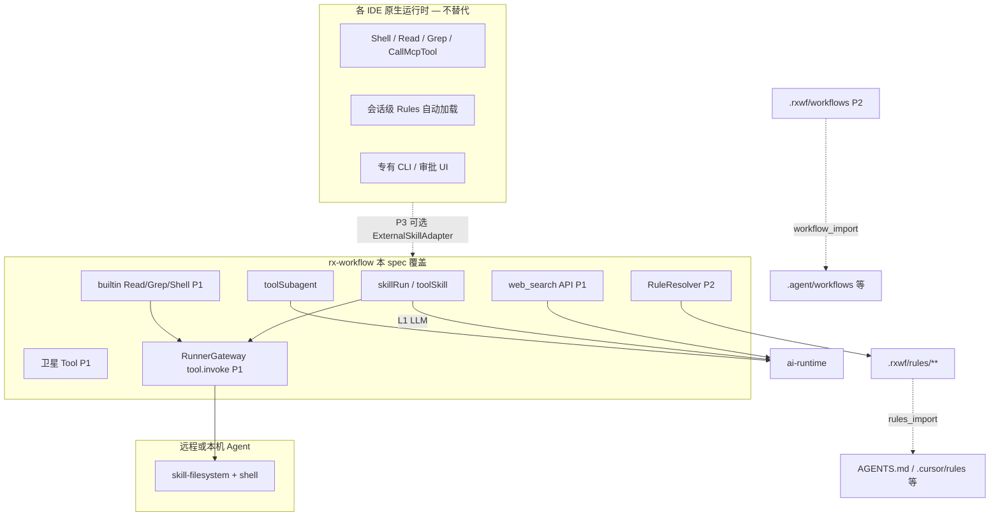

# Skill 集成 — 多平台对标矩阵

| 字段         | 内容                                                                                 |
| ---------- | ---------------------------------------------------------------------------------- |
| **状态**     | Draft — 与主 spec 同步维护                                                               |
| **日期**     | 2026-05-31                                                                         |
| **主 spec** | [2026-05-31-skill-integration-design.md](./2026-05-31-skill-integration-design.md) |
| **范围**     | Cursor、Claude Code、Codex、Antigravity、OpenCode、OpenClaw、AGENTS.md 开源标准              |

本文档描述 **当前设计 spec 对各 AI 编程平台的对标状态**（非已实现能力）。实现进度以主 spec 分阶段计划为准。

**最后同步主 spec**：2026-05-31（§3.4.2、§5.6、§6.7.10.1、§7.3、§17；§8.3 文档项已全部闭合）。

---

## 1. 总览

### 1.1 成熟度一览

| 平台                 | Spec 状态       | 计划阶段                       | 摘要                                                                                                  |
| ------------------ | ------------- | -------------------------- | --------------------------------------------------------------------------------------------------- |
| **rx-workflow 原生** | 🟢 定义方        | P1 `.rxwf/skills`；P2 全树    | `**.rxwf/`** skills/rules/agents/hooks/scripts/commands/**workflows**（§3.8）                         |
| **Cursor**         | 🟢 import+执行  | P1 Skill；P2 Rules+Subagent | **运行时仅 `.rxwf`**；`skill_import` 可读 `.cursor/...` → 装 `.rxwf/`                                       |
| **Claude Code**    | 🟢 import+执行  | P2 Skill                   | **Skill**：`.claude/skills` → `.rxwf/skills/`；**Context 不用 CLAUDE.md**，用 **AGENTS.md** / `agents.md` |
| **AGENTS.md（跨工具）** | 🟢 import+执行  | P2                         | `AGENTS.md` / `.agents/skills` **仅 import**；运行时 `rxwf_rules` only                                   |
| **OpenCode**       | 🟠 import P3  | P3 专用适配器；P2 通用 import   | `.opencode/skills` **非运行时**；`.agents/skills` 可走 P2 `skill_import`；`opencode.json` → denylist P3 |
| **OpenClaw**       | 🟠 import P3  | P3                         | 多路径 **仅 import** 合并至 `.rxwf/skills/`；不扫描 bundled/extraDirs                                          |
| **Codex**          | 🔴 MCP+import | 母 spec MCP                 | **无**原生目录；`skill_import` → `.rxwf/`                                                                 |
| **Antigravity**    | 🟡 import P2  | P2 Skill + **workflows**     | `.agent/skills|rules|workflows` **import** → `.rxwf/`；链式 workflow **编译 DAG**（§3.8.10）              |

图例：🟢 有明确章节与验收 · 🟡 部分覆盖 · 🟠 占位/调研 · 🔴 未设计

### 1.2 架构定位（rx-workflow 做什么、不做什么）

| 层级                | 业界常见形态                                           | rx-workflow 策略                                                    |
| ----------------- | ------------------------------------------------ | ----------------------------------------------------------------- |
| **Skill 执行**      | `SKILL.md` 目录包                                   | ✅ `SkillIR` + `SkillExecutor`                                     |
| **Rule / Memory** | `**AGENTS.md` / `agents.md`**（**无** `CLAUDE.md`） | ✅ P2 `RuleResolver`（**仅** `.rxwf/rules`）；Context **rules_import** |
| **Tool**          | IDE 内置 + MCP                                     | ✅ P1 卫星连线；P3 意图映射                                                 |
| **执行面**           | IDE 本机进程                                         | ✅ **L1 API + L2 远程/Embedded Agent**（§4.5）                         |
| **Subagent**      | Task / `mode: subagent`                          | ✅ P2 `toolSubagent`                                               |
| **编排**            | IDE workflows `.md` 链式技能                         | ✅ **DAG 执行** + `.rxwf/workflows/` 模板 import/编译（§3.8.10）              |

**原则**：复刻 **文件格式与加载语义**，不复刻 **完整 IDE Agent 运行时**。

### 1.2.1 运行时边界（与主 spec §3.3.1 一致）

| 能力                                                                                                                    | rx-workflow                                                     |
| --------------------------------------------------------------------------------------------------------------------- | --------------------------------------------------------------- |
| **Skill 执行 / 扫描**                                                                                                     | **仅** `{root}/.rxwf/skills/`**、`~/.rxwf/skills/**`              |
| **Rules 加载**                                                                                                          | **仅** `{root}/.rxwf/rules/**`、`~/.rxwf/rules/**`（`rxwf_rules`）  |
| **第三方目录**（`.cursor`、`.claude`、`~/.cursor`、`~/.claude`、`.agents`、`.opencode`、`~/.openclaw`、`.agent`、`~/.gemini/...` 等） | **不**运行时读取；**仅** `skill_import` / `rules_import` / `workflow_import` → `.rxwf/` |
| **安装目标**                                                                                                              | **仅** `{root}/.rxwf/` 或 `~/.rxwf/`；**不**写回 `~/.cursor/skills` 等 |
| **Context 标准**                                                                                                          | **仅** `AGENTS.md` / `agents.md`；**不**支持 `CLAUDE.md`（E1070） |
| **Skill 布局**                                                                                                            | 多级子目录 + symlink（§3.8.3）；`skillRelPath` 可含 `/` |

### 1.3 行业收敛趋势

多家工具向 **AgentSkills + AGENTS.md** 收敛：

| 层     | 常见载体                          | rx-workflow 对应                                                                       |
| ----- | ----------------------------- | ------------------------------------------------------------------------------------ |
| 可执行流程 | 各工具 `*/skills/*/SKILL.md`     | 运行时 **仅** `.rxwf/skills/**`；第三方 **skill_import**                                     |
| 持久约束  | `**AGENTS.md` / `agents.md**` | `InstructionContextIR` + `RuleResolver`（P2）；模块化 rules 用 `.cursor/rules` 等 **import** |
| 外部能力  | MCP                           | 已有 `toolMcp` + MCP Server（FR-16）                                                     |
| 多步编排  | workflows / DAG               | `.rxwf/workflows/*.workflow.yaml` + **import-to-workflow** → 平台 DAG（§3.8.10）                    |

参考：[agents.md](https://agents.md/)、[AgentSkills](https://agentskills.io/)（OpenClaw/OpenCode 等声明兼容）。

---

## 2. 分平台对标详情

### 2.1 Cursor

**Spec 成熟度：🟢 约 75–85% 行为覆盖（非 1:1 IDE）**

#### 路径与发现

| 能力           | Cursor 业界                                    | 主 spec                                               | 阶段  | 差距                                      |
| ------------ | -------------------------------------------- | ---------------------------------------------------- | --- | --------------------------------------- |
| Skill 包      | `{root}/.cursor/skills/`、`~/.cursor/skills/` | 🟡 **import** → `.rxwf/skills/`                      | P1  | 运行时 **不**读 `.cursor`；E1066              |
| 全局 Skill     | `~/.cursor/skills/`                          | 🟡 import → `~/.rxwf/skills/`                        | P1  | 执行用 `user://skills/...` 或 `~/.rxwf/...` |
| 项目 Rules     | `{root}/.cursor/rules/**`                    | 🟡 **rules_import** → `.rxwf/rules/imported/cursor/` | P2  | 运行时 `rxwf_rules` only；`alwaysApply` P3  |
| 内置 Skills 目录 | `~/.cursor/skills-cursor/`（系统）               | ❌ 不读取                                                | —   | 有意排除                                    |

#### 执行与 Tool

| 能力                         | Cursor 业界      | 主 spec              | 阶段  | 差距                                                               |
| -------------------------- | -------------- | ------------------- | --- | ---------------------------------------------------------------- |
| Skill 正文                   | → systemPrompt | ✅                   | P1  | —                                                                |
| Shell / Read / Grep        | IDE 内置         | ✅ §6.7 Runner 沙箱   | P1  | `filesystem:read` / `code:execute` 门控 |
| Web Search                 | IDE 内置         | ✅ §6.7.10 API 出站   | P1  | `network` → `web_search`；Provider + `credentialId`；E1071/E1072 |
| CallMcpTool                | IDE 内置         | ✅ `toolMcp` 卫星      | P1  | 须画布连线                                                            |
| Task（Subagent）             | 子 Agent 进程     | ✅ `toolSubagent`    | P2  | 内嵌 ReAct，非 Cursor 子进程                                            |
| 正文 → 自动 Tool               | 描述 + 内置能力      | P3 `toolIntentMode` | P3  | P1/P2 仅显式连线                                                      |
| `disable-model-invocation` | frontmatter    | 🟡 映射 `SkillIR`     | P1  | 需适配器读取                                                           |

#### 与 rx-workflow 其他能力

| 能力                | 说明                                                         |
| ----------------- | ---------------------------------------------------------- |
| MCP Server（FR-16） | Codex/Claude/Cursor 通过 MCP **反控工作流** — 母 spec，非本轨 Skill 执行 |
| 导出                | P3 导出至 `.cursor/skills/{name}/SKILL.md`                    |

---

### 2.2 Claude Code

**Spec 成熟度：🟢 Skill import；Context 走 AGENTS.md 标准（非 CLAUDE.md）**

#### Skill

| 能力      | Claude 业界                                    | 主 spec                        | 阶段  | 差距    |
| ------- | -------------------------------------------- | ----------------------------- | --- | ----- |
| Skill 包 | `{root}/.claude/skills/`、`~/.claude/skills/` | 🟡 import → `.rxwf/skills/`   | P2  | 运行时 ❌ |
| 全局      | `~/.claude/skills/`                          | 🟡 import → `~/.rxwf/skills/` | P2  | 同左    |

#### Memory / Rules（Claude 专有格式：本轨 **不支持**）

| 能力                   | Claude 业界                 | 主 spec                  | 阶段  | 差距                                                |
| -------------------- | ------------------------- | ----------------------- | --- | ------------------------------------------------- |
| `CLAUDE.md`          | 项目/用户/嵌套记忆文件              | ❌ **E1070**             | —   | 请用 `**AGENTS.md` / `agents.md**` + `rules_import` |
| `CLAUDE.local.md`    | 本地覆盖                      | ❌                       | —   | 合并进 `AGENTS.md` 后 import                          |
| `.claude/rules/**`   | 分模块规则                     | ❌                       | —   | 内容迁入 `AGENTS.md` 或 `.cursor/rules` 再 import       |
| 项目 Context（推荐）       | `AGENTS.md` / `agents.md` | 🟡 **agents_md** import | P2  | 与 §2.3 相同                                         |
| `/init` 生成 CLAUDE.md | CLI                       | ❌                       | —   | 不在本轨                                              |

#### 其他

| 能力        | Claude 业界         | 主 spec                 | 阶段    |
| --------- | ----------------- | ---------------------- | ----- |
| Subagent  | 内置子 Agent         | `toolSubagent`         | P2    |
| 外部 CLI 代理 | `claude` headless | `ExternalSkillAdapter` | P3 可选 |

---

### 2.3 AGENTS.md（开源跨工具标准）

**Spec 成熟度：🟢 约 75%（本轨「通用锚点」）**

| 能力           | 业界                                                    | 主 spec                            | 阶段  | 备注                                |
| ------------ | ----------------------------------------------------- | --------------------------------- | --- | --------------------------------- |
| 项目 Context   | `AGENTS.md`、`agents.md`、`**/AGENTS.md`、`**/agents.md` | 🟡 **rules_import**（`agents_md`）  | P2  | 两文件名**等价**；运行时 **仅** `rxwf_rules` |
| 嵌套 monorepo  | 多份 Context 文件                                         | 🟡 import → `imported/agents-md/` | P2  | import 可选 walk-up                 |
| 全局           | `~/.config/.../AGENTS.md` 等                           | 🟡 import → `~/.rxwf/rules/`      | P2+ | —                                 |
| Skill 包      | `{root}/.agents/skills/`、`~/.agents/skills/`          | 🟡 **skill_import**               | P2  | → `.rxwf/skills/`                 |
| 格式           | 自由 Markdown，无必填 schema                                | ✅                                 | P2  | —                                 |
| 用户 prompt 优先 | 规范要求                                                  | ✅ §3.7.5 优先级                      | P2  | —                                 |

**也服务于**：OpenCode Rules、Claude `@AGENTS.md`、Copilot 等（工具无关）。

---

### 2.4 OpenCode

**Spec 成熟度：🟠 约 40%（P2 通用路径 + P3 专用适配器）**

文档：[OpenCode Skills](https://opencode.ai/docs/skills/)、[Rules](https://opencode.ai/docs/rules/)

#### Skill 发现路径

| 路径                                               | OpenCode | 主 spec（运行时）              |
| ------------------------------------------------ | -------- | ------------------------ |
| `.opencode/skills/`、`~/.config/opencode/skills/` | ✅ 业界     | ❌ **仅 import** P3        |
| `.claude/skills/`、`~/.claude/skills/`            | ✅ 业界兼容   | ❌ 仅 import               |
| `.agents/skills/`、`~/.agents/skills/`            | ✅ 业界兼容   | ❌ 仅 import               |
| **执行**                                           | —        | ✅ **仅** `.rxwf/skills/** |

#### 其他能力

| 能力               | OpenCode                                 | 主 spec                                    | 阶段                                                        |
| ---------------- | ---------------------------------------- | ----------------------------------------- | --------------------------------------------------------- |
| Rules            | OpenCode 业界：`AGENTS.md` 优先（无 CLAUDE 链）   | 🟡 **仅** `AGENTS.md` / `agents.md` import | 与主 spec 一致；**不**实现 CLAUDE 回退                              |
| 自定义 instructions | `opencode.json`                          | ❌                                         | —                                                         |
| Skill 权限         | `permission.skill` 通配 allow/deny/ask     | ✅ **§9.1 五层**（非运行时通配）                     | L0 RBAC + L1 画布 + L2 `permissions` + denylist；凭证≠Skill 权限 |
| 原生 `skill` 工具    | 按需加载 SKILL                               | 🟡 `toolSkill` / `skillRun`               | 一次性加载，非渐进披露                                               |
| Subagent         | `.opencode/agents/*.md` `mode: subagent` | 🟡 `toolSubagent`                         | 无 agent md 文件解析                                           |
| Agent 权限         | `edit`/`bash` deny 等                     | 🟡 `toolSubagent.readonly`                | §9.1.5 子集                                                 |

**P3 OpenCodeAdapter**：**import only**（`.opencode/skills`、`opencode.json` → `.rxwf/`）；`permission.skill` → `skillDenylist` 元数据（§9.1.3）。

---

### 2.5 OpenClaw

**Spec 成熟度：🟠 约 35%（格式同构，私有特性缺失）**

文档：[OpenClaw Skills](https://docs.openclaw.ai/tools/skills)

遵循 **AgentSkills**：`SKILL.md` + YAML frontmatter（`name`、`description` 必填）。

#### Skill 路径与优先级（OpenClaw 业界）

| 优先级 | 路径（OpenClaw 业界）                                                  | 主 spec                                                  |
| --- | ---------------------------------------------------------------- | ------------------------------------------------------- |
| 1–6 | workspace/`skills`、`.agents`、`~/.openclaw`、bundled、`extraDirs` 等 | ❌ 运行时；🟡 **skill_import** 合并单包至 `.rxwf/skills/`（§3.9.3） |

#### 格式与运行时

| 能力                         | OpenClaw          | 主 spec     | 阶段                  |
| -------------------------- | ----------------- | ---------- | ------------------- |
| `metadata` 单行 JSON         | 必填（高级）            | ❌          | P3                  |
| `metadata.openclaw` 过滤     | env / binary / OS | ❌          | P3                  |
| `{baseDir}` 正文变量           | 路径替换              | ❌          | P3                  |
| `disable-model-invocation` | frontmatter       | 🟡 SkillIR | P1–P2               |
| `command-dispatch: tool`   | 直连工具              | ❌          | 可用 workflow tool 近似 |
| 名称冲突覆盖                     | 多源优先级             | ❌          | P3                  |

**OQ-1**（主 spec §12）：OpenClaw 目录与 frontmatter 差异 — 本矩阵纳入调研清单。

---

### 2.6 Codex

**Spec 成熟度：🔴 本轨几乎空白（母项目 MCP 客户端）**

| 能力                    | 业界（典型）                              | 主 spec / 母 spec                      |
| --------------------- | ----------------------------------- | ------------------------------------ |
| 工作流 MCP               | `mcp.json` → rx-workflow MCP Server | ✅ [spec.md FR-16](../../spec.md)     |
| 本地 Skill 目录规范         | 无统一公开标准（随宿主）                        | ❌ 本轨无                                |
| 执行 Skill 文件           | 依赖 IDE/CLI                          | 🟡 P3 MCP `skill_run` 间接             |
| AGENTS.md / agents.md | 若仓库存在                               | 🟡 **rules_import** → `.rxwf/rules/` |

**结论**：Codex 对标定位为 **MCP 控制面客户端**，不在 Skill 格式适配范围；文档中应显式声明，避免假对标。

---

### 2.7 Google Antigravity

**Spec 成熟度：🟡 约 55%（Skill/Rules P2；**Workflows P2** 已 spec）**

参考：[Authoring Antigravity Skills](https://codelabs.developers.google.com/getting-started-with-antigravity-skills)

#### 目录约定

| 能力        | Antigravity 业界                  | 主 spec                                                    |
| --------- | ------------------------------- | --------------------------------------------------------- |
| 项目 Skill  | `{root}/.agent/skills/`         | 🟡 **skill_import** → `.rxwf/skills/`                     |
| 全局 Skill  | `~/.gemini/antigravity/skills/` | 🟡 import → `~/.rxwf/skills/`                             |
| 兼容路径      | `.agents/skills`                | 🟡 import only                                            |
| Rules     | `{root}/.agent/rules/`**        | 🟡 **rules_import** → `.rxwf/rules/imported/antigravity/` |
| 团队定义      | `agents.md`（小写）                 | 🟡 与 `AGENTS.md` 等价，`agents_md` import                    |
| Workflows | `.agent/workflows/*.md`（如 `/startcycle`） | 🟡 **workflow_import** → `.rxwf/workflows/`；**import-to-workflow** 编译 DAG（P2）；P3 执行 |
| 平铺 skill  | `.agents/skills/*.md`（非目录）      | ❌                                                         |

#### 格式

| 字段                       | Antigravity   | 与 Cursor SKILL 对比 |
| ------------------------ | ------------- | ----------------- |
| `SKILL.md` + frontmatter | ✅             | 高度同构              |
| `description` 语义路由       | 强调 trigger 质量 | 同 Cursor          |
| `scripts/`、`references/` | 可选            | P2 scripts 可复用    |

**剩余**：slash 命令在 IDE 内原样保留；rx-workflow 通过 `commands/` + 编译 DAG 等价触发（P3）。

---

### 2.8 rx-workflow 原生 `.rxwf/`（主 spec §3.8）

**Spec 成熟度：🟢 一等公民（本轨定义方）**

| 子目录                     | 用途                                | 阶段                     | 说明                                                                                                                                         |
| ----------------------- | --------------------------------- | ---------------------- | ------------------------------------------------------------------------------------------------------------------------------------------ |
| `**skills/`**           | `SkillIR`，`sourceFormat: rxwf`    | **P1**                 | 扁平或**任意深度** `skills/**/{pkg}/SKILL.md`；`skillRelPath` 可含 `/`；支持 **symlink/junction**（§3.8.3）；导入后 `workspace://.rxwf/skills/{skillRelPath}` |
| `**rules/`**            | `rxwf_rules` → InstructionContext | **P2**                 | 含 `imported/cursor/` 等；**不**运行时读 `.cursor/rules`                                                                                           |
| `**agents/`**           | `AGENT.md` → `toolSubagent` 模板    | **P2**                 | 画布导入，非自动挂载                                                                                                                                 |
| `**scripts/`**          | 项目级 `script:*` Tool               | **P2**                 | 区别于 Skill 包内 `scripts/`                                                                                                                    |
| `**hooks/`**            | `*.hook.yaml` 生命周期声明              | P2 索引 / **P3** 执行      | `pre_skill_run` 等                                                                                                                          |
| `**commands/`**         | 用户快捷命令                            | P2 索引 / **P3** Web·CLI | 可触发 `workflow_execute`                                                                                                                  |
| `**workflows/`**        | 多步编排模板 → 编译 DAG                   | **P2** import/索引；**P3** 执行 | `*.workflow.yaml`；Antigravity `.agent/workflows/*.md` import                                                                                |
| `**rxwf.project.json`** | 默认 `ruleSources`、Skill 优先级        | P2                     | `workflows.enabled`                                                                                                                          |

全局：`~/.rxwf/skills/**/`、`~/.rxwf/rules/**`（P1/P2）；与项目树相同的嵌套与 symlink 规则。

仓库可同时存在 `.cursor/` 与 `.rxwf/`（IDE vs 工作流）；rx-workflow **只执行** `.rxwf/`（§3.3.1）。

---

### 2.9 RuleSource 速查（主 spec §3.9）

| `ruleSources`（运行时）         | 发现路径                                       | 说明     |
| -------------------------- | ------------------------------------------ | ------ |
| `**rxwf_rules`**（**唯一合法**） | `{root}/.rxwf/rules/`**、`~/.rxwf/rules/**` | §3.8.4 |

| 已废弃 `ruleSources` 值 | 原业界路径               | rx-workflow 做法                             |
| ------------------- | ------------------- | ------------------------------------------ |
| `agents_md`         | `AGENTS.md`、walk-up | **rules_import** → `.rxwf/rules/imported/` |
| `claude_md`         | `CLAUDE.md` 等       | **已移除** → **E1070**；请用 `agents_md`         |
| `claude_rules`      | `.claude/rules/`**  | **已移除** → **E1070**                        |
| `cursor_rules`      | `.cursor/rules/`**  | 同上                                         |
| `antigravity_rules` | `.agent/rules/**`   | 同上                                         |

`ruleMode=inherit` 时：若存在 `.rxwf/rules` 则加载 `**rxwf_rules` only**。`ruleMode=off` 为默认。废弃值 → **E1069**。

---

## 3. 能力维度矩阵（汇总）

| 维度                          | **rxwf 原生**          | Cursor               | Claude                | AGENTS.md               | OpenCode     | OpenClaw     | Codex      | Antigravity  |
| --------------------------- | -------------------- | -------------------- | --------------------- | ----------------------- | ------------ | ------------ | ---------- | ------------ |
| **Skill 执行**                | **P1 运行时** `.rxwf/skills/** | P1 🟡 import | P2 🟡 import | P2 🟡 import | P3 import | P3 import | MCP | P2 import |
| **Rules（Context）**          | **P2** `rxwf_rules` only | P2 import | ❌ 用 AGENTS | P2 AGENTS/agents | P2 import | P2 import | — | P2 import |
| **path-scoped rules**       | P3 `.rxwf` fm | P3 | P3 | P3 | ❌ | ❌ | — | P3 |
| **RuleResolver**            | ✅ 仅 `rxwf_rules` | ✅ | ✅ | ✅ | ✅ | ✅ | — | ✅ |
| **卫星 Tool**                 | P1 ✅ | P1 ✅ | P1 ✅ | P1 ✅ | P1 ✅ | P1 ✅ | — | P1 ✅ |
| **Read/Grep/Shell**         | P1 §6.7 | P1 | P1 | P1 | P1 | P1 | — | P1 |
| **Web Search**              | P1 §6.7.10 | P1 | P1 | P1 | P1 | P1 | — | P1 |
| **远程 Runner**               | P1 §4.5 | P1 | P1 | P1 | P1 | P1 | — | P1 |
| **Tool 意图**                 | P3 | P3 | P3 | P3 | P3 | P3 | — | — |
| **Subagent**                | P2 `toolSubagent` | P2 | P2 | — | P2 🟡 | — | — | — |
| **Workflow 模板**             | **P2** import+编译；**P3** 执行 | — | — | — | — | — | — | P2 源格式 |
| **MCP 反控**                  | FR-16 | FR-16 | FR-16 | FR-16 | FR-16 | — | FR-16 | — |
| **导出**                      | P3 | P3 | P3 Skill | P3 | — | — | — | — |

---

## 4. 主 spec 章节 → 平台映射

| 主 spec 章节                   | 主要对标平台                                                |
| --------------------------- | ----------------------------------------------------- |
| §3.8 / §3.8.10 `.rxwf/`       | skills…commands、**workflows** 模板                         |
| §3.3 / §3.8.3 Skill 目录发现    | **运行时仅** `.rxwf/skills/**/`（嵌套 + symlink）；第三方经 import |
| §3.7 Instruction Context 总览 | 全平台 Rule 轨                                            |
| §3.3.1 / §3.9 Rules         | 运行时 `rxwf_rules`；第三方 **import** 对照表                   |
| §3.10 toolSubagent          | Cursor Task、OpenCode subagent                         |
| §4.5 远程 Runner              | ADR-006 Agent；`runner.tool.invoke`                    |
| §9.1 Skill 权限分层             | OpenCode `permission.skill`、RBAC、凭证正交                 |
| §6.7 / §6.7.10 builtin       | Read/Grep/Shell（Runner）；Web Search（API）              |
| §6 Tool 处理                  | 卫星 MCP + builtin + P3 意图                              |
| §8 MCP                      | 含 **Codex**                                           |
| §12 OQ-1/4/5                | OpenClaw、`.mdc`、`.rxwf` `@import`                     |

**远程 Runner**：已纳入主 spec §4.5（实现待 P1）。**仍待实现（已 spec）**：OpenCode/OpenClaw **import 适配器** P3（§3.9.3）；`workflow_run` **执行器** P3（§5.6 已写 Schema）。Workflow import/编译：§3.8.11–12。

---

## 5. 实施阶段与平台可用性

| 阶段      | 预期可用能力                                                                                                          | 主要平台                |
| ------- | --------------------------------------------------------------------------------------------------------------- | ------------------- |
| **P1**  | `skillRun` + §4.5 Runner + §6.7 builtin（含 **web_search**）+ 卫星；AC-S1b / **AC-S1d**                              | Cursor              |
| **P2**  | + `rxwf_rules`、`skill_import`/`rules_import`/`workflow_import`、注册中心、`toolSkill`/`toolSubagent`、AC-S2/S2b/S2c | 全平台 → `.rxwf/` |
| **P3**  | + path-scoped、Tool 意图、MCP、OpenCode/OpenClaw import、**workflow 执行**、导出 | + OpenCode、OpenClaw |
| **未排期** | Codex 专有格式                                                                                                       | 见 §6                |

**当前实现状态**：代码 **零实现**；验收 AC-S1/S1d/S2/S2c/S3 均为设计目标。

---

## 6. 设计覆盖清单（主 spec 已写入）

| 状态          | 内容                                                          | 阶段       |
| ----------- | ----------------------------------------------------------- | -------- |
| ✅ 已纳入主 spec | `RuleResolver`（**仅** `rxwf_rules`）+ import 适配器（§3.3.1、§3.9） | P2       |
| ✅ 已纳入       | **§3.3.1** 全平台第三方路径仅 import、运行时仅 `.rxwf/`                   | P1–P3    |
| ✅ 已纳入       | `ruleInject` / `ai_instruction`                             | P2       |
| ✅ 已纳入       | Read / Grep / Shell **builtin**（§6.7）                       | P1       |
| ✅ 已纳入       | **Web Search** `web_search`（§6.7.10，AC-S1d）                | P1       |
| ✅ 已纳入       | **远程 Runner**（§4.5、`runner.tool.invoke`、AC-S1b）             | P1       |
| ✅ 已纳入       | **Skill 权限五层**（§9.1，含 OpenCode denylist）                    | P1–P3    |
| ✅ 已纳入       | `.rxwf/` 全树（含 **workflows/**）                          | P1–P3    |
| ✅ 已纳入       | Context **仅** AGENTS.md / agents.md（无 CLAUDE.md）        | P1–P2    |
| ✅ 已纳入       | `.rxwf/skills` **多级子目录** + **符号链接**（§3.8.3）                 | P1       |
| ✅ 已纳入       | **`.rxwf/workflows/`** + `workflow_import`（§3.8.10，AC-S2c）       | P2       |
| **中**       | `OpenCodeAdapter` + `opencode.json` instructions            | P3       |
| **中**       | `OpenClawAdapter` 路径 + `metadata.openclaw`                  | P3       |
| **中**       | path-scoped rules（`contextPaths`）                           | P3       |
| **中**       | `.rxwf/rules` `@import`（非 CLAUDE.md）                        | P3（OQ-5） |
| **低**       | `.mdc` `alwaysApply: false` 尊重                              | P3（OQ-4） |
| **低**       | Antigravity import 增强（全局 `~/.gemini/...` 源）                 | P2–P3    |
| **文档**      | Codex：仅 MCP                                                 | 母 spec   |

---

## 7. 与主 spec 的同步

| 主 spec 已确认决策                         | 本矩阵               |
| ------------------------------------ | ----------------- |
| `ruleMode` 默认 `off`                  | §2.3、§2.4、§2.9   |
| 运行时 **仅** `rxwf_rules`（非五源 discover） | §2.9、§3 矩阵      |
| 第三方 **仅 import** → `.rxwf/`          | §1.2.1、§2 各平台   |
| P2 `toolSubagent`                    | §2.1、§2.2         |
| P1 builtin + §4.5 + Web Search API   | §2.1、§3、§6.7/6.7.10 |
| P2 workflows import + 编译 DAG       | §2.7、§2.8、§3     |
| OpenCode/OpenClaw P3 import 适配器     | §2.4、§2.5、§6      |

主 spec 修订时，应更新 **§1.1**、**§3**、**§5**、**§8**，并在 **§9** 修订记录登记。

---

## 8. Spec 完善度与审阅结论

### 8.1 审阅结论（2026-05-31）

| 结论 | 说明 |
|------|------|
| **可进入实施计划** | 架构与 P1/P2 验收已闭合；§8.3 文档项已闭合 |
| **实施计划** | [2026-05-31-skill-integration.md](../plans/2026-05-31-skill-integration.md)（Phase 1–3，22 Task） |
| **实现状态** | 代码零实现；本矩阵与主 spec §16 一致 |

### 8.2 验收标准一览（主 spec §1.3）

| ID | 阶段 | 要点 |
|----|------|------|
| AC-S1 | P1 | `.rxwf/skills` 执行；拒绝 `.cursor`（E1066） |
| AC-S1b | P1 | 远程 Runner + `workspaceRoot` 本机路径 |
| AC-S1c | P1 | 嵌套 skills + symlink |
| AC-S1d | P1 | `web_search` + `network` + Provider |
| AC-S2 | P2 | `rxwf_rules` only |
| AC-S2b | P2 | `skill_import` from `.cursor` |
| AC-S2c | P2 | `workflow_import` + DAG 编译 |
| AC-S3 | P3 | 导出、MCP、意图解析、workflow 执行 |

### 8.3 主 spec 待完善项（优先级）

**状态**：2026-05-31 文档项 **已全部闭合**；仅剩 **代码实现** 阻塞交付。

| 项 | 优先级 | 状态 | 主 spec 锚点 | 阻塞实施计划？ |
|----|--------|------|-------------|----------------|
| Antigravity workflow Markdown 解析 | 中→✅ | **已闭合** | §3.8.11；fixture [`antigravity-startcycle.source.md`](../fixtures/workflows/antigravity-startcycle.source.md) | 否 |
| `WorkflowCompiler` 输出 JSON | 中→✅ | **已闭合** | §3.8.12；fixture [`startcycle.compiled.linear_skillRun.json`](../fixtures/workflows/startcycle.compiled.linear_skillRun.json) | 否 |
| 错误码 E1040–E1076 合并附录 | 低→✅ | **已闭合** | **§17**；§5.4 高频子集 | 否 |
| `instruction_contexts` 表 DDL | 低→✅ | **已闭合** | §7.3（字段、索引、`reindex` API、迁移路径） | 否 |
| `settings.webSearch` 与母 spec 对齐 | 低→✅ | **已闭合** | §6.7.10.1 + `workflow-definition.v1` 扩展说明 | 否 |
| OpenCode P2 import（无专用适配器） | 低→✅ | **已闭合** | §3.4.2（P2 `skill_import` / `agents_md`；P3 专用适配器） | 否 |
| `workflow_run` 节点 §5 Schema | 低→✅ | **已闭合**（执行器 P3） | §5.1、**§5.6**；E1076 | 否 |
| **代码实现** | — | ❌ 未开始 | Phase 1–4 任务表（主 spec §10–11） | **是** |

**实施计划可引用**：上表「主 spec 锚点」列即各任务的 spec 入口；无需再补 Draft。

### 8.4 错误码速查

**完整表**：主 spec **[§17](2026-05-31-skill-integration-design.md#17-附录-c--skill-轨错误码合并表e1040e1076)**（E1040–E1076 + 相关 E1005/E1023/E2010 注记）。

**高频（P1 冒烟）**：

| 码 | 含义 |
|----|------|
| E1040–E1043 | `skillRun` 配置 / 解析 / 权限 / Model |
| E1055–E1061 | Runner / builtin / 远程 invoke |
| E1066–E1067 | 非 `.rxwf` 路径 / 包目录层级 |
| E1071–E1072 | `web_search` Provider / `network` |
| E1073–E1076 | workflow 模板 / `workflow_run` |

**Rules / import（P2）**：E1046–E1047、E1069–E1070、E1068。§5.4 保存校验子集。

---

## 9. 修订记录

| 日期         | 变更                                                                  |
| ---------- | ------------------------------------------------------------------- |
| 2026-05-31 | 初稿：七平台对标矩阵、能力汇总、补 spec 建议                                           |
| 2026-05-31 | 同步主 spec §3.9 Rules：Claude/Cursor/Antigravity rules；更新成熟度与 §3/§5/§6 |
| 2026-05-31 | 同步 §6.7：Shell/Read/Grep 标为 P1 builtin（Runner 沙箱）                    |
| 2026-05-31 | 同步 §4.5：远程 Runner、`tool.invoke`、架构图与 §3 矩阵行                         |
| 2026-05-31 | 同步 §9.1：OpenCode `permission.skill` → 五层模型 + denylist（非「凭证代替」）      |
| 2026-05-31 | 新增 §2.9 `.rxwf/` 原生目录；`rxwf_rules` 入 §2.8                           |
| 2026-05-31 | 同步 §3.8.3：`.rxwf/skills` 多级目录、`skillRelPath`、symlink/junction       |
| 2026-05-31 | 同步 §3.3.1：第三方 Skill/Rule **仅 import**；§2/§3 矩阵与 §2.8 废弃多源运行时        |
| 2026-05-31 | 同步主 spec：**去掉 `CLAUDE.md`**；Context **仅** `AGENTS.md` / `agents.md` |
| 2026-05-31 | 同步 §6.7.10：**Web Search** builtin（`web_search`、`network`、AC-S1d） |
| 2026-05-31 | 同步 §3.8.10：**workflows**；Antigravity `.agent/workflows` import + 编译 DAG |
| 2026-05-31 | **§8** 审阅结论、AC 一览、待完善项、错误码速查；§3 增 **rxwf 原生**列；修正 §7 同步表 |
| 2026-05-31 | 章节重排：原 §9/§10 → §8/§9；主 spec §16 交叉引用对齐 |
| 2026-05-31 | §8.3：WorkflowCompiler / Antigravity 附录已补（主 spec §3.8.11–12 + fixtures） |
| 2026-05-31 | **§8.3 全部闭合**：§3.4.2、§5.6、§6.7.10.1、§7.3、§17；§8.4 指向 §17 |

