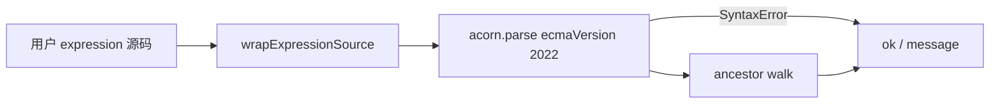

# 表达式静态校验升级设计

| 字段 | 内容 |
|------|------|
| **状态** | Implemented |
| **日期** | 2026-06-03 |
| **关联** | [JS 表达式 globals](./2026-06-03-js-expression-globals-design.md) §6.4、`packages/expression/src/validate-expression-source.ts` |
| **替代** | 纯正则 `FORBIDDEN_PATTERNS` 扫描 |

---

## 1. 背景

当前 `validateExpressionSource` 用正则匹配禁止标识符，存在：

- **误报**：字符串含 `process` 等词（如 `"process finished"`）
- **漏报**：未校验 JS 语法；`Function('...')` 等间接构造
- **难维护**：与合法属性名、模板字符串冲突

运行期安全仍由 **`isolated-vm`** 保障；本升级改善 **保存期 UX** 与 **校验准确性**（纵深防御）。

---

## 2. 目标与非目标

### 2.1 目标

- 用 **AST 解析**（acorn）替代正则作为权威校验
- 与运行期一致：先 `wrapExpressionSource`，再 parse（同 `evaluate-js.ts`）
- 保存工作流时报告 **语法错误** + **禁止构造**
- 消除字符串/对象字面量 key 的误报

### 2.2 非目标

- 完整 ESLint/类型检查
- 证明无沙箱逃逸（仍依赖 ivm）
- 校验 Code 节点 `jsCode`（仍由 Code 路径单独处理）

---

## 3. 技术选型

| 选项 | 结论 |
|------|------|
| **acorn + acorn-walk** | ✅ 选用：纯 JS、体积小、仅 parse + walk |
| esbuild transform | 过重；monorepo 未统一依赖 |
| 保留正则 | ❌ 仅作可选快速预筛（本阶段不保留） |

依赖：`acorn@^8`、`acorn-walk@^8` → `@rxwf/expression`。

---

## 4. 校验流程



1. 空字符串 → `{ ok: false, message: 'Expression source is empty' }`
2. `wrapExpressionSource(trimmed)` — 与 `evaluateJsExpression` 相同包装
3. `acorn.parse` — 失败 → `Invalid expression syntax: …`
4. AST walk — 命中禁止规则 → `Expression contains forbidden syntax: …`

---

## 5. 禁止规则（与 globals spec §6.3 对齐）

### 5.1 禁止标识符（作为 **引用** 使用时）

`process`, `globalThis`, `require`, `eval`, `fetch`, `XMLHttpRequest`, `WebSocket`, `setTimeout`, `setInterval`, `queueMicrotask`

**判定为「引用」**（需拦截）：

| AST 位置 | 示例 |
|----------|------|
| `CallExpression.callee` 为 `Identifier` | `fetch()`, `eval()` |
| `MemberExpression` 链 **根对象** 为禁止 `Identifier` | `process.exit()`, `globalThis.x` |
| 表达式中的独立 `Identifier`（非声明、非绑定） | `return process` |
| `NewExpression.callee` 为 `Function` | `new Function('')` |

**不拦截**（避免误报）：

| 场景 | 示例 |
|------|------|
| 字符串字面量 | `"process finished"` |
| 对象字面量 **非 computed key** | `{ process: 1 }` |
| 成员访问 **属性名** | `$json.process`, `item.process` |
| 函数/变量 **声明名** | `const fetch = 1`（仍允许声明 shadow？— **拦截** 声明名与禁止词相同，避免混淆） |
| 注入全局 `$json` 等 | 允许任意 `$` 前缀标识符 |

> **声明名**：若 `VariableDeclarator.id` / 函数名为禁止词，仍拒绝（`const process = 1`），与沙箱「不提供该全局」一致。

### 5.2 禁止语法节点

- `ImportDeclaration`
- `ImportExpression`（动态 `import()`）

### 5.3 禁止调用

- `eval(...)`
- `Function(...)` / `new Function(...)`

---

## 6. API（不变）

```ts
type ValidateExpressionSourceResult =
  | { ok: true }
  | { ok: false; message: string };

function validateExpressionSource(source: string): ValidateExpressionSourceResult;
```

`scanExpressionSources` / `validateWorkflowExpressionSources` / `workflow/validate` **无需改签名**。

---

## 7. 测试矩阵

| 用例 | 期望 |
|------|------|
| `return $json.x` | ok |
| `process.exit()` | reject |
| `import("fs")` | reject |
| `fetch("http://x")` | reject |
| `return $json.msg === "process finished"` | ok（修复正则误报） |
| `return { process: 1 }` | ok |
| `return $json.process` | ok |
| `return (` | reject（语法） |
| `async () => await Promise.resolve(1)` | ok（若包装后合法） |

---

## 8. 文档更新

- [js-expression-globals-design.md](./2026-06-03-js-expression-globals-design.md) §10：移除「正则非 esbuild」为长期差异，改为 acorn 已实施
- §6.4 文本与实现对齐

---

## 9. 变更记录

| 版本 | 日期 | 说明 |
|------|------|------|
| 1.0 | 2026-06-03 | 初稿 Accepted |
| 1.1 | 2026-06-03 | 已实施：acorn 校验器 + 测试 |
| 1.2 | 2026-06-03 | 与 [implicit-return](./2026-06-03-expression-implicit-return-design.md) 共用 `classify-expression-source`；多语句 `return` 校验 |
