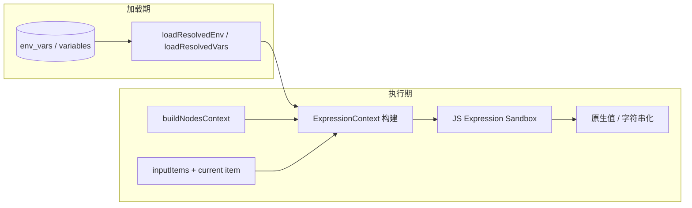

# JS 表达式引擎与全局变量（`{{ }}`）设计

| 字段 | 内容 |
|------|------|
| **状态** | Implemented |
| **日期** | 2026-06-03 |
| **关联** | [ADR-004](../../adr-expression-sandbox.md)、FR-9 [spec.md](../../spec.md)、`@rxwf/expression`、[实施计划](../plans/2026-06-03-js-expression-engine.md)、[隐式 return 修订](./2026-06-03-expression-implicit-return-design.md) |
| **前置决策** | 方案 **A**（专用 JS 沙箱，非 Code 运行时）；**A2**（`async/await`，无网络）；**B1**（`$` 前缀全局）；**不向后兼容** |

---

## 1. 目标与非目标

### 1.1 目标

- 将 `{{ }}` 内求值改为 **JavaScript 表达式/脚本片段**（专用沙箱），支持复杂逻辑（分支、循环、数组方法、`async/await`）。
- 表达式返回值可为 **任意 JSON 可序列化类型** 及 **binary 结构**（见 §5）。
- 统一 **所有节点** 的 `{{ }}` 处理路径（全量模板、嵌入模板、`expression` 模式字段、`resolveTemplateJson` 等）。
- 重新定义并文档化运行时全局：`$env`、`$vars`、`$nodes`、`$input`、`$json`、`$binary`，并扩展执行元数据全局（§4.6）。
- **`$vars` 维持现状**：仅字符串；存储、API、UI **本阶段不变**。

### 1.2 非目标（本阶段）

- 不把 `{{ }}` 并入 Code 节点子进程（方案 C 已否决）。
- 不在表达式沙箱内开放 `fetch` / `require` / 文件系统（A2）。
- 不实现 n8n 全套扩展方法（如 `extractEmail()`、`toFormat()` 链）；仅提供 **标准 JS + 可选少量内置辅助**（§6）。
- 不保证与旧版自研 AST 表达式语法兼容（已确认 **零兼容**）。

---

## 2. 现状（as-is）确认

### 2.1 求值管线（实施后）

| 入口 | 包/文件 | 行为 |
|------|---------|------|
| 全量 `{{ expr }}` / `={{ expr }}` | `evaluateExpression` → `evaluateJsExpression` | `isolated-vm` JS 沙箱 |
| 嵌入 `"...{{ expr }}..."` | `resolveTemplateString`（async） | 每段 JS 求值 + `toDisplayString` |
| JSON 含模板 | `resolveTemplateJson`（async） | 递归 `resolveTemplateValue` |
| 条件节点 | `evaluateCondition`（async） | `Boolean(await evaluateExpression(...))` |
| 按 item | `itemExpressionContext` + 各 executor | 每 item 注入 `json`/`binary`/`itemIndex`/meta |

### 2.2 上下文注入（执行引擎 → node-runner）

`execution-engine` / `run-debug-execution` 通过 `buildNodesContext` 构建 `nodes`，传入 `NodeExecutionContext`：

- `env`、`vars`：`loadResolvedEnv` / `loadResolvedVars` → **`Record<string, string>`**（层叠：global < user < workflow）。
- `inputItems`：当前节点主输入分支的 `WorkflowItem[]`。
- 逐 item 求值时：`json` = 当前 item 的 `json`；`input` = 完整输入数组。

### 2.3 `NodeOutputEntry`（`$nodes` 数据源）

```ts
interface NodeOutputEntry {
  name: string;           // 节点显示名（workflow 内唯一）
  json: Record<string, unknown>;  // 主分支第一项 json 快捷方式
  items: WorkflowItem[];          // 主分支全部 items
}
```

- 仅包含 **当前节点拓扑序之前** 已执行节点。
- **无** `.binary` 快捷字段；binary 在 `items[i].binary` 内。
- 节点名匹配区分大小写（与画布 `name` 一致）。

### 2.4 缺口（相对本设计）— 2026-06-03 实施后

| 能力 | 实施前 | **实施后** |
|------|--------|------------|
| `$binary` | 未暴露 | ✅ `buildBootstrapData` + `BOOTSTRAP_SCRIPT` 注入 |
| `$execution` / `$workflow` | 未实现 | ✅ `ExpressionContext` + `expressionMetaFromNodeContext` |
| `$vars` | 字符串 | ✅ 不变（字符串） |
| `$input` 语义 | 仅 `$input[0].json` 路径 | ✅ `InputProxy`（`all/first/last/item/下标`） |
| JS 求值 | 自研 AST | ✅ `isolated-vm`；`parse-eval.ts` 已删除 |
| 保存校验 | 无 JS 扫描 | ✅ `validateWorkflowExpressionSources` → `workflow/validate` |
| 嵌入 binary 占位 | 无 | ✅ `toDisplayString` → `[binary:key]` |
| Set 写入 binary | 未定义 executor 行为 | ⚠️ **仍仅透传** input binary；表达式返回 BinaryMap 写入 output 见 [binary support design](./2026-06-03-workflow-binary-support-design.md) |

### 2.5 相关但独立的能力

- **`$fromAI(...)`**：在 `packages/expression/src/from-ai.ts` 做 **执行前字符串替换**，不是运行时全局；本设计 **保留** 该预处理，与 JS 沙箱正交。
- **Code 节点**：`packages/sandbox` worker 内 `$input`/`$env`/`$vars`/`$nodes`；`$vars` 仍为 `Record<string, string>`，运行时与表达式沙箱分离。

---

## 3. 外部调研摘要（n8n 等）

| 全局/API | n8n | 本设计取向 |
|----------|-----|------------|
| `$json` | 当前 item json，≈ `$input.item.json` | **保留**，与 `$input.item` 同步 |
| `$binary` | 当前 item binary | **新增** 一等全局 |
| `$input` | `.all()` / `.first()` / `.last()` / `.item` | **采用包装对象**（§4.4） |
| `$('Name')` | 按名取前序节点 | **不采用**；统一 `$nodes["Name"]` |
| `$node` / `$nodes` | 历史命名混用 | 统一 **`$nodes`**（Map 语义） |
| `$env` | OS/实例环境变量（字符串） | **保留字符串** |
| `$vars` | 项目变量（UI 配置） | **维持字符串**（与现网一致） |
| `$execution` | id、mode、resumeUrl 等 | **最小子集**（§4.6） |
| `$workflow` | id、name、active 等 | **最小子集** |
| `$itemIndex` | 当前 item 下标 | **建议 v1 纳入** |
| `$now` / `$today` | Luxon 对象 | **v1.1**（可选 `Date` 简易版） |
| `$parameter` | 当前节点参数 | **不实现**（避免循环依赖与产品复杂度） |

---

## 4. 运行时全局变量规范（B1）

表达式沙箱在求值前注入以下 **const 全局**（不可赋值覆盖）。用户代码为严格模式下的 async 函数体。单行**表达式**可省略 `return`（宿主隐式 `return <expr>`）；多语句块须手写 `return`（详见 [隐式 return 设计](./2026-06-03-expression-implicit-return-design.md)）。

### 4.1 `$env` — 环境变量

| 项 | 说明 |
|----|------|
| 类型 | `Record<string, string>`（只读视图） |
| 访问 | `$env.KEY`、`$env["KEY"]` |
| 解析 | 与现网一致：global < user < workflow × `test`/`prod` 环境 |
| 注意 | **永远是字符串**；数值比较用 `Number($env.X)` 或把数字写成 `$vars` 字符串再 `Number($vars.X)` |

### 4.2 `$vars` — 工作流变量（维持现状）

| 项 | 说明 |
|----|------|
| 类型 | `Record<string, string>`（只读视图） |
| 访问 | `$vars.KEY`、`$vars["KEY"]`（**扁平键**，不支持 `$vars.A.B` 嵌套路径） |
| 解析 | 与现网一致：global < user < workflow × `test`/`prod`；`loadResolvedVars` → `Record<string, string>` |
| 存储 / API / UI | **本阶段不改动**（`variables.value` 仍为 TEXT 字符串） |
| 不存在 KEY | `undefined`（与 JS 一致） |

> 多类型变量（bool / object / binary 等）列为 **后续迭代**，不在本 spec 范围内。

### 4.3 `$nodes` — 前序节点输出

#### 4.3.1 结构

运行时类型（示意）：

```ts
type NodesProxy = Record<string, NodeOutputProxy>;

interface NodeOutputProxy {
  readonly name: string;
  readonly json: Record<string, unknown>;   // items[0].json ?? {}
  readonly binary: BinaryMap | undefined;   // items[0].binary
  readonly items: readonly WorkflowItem[];
  first(): WorkflowItem | undefined;
  all(): WorkflowItem[];
  last(): WorkflowItem | undefined;
}
```

#### 4.3.2 访问示例

```js
$nodes["HTTP Request"].json.status
$nodes["HTTP Request"].binary.data
$nodes["HTTP Request"].items[1].json.id
$nodes["HTTP Request"].all().map(i => i.json)
```

#### 4.3.3 规则

| 规则 | 说明 |
|------|------|
| 键 | 节点 **显示名**（与画布一致）；不存在 → `undefined`（访问 `.json` 会抛错） |
| 多输出分支 | v1 仅 **主输出分支（index 0）**；与现 `buildNodesContext` 一致 |
| 重名 | 工作流校验阶段拒绝重复节点名（已有/需强化） |
| 大小写 | 敏感 |

**不采用** n8n `$("Name")` 语法糖，避免与 JS 函数调用解析冲突；文档提供对照表。

### 4.4 `$input` — 当前节点输入

包装对象（非裸数组），与 n8n 对齐：

```ts
interface InputProxy {
  readonly all: () => WorkflowItem[];
  readonly first: () => WorkflowItem | undefined;
  readonly last: () => WorkflowItem | undefined;
  readonly item: WorkflowItem;       // 当前 item（与 $json/$binary 一致）
  readonly itemIndex: number;
  readonly length: number;
  readonly [index: number]: WorkflowItem;  // $input[0] 兼容
}
```

- Merge 等多输入节点：v1 **仅主分支**进入 `$input`（与现执行器一致）；分支语义在 Merge 专规中另述。

### 4.5 `$json` / `$binary` — 当前 item

| 全局 | 类型 | 说明 |
|------|------|------|
| `$json` | `Record<string, unknown>` | 当前 item 的 `json` 引用（只读视图） |
| `$binary` | `BinaryMap \| undefined` | 当前 item 的 `binary`；结构同 `WorkflowItem.binary` |

```ts
type BinaryMap = Record<string, {
  data: string;      // base64
  mimeType: string;
  fileName?: string;
}>;
```

### 4.6 v1 扩展全局（已确认纳入）

| 全局 | 类型 | 字段 |
|------|------|------|
| `$itemIndex` | `number` | 当前 item 在输入列表中的下标；等价 `$input.itemIndex` |
| `$execution` | object | `id`, `mode`（`manual`/`production`/…）, `environment`（`test`/`prod`）, `startedAt`（ISO 字符串） |
| `$workflow` | object | `id`, `name`, `versionId?` |

**v1.1 已纳入**：`$now`、`$today`（ISO 字符串）。**不纳入**：`$parameter`。

### 4.7 明确不提供的全局

- `process`、`globalThis`、`require`、`import`
- `fetch`、`XMLHttpRequest`
- `constructor`、`__proto__` 链攻击面（沙箱冻结原型）

---

## 5. 表达式返回值与字段语义

### 5.1 求值入口（统一 API）

所有路径最终调用同一函数（示意）：

```ts
evaluateJsExpression(
  source: string,           // 已 unwrap 的 JS 源码或自动包裹后的体
  context: ExpressionContext,
  options?: { awaitResult?: boolean },  // 默认 true：顶层 Promise 自动 await
): unknown
```

- 废弃 `evaluateInnerExpression`（AST）；`evaluateExpression` / `resolveTemplateString` 等改为调用 `evaluateJsExpression`。
- 用户脚本由宿主包装为 async IIFE（见 [隐式 return 设计](./2026-06-03-expression-implicit-return-design.md)）：单 `ExpressionStatement` → `return <expr>`；否则整段作为函数体，**保证**顶层 `async` 结果可被 await。

### 5.2 按使用场景的行为

| 场景 | 输入形态 | 返回值 |
|------|----------|--------|
| 整段 `{{ expr }}` / `={{ expr }}` | 单模板 | **原生 JS 值**（`unknown`） |
| `expression` 模式字段 | 可为完整模板，或 **裸 JS**（无 `{{ }}`） | 原生值；裸 JS 时宿主自动包为 `{{ ... }}` 再 unwrap（与现 IF `ensureIfConditionTemplate` 一致，推广到所有 `expression` 字段） |
| `fixed` 模式字符串含嵌入 `{{ }}` | 混合文本 | 整体结果为 **string**；每段嵌入按 `toDisplayString` |
| IF / Switch 条件 | 同上 | `Boolean(原生值)`；`0`/`""`/`null` 为 false |
| `resolveTemplateJson` | JSON 或 `={{ object }}` | 对象/数组直接合并；标量包 `{ value }` 规则保留（仅当整段求值结果非 object） |

### 5.3 `toDisplayString`（嵌入模板专用）

| 运行时类型 | 字符串化规则 |
|------------|----------------|
| `null` / `undefined` | `''` |
| `string` | 原样 |
| `number` / `boolean` | `String(value)` |
| `object` / `array` | `JSON.stringify` |
| `BinaryMap` / 单附件 | `[binary:<key>]` 或 `mimeType` 摘要；**禁止** 默认输出 base64 全文 |
| `Promise`（不应出现） | 宿主在嵌入替换前已 await；若仍残留则 `E1002` |

### 5.4 节点边界类型约束

Executor 在拿到表达式结果后按字段类型做 **最小强制**（不改变沙箱语义）：

| 字段用途 | 约束 |
|----------|------|
| URL、Header 名、路径片段 | `String(...)` |
| JSON body / Set fields | 对象为 object；否则尝试 `JSON.parse(String)` 或失败 `E1002` |
| 条件 | `Boolean(...)` |

### 5.5 Binary 作为返回值

- 允许求值结果为 `BinaryMap`（与 `WorkflowItem.binary` 同形）。
- 仅 **明确支持 binary 输出的节点**（如 Set、部分 Transform）把结果写入 item.`binary`；HTTP 等仍以 string/json 为主。
- 嵌入模板中引用 `$binary` 走 §5.3 占位规则。

### 5.6 与 `$fromAI` 的次序

1. `substituteFromAiInString`（工具参数等）
2. JS 表达式求值

---

## 6. JS 沙箱（方案 A + A2）

### 6.1 选型：**S1 — `isolated-vm` 同进程**

| 项 | 表达式沙箱 | Code 节点（不变） |
|----|------------|-------------------|
| 隔离 | `isolated-vm` Isolate，**同进程**、可复用 isolate 池 | Piscina **子进程** + worker 内 `new Function` |
| 原因 | 每 item/字段可能求值数十次，需毫秒级 | 脚本更长、能力更接近完整 JS |

**不采用** S2（主线程 `new Function`）、S3（每表达式起子进程）。

### 6.2 注入与编译

1. 从 `ExpressionContext` 构建 **ivm 外部拷贝** 的 globals（`$json`、`$nodes` 等；大对象用 `ExternalCopy` / `Reference`）。
2. 用户源码 → 校验（§6.4）→ `ivm.compileScript` 或 `runInContext`。
3. 默认 **memory limit**（如 32MB/isolate）。**不设表达式执行超时**（不向 `ivm` 传入 timeout；无 `RXWF_EXPRESSION_TIMEOUT_MS`）。

### 6.3 能力边界（A2）

**允许**：语句块、`if/for/while`、`async/await`、箭头函数、`Math`/`JSON`/`Date`/`Array`/`Map`/`Set`、`RegExp`、模板字符串、可选链、空值合并。

**禁止**（静态 + 运行期）：

- `import` / `require` / `process` / `globalThis`（用户代码内）
- `fetch`、`XMLHttpRequest`、`WebSocket`
- `setTimeout` / `setInterval` / `queueMicrotask` 等（避免沙箱内自建调度；表达式侧也无超时兜底）
- 用户侧 `eval` / `new Function`

**`async/await`**：仅用于用户自定义 async 函数或 Promise 链；沙箱 **不提供** 预置异步 IO API。

**超时策略**：表达式 **不配置运行超时**。长时间运行依赖用户逻辑自控；工作流级 **取消执行**（若平台已实现）通过终止整个 execution 间接打断。Code 节点仍保留既有超时（与子进程模型一致，见 ADR-004 §4）。

### 6.4 静态校验（保存 + 可选执行前）

- 扫描工作流定义中所有含 `{{ }}` 的字符串及 `expression` 模式字段（裸 JS 一并扫描）。
- 解析器：**acorn** + `acorn-walk`（`validateExpressionSource`）；拒绝禁止标识符引用与动态 `import()`；语法错误在保存期报告。
- 错误写入 `workflow_validate`；运行期仍捕获并映射 **E1002**。

### 6.5 ADR-004 修订要点（实现时同步文档）

| 原 v1.0 | 新 |
|---------|-----|
| 表达式 = 自研 AST / tournament | 表达式 = **`isolated-vm` JS 沙箱（A2）** |
| 禁止主进程 `eval`/`new Function` | **用户**表达式禁止；**宿主**可用 ivm 编译 |
| 白名单 `$min`/`$max` 等 | **删除**；改用标准 JS |
| Code 节点 | **维持**子进程沙箱，与表达式分离 |

### 6.6 包结构（实现参考）

- 新模块：`packages/expression/src/js-sandbox/`（或 `packages/expression-sandbox`）
- 依赖：`isolated-vm`（与 Code 路径共享版本锁定）
- 导出：`evaluateJsExpression`、`validateExpressionSource`、`buildSandboxGlobals`

---

## 7. 数据流（确认）



---

## 8. 测试与文档

| 类型 | 内容 |
|------|------|
| 单元 | 各全局访问、`$vars` 字符串键、多 item、`async`、错误码 |
| 集成 | IF/Switch/HTTP/Set 节点端到端 |
| 文档 | 更新 FR-9、ADR-004、编辑器变量表（`$vars` 仍标注为字符串） |
| 迁移 | 一次性 breaking changelog；无自动语法迁移 |

---

## 9. 已定决策

| 项 | 决策 |
|----|------|
| 嵌入模板中的 binary | 使用 **`[binary:<key>]`** 占位，不输出 base64 全文 |
| `$nodes` 不存在 | 返回 `undefined`；文档 **推荐** `$nodes["X"]?.json` 可选链 |
| v1 扩展全局 | **包含** `$execution`、`$workflow`、`$itemIndex` |
| 表达式超时 | **不设**（见 §6.3） |
| `$vars` 类型 | **仅字符串**（见 §4.2） |

---

## 10. 实施对照（as-built）

| Spec | 代码位置 |
|------|----------|
| `evaluateJsExpression` | `packages/expression/src/js-sandbox/evaluate-js.ts` |
| Globals 注入 | `packages/expression/src/js-sandbox/build-globals.ts`（`BOOTSTRAP_SCRIPT`） |
| 模板/async API | `packages/expression/src/evaluate.ts`、`resolve-template.ts` |
| `toDisplayString` / binary 占位 | `packages/expression/src/to-display-string.ts` |
| 静态校验 | `validate-expression-source.ts`（acorn + 多语句须 `return`；见 [static validation](./2026-06-03-expression-static-validation-design.md)） |
| 隐式 return / 包装分类 | `classify-expression-source.ts` + `wrapExpressionSource`（见 [implicit return](./2026-06-03-expression-implicit-return-design.md)） |
| 工作流扫描 | `packages/expression/src/scan-expression-sources.ts` → `packages/workflow/src/validate.ts` |
| 执行期 context | `packages/node-runner/src/expression/item-context.ts`（`binary`、`itemIndex`、`execution`/`workflow`） |
| IF 裸 JS 包装 | `packages/node-runner/src/executors/control-flow/if-condition.ts`（保留，未抽 `ensure-expression-template.ts`） |
| ADR / spec 文档 | `docs/adr-expression-sandbox.md` §2–3、`docs/spec.md` FR-9 |

**与 spec 差异（已接受 / 已关闭）：**

1. **无 isolate 池**：每次 `evaluateJsExpression` 创建并 `dispose` isolate（实现简单；高并发可后续优化）。
2. ~~**静态校验用正则**~~ → **已升级 acorn AST**（[2026-06-03-expression-static-validation-design.md](./2026-06-03-expression-static-validation-design.md)）。
3. **`ensureExpressionTemplate` 未独立模块**：IF 仍用 `if-condition.ts`；扫描逻辑在 `scan-expression-sources.ts`。
4. **无 `$binary` 专项单元测试**：globals 脚本已注入；建议补测（非阻塞）。

**下游依赖（Item binary 全链路）：** 表达式可读 `$binary`，但 **尚无节点产出 binary**（HTTP 响应、Webhook 等）。见 [2026-06-03-workflow-binary-support-design.md](./2026-06-03-workflow-binary-support-design.md)。

---

## 11. 变更记录

| 版本 | 日期 | 说明 |
|------|------|------|
| 0.1 | 2026-06-03 | 初稿：全局变量与 JS 表达式方向 |
| 0.2 | 2026-06-03 | `$vars` 回退为仅字符串，移除多类型与嵌套访问 |
| 0.3 | 2026-06-03 | 扩充 §5 返回值语义、§6 isolated-vm 与 ADR 修订 |
| 0.4 | 2026-06-03 | 表达式沙箱不设执行超时 |
| 0.5 | 2026-06-03 | §9 已定；状态 Accepted |
| 1.0 | 2026-06-03 | 实施完成；§2.1/§2.4 / §10 as-built；状态 Implemented |
| 1.1 | 2026-06-03 | 静态校验升级 acorn（见 expression-static-validation spec） |
| 1.2 | 2026-06-03 | 隐式 return + `classify-expression-source`（见 implicit-return spec）；`@rxwf/expression` 75 tests |
