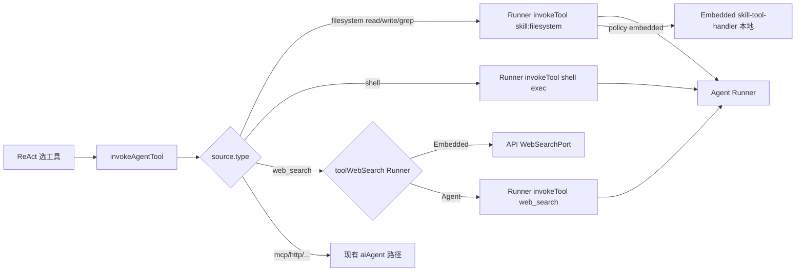
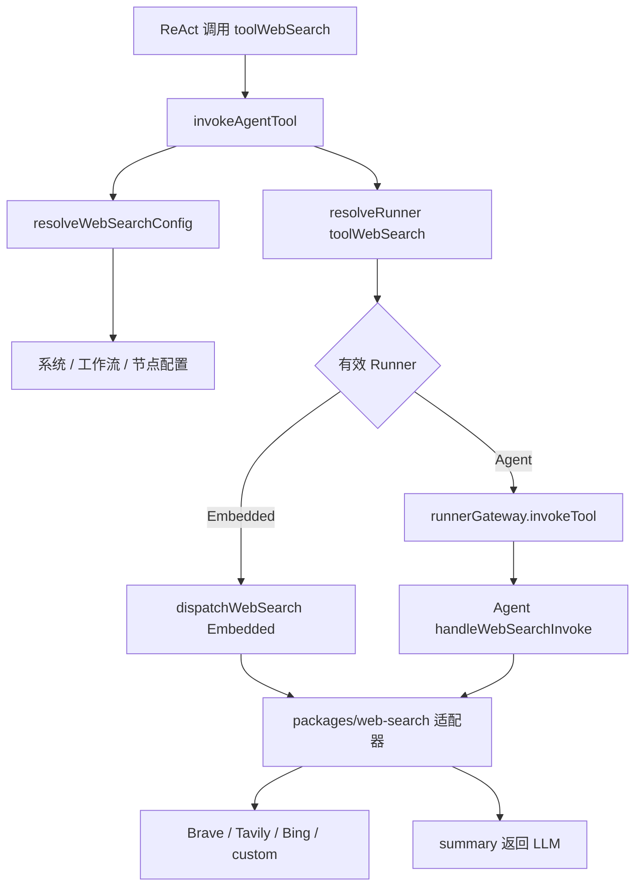
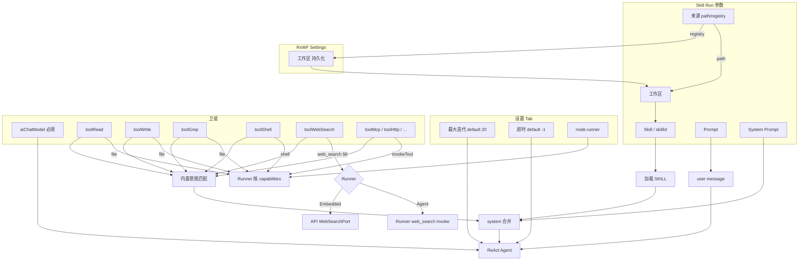

# Skill Run 简化与系统能力统一设计

| 字段 | 内容 |
|------|------|
| **状态** | Draft — 待审阅后进入 implementation plan |
| **日期** | 2026-06-03 |
| **范围** | `skillRun` 节点参数/UI/执行；**搜索引擎集成（Web Search）**；RxWF Settings 工作区持久化；系统级 Plus 与 Runner 调度 |
| **关联** | `packages/node-runner/src/executors/skill-run.ts`；`apps/web` 编辑器参数面板；`apps/web/src/features/rxwf/RxwfSettingsPage.tsx`；`packages/node-runner/src/facade/node-runner-facade.ts` |

---

## 1. 背景与问题

Skill Run 节点当前存在多层概念重叠、半接线实现与 UI 不一致，增加学习成本且部分能力实际不可用。

| 问题 | 现状 | 影响 |
|------|------|------|
| Runner 双轨 | 节点 `preferRemote` + 设置 `runnerPolicy` / `node.runner` | 与通用 Runner 设置重复；`resolveRunnerForSkill` 未注入 API |
| Builtin 工具 | `builtinToolsMode` 隐式注入 read/shell/web_search | 与 `aiAgent` 显式 Tool 卫星模型不一致；卫星 Tool `invokeTool` 未接通 |
| Prompt 双模式 | `promptType: auto \| define` | 用户困惑；`auto` 可合并为「空 Prompt 透传」 |
| Tool 意图 | `toolIntentMode` + 工作流 `skillToolIntentAuto` + Plus 门控 | 参数过多；`auto` 模式价值有限 |
| Skill 来源 | `path \| inline \| registry` | `inline` 几乎无产品场景；`registry` 的 `skillId` 在编辑器被误隐藏 |
| RxWF 工作区 | Settings 仅 `useState`，无持久化 | 刷新丢失；registry 模式无法稳定引用工作区 |
| Plus 开关 | `featurePlus` 门控节点与运行时 | 默认已开启，产品不再需要分层 |
| Runner 白名单 | `REMOTE_V1_1_NODE_TYPES` 仅 4 类型 + 无 capabilities 静默回退 Embedded | 与「按能力调度」目标不一致 |
| Web Search | 仅有 `WebSearchPort` 接口；无 Provider、无 API 注入、无 Settings UI | 接 `toolWebSearch` 仍 E1071 |

**目标**：收敛 Skill Run 参数模型，与 `aiAgent` 架构对齐；统一 Runner/Settings；去掉 Plus 产品分层；补齐 RxWF 工作区持久化。

---

## 2. 已确认决策（决策记录）

### 2.1 Skill Run 参数

| 项 | 决策 |
|----|------|
| Skill 来源 | 去掉 **`inline`**；保留 **`path`** 与 **`registry`**（registry 后续再优化） |
| `Skill 来源` 显示名 | 更名为 **来源** |
| Prompt | 去掉 **`promptType`**；仅保留 **Prompt** 字段；**空 = 透传上游 JSON**（策略 A） |
| System Prompt | **新增**字段，默认空 |
| Tool 意图 | 去掉节点参数 **`toolIntentMode`**；有意图匹配时 **内置执行**（见 §4.3） |
| 最大迭代 | 移入 **设置 Tab**，默认 **20** |
| 超时 | 移入 **设置 Tab**，默认 **-1**（无限制，与 Code 节点语义对齐） |
| 工作区 | 原「工作区根目录」更名为 **工作区**；放在 **Skill** 之前（见 §3.1 顺序） |
| Skill 名称 | 更名为 **Skill** |
| `preferRemote` | **删除**（统一走设置里的 Runner） |
| `builtinToolsMode` / `builtinTools` | **删除**；改为 **`toolRead` / `toolWrite` / `toolGrep` / `toolShell` / `toolWebSearch`** 卫星（见 §5） |

### 2.2 来源 = registry 时的工作区

| 项 | 决策 |
|----|------|
| 工作区字段 | 填入 **Settings → RxWF / Skills** 中保存的 **工作区**，**只读** |
| Settings 文案 | 「工作区根目录」更名为 **工作区** |
| 工作区无法保存 | **必须修复**（见 §7） |

### 2.3 系统级（与 Skill Run 同批次规划）

| 项 | 决策 |
|----|------|
| Plus 模式 | **去掉**；所有功能默认可用，不再 `featurePlus` 门控 |
| 节点远程 | **去掉节点类型白名单**；按节点声明的 **`capabilities`** 匹配 Runner |

### 2.4 已确认细节

| 项 | 决策 |
|----|------|
| registry 是否存 `workspaceRoot` 到节点 JSON | **不存**（方案 A）；展示与执行均读 Settings，单一数据源 |
| System Prompt 与 SKILL 正文顺序 | **append**：节点 System Prompt 放在 system 合并结果的**最后**（见 §4.4） |

---

## 3. Skill Run 参数面板（目标态）

### 3.1 主 Tab 字段顺序

| 顺序 | 参数 key | 显示名 | 说明 |
|------|-----------|--------|------|
| 1 | `skillSource` | **来源** | `path` \| `registry` |
| 2 | `workspaceRoot` | **工作区** | `path` 可编辑并写入节点 JSON；`registry` 仅 UI 只读展示（**不写入**节点 JSON，值来自 Settings） |
| 3 | `skillPath` | **Skill** | 仅 `path`；下拉扫描 + 手输 |
| 3 | `skillId` | （注册中心选择器） | 仅 `registry`；`SkillRegistrySelect` |
| 4 | `prompt` | **Prompt** | 见 §4.1 |
| 5 | `systemPrompt` | **System Prompt** | 见 §4.4 |

### 3.2 设置 Tab

| 参数 key | 显示名 | 默认值 |
|----------|--------|--------|
| `maxIterations` | 最大迭代 | `20` |
| `timeoutMs` | 超时 (ms，-1=无) | `-1` |

另保留节点级 **Runner** 覆盖（设置 Tab 现有 `node.runner` 机制），不再使用 `preferRemote`。

### 3.3 删除的参数字段

- `skillInline`
- `promptType`
- `toolIntentMode`
- `preferRemote`
- `builtinToolsMode`
- `builtinTools`（及历史 `enableBuiltinTools` 类字段）

### 3.4 卫星节点（画布）

| 卫星 | 要求 |
|------|------|
| `aiChatModel` | **必填**（E1043） |
| `toolMcp` / `toolHttp` / `toolWorkflow` / `toolSkill` / `toolSubagent` | **按需**显式接线 |
| **`toolRead` / `toolWrite` / `toolGrep` / `toolShell` / `toolWebSearch`** | 原 Builtin 能力；**须显式接线**（§5） |

`skillRun` 与 `aiAgent` / `toolSubagent` 共用同一套 Tool 卫星模型；不再根据 Skill `permissions` 隐式注入工具。

---

## 4. 执行语义

### 4.1 Prompt（策略 A）

```ts
function buildUserMessage(prompt: string, inputItems: WorkflowItem[]): string {
  if (prompt.trim()) return prompt; // 已做 {{ }} 表达式解析
  if (inputItems.length === 0) return 'Execute the skill.';
  return JSON.stringify(inputItems.map((i) => i.json));
}
```

**UI placeholder**（i18n）：

- 中文：留空则默认透传上游输入 JSON
- English：Empty = pass through upstream items as JSON

`workflow-compiler` 有模板时只写 `prompt` 字段，不再写 `promptType`。

### 4.2 最大迭代

- 控制 ReAct Agent 工具调用轮数**上限**（LangChain `recursionLimit ≈ maxIterations + 2`）。
- 默认 **`20`**；**非固定次数**——模型认为任务完成、不再调 Tool 时会提前结束（与 Cursor/Claude 类似）；仅防死循环。
- 触顶抛 **E3004**（Agent reached max iterations）。
- 未接 Tool 时走单次 `llm.invoke`，本参数基本不生效。
- UI hint：留空或使用 schema 默认 `20`。

### 4.3 内置 Tool 意图匹配

去掉 `toolIntentMode` 与 workflow `settings.skillToolIntentAuto` 后，固定规则：

```
若 skillRun 存在 ai_tool 卫星：
  matches = matchToolIntents(SKILL.md 正文, wiredTools)
  若 matches 非空 → system 追加 formatIntentHints(matches)
否则跳过
```

不再提供 `hint` / `auto` / `off` 开关；不再校验 E1077；删除 `toolIntentModeAuto` Plus 门控。

### 4.4 System Prompt 拼接

默认空字符串。非空时（表达式解析后）追加在 system 合并结果的**最后**：

```text
finalSystem = join('\n\n', [
  skillBody,           // getSkillBody(skill)
  intentAppendix?,     // §4.3
  ruleAppendix?,       // ruleMode 开启时
  userSystemPrompt?,   // params.systemPrompt，空则跳过；**置于末尾**
])
```

节点 **System Prompt** 表示工作流级补充约束（输出格式、临时限制等），不替代 SKILL.md 主指令。

### 4.5 超时

- Schema/UI 默认 `-1`。
- 执行层新增或复用 `resolveSkillRunTimeoutMs`（对齐 `resolveCodeSandboxTimeoutMs`：`<= 0` → `-1` 表示无超时）。
- 现状默认 `120_000` ms，实现时改为 `-1`。
- `deps.ai.runAgent` 需约定 `-1` 时不设 deadline。

### 4.6 Skill 加载

| 来源 | 行为 |
|------|------|
| `path` | `workspaceRoot` + `skillPath` → `.rxwf/skills/.../SKILL.md` |
| `registry` | `skillId` → `loadSkillFromRegistry`；`workspaceRoot` 运行时从 **Settings 持久化工作区** 读取（**节点 JSON 不存**该字段） |

去掉 `skillSource: inline` 后，校验与 E1040 文案更新为 path / registry only。

---

## 5. Builtin → Tool 卫星（完整设计）

将原 Skill Run **Builtin 工具**（`read_file` / `grep` / `run_terminal_cmd` / `web_search`）及用户要求的 **写文件**，实现为与 `toolMcp` / `toolHttp` 同类的 **Agent Tool 卫星节点**。画布上「接什么工具，Agent 才能用什么能力」。

### 5.1 现状与缺口

| 项 | 现状 |
|----|------|
| Builtin 注入 | `mergeBuiltinTools` + `onBuiltinInvoke` 在 `skill-run.ts` 内隐式注册 |
| 卫星 Tool | `executeSkill` 支持 `satelliteTools`，但 **skill-run 未传入**；`invokeTool` 仅处理 builtin |
| `aiAgent` | 已注册 `toolMcp` / `toolHttp` / `toolWorkflow` / `toolSkill` / `toolSubagent`，**无** filesystem/shell/web |
| Runner `skill:filesystem` | Agent 侧 `handleSkillToolInvoke` 仅实现 **`read`**；**`write` / `grep` 未实现** |
| Runner `shell` | `skill-tool-handler` 返回 **E1057**（Shell not enabled v1） |
| `web_search` | 接口与调度壳已存在；**Provider 与 API 注入未实现**（§6） |

### 5.2 新增节点类型

与现有 `tool*` 命名一致，加入 `SATELLITE_NODE_TYPES` / 节点面板 / 端口定义 / Plus 列表（去 Plus 后并入默认列表）：

| node `type` | 画布标签 | 替代原 Builtin | Runner `capabilities` |
|-------------|----------|----------------|------------------------|
| `toolRead` | Tool (Read) | `read_file` | `file` |
| `toolWrite` | Tool (Write) | （新增，原无 write builtin） | `file` |
| `toolGrep` | Tool (Grep) | `grep` | `file` |
| `toolShell` | Tool (Shell) | `run_terminal_cmd` | `shell` |
| `toolWebSearch` | Tool (Web Search) | `web_search` | **`web_search`**（Embedded 或远程 Agent，§6.15） |

**连线**：卫星 `ai_tool` → `skillRun` / `aiAgent` / `toolSubagent`（与现有 Tool 相同）。

**LLM 工具名**：使用卫星节点 **`name`**（与 `aiAgent` 一致）。若需与 SKILL.md 别名兼容，将节点命名为 `read_file`、`run_terminal_cmd` 等，或后续可选参数 `exposeAsName`。

### 5.3 卫星节点参数 Schema

各类型共有字段：

| 字段 | 类型 | 说明 |
|------|------|------|
| `toolDescription` | text | **必填**；LLM 工具描述（E2003 同现有 Tool） |

类型特有（可选，P1 可极简）：

| 类型 | 额外参数 | 说明 |
|------|----------|------|
| `toolRead` | — | 路径由 LLM 在调用参数 `path` / `target_file` 传入 |
| `toolWrite` | `defaultEncoding`? | 默认 `utf8` |
| `toolGrep` | `maxResults`? | 默认 `100` |
| `toolShell` | `cwd`? | 默认相对 scanRoots[0]；支持表达式 |
| `toolWebSearch` | `inheritConfig`?、`provider`?、`credentialId`?、`credentialMode`? | 默认继承系统/工作流（§6.8）；`credentialMode`: `platform` \| `runner-local`（§6.15.3） |

**Runner**：`toolRead` / `toolWrite` / `toolGrep` / `toolShell` / **`toolWebSearch`** 均支持节点级 **`node.runner`** + 工作流 `runnerPolicy`。`toolWebSearch` 有效 Runner 为 **Embedded** 时走 API `WebSearchPort`；为 **Agent** 时走 `runner.tool.invoke`（§6.15）。

### 5.4 执行架构

#### 5.4.1 共享模块

抽取 `packages/node-runner/src/executors/agent-satellite-tools.ts`（名称可微调），供 **`run-ai-agent-node.ts`** 与 **`skill-run.ts`** 共用：

```ts
// 注册：collectSatellites → ToolDefinition[]
buildAgentToolDefinitions(toolNodes: WorkflowNode[]): ToolDefinition[];

// 调用：根据 ToolDefinition.source 分发
invokeAgentTool(
  def: ToolDefinition,
  args: Record<string, unknown>,
  ctx: AgentToolInvokeContext,
): Promise<unknown>;
```

`AgentToolInvokeContext` 至少包含：

- `scanRoots: string[]` — 来自父 Agent / Skill Run 解析后的 **工作区**
- `runnerGateway` / `resolveRunnerForToolNode(toolNodeId)` — 按 **Tool 卫星** 的 `node.runner` 解析
- `webSearch` / `skillPermissions` — `toolWebSearch` 校验 `network` 权限

#### 5.4.2 scanRoots 来源

| 父节点 | scanRoots |
|--------|-----------|
| `skillRun` + `path` | `[workspaceRoot]`（节点参数） |
| `skillRun` + `registry` | `[Settings.rxwfWorkspaceRoot]` |
| `aiAgent` | 参数 `workspaceRoot` 或 `process.cwd()`（与现有 Agent 约定对齐） |
| `toolSubagent` | 继承 hub 解析逻辑 |

Filesystem / Shell 工具调用时 **必须** 限制在 `scanRoots` 内（沿用 `E1056` Path outside scanRoots）。

#### 5.4.3 调用路径



- **远程 Agent**：`runnerGateway.invokeTool(runnerId, RunnerToolInvokeRequest)`（filesystem / shell / **web_search**）。
- **Embedded**：filesystem/shell 本地 `handleSkillToolInvoke`；**web_search** 走 API `WebSearchPort`（§6.15）。

#### 5.4.4 Runner 协议扩展

在 `packages/runner-protocol/src/tool-invoke.ts` / `skill-tool-handler.ts` 补齐：

| capability | method | args | 说明 |
|------------|--------|------|------|
| `skill:filesystem` | `read` | `{ path }` | **已有** |
| `skill:filesystem` | `write` | `{ path, content, append? }` | **新增** |
| `skill:filesystem` | `grep` | `{ pattern, path?, glob? }` | **新增**（可封装 rg 或 Node 实现） |
| `shell` | `exec` | `{ command, cwd?, timeoutMs? }` | **实现**（现 E1057 占位） |
| **`web_search`** | **`search`** | `{ query, maxResults?, allowedDomains? }` + **`providerConfig`**（§6.15.3） | **新增** |

`BUILTIN_NODE_RUNNER_REQUIREMENTS` 增加：

```ts
toolRead: { capabilities: ['file'] },
toolWrite: { capabilities: ['file'] },
toolGrep: { capabilities: ['file'] },
toolShell: { capabilities: ['shell'], platforms: ['linux', 'windows', 'macos'] },
toolWebSearch: { capabilities: ['web_search'] },
```

### 5.5 ToolDefinition.source 扩展

在 `@rxwf/ai-runtime-stub`（或 node-runner 本地类型）增加 source 变体：

```ts
| { type: 'filesystem'; operation: 'read' | 'write' | 'grep'; toolNodeId: string }
| { type: 'shell'; toolNodeId: string }
| { type: 'web_search'; toolNodeId: string }
```

`toolNodeId` 用于解析该卫星的 `node.runner`。

### 5.6 skill-run / executeSkill 变更

1. **删除** `builtinToolsMode`、`builtinTools`、`onBuiltinInvoke`、`mergeBuiltinTools` 调用链。
2. `collectSatellites` → `buildAgentToolDefinitions` → 传入 `executeSkill` 的 tools 列表（仅卫星 + 无隐式 builtin）。
3. `executeSkill.invokeTool` 委托给 `invokeAgentTool`（不再返回 `Tool not available` 给已接线卫星）。
4. **内置意图匹配**（§4.3）的 `wiredTools` 使用卫星 **`node.name`**；保留 `skill-tool-intent-parser` 别名表，将 `Read` → `read_file` 等映射到**实际节点名**（文档建议命名约定）。

### 5.7 权限与校验

| 规则 | 行为 |
|------|------|
| Skill `permissions` | **不再**自动注入工具；可作为 **警告**（如声明 `filesystem:read` 但未接 `toolRead`） |
| `toolWebSearch` | Skill Run：父 Skill 须 `network` 权限，否则 **E1072**（§6.9） |
| `toolWebSearch` | Provider 未启用/未配置 → **E1071**；超配额 → **E1073**（§6.11） |
| 未接 Tool 但 LLM 幻觉调用 | 标准 ReAct 错误反馈 / `Tool not available` |

可选校验（Editor+）：`validateSkillRunNodes` 对 Skill permissions 与已接 Tool 类型做 **warn** 级提示（非阻塞）。

### 5.8 编辑器与 i18n

- `node-type-meta.ts`：5 类节点 meta、图标、描述。
- `node-param-schemas.ts`：各类型 `toolDescription` 等。
- `node-port-defs.ts`：与 `toolMcp` 相同 `resourceOutputs: [{ id: 'ai_tool', ... }]`。
- `NodePalette` / `AgentToolsPanel`：分组展示「内置能力 Tool」。
- `packages/workflow`：`SATELLITE_NODE_TYPES`、`TOOL_SATELLITE_TYPES`（若用于校验）扩展。
- Help：`docs/help/zh/nodes/skillRun.md` 等补充接线示例。

### 5.9 迁移

| 旧行为 | 新行为 |
|--------|--------|
| `builtinToolsMode: from-skill-permissions` 自动 read/shell/web | 用户手动添加对应 Tool 卫星 |
| 节点参数 `preferRemote` 控制 builtin 远程 | 删除；由 **各 Tool 卫星** `node.runner` 控制 |
| SKILL.md 写 `Read` / `Shell` 别名 | 意图匹配仍有效；需接线且节点名匹配别名目标 |

旧工作流 JSON 含 `builtinToolsMode` / `builtinTools`：保存时 strip 或忽略。

### 5.10 实现顺序建议

1. **Runner 层**：`write` / `grep` / `shell exec` 实现 + 测试。
2. **node-runner**：`agent-satellite-tools.ts` + `aiAgent` 接入五类 Tool。
3. **skill-run**：删除 builtin 链，接入共享模块。
4. **workflow + web**：节点类型注册与编辑器。
5. **搜索引擎集成**（§6）+ `toolWebSearch` 接线。
6. **意图解析 / 文档 / 示例工作流**。

---

## 6. 搜索引擎集成（Web Search）

`toolWebSearch` 卫星与（已废弃的）Builtin `web_search` 共用本节检索能力。对齐 Cursor **Web Search**：固定「查询 → 摘要」语义；支持 **Embedded（API 出站）** 与 **远程 Agent Runner 出站** 双路径（§6.15）。

### 6.1 现状与目标

| 项 | 现状 | 目标 |
|----|------|------|
| `WebSearchPort` | `packages/providers/contracts` 仅有接口 | 实现 **多 Provider 适配器** + 工厂（API 与 Agent **共用**） |
| `dispatchWebSearch` | `skill-runtime` 已实现权限/空查询校验 | 扩展为 **Embedded / Remote** 双路径调度 |
| `runner.tool.invoke` | 仅 `skill:filesystem` / `shell` | 增加 **`web_search`** capability（§6.15） |
| API 注入 | `plusDeps.webSearch` **未接线** | Embedded 路径注入；Remote 路径经 `runnerGateway` |
| 配置 UI | 无 | **系统 Settings** + 可选 **工作流 settings.webSearch** |
| Builtin 门控 | `webSearchEnabled` + `settings.webSearch` 存在即启用 | **删除**；仅 **`toolWebSearch` 已接线** 且 Provider 可用时可调用 |
| 凭证 | 通用 `apiKey` 类型可复用 | 平台凭证 + **Runner 本地凭证** 两种模式（§6.15.3） |

### 6.2 设计原则

1. **双路径执行**：按 **`toolWebSearch` 节点** 的 `node.runner` + `runnerPolicy` 解析有效 Runner；**Embedded** → API `WebSearchPort`；**Agent** → `runner.tool.invoke` **`web_search`**（HTTP 从 Runner 主机出站）。
2. **密钥与 Job 分离**：Provider API Key **禁止**写入远程 **`NodeRunJob` / `job.assign`**；允许在 **`tool.invoke` 专用消息**中短时传递（平台 relay 模式），或配置在 **Runner 本地**（runner-local 模式）。
3. **权限**：Skill Run 场景下父 Skill 须含 **`network`**；`network:write` **不**隐含搜索。
4. **显式接线**：画布须接 `toolWebSearch`；不根据 Skill 权限隐式注入。
5. **与 `toolHttp` 分工**：`web_search` = 固定检索 Schema + 摘要；任意 REST 仍用 `toolHttp`。
6. **能力匹配**：远程路径要求 Agent 注册 **`web_search`** capability（与 `file` / `shell` 同级）。

### 6.3 架构



### 6.4 包与模块划分

| 路径 | 职责 |
|------|------|
| `packages/providers/contracts/src/web-search-port.ts` | **`WebSearchPort`**、请求/结果类型（§6.5） |
| `packages/web-search/`（**新包**，或 `packages/providers/web-search/`） | Provider 适配器、工厂、`resolveWebSearchConfig` |
| `packages/skill-runtime/src/executor/web-search.ts` | **`dispatchWebSearch`**（权限 + 调用 Port） |
| `packages/node-runner/.../agent-satellite-tools.ts` | `toolWebSearch` → `source: { type: 'web_search', toolNodeId }`；Runner 分支调度 |
| `packages/runner-agent/src/web-search-tool-handler.ts` | Agent 侧 `web_search` invoke（复用 `packages/web-search`） |
| `packages/runner-protocol/src/tool-invoke.ts` | 扩展 `RunnerToolCapability` + `providerConfig` |
| `apps/api/src/web-search/` | Embedded 路径：启动时构造 `WebSearchPort` |
| `apps/api/src/execution/create-execution-runtime.ts` | `plusDeps.webSearch` + `runnerGateway` 双路径 |
| `apps/web/src/features/settings/WebSearchSettings.tsx` | 系统级 Provider 配置 UI |

### 6.5 `WebSearchPort` 与 LLM Tool Schema

**端口接口**（演进现有契约，保持向后兼容）：

```typescript
export interface WebSearchResult {
  summary: string;
  results?: Array<{
    title?: string;
    url?: string;
    snippet?: string;
  }>;
}

export interface WebSearchSearchRequest {
  query: string;
  /** 可选；供审计/日志，不发给 Provider */
  explanation?: string;
}

export interface WebSearchSearchOptions {
  maxResults?: number;      // 默认 10
  timeoutMs?: number;       // 默认 30000
  allowedDomains?: string[];  // 空 = 不限制
}

export interface WebSearchPort {
  search(
    request: WebSearchSearchRequest,
    options?: WebSearchSearchOptions,
  ): Promise<WebSearchResult>;
}
```

**LLM 侧工具定义**（`toolWebSearch` 注册时）：

```json
{
  "name": "<节点 name，建议 web_search>",
  "description": "<toolDescription>",
  "parameters": {
    "type": "object",
    "properties": {
      "query": { "type": "string", "description": "Search query" },
      "q": { "type": "string", "description": "Alias of query" }
    },
    "required": ["query"]
  }
}
```

`dispatchWebSearch` 返回 **`result.summary`** 字符串给 ReAct（与现实现一致）；`results[]` 可选用于调试/流式展示。

### 6.6 搜索 Provider（P1 实现范围）

至少实现 **两种** Provider；推荐 **Tavily**（Agent/RAG 场景）+ **Brave**（通用 Web 搜索）。

| Provider ID | 用途 | 认证 | 出站端点（示意） |
|-------------|------|------|------------------|
| `tavily` | Agent 优化检索 + 摘要 | `apiKey` Header `Bearer` | `https://api.tavily.com/search` |
| `brave` | 通用 Web 搜索 | `X-Subscription-Token` | `https://api.search.brave.com/res/v1/web/search` |
| `bing` | Azure Bing Web Search | `Ocp-Apim-Subscription-Key` | `https://api.bing.microsoft.com/v7.0/search` |
| `custom` | 自建聚合服务 | `apiKey` 或 `none` | 管理员配置的 `baseUrl` + POST JSON |

**`custom` 请求/响应约定**（便于内网网关）：

```typescript
// POST {baseUrl}/search
// Request:  { "query": string, "maxResults"?: number }
// Response: { "summary": string, "results"?: WebSearchResult["results"] }
```

各适配器职责：

- 将统一 `WebSearchSearchRequest` 映射为 Provider 原生请求；
- 解析结果为 `WebSearchResult`；
- 对 snippet 做 **长度截断**（单条最大 **2 KiB**）；
- 由工厂层拼 **summary**（默认：标题 + URL + snippet 的 Markdown 列表，总长上限 **8 KiB**）。

**Serper / Google Programmable Search** 等可作为 P2 插件式 Provider，接口与 `brave` 类似。

### 6.7 凭证类型

复用现有 **`apiKey`** 凭证，在系统/工作流配置中指明 `credentialId`。

| Provider | 凭证 `data` 字段 | 校验 |
|----------|------------------|------|
| `tavily` | `apiKey` | 非空 |
| `brave` | `apiKey` | 非空 |
| `bing` | `apiKey`（Subscription Key） | 非空 |
| `custom` | `apiKey` 可选；`baseUrl` 必填 | URL 合法 |

可选 P2：注册专用类型 `webSearchApiKey`（`acceptedTypes` 更清晰）；P1 用 `apiKey` + 配置页说明即可。

### 6.8 配置模型与继承

#### 6.8.1 系统级（租户默认）

**Settings → 集成 → Web Search**（与 Ollama 同级），持久化到 `system_settings`：

```typescript
interface SystemWebSearchSettings {
  enabled: boolean;              // 默认 false
  defaultProvider: WebSearchProviderId;
  defaultCredentialId?: string;
  maxQueriesPerExecution: number; // 默认 10
  timeoutMs: number;             // 默认 30000
  maxResults: number;            // 默认 10
  allowedDomains?: string[];     // 可选；空 = 不限制
  customBaseUrl?: string;        // provider=custom 时必填
}
```

API：

- `GET /api/settings/web-search` — 返回配置（密钥 MASK）
- `PUT /api/settings/web-search` — admin 保存

#### 6.8.2 工作流级（可选覆盖）

写入 `WorkflowDefinition.settings.webSearch`（扩展 `workflow-definition.v1.schema.json`）：

```typescript
interface WorkflowWebSearchSettings {
  enabled?: boolean;           // 默认继承系统；false 显式禁用本流搜索
  provider?: WebSearchProviderId;
  credentialId?: string;
  maxQueriesPerExecution?: number;
  timeoutMs?: number;
  maxResults?: number;
  allowedDomains?: string[];
  customBaseUrl?: string;
}
```

编辑器：**工作流设置** 中可选「Web Search」折叠区（不强制；未配置则继承系统默认）。

#### 6.8.3 `toolWebSearch` 节点级（可选）

| 字段 | 说明 |
|------|------|
| `toolDescription` | 必填 |
| `provider` | 可选；覆盖工作流/系统 |
| `credentialId` | 可选；覆盖凭证 |
| `inheritConfig` | 默认 `true`；`false` 时必须指定 `provider` + `credentialId` |
| `credentialMode` | `platform`（默认）\| `runner-local`（§6.15.3） |

#### 6.8.4 解析顺序（单次调用）

```
1. toolWebSearch 节点参数（inheritConfig=false 时）
2. workflow.settings.webSearch
3. 系统 SystemWebSearchSettings
4. 若 enabled=false 或缺少 provider/credential → E1071
```

**启用条件**（同时满足）：

- 配置链 `enabled === true`（系统或工作流）；
- 已解析 `provider` + 有效 `credentialId`（`custom` 另需 `baseUrl`）；
- 画布已接 **`toolWebSearch`** 卫星；
- 父 Skill `permissions` 含 **`network`**。

### 6.9 执行路径（`toolWebSearch`）

1. `invokeAgentTool` 识别 `source.type === 'web_search'`。
2. 从父 `skillRun` / `aiAgent` 加载 **SkillIR**（或 Agent 无 Skill 时跳过 L2，见 §6.9.1）。
3. `resolveWebSearchConfig(ctx, toolNode)` → Provider / 限额 / 凭证引用。
4. **配额**：同一 `executionId` 内计数；超过 `maxQueriesPerExecution` → **E1073**。
5. **`resolveRunnerForToolNode(toolWebSearch)`** → Embedded 或 Agent（与 `toolShell` 相同，`capabilities: ['web_search']`）。
6. **分支**：
   - **Embedded** → `dispatchWebSearchEmbedded`：API 内存 `WebSearchPort` + 平台凭证 → summary。
   - **Agent** → `dispatchWebSearchRemote`：`runnerGateway.invokeTool`（§6.15）→ summary。
7. `agentSteps` 记录 `{ type: 'tool', name, runnerId?, searchTermRedacted?, resultCount }`；**不**持久化完整 snippet。

#### 6.9.1 `aiAgent` 无 SKILL 场景

`aiAgent` 未加载 Skill 时：

- **不**校验 `network` 权限（或校验工作流级 `settings.webSearch.requireNetworkPermission`，默认 **false**）；
- 仍须系统/工作流 **enabled + Provider**；
- 产品默认：**仅 Skill Run 强制 `network`**；`aiAgent` 接 `toolWebSearch` 视为工作流作者显式授权。

### 6.10 限额、超时与审计

| 项 | 默认 | 可配置 |
|----|------|--------|
| 每 execution 最大搜索次数 | 10 | 系统 / 工作流 `maxQueriesPerExecution` |
| 单次 HTTP 超时 | 30 s | `timeoutMs` |
| 返回条数 | 10 | `maxResults` |
| 单条 snippet 上限 | 2 KiB | 代码常量 |
| summary 总长上限 | 8 KiB | 代码常量 |

审计：记录搜索词 **哈希或截断**（不记全文明文到长期日志）；Shell 类脱敏规则同母 spec §6.7.5。

### 6.11 错误码

| 代码 | 条件 |
|------|------|
| **E1071** | Provider 未配置、凭证无效、`enabled=false`、或 `custom` 缺 `baseUrl` |
| **E1072** | Skill Run 场景：Skill 无 `network` 权限却调用 `toolWebSearch` |
| **E1073** | 超过 `maxQueriesPerExecution`（**新增**） |
| **E1074** | Provider HTTP 失败 / 超时（**新增**，可选；或并入 E1071 消息区分） |
| **E1075** | 策略指向远程 Agent，但无在线 Agent 具备 **`web_search`** capability，且未配置 Embedded 回退 → **E2010** 族 |

### 6.12 与 `toolHttp` 的选型指引

| 需求 | 推荐 |
|------|------|
| Agent 标准「查一下网上最新…」 | `toolWebSearch` + 系统 Provider |
| 调用特定 REST（内部 API、非标准搜索） | `toolHttp` |
| 需要写操作 / POST 非搜索 | `toolHttp` + `network:write` |

### 6.13 实现检查清单（Web Search）

**packages**

- [ ] 新包 `packages/web-search`：`brave`、`tavily`、`bing`、`custom` 适配器
- [ ] `createWebSearchService(config, resolveCredential)` 工厂
- [ ] `resolveWebSearchConfig(execution, workflow, toolNode)` 
- [ ] 扩展 `web-search-port.ts` 类型；`dispatchWebSearch` 接受 options
- [ ] 执行级配额计数器（per `executionId`）

**API**

- [ ] `GET/PUT /api/settings/web-search`
- [ ] `SETTING_KEYS.webSearch*` 或 JSON blob
- [ ] `create-execution-runtime` 注入 `plusDeps.webSearch` + Remote invoke 分支
- [ ] `runner-protocol` / `runner-agent`：`web_search` capability（§6.15）
- [ ] 集成测试：Embedded + **远程 Agent** `tool.invoke` 双路径

**Web**

- [ ] Settings → Web Search 配置页（Provider、credential 选择、测试连接）
- [ ] 工作流设置可选 `webSearch` 区
- [ ] `toolWebSearch` 节点参数 schema + `inheritConfig`

**文档**

- [ ] `docs/error-codes.md` 增加 E1073/E1074
- [ ] Help：如何申请 Brave/Tavily Key、接线示例

### 6.14 测试连接（Settings UI）

`POST /api/settings/web-search/test`：用当前配置发起 `query="rx-workflow ping"`，返回 `{ ok, latencyMs, preview }` 或错误码。不消耗 execution 配额。

### 6.15 远程 Runner 执行（`web_search`）

#### 6.15.1 动机

- 搜索 HTTP 从 **Runner 主机出站**（企业网络、地域、代理策略与 shell/read 一致）。
- 与 `toolRead` / `toolShell` **同一 Runner 策略模型**：`toolWebSearch` 节点设置 `node.runner`，工作流 `runnerPolicy` 统一调度。
- Agent 注册 **`web_search`** capability 后纳入 Runner 池筛选（§9）。

#### 6.15.2 协议扩展

`packages/runner-protocol/src/tool-invoke.ts`：

```typescript
export type RunnerToolCapability =
  | 'skill:filesystem'
  | 'shell'
  | 'web_search';

export interface WebSearchProviderConfig {
  providerId: 'tavily' | 'brave' | 'bing' | 'custom';
  apiKey?: string;       // platform-relay 模式；runner-local 可省略
  baseUrl?: string;      // custom 必填
  timeoutMs?: number;
  maxResults?: number;
  allowedDomains?: string[];
}

export interface RunnerToolInvokeRequest {
  invokeId: string;
  executionId: string;
  nodeRunId: string;
  capability: RunnerToolCapability;
  method: string;
  args: Record<string, unknown>;
  /** filesystem/shell 必填；web_search 可省略 */
  scanRoots?: string[];
  timeoutMs: number;
  /** 仅 capability=web_search 时使用 */
  providerConfig?: WebSearchProviderConfig;
}
```

**Invoke 约定**（`capability: 'web_search'`, `method: 'search'`）：

| 字段 | 说明 |
|------|------|
| `args.query` | 搜索词（必填） |
| `args.maxResults` | 可选；默认继承配置 |
| `args.allowedDomains` | 可选 |
| `providerConfig` | Provider 与认证；见 §6.15.3 |

**响应**：`result: { summary: string, results?: [...] }`；控制面取 `summary` 返回 ReAct。

#### 6.15.3 凭证模式

| 模式 | 配置 | 行为 |
|------|------|------|
| **`platform`**（默认） | 系统/工作流 `credentialId` | 控制面在发起 **`tool.invoke`** 前解密凭证，填入 **`providerConfig.apiKey`**；经 **WSS** 发给 Agent；**不**写入 `job.assign`；日志脱敏 |
| **`runner-local`** | `toolWebSearch.credentialMode: 'runner-local'` 或节点级开关 | `providerConfig` **不含** apiKey；Agent 从 **`runner-config` / `credentialFile`** 读取 `webSearch.apiKey`（与现有 `credentialFile` 扩展字段对齐） |
| **混合** | 节点 `credentialMode: 'platform'` 且 Runner 本地也有 key | 优先 platform relay；Runner 本地作 offline 兜底（P2） |

`runner-config` 扩展示例：

```json
{
  "serverUrl": "http://localhost:8787",
  "credentialFile": "./runner-config/credential.json",
  "webSearch": {
    "provider": "tavily",
    "credentialRef": "web-search-key"
  }
}
```

`credential.json` 内增加命名条目（不进 Git）：

```json
{
  "web-search-key": { "apiKey": "tvly-..." }
}
```

#### 6.15.4 Agent 实现

| 组件 | 职责 |
|------|------|
| `runner-agent` 注册 | `CORE_CAPABILITIES` 增加 **`web_search`**（或扩展 manifest） |
| `handleWebSearchInvoke` | 解析 `providerConfig` + runner-local 凭证；调用 **`@rxwf/web-search`** 适配器出站 HTTP |
| `extension-host` | presence 上报 `web_search` capability，供调度器匹配 |

Embedded Runner（`kind: embedded`）**不**走 WS invoke，直接使用 API 进程内 `WebSearchPort`（与 filesystem 在 embedded 本地处理类似）。

#### 6.15.5 调度与回退

```
resolveRunner(toolWebSearch.node.runner, { capabilities: ['web_search'] })
  → embedded：API WebSearchPort
  → agent：runnerGateway.invokeTool(..., { capability: 'web_search', ... })
  → 无匹配 Agent：
      - workflow.runnerPolicy.fallback === 'embedded' 且系统 Provider 已配置 → **回退 API 出站**（可选，默认 **false**，fail fast）
      - 否则 E1075 / E2010
```

工作流可选 `settings.webSearch.fallbackEmbedded: true`：远程不可用时改由控制面搜索（密钥仅 API 侧，适合 dev）。

#### 6.15.6 与母 spec 的差异说明

母 spec §6.7.10 写「不经 `runner.tool.invoke`」——本设计 **扩展**为双路径：**默认仍支持纯 Embedded**；企业场景通过 **`toolWebSearch` + 远程 Runner** 从 Agent 主机出站，密钥通过 **`tool.invoke` relay 或 runner-local** 传递，**仍不进入 `NodeRunJob`**。

#### 6.15.7 检查项（远程路径）

- [ ] `RunnerToolCapability` 增加 `web_search`；`scanRoots` 改为可选
- [ ] `runner-agent`：`handleWebSearchInvoke` + capability 注册
- [ ] `agent-satellite-tools`：Remote 分支 + platform credential relay
- [ ] Runner 设置文档：`webSearch` 本地凭证配置
- [ ] 集成测试：mock Agent 收到 `tool.invoke` 并返回 summary

---

## 7. RxWF Settings 工作区持久化

### 7.1 问题根因

`RxwfSettingsPage` 中 `workspaceRoot` 仅为 `useState('')`：

- 无 mount 加载
- 无保存 API
- 刷新即丢失

`POST /api/skills/scan` 会 `recordScanRoot` 写入 `skill_scan_roots`，但：

- 仅点击扫描时写入
- **无 GET** 供 Settings / 编辑器读取「当前工作区」

### 7.2 推荐方案（方案 A）

新增持久化键（系统设置或专用 RxWF 配置）：

```ts
// 示例
SETTING_KEYS.rxwfWorkspaceRoot  // 或 GET/PUT /api/rxwf/workspace
```

| 端点 | 行为 |
|------|------|
| `GET /api/rxwf/workspace` | 返回 `{ workspaceRoot: string }` |
| `PUT /api/rxwf/workspace` | 保存工作区（member/admin，与 RxWF 页同级） |

**RxwfSettingsPage**：

- mount 时 `GET` 填充输入框
- 「保存」按钮或 debounce 自动 `PUT`
- 标签改为 **工作区**（`rxwf.workspaceRoot` i18n）

**Skill Run 编辑器**（`来源 = registry`）：

- `GET` 同一接口，**只读**展示工作区（UI 虚拟字段，非 `node.parameters`）
- **确认：不在节点 JSON 存储** `workspaceRoot`；切换为 registry 时清除节点上已有的 `workspaceRoot`
- 保存工作流时若 `skillSource === 'registry'`，序列化应省略 `workspaceRoot`（或 strip 后写入）

`skill_scan_roots` 继续作为扫描历史，不作为 Settings 主数据源。

### 7.3 需修复的现有 UI Bug

`NodeEditorParamsPane` 中 `skillId` 被误写为恒隐藏：

```ts
// 当前（错误）
if (f.key === 'skillId') return false;

// 应为
if (f.key === 'skillId' && src !== 'registry') return false;
```

registry 模式应渲染 `SkillRegistrySelect`。

### 7.4 Skill 下拉（path 模式）

设 **工作区** 后，按 `POST /api/skills/scan` 或专用 list 接口填充 **Skill** 下拉（参考 `OllamaModelParamField` + `SuggestTextInput`）。

---

## 8. 去掉 Plus 模式

### 8.1 现状

- `RXWF_FEATURE_PLUS` 默认开启（仅 `=false` 关闭）。
- `featurePlus=false` 时：不注册 `registerPlusExecutors`、节点面板隐藏 `PLUS_NODE_TYPES`、Chat/部分 Settings 不可用。

### 8.2 目标

| 层 | 动作 |
|----|------|
| API | 删除 `featurePlus` 分支；始终注册 `plusDeps` |
| Web | 移除 `featurePlus` prop；节点/模板/设置始终可见 |
| 配置 | 移除 `RXWF_FEATURE_PLUS` 或恒 true |
| 文案 | 去掉节点 meta「（Plus）」 |
| 测试 | 集成测试不再传 `featurePlus: true` |

Lite 部署仍可通过环境控制可选依赖（Ollama、Crew sidecar），但不做产品功能开关。

---

## 9. Runner：按能力调度，去掉类型白名单

### 9.1 现状（两层）

1. **能力过滤（已有）**：`getNodeRunnerRequirements(nodeType)` → `capabilities: code|shell|http|file`；`RunnerDispatcher` 按 Agent `capabilities` 匹配。
2. **隐式限制**：`node-runner-facade` 中无 `capabilities` 的节点在策略指向 Agent 时 **静默回退 Embedded**。
3. **UI 提示**：`REMOTE_V11_NODE_TYPES` 固定 4 类型。
4. **Agent 侧**：Runner 须注册该 `nodeType` 执行器，否则 **E2016**。

### 9.2 目标模型

```
节点（或插件 manifest）声明 runnerRequirements.capabilities
  → 调度器按 effectivePolicy + capabilities 选 Agent
  → Agent 有 executor → 远程执行
  → 无匹配 Agent → E2010 / fallback（按策略）
```

| 节点类型 | capabilities | 远程语义 |
|----------|--------------|----------|
| `code` | `code` | Agent 沙箱执行 JS |
| `executeCommand` | `shell` | Agent 执行命令 |
| `readWriteFile` | `file` | Agent 读写文件 |
| `httpRequest` | `http` | 可 Embedded 或 Agent |
| `set`、`if` 等 | **无** | **始终 Embedded** |
| `toolRead` / `toolWrite` / `toolGrep` | `file` | Tool 卫星 → Agent `skill:filesystem` |
| `toolShell` | `shell` | Tool 卫星 → Agent shell |
| **`toolWebSearch`** | **`web_search`** | Tool 卫星 → Agent **`web_search`** 或 Embedded API（§6.15） |
| `skillRun` | **无** | 主体 Embedded；工具走卫星 + Runner |

### 9.3 落地要点

1. 淡化/删除 `REMOTE_V11_NODE_TYPES` UI 白名单，改为 per-node `getNodeRunnerRequirementHints`。
2. 插件通过 `registerNodeRunnerRequirements` 声明能力。
3. 无 capabilities 的节点保持 Embedded；有声明但无 Agent 时按 `fallback: fail` 明确报错（评估是否取消「静默回退」）。
4. 删除 Skill 专用 `preferRemote` 及关联 E1005/E1059 校验（若全局不再使用 `parameters.preferRemote`）。

---

## 10. 数据流示意



---

## 11. 迁移与兼容

| 场景 | 处理 |
|------|------|
| `skillSource: inline` | 保存/校验时报错 E1040，或一次性迁移脚本 |
| `promptType: auto` | 删除字段；空 `prompt` 即等同原 auto |
| `toolIntentMode` | 删除；行为固定为内置 hint |
| `preferRemote` / `builtinToolsMode` | 删除字段 |
| Builtin 隐式工具 | 改为显式接 `toolRead` / `toolWrite` / `toolGrep` / `toolShell` / `toolWebSearch` |
| `webSearchEnabled` / 隐式 `web_search` | 删除；须配置 §6 Provider + 接 `toolWebSearch` |
| 旧工作流 `timeoutMs` 缺省 | 执行层 `-1`；已有正数保留 |

---

## 12. 实现检查清单

### 12.1 Skill Run

- [ ] `apps/web/.../node-param-schemas.ts`：字段顺序、改名、设置 Tab、`systemPrompt`、默认 `timeoutMs: -1`
- [ ] `NodeEditorParamsPane`：修复 `skillId`；registry 工作区只读 + GET Settings
- [ ] `SkillPathParamField`（新）：工作区变化触发 scan / 下拉
- [ ] `packages/node-runner/.../skill-run.ts`：Prompt、systemPrompt 合并、timeout -1、registry workspace
- [ ] `packages/workflow/.../validate-skill.ts`：去掉 inline / toolIntent / promptType；更新 E1040
- [ ] 删除 `skillToolIntentAuto` 工作流设置 UI 与 E1077

### 12.2 RxWF Settings

- [ ] `SETTING_KEYS.rxwfWorkspaceRoot` 或 `/api/rxwf/workspace` GET/PUT
- [ ] `RxwfSettingsPage` load/save；标签「工作区」
- [ ] i18n：`rxwf.workspaceRoot`、`WorkflowRunFields` 等

### 12.3 Tool 卫星与 Builtin 移除（§5）

**Runner / 协议**

- [ ] `skill-tool-handler`：`filesystem.write`、`filesystem.grep`、`shell.exec`
- [ ] `runner-protocol` 文档与集成测试更新

**node-runner**

- [ ] 新增 `agent-satellite-tools.ts`（注册 + `invokeAgentTool`）
- [ ] `ToolDefinition.source` 扩展：`filesystem` / `shell` / `web_search`
- [ ] `getNodeRunnerRequirements`：`toolRead` / `toolWrite` / `toolGrep` / `toolShell`
- [ ] `run-ai-agent-node.ts` 接入五类 Tool
- [ ] `skill-run.ts`：删除 builtin 链；共用卫星 Tool 模块
- [ ] `executeSkill` / `builtin-tools.ts`：删除或仅保留测试迁移参考

**workflow + web**

- [ ] `SATELLITE_NODE_TYPES`：`toolRead`、`toolWrite`、`toolGrep`、`toolShell`、`toolWebSearch`
- [ ] `node-type-meta`、`node-param-schemas`、`node-port-defs`、`NodePalette`
- [ ] Help 与示例工作流（Skill + 读/写/shell/web 接线）

**测试**

- [ ] 各 Tool 卫星单元 / 集成测试（Embedded + 远程 Runner）
- [ ] skill-run 无 builtin、仅卫星 Tool 的 ReAct 路径

### 12.4 搜索引擎集成（§6）

- [ ] `packages/web-search` Provider 适配器（tavily、brave、bing、custom）
- [ ] `GET/PUT /api/settings/web-search` + 测试连接
- [ ] `create-execution-runtime` 注入 `plusDeps.webSearch`
- [ ] `workflow-definition.v1.schema.json`：`settings.webSearch`
- [ ] Settings / 工作流设置 / `toolWebSearch` 节点 UI
- [ ] E1073/E1074 + `docs/error-codes.md`

### 12.5 系统级

- [ ] 去掉 `featurePlus` 门控（API + Web + 文案）
- [ ] Runner 按 capabilities；更新 `REMOTE_V11` 相关 UI/文档
- [ ] Help 文档与 `docs/error-codes.md` 更新

### 12.6 测试

- [ ] `skill-run.test.ts`：Prompt 空值透传、systemPrompt 合并、registry workspace
- [ ] RxWF workspace API 持久化
- [ ] 删除/更新依赖 `inline`、`toolIntentMode`、`featurePlus` 的测试
- [ ] Web Search：`toolWebSearch` + mock Provider 端到端；配额 E1073；Settings 测试连接

---

## 13. 关联文档

- `docs/superpowers/specs/2026-05-31-skill-integration-design.md` — 原始 Skill 集成（部分参数将废弃）
- `docs/error-codes.md` — E1040、E1043、E3004、E1071–E1074 等
- `docs/superpowers/specs/2026-05-31-skill-integration-design.md` — §6.7.10 Web Search（母 spec，由本节 §6 承接并落地）
- `docs/runner-extension-packaging-deployment.md` — Runner 远程与 capabilities

---

## 14. 修订记录

| 日期 | 说明 |
|------|------|
| 2026-06-03 | 初稿：合并 Skill Run 参数简化、RxWF 工作区持久化、去 Plus、Runner 按能力调度、Builtin→Tool 方向 |
| 2026-06-03 | 确认：registry 不存 `workspaceRoot`；System Prompt 置于 system 合并末尾 |
| 2026-06-03 | 扩充 §5：`toolRead`/`toolWrite`/`toolGrep`/`toolShell`/`toolWebSearch` 卫星完整设计 |
| 2026-06-03 | `maxIterations` 默认由 10 调整为 20；§4.2 补充「上限非固定次数」说明 |
| 2026-06-03 | 新增 **§6 搜索引擎集成**：Provider、凭证、配置继承、`toolWebSearch` 执行路径与清单 |
| 2026-06-03 | **§6.15**：`web_search` 支持远程 Runner（`web_search` capability + `tool.invoke` + 凭证 relay/runner-local） |
