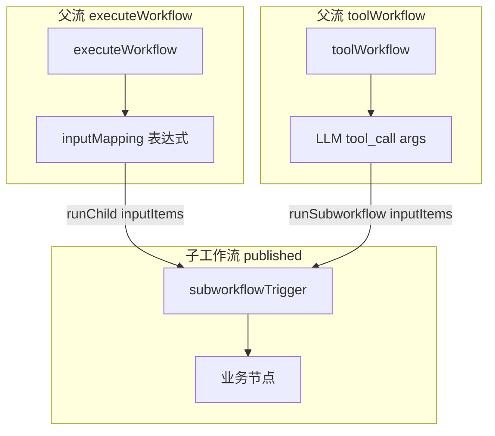

# subworkflowTrigger（n8n 式子工作流触发器）— 设计规格

| 字段 | 内容 |
|------|------|
| **状态** | **Implemented** — 2026-06-06 |
| **日期** | 2026-06-06 |
| **策略** | **方案 1**：专用 `subworkflowTrigger` 节点；父流自动拉取 schema + 动态映射 |
| **关联** | [spec.md](../../spec.md) §触发器、[workflow-agent-node-design](./2026-05-23-workflow-agent-node-design.md) §5.4–5.5、[workflow-tool-expose-as-tool](../plans/2026-05-23-workflow-tool-expose-as-tool.md) |
| **对标** | [n8n Execute Sub-workflow Trigger](https://docs.n8n.io/integrations/builtin/core-nodes/n8n-nodes-base.executeworkflowtrigger/) |

---

## 1. 背景与目标

### 1.1 现状与问题

| 项 | 现状 |
|----|------|
| 规格 | `docs/spec.md` 已列「子工作流触发」v1.0，但**未实现**对应节点 |
| 子流入参 | 运行时经 `runChild({ inputItems })` → 引擎 `initialItems` 注入起始节点 |
| Manual Trigger | **忽略** `inputItems`，只输出 `parameters.json`；Agent Tool 传入参数到不了下游 |
| Webhook / Schedule | 有 `inputItems` 时透传，可作权宜之计，但无语义、无 schema |
| Agent Tool schema | 目前在**父流** `toolWorkflow.inputMapping` + `$fromAI` 定义，与子流脱节 |
| 产品愿景 | `spec.md` §范式 C：「自动生成 Tool 的 `inputSchema`（来自子工作流触发器入参）」— 未落地 |

### 1.2 目标

1. 新增 **`subworkflowTrigger`** 节点，作为「被其他工作流调用」时的画布起点（对标 n8n *When executed by another workflow*）。
2. 子流在触发器上声明入参（三模式）；父流 **`executeWorkflow`** / **`toolWorkflow`** 从 **published** 子流定义**自动拉取 schema** 并生成映射 UI。
3. **`toolWorkflow`（Agent Tool）** 路径校验更严：子流须有合法 trigger schema；LLM `inputSchema` 默认由子流推导。
4. 修复当前 `manualTrigger` 子流无法接收调用方 payload 的数据断点。

### 1.3 已确认产品决策

| 决策点 | 选择 |
|--------|------|
| 实现方案 | **方案 1**：专用 `subworkflowTrigger` 节点（非增强 manualTrigger、非 settings-only schema） |
| 调用范围 | **C**：`executeWorkflow` + `toolWorkflow` 双路径；Agent Tool 更严校验 |
| 入参定义 | **A**：三模式 — `fields` / `jsonExample` / `acceptAll` |
| 父流映射 | **A**：自动拉取子流 schema + 动态表单；`inputMapping` / `$fromAI` 降为**可选覆盖** |

### 1.4 非目标（本期）

- 从父画布「一键创建子工作流」向导（n8n *Create sub-workflow*）。
- 子工作流多触发器并联（manual + subworkflow 共存）。
- `workflow_run` / MCP 触发路径改造（可后续对齐）。
- 子流 trigger schema 的版本 diff / 迁移助手 UI。
- 修改 `manualTrigger` 在子流调用下的透传行为（由 `subworkflowTrigger` 承接，避免语义混杂）。

---

## 2. 节点定义：`subworkflowTrigger`

### 2.1 元数据

| 属性 | 值 |
|------|-----|
| `type` | `subworkflowTrigger` |
| 分类 | `trigger` |
| 画布标签 | Sub-workflow / 子工作流触发 |
| 图标/配色 | 与现有 trigger 系列一致，区别于 Manual |
| 端口 | 仅 `main` 输出；无输入 |

### 2.2 参数

| 字段 | 类型 | 默认 | 说明 |
|------|------|------|------|
| `inputMode` | `'fields'` \| `'jsonExample'` \| `'acceptAll'` | `'fields'` | 入参定义模式 |
| `inputs` | `SubworkflowInputField[]` | `[]` | `inputMode === 'fields'` 时生效 |
| `jsonExample` | `object` \| `string` | `{}` | `inputMode === 'jsonExample'` 时生效 |

**`SubworkflowInputField`：**

```ts
interface SubworkflowInputField {
  name: string;           // ^[A-Za-z0-9_-]{1,64}$
  type: 'string' | 'number' | 'boolean' | 'json';
  description?: string;
  required?: boolean;       // 默认 true（fields 模式）
  default?: unknown;
}
```

### 2.3 三种 `inputMode` 语义

| 模式 | 行为 | 父流映射 UI | LLM schema（toolWorkflow） |
|------|------|-------------|---------------------------|
| `fields` | 显式字段列表 | 每字段一行表达式输入 | 由字段生成 JSON Schema |
| `jsonExample` | 从样例 JSON 推断类型 | 同 fields（推断后展开） | 由推断 schema 生成 |
| `acceptAll` | 不声明 schema | 仅「透传上游 JSON」或单 JSON 映射 | `additionalProperties: true` 的空 object 或省略 required |

**`jsonExample` 推断规则：**

- 根须为 object（非 array）。
- 每个 key 推断：`string` / `number` / `boolean`；嵌套 object → `json`（`type: object`）。
- 推断结果**不**自动标 required（与 n8n 一致：样例仅示类型）；父流映射时所有 key 可选，运行时缺省用 `undefined` / 省略。

### 2.4 执行器行为

路径：`packages/node-runner/src/executors/triggers/subworkflow.ts`

```ts
// 与 scheduleTrigger 对齐：透传调用方 inputItems
const items = ctx.inputItems.length > 0 ? ctx.inputItems : [{ json: {} }];
return { status: 'success', outputItems: [items] };
```

**数据流：**

```text
父流 runChild / toolWorkflow
  → inputItems: [{ json: mappedPayload }]
  → ExecutionEngine.initialItems → startNodeId
  → subworkflowTrigger 透传
  → 下游 {{ $json.fieldName }}
```

### 2.5 触发器互斥规则

工作流 `definition.nodes` 中：

| 规则 | 级别 | 代码 |
|------|------|------|
| 存在 `subworkflowTrigger` 时，不得再有 `manualTrigger` / `webhookTrigger` / `scheduleTrigger` | error | `E1051` |
| `settings.exposeAsTool === true` 时，**必须**存在且仅存在一个 `subworkflowTrigger` | error | `E1052` |
| 无 `subworkflowTrigger` 的普通 automation 工作流 | 不变 | — |
| `errorTrigger` | 仅用于 Error Workflow 专用流；与 `subworkflowTrigger` 互斥 | `E1051` |

`toWorkflowGraph` 的 `TRIGGER_TYPES` 增加 `subworkflowTrigger`；`startNodeId` 解析优先级与其它 trigger 相同（图中第一个 trigger 节点）。

---

## 3. Schema 解析（共享库）

### 3.1 模块

新建：`packages/workflow/src/subworkflow-trigger-schema.ts`

导出：

```ts
interface ResolvedSubworkflowInputSchema {
  mode: 'fields' | 'jsonExample' | 'acceptAll';
  /** JSON Schema draft-07 object；acceptAll 时为宽松 object */
  jsonSchema: Record<string, unknown>;
  /** 扁平字段列表（acceptAll 时为空） */
  fields: SubworkflowInputField[];
}

function findSubworkflowTriggerNode(
  definition: WorkflowDefinition,
): WorkflowNode | undefined;

function resolveSubworkflowInputSchema(
  definition: WorkflowDefinition,
): ResolvedSubworkflowInputSchema | null;

function schemaToJsonSchema(
  resolved: ResolvedSubworkflowInputSchema,
): Record<string, unknown>;
```

**调用方：**

- `validateWorkflowDefinition` / `workflowService.validateToolWorkflowNodes`
- `buildAgentToolDefinitions`（`toolWorkflow` 默认 parameters）
- `apps/web` 父节点动态表单（`executeWorkflow` / `toolWorkflow`）
- API：`GET /api/workflows/:id/subworkflow-input-schema?source=published`

### 3.2 Published 优先

父流引用子流时，schema **一律**从 **published** 版本读取（与 `toolWorkflow` / `runChild` 运行时一致）。草稿子流在父流保存校验时：

- 若子流未发布 → 已有 `E1023`（toolWorkflow）或新增 `E1053`（executeWorkflow 目标未发布）。
- 若子流已发布但父流草稿中子流 trigger 已改、未再发布 → 父流仍用**已发布** schema；编辑器显示「子流已发布版本」提示（warning `W1012`）。

---

## 4. 父流集成

### 4.1 `executeWorkflow` 节点

**现有：** 仅 `workflowId`。

**新增参数：**

| 字段 | 类型 | 说明 |
|------|------|------|
| `workflowId` | string | 子工作流 ID（不变） |
| `inputMapping` | `Record<string, string>` | 可选；key = 子流字段名，value = 表达式模板 |

**UI 行为（n8n 式）：**

1. 用户选择 `workflowId`。
2. 前端请求子流 published schema（或从 workflow 详情缓存）。
3. 若 `acceptAll`：显示单个 JSON/表达式框映射整包（默认 `{{ $json }}` 或透传当前 item）。
4. 若 `fields` / `jsonExample`：为每个字段渲染 `ParamField`（`{{ }}` 表达式）。
5. 保存时 `inputMapping` 写入节点 parameters。

**运行时（`subworkflow.ts` / `create-execution-runtime`）：**

- 在 `runChild` 前，根据 `inputMapping` + 子流 schema 解析表达式，构建 `payload: Record<string, unknown>`。
- 无 `inputMapping` 且非 `acceptAll`：required 字段缺失 → `E1054`。
- `acceptAll` 且无 mapping：透传当前 `inputItems[0].json`。

### 4.2 `toolWorkflow` 节点

**现有：** `workflowId`、`toolDescription`、`inputMapping`（`$fromAI`）。

**变更：**

| 项 | 行为 |
|----|------|
| LLM `inputSchema` | **默认**从子流 `subworkflowTrigger` 推导（`buildAgentToolDefinitions` 改为读子流 published 定义，而非仅扫父节点 `$fromAI`） |
| `inputMapping` | **可选覆盖**：若存在，覆盖自动 schema 的字段映射逻辑（保留 `$fromAI` 兼容）；若为空，按子流 schema 字段名 1:1 期待 LLM 传参 |
| `toolDescription` | 仍为父节点必填；子流 `exposeAsToolDescription` 仅作下拉展示辅助，不替代 |

**Agent Tool 更严校验（相对 executeWorkflow）：**

| 规则 | 级别 | 代码 |
|------|------|------|
| 目标子流须有 `subworkflowTrigger` | error | `E1055` |
| `inputMode === 'acceptAll'` 时允许，但 warning 提示 LLM 无结构约束 | warning | `W1013` |
| 子流 `fields` 中 `required: true` 的字段，须在推导的 LLM schema 中为 required | 自动保证 | — |
| 父节点 `inputMapping` 含 `$fromAI` 且 key 不在子流 schema 中 | warning | `W1014` |
| 运行时 LLM 缺少 required 字段 | error | `E1054`（invoke 前校验） |

### 4.3 `run-ai-agent-node.ts` 映射逻辑调整

当前逻辑（简化）：

```text
有 inputMapping → 按 mapping 构建 payload
无 inputMapping → payload = llm args 原样
```

目标逻辑：

```text
加载子流 published schema
若 inputMapping 非空 → 按 mapping 构建（$fromAI 替换 + 表达式）
否则若 schema.mode !== 'acceptAll' → payload = llm args 按 schema 字段 pick/validate
否则 → payload = llm args 原样
```

---

## 5. 校验与错误码

### 5.1 新增错误码

| 代码 | zh-CN | 场景 |
|------|-------|------|
| `E1051` | 子工作流触发器与其它主触发器互斥 | 图中同时有 subworkflow + manual/webhook/schedule |
| `E1052` | 已开启「作为 Agent Tool 暴露」的工作流必须使用子工作流触发器 | exposeAsTool 无 subworkflowTrigger |
| `E1053` | 子工作流目标未发布 | executeWorkflow 引用未发布子流 |
| `E1054` | 子工作流入参缺失或类型不匹配 | 运行时/保存时 required 字段未映射 |
| `E1055` | Workflow Tool 目标缺少子工作流触发器 | toolWorkflow 指向无 subworkflowTrigger 的 published 流 |

### 5.2 新增警告码

| 代码 | zh-CN |
|------|-------|
| `W1012` | 父流映射基于子工作流已发布版本，草稿变更尚未发布 |
| `W1013` | Agent Tool 子工作流使用 Accept all，LLM 入参无 schema 约束 |
| `W1014` | toolWorkflow inputMapping 含子流 schema 外的字段 |

### 5.3 子流本地校验（保存时）

- `inputMode: 'fields'` 且 `inputs` 为空 → `E1056`（fields 模式至少一个字段，除非改为 acceptAll）。
- 字段名重复 → `E1057`。
- `jsonExample` 非法 JSON 或非 object → `E1058`。

---

## 6. 编辑器

### 6.1 节点面板

- 触发器分类新增 **Sub-workflow Trigger**。
- `exposeAsTool` 开启时，保存前若 trigger 不是 `subworkflowTrigger`，拦截并提示切换。

### 6.2 `subworkflowTrigger` 参数 UI

| inputMode | UI |
|-----------|-----|
| `fields` | 可增删行表格：name / type / description / required / default |
| `jsonExample` | JSON 编辑器 + 「从 JSON 推断预览」只读 schema 预览 |
| `acceptAll` | 说明文案：「调用方传入的全部字段将原样可用」 |

### 6.3 父节点动态表单

组件：`SubworkflowInputMappingFields`（可复用）

- Props：`workflowId`、`mode: 'executeWorkflow' | 'toolWorkflow'`、`mapping`、`onChange`
- 内部拉取 `subworkflow-input-schema` API
- `toolWorkflow` 在映射区上方保留 `toolDescription`；映射区标题「工作流入参（来自子流触发器）」

### 6.4 列表 API 增强（可选 P2）

`GET /api/workflows?exposeAsTool=true` 响应可增加 `inputFieldCount` / `inputMode` 摘要，便于 Agent Tools 面板展示。

---

## 7. 迁移与兼容

### 7.1 已有 `exposeAsTool` 工作流

| 现状 | 策略 |
|------|------|
| Manual Trigger + exposeAsTool | 保存时 **error `E1052`**；编辑器展示一次性迁移提示：「将 Manual 替换为 Sub-workflow Trigger」 |
| 已发布旧版仍 online | 发布后旧版若无 subworkflowTrigger，父流 `toolWorkflow` 校验 **E1055**；强制用户发新版 |

### 7.2 已有父流 `toolWorkflow` + `inputMapping` + `$fromAI`

- **兼容**：保留；映射覆盖自动 schema。
- 若 `inputMapping` 为空，切换到子流 schema 自动推导（推荐路径）。

### 7.3 无 exposeAsTool 的普通子流

- 仅被 `executeWorkflow` 调用：建议有 `subworkflowTrigger`，但 **不强制**（warning `W1015`：「建议使用子工作流触发器以声明入参」）。
- 被调用时若用 `manualTrigger`：行为不变（仍不透传）；文档引导迁移。

---

## 8. 分期实施

### P1 — 节点 + 透传 + 核心校验（可独立上线）

| 任务 | 文件/区域 |
|------|-----------|
| `subworkflowTrigger` 执行器 + 注册 | `packages/node-runner/src/executors/triggers/subworkflow.ts` |
| `TRIGGER_TYPES` + 图编译 | `packages/execution/src/graph/to-workflow-graph.ts` |
| schema 解析库 | `packages/workflow/src/subworkflow-trigger-schema.ts` |
| 校验 E1051/E1052/E1055/E1056–E1058 | `packages/workflow/src/validate.ts` |
| `toolWorkflow` 目标校验扩展 | `packages/workflow/src/workflow-service.ts` |
| 运行时 payload 构建（toolWorkflow） | `packages/node-runner/src/executors/run-ai-agent-node.ts` |
| LLM schema 从子流推导 | `packages/node-runner/src/executors/agent-satellite-tools.ts` |
| 基础单元测试 | workflow + node-runner + execution |

**P1 验收：** Agent Tool 调用带字段的子流，`{{ $json.x }}` 可读到 LLM 传入值。

### P2 — 父流动态 UI + executeWorkflow 映射

| 任务 | 文件/区域 |
|------|-----------|
| API `subworkflow-input-schema` | `apps/api/src/routes/` |
| `executeWorkflow` inputMapping 运行时 | `packages/node-runner/src/executors/subworkflow.ts` + runtime |
| 编辑器 trigger 节点 UI | `apps/web` node-param-schemas / NodeEditorParamsPane |
| 父流 `SubworkflowInputMappingFields` | `apps/web` |
| `executeWorkflow` 保存校验 E1053/E1054 | validate + workflow-service |
| 集成测试 | `apps/api/src/integration/` |
| 文档 | `docs/error-codes.md`、`docs/help/zh/nodes/` |

---

## 9. 测试计划

| 层级 | 用例 |
|------|------|
| 单元 | schema 解析三模式；jsonExample 推断；字段名校验；互斥 trigger |
| 单元 | `subworkflowTrigger` 透传 / 空 inputItems |
| 集成 | toolWorkflow → 子流 fields 模式，LLM args 到达 Set 节点 |
| 集成 | executeWorkflow + inputMapping 表达式 |
| 集成 | exposeAsTool 无 subworkflowTrigger → E1052；toolWorkflow → E1055 |
| 集成 | acceptAll 透传任意 payload |
| 回归 | 普通 manualTrigger 工作流手动触发不受影响 |

---

## 10. 验收标准

| ID | 条件 |
|----|------|
| ST-1 | 子流含 `subworkflowTrigger`（fields），父 `toolWorkflow` 无 inputMapping，LLM 按 schema 传参，子流 `$json` 可读 |
| ST-2 | `exposeAsTool` 工作流无 `subworkflowTrigger` 保存失败 E1052 |
| ST-3 | `toolWorkflow` 指向无 trigger 的 published 流 → E1055 |
| ST-4 | `executeWorkflow` 动态表单随子流 schema 变化 |
| ST-5 | `acceptAll` 模式原样透传，无 required 校验 |
| ST-6 | subworkflowTrigger 与 manualTrigger 共存 → E1051 |
| ST-7 | 父流映射基于 published 子流；草稿未发布变更 → W1012 |

---

## 11. 架构示意



---

## 12. 开放问题（实施前可关闭）

1. **`jsonExample` 字段是否默认 required？** 本期采用：**否**（与 n8n 一致，样例只定类型）。
2. **`executeWorkflow` 是否强制 subworkflowTrigger？** 本期：**建议 + W1015**，不 error（仅 exposeAsTool 强制）。
3. **子流多 item 支持？** 本期仅支持单 item `[{ json: payload }]`；与当前 `toolWorkflow` 一致。

---

## 13. 变更记录

| 日期 | 说明 |
|------|------|
| 2026-06-06 | 初稿；确认方案 1 + 决策 C/A/A |
